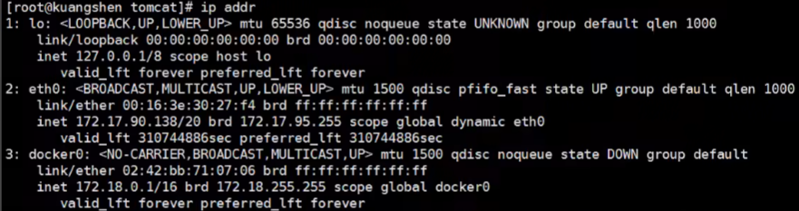

## Docker概念

**镜像(image)**
Docker镜像就好比是一个模板，可以通过这个模板来创建容器服务
**容器(container)**
Docker利用容器技术，独立运行一个或者一组应用，通过镜像创建；
**仓库(repository)**
存放镜像的地方，分为共有仓库和私有仓库，Docker Hub；

## Docker安装
**卸载旧版Docker**
```shell
sudo apt-get remove docker docker-engine docker.io containerd runc
```
**设置仓库**
```shell
sudo apt-get update

sudo apt-get install \
    ca-certificates \
    curl \
    gnupg \
    lsb-release

curl -fsSL https://download.docker.com/linux/ubuntu/gpg | sudo gpg --dearmor -o /usr/share/keyrings/docker-archive-keyring.gpg

echo \
  "deb [arch=$(dpkg --print-architecture) signed-by=/usr/share/keyrings/docker-archive-keyring.gpg] https://download.docker.com/linux/ubuntu \
  $(lsb_release -cs) stable" | sudo tee /etc/apt/sources.list.d/docker.list > /dev/null
```
**Docker安装**
```shell
sudo apt-get update

sudo apt-get install docker-ce docker-ce-cli containerd.io docker-compose-plugin
```
**测试**
```shell
docker version

sudo docker run hello-world
```
**查看镜像**
```shell
sudo docker images
```
**卸载Docker**
```shell
sudo apt-get purge docker-ce docker-ce-cli containerd.io docker-compose-plugin

sudo rm -rf /var/lib/docker
sudo rm -rf /var/lib/containerd
```

## Docker常用命令
命令帮助文档：https://docs.docker.com/engine/reference/run/

#### 帮助命令
```shell
# 版本信息
docker version
# 详细信息，包括镜像和容器数量
docker info
# 帮助命令
docker --help
# 查看容器CPU，内存等状态
docker status 容器ID
# 查看容器网络信息
docker network inspect 网络名
```
#### 镜像命令
**查看所有镜像**
```shell
# docker images [-a][-q]
ubuntu@VM-20-14-ubuntu:~$ docker images
REPOSITORY    TAG       IMAGE ID       CREATED        SIZE
hello-world   latest    feb5d9fea6a5   7 months ago   13.3kB

# 可选项
-a --all 列出所有镜像
-q --quiet 只显示ID
```
**搜索镜像**
```shell
# docker search 镜像名
ubuntu@VM-20-14-ubuntu:~$ docker search mysql
NAME                           DESCRIPTION                                     STARS     OFFICIAL   AUTOMATED
mysql                          MySQL is a widely used， open-source relation…   12529     [OK]       
mariadb                        MariaDB Server is a high performing open sou…   4823      [OK]       
...
```
**下载镜像**
```shell
# docker pull 镜像名[:tag]
ubuntu@VM-20-14-ubuntu:~$ docker pull mysql
Using default tag: latest     # 不加tag默认latest
latest: Pulling from library/mysql
4be315f6562f: Pull complete   # 分层下载
...
752752efdaea: Pull complete 
Digest: sha256:2dafe3f044f140ec6c07716d34f0b317b98f8e251435abd347951699f7aa3904   # 签名
Status: Downloaded newer image for mysql:latest
docker.io/library/mysql:latest  # 真实地址

# 指定下载版本
ubuntu@VM-20-14-ubuntu:~$ docker pull mysql:5.7
5.7: Pulling from library/mysql
4be315f6562f: Already exists #  已经下载的部分可以共用(联合文件系统)
... 
2e5ee322af48: Pull complete 
Digest: sha256:e767595ba3408fbb2dda493be3594b9a148178df58325fafe8b0363662935624
Status: Downloaded newer image for mysql:5.7
docker.io/library/mysql:5.7
```
**删除镜像**
```shell
# docker rmi -f 镜像ID [镜像ID]
ubuntu@VM-20-14-ubuntu:~$ docker rmi -f 8aa4b5ffb001
Untagged: mysql:5.7
Untagged: mysql@sha256:e767595ba3408fbb2dda493be3594b9a148178df58325fafe8b0363662935624
Deleted: sha256:8aa4b5ffb001f0092b491bdd8a48a83cb2ab2b721646db139d4cda64dea93600 # 只会删除独有的部分
...

# docker rmi -f $(参数)
ubuntu@VM-20-14-ubuntu:~$ docker rmi -f $(docker images -aq)  # 全部删除
```
#### 容器命令
`有镜像才能创建容器`
**新建容器并启动**
```shell
# docker run [参数] 镜像名

# 参数说明
--name="Name" # 容器名字，用于区分容器
-d            # 后台方式运行
-it           # 使用交互方式运行，进入容器查看内容
-p            # 指定容器端口 -p 8080
    -p 主机端口:容器端口 (常用，主机端口到容器端口的映射)
    -p ip:主机端口:容器端口
    -p 容器端口
-P            # 随机指定端口
-e "xxx=xxx"  # 设置环境变量
--rm          # 容器停止后自动删除，一般用来测试

ubuntu@VM-20-14-ubuntu:~$ docker run -it centos /bin/bash    # 启动并进入容器
[root@d4aa5e27764b /]# ls   # 查看容器内部
bin  dev  etc  home  lib  lib64  lost+found  media  mnt  opt  proc  root  run  sbin  srv  sys  tmp  usr  var
[root@d4aa5e27764b /]# exit # 退出
exit
```
**查看运行中的容器**
```shell
# docker ps

# 参数说明
-a          # 查看所有运行的容器，包括已经结束的
-n=1        # 显示最近创建的1个容器
-q          # 只显示容器ID

ubuntu@VM-20-14-ubuntu:~$ docker ps -a
CONTAINER ID   IMAGE         COMMAND       CREATED             STATUS                          PORTS     NAMES
d4aa5e27764b   centos        "/bin/bash"   4 minutes ago       Exited (0) About a minute ago             flamboyant_poitras
5a746273c0c5   hello-world   "/hello"      About an hour ago   Exited (0) About an hour ago              interesting_clarke
225f97e27098   hello-world   "/hello"      About an hour ago   Exited (0) About an hour ago              stupefied_beaver
```
**退出容器**
```shell
# 在-it模式下输入
exit          # 容器停止并退出
Ctrl + P + Q  # 容器不停止退出
```
**删除容器**
```shell
docker rm 容器ID              # 删除指定容器，不能删除运行中的容器
docker rm -f $(docker ps -aq) # 删除全部容器，强制删除 -f
docker ps -aq | xargs docker rm # 删除全部容器
```
**启动停止容器**
```shell
docker start 容器ID     # 启动容器
docker restart 容器ID   # 重启容器
docker stop 容器ID      # 停止容器
docker kill 容器ID      # 强制停止容器
```
#### 其他命令
**后台启动容器**
```shell
# docker run -d 镜像名
ubuntu@VM-20-14-ubuntu:~$ sudo docker run -d centos
875c08df6ea87bd7480eaab34dc605a08b0af2c8b3106f167575fa67e9fbc54a
```
问题：docker ps发现centos停止了
docker容器使用`后台`运行时必须有一个`前台`进程，centos启动后发现自己没有提供服务，就会立刻停止
**查看日志**
```shell
docker logs [参数] 容器ID

# 参数说明
-f          # 不断显示最新的日志
-t          # 显示日志时间戳
--tail 10   # 显示最新10条日志
```
**查看容器中的进程信息**
```shell
docker top 容器ID
```
**查看容器元数据**
```shell
docker inspect 容器名|容器ID
```
**进入正在运行的容器**
```shell
docker exec -it 容器ID /bin/bash  # 进入容器后开启一个新的终端，可以在内部进行操作
docker attach 容器ID  # 进入容器正在执行的终端
```
**从容器内拷贝文件到主机**
```shell
docker cp 容器ID:容器内路径 目的主机路径
```

## Docker底层原理

#### Docker工作原理
Docker是一个`Client-Server`结构的系统，Docker的`守护进程(Deamon)`运行在主机上，通过`Socket`从客户端访问。`Docker-Server`接收到`Docker-Client`的指令，就会执行这个命令

#### Docker为什么比VM快
1. Docker有着比虚拟机更少的`抽象层`
由于Docker不需要Hypervisor实现硬件资源`虚拟化`，运行在Docker容器上的程序直接使用的都是实际`物理机`的硬件资源，因此在CPU、内存利用率上Docker将会在效率上有明显优势。
2. Docker利用的是`宿主机`的内核，VM需要`Guest OS`
新建一个容器的时候，Docker不需要要像虚拟机一样重新加载一个操作系统内核，虚拟机需要加载GuestOS，而Docker利用宿主机的操作系统。


## Docker镜像
镜像是一种轻量级、可执行的`独立软件包`，用来打包软件运行环境和基于运行环境开发的软件，它包含运行某个软件所需要的所有内容，包括代码，运行时（一个程序在运行或者在被执行的依赖）、库，环境变量和配置文件。
#### 联合文件系统
Docker的镜像实际上由一层一层的文件系统组成，这种层级的文件系统是UnionFS**联合文件系统**
- UnionFS (联合文件系统) : 联合文件系统是一种`分层、轻量级并且高性能`的文件系统，它支持对文件系统的修改作为一次`提交`来一层层的`叠加`，同时可以将不同目录挂载到同一个虚拟文件系统下。联合文件系统是Docker镜像的基础。镜像可以通过分层来进行`继承`，基于基础镜像(没有父镜像) ， 可以制作各种具体的应用镜像。

**特性**: 一次同时加载多个文件系统，但从外面看起来，只能看到一个文件系统，联合加载会把各层文件系统`叠加`起来，这样最终的文件系统会包含所有底层的文件和目录

**bootfs**
主要包含`bootloader`和`kernel`， bootloader主要是引导加载kernel， Linux刚启动时会加载bootfs文件系统，在Docker镜像的最底层是bootfs。这一层与我们典型的Linux/Unix系统是一样的，包含boot加载器和内核。当boot加载完成之后整个内核就都在内存中了，此时内存的使用权已由bootfs转交给内核，此时系统也会卸载bootfs。
**rootfs**
在`bootfs`之上。包含的就是典型Linux系统中的/dev， /proc， /bin， /etc等标准目录和文件。rootfs就是各种不同的操作系统发行版，比如Ubuntu ， Centos等等。
#### 镜像分层
所有的Docker镜像都起始于一个`基础镜像层`，当进行修改或增加新的内容时，就会在当前镜像层之上，创建新的镜像层。举一个简单的例子，假如基于Ubuntu Linux 16.04创建一个新的镜像，这就是新镜像的第一层：如果在该镜像中添加Python包，就会在基础镜像层之上创建第二个镜像层：如果继续添加一个安全补丁，就会创建第三个镜像层。

在添加额外的镜像层的同时，镜像始终保持是当前所有镜像的`组合`，下图中举了一个简单的例子，每个镜像层包含3个文件，而镜像包含了来自两个镜像层的6个文件。

下图中展示了一个稍微复杂的三层镜像，在外部看来整个镜像只有6个文件，这是因为最上层中的文件7是文件5的一个`更新版本`。

这种情况下，上层镜像层中的文件`覆盖`了底层镜像层中的文件。这样就使得文件的更新版本作为一个`新镜像层`添加到镜像当中。Docker通过Linux的`存储引擎`(新版本采用`快照机制`)的方式来实现镜像层堆栈，并保证多镜像层对外展示为`统一`的文件系统。
下图展示了与系统显示相同的三层镜像。所有镜像层堆叠并合并，对外提供`统一`的视图。

Docker镜像都是`只读`的， 当容器启动时，一个新的`可写层`被加载到镜像的`顶部`，这一层就是我们通常说的`容器层`，容器之下的都叫`镜像层`。
**优点**
资源共享：多个镜像从相同的`Base镜像`构建而来，那么宿主机只需在磁盘上保留一份base镜像，同时内存中也只需要加载一份base镜像，这样就可以为所有的容器服务了，而且镜像的每一层都可以被共享。
#### 提交镜像
```shell
docker commit 提交容器成为一个新的镜像到本地仓库

# 命令和git原理类似
docker commit -m="提交的描述信息" -a="作者" 容器id 目标镜像名:[TAG]
```

## 容器数据卷
#### 概念
Docker将运用与运行的环境打包形成`容器`运行， Docker容器产生的数据，如果不通过docker commit生成新的镜像，使得数据做为镜像的一部分保存下来， 那么当容器删除后，数据自然也就没有了。 为了能`保存数据`在Docker中我们使用卷。
卷就是`目录`或`文件`，存在于`宿主机`中，由Docker挂载到`容器`，但卷不属于联合文件系统（Union FileSystem），因此能够绕过联合文件系统提供一些用于持续存储或共享数据的特性:。
卷的设计目的就是数据的`持久化`，完全独立于容器的生存周期，因此Docker不会在容器删除时删除其挂载的数据卷。
**特点:**
1. 数据卷可在容器之间共享或重用数据
2. 卷中的更改可以实时同步，双向映射
3. 数据卷中的更改不会包含在镜像的更新中
#### 数据卷的使用
```shell
# 普通方式
docker run [参数] -v 主机路径:容器内路径 镜像名
# 匿名挂载
docker run [参数] -v 容器内路径 镜像名
# 具名挂载
docker run [参数] -v 卷名:容器内路径 镜像名
# 只读，只能通过宿主机修改，容器无法修改
docker run [参数] -v xxx:容器内路径:ro 镜像名
# 可读可写，默认
docker run [参数] -v xxx:容器内路径:rw 镜像名
```
```shell
# 创建数据卷
docker volume create 卷名
# 查看所有的数据卷
docker volume ls
# 查看指定数据卷的信息
docker volume inspect 卷名
# 删除数据卷
docker volume rm 卷名
# 删除容器的同时删除相关的卷
docker rm -v ...
# 清理无主的数据卷
docker volume prune
```
#### 具名挂载和匿名挂载
**匿名挂载**
在指定数据卷的时候，不指定容器路径对应的`主机路径`，这样对应映射的主机路径就是`默认`的路径`/var/lib/docker/volumes/`中自动生成一个`随机命名`的文件夹。
```shell
docker run -d -P --name nginx01 -v /etc/nginx nginx

[root@iZwz99sm8v95sckz8bd2c4Z ~]# docker volume ls
DRIVER    VOLUME NAME
local     0cd45ab893fc13971219ac5127f9c0b02491635d76d94183b0261953bdb52d26
local     668a94251e562612880a2fdb03944d67d1acdbbdae6ef7c94bee8685644f2956
local     e605f3dc4bf11ab693972592b55fb6911e5bf2083425fd58869c5f574998a09a
```
查看所有的数据卷volume的情况, VOLUME NAME这里的值是真实存在的目录。
**具名挂载**
指定`文件夹名称`，区别于指定`路径`挂载，这里的指定文件夹名称是在Docker指定的`默认`数据卷路径下的。
```shell
docker run -d -P --name nginx02 -v my-volume-name:/etc/nginx nginx

[root@iZwz99sm8v95sckz8bd2c4Z ~]# docker volume ls
DRIVER    VOLUME NAME
local     0cd45ab893fc13971219ac5127f9c0b02491635d76d94183b0261953bdb52d26
local     668a94251e562612880a2fdb03944d67d1acdbbdae6ef7c94bee8685644f2956
local     e605f3dc4bf11ab693972592b55fb6911e5bf2083425fd58869c5f574998a09a
local     my-volume-name
```
#### 数据卷容器
多个容器数据共享 `--volumes-from`
```shell
docker run -it --name centos02 --volumes-from centos01 centos
```
`centos01`的卷会同步到`centos02`，`centos01`叫数据卷容器，当`centos01`删除后，`centos02`的卷依旧有效


## DockerFile
DockerFile是用来构建Docker镜像的构建文件，是一种脚本文件。
```shell
FROM centos # 基于centos构建

VOLUME ["volume01" , "volume02"]  # 在容器内部自动生成挂载路径，匿名挂载

CMD echo "----end-----"

CMD /bin/bash
```
```shell
docker build -f dockerfile路径 -t 镜像名:[tag] .
```
Docker镜像发布的步骤：
1. 编写一个dockerfile文件
2. docker build 构建成为一个镜像
3. docker run 镜像
4. docker push 镜像（DockerHub、阿里云镜像仓库）
#### DockerFile指令
| 指令       | 说明                                                                                              |
| ---------- | ------------------------------------------------------------------------------------------------- |
| FROM       | 指定基础镜像                                                                                      |
| MAINTAINER | 镜像是谁写的，姓名+邮箱                                                                           |
| RUN        | 镜像构建的时候需要运行的命令                                                                      |
| ADD        | 将本地文件添加到容器中，tar类型文件会自动解压(网络压缩资源不会被解压)，可以访问网络资源，类似wget |
| WORKDIR    | 镜像的工作目录                                                                                    |
| VOLUME     | 挂载的目录                                                                                        |
| EXPOSE     | 保留端口配置                                                                                      |
| CMD        | 指定这个容器启动的时候要运行的命令（只有最后一个会生效）                                          |
| EMTRYPOINT | 指定这个容器启动的时候要运行的命令，可以追加命令                                                  |
| ONBUILD    | 当构建一个被继承DockerFile，这个时候就会运行ONBUILD的指令，触发指令                               |
| COPY       | 功能类似ADD，但是是不会自动解压文件，也不能访问网络资源                                           |
| ENV        | 构建的时候设置环境变量                                                                            |
#### RUN，CMD和ENTRYPOINT的区别
```shell
RUN yum -y install vim
CMD ["ls", "-a"]
ENTRYPOINT ["ls", "-a"]
```
**RUN命令与CMD命令的区别在哪里？**
简单说，`RUN`命令在image文件的`构建`阶段执行，执行结果都会`打包`进入image文件；`CMD`命令则是在容器`启动后`执行。另外，一个 Dockerfile可以包含`多个RUN`命令，但是只能有`一个CMD`命令。
注意，指定了CMD命令以后，docker container run命令就不能附加命令了（比如前面的/bin/bash），否则它会`覆盖`CMD命令。
**CMD和ENTRYPOINT的区别在哪里？**
CMD ：指定容器启动的时候要运行的命令，只有`最后一个`会生效
ENTRYPOINT ：指定容器启动的时候要运行的命令,命令可以`追加`
#### 制作Centos镜像
**1. 编写DockerFile**
```shell
[root@iZwz99sm8v95sckz8bd2c4Z dockerfile]# vim mydockerfile-centos
FROM centos
MAINTAINER zifeiyu<123456789@qq.com>

ENV MYPATH /usr/local # 设置环境变量
WORKDIR $MYPATH       # 设置工作目录

RUN yum -y install vim
RUN yum -y install net-tools

EXPOSE 80

CMD /bin/bash
```
**2. 构建镜像**
```shell
docker build -f mydockerfile-centos -t mycentos:1.0 .
```
**3. 运行测试**
```shell
docker run -it mycentos:1.0
```
**4. 查看镜像构建历史**
```shell
docker history 镜像ID
```
#### 制作tomcat镜像
```shell
FROM centos
MAINTAINER ethan<1258398543@qq.com>

COPY readme.txt /usr/local/readme.txt

ADD jdk-8u251-linux-x64.tar.gz /usr/local/
ADD apache-tomcat-8.5.55.tar.gz /usr/local/

RUN yum -y install vim

ENV MYPATH /usr/local
WORKDIR $MYPATH

ENV JAVA_HOME /usr/local/jdk1.8.0_251
ENV CLASSPATH $JAVA_HOME/lib/dt.jar:$JAVA_HOME/lib/tools.jar
ENV CATALINA_HOME /usr/local/apache-tomcat-8.5.55
ENV CATALINA_BASH /usr/local/apache-tomcat-8.5.55
ENV PATH $PATH:$JAVA_HOME/bin:$CATALINA_HOME/lib:$CATALINA_HOME/bin

EXPOSE 8080

CMD /usr/local/apache-tomcat-8.5.55/bin/startup.sh && tail -F /usr/local/apache-tomcat-8.5.55/bin/logs/catalina.out
```
#### 提交镜像
**1. 登录**
```shell
docker login -u username
Password:
```
**2. 提交**
```shell
docker push username/mycentos:1.0
```

## Docker网络
Docker提供了四个网络模式：
- **bridge**：容器默认的网络是桥接模式(自己搭建的网络默认也是使用桥接模式,启动容器默认也是使用桥接模式)。此模式会为每一个容器分配、设置IP等，并将容器连接到一个docker0虚拟网桥，通过docker0网桥以及Iptables nat表配置与宿主机通信。
- **none**：不配置网络，容器有独立的Network namespace，但并没有对其进行任何网络设置，如分配veth pair 和网桥连接，配置IP等。
- **host**：容器和宿主机共享Network namespace。容器将不会虚拟出自己的网卡，配置自己的IP等，而是使用宿主机的IP和端口。
- **container**：创建的容器不会创建自己的网卡，配置自己的IP容器网络连通。容器和另外一个容器共享Network namespace（共享IP、端口范围）。

Namespace：
Docker使用了Linux的Namespaces技术来进行资源隔离，如PID Namespace隔离进程，Mount Namespace隔离文件系统，Network Namespace隔离网络等。
一个Network Namespace提供了一份独立的网络环境，包括网卡、路由、Iptable规则等都与其他的NetworkNamespace隔离。一个Docker容器一般会分配一个独立的Network Namespace。
#### host模式
如果启动容器的时候使用host模式，那么这个容器将不会获得一个独立的Network Namespace，而是和宿主机共用一个Network Namespace。容器将不会虚拟出自己的网卡，配置自己的IP等，而是使用宿主机的IP和端口。但是，容器的其他方面，如文件系统、进程列表等还是和宿主机隔离的。

使用host模式的容器可以直接使用宿主机的IP地址与外界通信，容器内部的服务端口也可以使用宿主机的端口，不需要进行NAT，host最大的优势就是网络性能比较好，但是docker host上已经使用的端口就不能再用了，网络的隔离性不好。Host模式的模型图，如下图所示：

#### container模式
这个模式指定新创建的容器和已经存在的一个容器共享一个 Network Namespace，而不是和宿主机共享。新创建的容器不会创建自己的网卡，配置自己的 IP，而是和一个指定的容器共享 IP、端口范围等。同样，两个容器除了网络方面，其他的如文件系统、进程列表等还是隔离的。两个容器的进程可以通过 lo 网卡设备通信。Container模式模型示意图如下：

#### none模式
使用none模式，Docker容器拥有自己的Network Namespace，但是，并不为Docker容器进行任何网络配置。也就是说，这个Docker容器没有网卡、IP、路由等信息。需要我们自己为Docker容器添加网卡、配置IP等。

这种网络模式下容器只有lo回环网络，没有其他网卡。none模式可以在容器创建时通过–network=none来指定。这种类型的网络没有办法联网，封闭的网络能很好的保证容器的安全性。

#### bridge模式
当Docker进程启动时，会在主机上创建一个名为docker0的虚拟网桥，此主机上启动的Docker容器会连接到这个虚拟网桥上。虚拟网桥的工作方式和物理交换机类似，这样主机上的所有容器就通过交换机连在了一个二层网络中。

从docker0子网中分配一个IP给容器使用，并设置docker0的IP地址为容器的默认网关。在主机上创建一对虚拟网卡veth pair设备，Docker将veth pair设备的一端放在新创建的容器中，并命名为eth0（容器的网卡），另一端放在主机中，以vethxxx这样类似的名字命名，并将这个网络设备加入到docker0网桥中。可以通过brctl show命令查看。

bridge模式是docker的默认网络模式，不写–net参数，就是bridge模式。使用docker run -p时，docker实际是在iptables做了DNAT规则，实现端口转发功能。可以使用iptables -t nat -vnL查看。bridge模式如下图所示：


## docker0
当Docker server启动时，会在主机上创建一个名为`docker0`的虚拟网桥，此主机上启动的Docker容器会连接到这个虚拟网桥上。Docker0使用到的技术是`veth-pair`技术。在默认bridge网络模式下，我们每启动一个Docker容器，Docker就会给Docker容器配置一个`ip`。
Docker容器完成bridge网络配置的过程如下：
1. 在主机上创建一对虚拟网卡veth pair设备。veth设备总是成对出现的，它们组成了一个数据的`通道`，数据从一个设备进入，就会从另一个设备出来。因此，veth设备常用来连接两个网络设备。
2. Docker将veth pair设备的一端放在新创建的`容器`中，并命名为eth0。另一端放在`主机`中，以veth65f9这样类似的名字命名，并将这个网络设备加入到docker0网桥中。
3. 从docker0子网中分配一个IP给容器使用，并设置docker0的IP地址为容器的默认网关。

查看宿主机网卡

- **lo**：本机回环地址，127.0.0.1
- **eth0**：内网地址，172.17.90.138
- **docker0**：docker0地址，由docker创建，172.18.0.1

查看容器网卡

- **lo**：本机回环地址，127.0.0.1
- **eth0@if262**：docker分配给容器的内网地址，172.18.0.2

宿主机可以ping通容器，每启动一个容器，docker就会给容器分配一个ip，docker网络使用的是`桥接模式`，使用的技术是`veth-pair`
再次查看宿主机网卡，发现每启动一个容器后，就会多一个网卡，和容器网卡相对应，`veth-pair`就是一对的虚拟设备接口，他们都是成对出现的，一端连着协议，一端彼此相连

基于这个特性，`veth-pair`充当一个桥梁，连接各种虛拟网络设备，docker0充当路由器的角色，容器之间也可以相互ping通


## 外部访问容器
容器中可以运行一些网络应用，要让外部也可以访问这些应用，可以通过 `-P 或 -p `参数来指定端口映射。
当使用 `-P` 标记时，Docker 会`随机`映射一个端口到内部容器开放的网络端口。
使用 `docker container ls` 可以看到，本地主机的 32768 被映射到了容器的 80 端口。此时访问本机的 32768 端口即可访问容器内 NGINX 默认页面。
`-p` 则可以指定要映射的端口，并且，在一个指定端口上只可以绑定一个容器。支持的格式有 ip:hostPort:containerPort | ip::containerPort | hostPort:containerPort。
首先用下面命令创建一个含有web应用的容器，将容器的80端口映射到主机的80端口。
```
docker run -d --name web -p 80:80 fmzhen/simpleweb
```
然后查看Iptable规则的变化，发现多了这样一条规则：
```
-A DOCKER ! -i docker0 -p tcp -m tcp --dport 80 -j DNAT --to-destination 172.17.0.5:80
```
此条规则就是对主机eth0收到的目的端口为80的tcp流量进行DNAT转换，将流量发往172.17.0.5:80，也就是我们上面创建的Docker容器。所以，外界只需访问10.10.101.105:80就可以访问到容器中得服务。

## 容器互联
#### --link
在微服务部署的场景下，注册中心是使用服务名来唯一识别微服务的，而我们上线部署的时候微服务对应的IP地址可能会`改动`，所以我们需要使用容器名来配置容器间的网络连接。使用`--link`可以完成这个功能。
```shell
# 将tomcat03与tomcat02互联
docker run -d -P --name tomcat03 --link tomcat02 tomcat
```
只能 tomcat03 ping通tomcat02，反过来不行，--link实际上就是在tomcat03的`hosts`中配置了ip与容器名和容器ID的别名
目前–link设置容器互连的方式已经**不推荐**使用。因为docker0不支持容器名访问，所以更多地选择**自定义网络**
#### 自定义网络
使用`docker network create`创建网络
```shell
docker network create --driver bridge --subnet 192.168.0.0/16 --gateway 192.168.0.1 mynet
# --driver  定义网络模式，默认bridge
# --subnet  子网，允许的ip地址从192.168.0.2 ~ 192.168.255.255
# --gateway 网关
```
使用`--net`在容器创建过程中指定网络
```shell
docker run -d -P --name tomcat-net-01 --net mynet tomcat 
docker run -d -P --name tomcat-net-02 --net mynet tomcat 
```
自定义网络下，容器之间既可以通过`容器名`也可以通过`ip地址`进行网络通信

## 网络互联
没有设置的情况下，不同网络间（docker0、mynet）的容器是`无法`进行网络连接的
不同Docker网络之间的容器需要连接的话需要把作为`调用方`的容器注册一个`ip`到`被调用方`所在的网络上。需要使用`docker connect`命令。
```shell
# docker network connect 网络名 容器名
# 将tomcat-01与mynet连通
docker network connect mynet tomcat-01
```
连通后将tomcat-01也放在了mynet下（一个容器，两个ip）

## Compose
Compose 是一个用于定义和运行`多容器`Docker应用程序的工具。使用`YAML`文件来配置应用程序的服务。使用一个命令就可以从配置中创建并启动所有服务。
https://docs.docker.com/compose/gettingstarted/
1. 定义`Dockerfile`
2. 定义`docker-compose.yml`
```yaml
version: "3.9"
services:
  web:
    build: .
    ports:
      - "8000:5000"
  redis:
    image: "redis:alpine"
```
3. 运行`docker-compose up`

两个重要概念：
- `services`服务，容器/应用 （web、redis、mysql...）
- `project`项目，一组关联的容器
#### Compose yaml规则
https://docs.docker.com/compose/compose-file/
```yaml
# 3层
version: '' # 版本，和docker版本对应
services:   # 服务
  服务1:
    images: xxx
    build: xxx
    network: xxx
    ...
  服务2:
    ...
# 其他配置，网络/卷...
volumes: ...
networks: ...
configs: ...
```
**depends_on**
```yaml
services:
  web:
    build: .
    depends_on:
      - db
      - redis
  redis:
    image: redis
  db:
    image: postgres
```

## Swarm
swarm模式分为`managers`节点和`workers`节点，操作都在`managers`节点
**初始化一个swarm集群**
```shell
docker swarm init --advertise-addr 本机IP
```

**添加一个节点到swarm集群**
```shell
docker swarm join --token SWMTKN-1-4a1qo02iwnaoqbt9vuagbucusLkk9p451u3apf7ed7ybm50a3x-dkmn5q0oocys8lc91222xerwx 172.24. 82.149:2377
# 或使用以下命令重新生成一个命令用来加入集群
docker swarm join-token worker(manager)
```
以`worker`节点身份加入集群
**查看集群节点信息**
```shell
docker node ls
```
**在集群模式下创建服务**
```shell
docker service create -p 8888:80 --name my-nginx nginx 
```
**更新服务**
```shell
docker service update --replicas 3 my-nginx # 3个副本
```