## 什么是JVM
Java程序的跨平台特性主要是指字节码文件可以在任何具有JVM的计算机或者电子设备上运行，JVM中的Java解释器负责将字节码文件解释成为特定的机器码进行运行。因此在运行时，Java源程序需要通过编译器编译成为.class文件。
JVM是JRE的一部分。它是一个虚构出来的计算机。JVM有自己完善的硬件架构，如处理器、堆栈、寄存器等，还具有相应的指令系统。Java语言最重要的特点就是跨平台运行。使用JVM就是为了支持与操作系统无关，实现跨平台。

## JVM内存模型
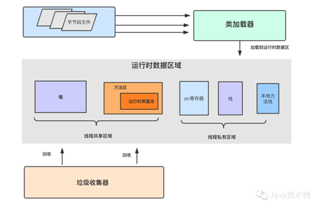
#### 栈区
栈分为java`虚拟机栈`和`本地方法栈`
1. 重点是Java虚拟机栈，它是线程`私有`的，生命周期与线程相同。
2. 每个方法执行都会创建一个`栈帧`，用于存放局部变量表，操作栈，动态链接，方法出口等。每个方法从被调用，直到被执行完。对应着一个栈帧在虚拟机中从入栈到出栈的过程。
3. 通常说的栈就是指局部变量表部分，存放编译期间可知的8种基本数据类型，及对象引用和指令地址。局部变量表是在编译期间完成分配，当进入一个方法时，这个栈中的局部变量分配内存大小是确定的。
4. 本地方法栈为虚拟机使用到本地方法服务(native)JNI
#### 堆区
1. 堆被所有线程`共享`区域，在虚拟机启动时创建，唯一目的存放`对象`实例。
2. 堆区是`gc`的主要区域，通常情况下分为两个区块：`年轻代`和`老年代`。更细一点年轻代又分为Eden区，放新创建对象，From survivor 和 To survivor 保存gc后幸存下的对象，默认情况下各自占比 8:1:1。
   1. 新生代（Young Generation）：大多数对象在新生代中被创建，其中很多对象的生命周期很短。每次新生代的垃圾回收（又称Minor GC）后只有少量对象存活，所以选用**复制**算法，只需要少量的复制成本就可以完成回收。新生代内又分三个区：一个Eden区，两个Survivor区（一般而言），大部分对象在Eden区中生成。当Eden区满时，还存活的对象将被复制到两个Survivor区（中的一个）。当这个Survivor区满时，此区的存活且不满足“晋升”条件的对象将被复制到另外一个Survivor区。对象每经历一次Minor GC，年龄加1，达到“晋升年龄阈值”后，被放到老年代，这个过程也称为`“晋升”`。显然，“晋升年龄阈值”的大小直接影响着对象在新生代中的停留时间，在Serial和ParNew GC两种回收器中，“晋升年龄阈值”通过参数MaxTenuringThreshold设定，默认值为15。
   2. 老年代（Old Generation）：在新生代中经历了N次垃圾回收后仍然存活的对象，就会被放到年老代，该区域中对象存活率高。老年代的垃圾回收（又称Major GC）通常使用“`标记-清理`”或“`标记-整理`”算法。整堆包括新生代和老年代的垃圾回收称为Full GC（HotSpot VM里，除了CMS之外，其它能收集老年代的GC都会同时收集整个GC堆，包括新生代）。
#### 方法区：
1. 被所有线程`共享`区域，用于存放已被虚拟机加载的类信息、常量、静态变量等数据。被《Java虚拟机规范》描述为堆的一个逻辑部分(非堆)。习惯是也叫它`永久代`(元空间)
2. 垃圾回收很少光顾这个区域，不过也是需要回收的，主要针对常量池回收，类型卸载。
3. 常量池具有一定的动态性，里面可以存放编译期生成的常量；运行期间的常量也可以添加进入常量池中，比如string的intern() 方法。
#### 程序计数器：
1. 当前线程所执行的`行号`指示器。通过改变计数器的值来确定下一条`指令`，比如循环，分支，跳转，异常处理，线程恢复等都是依赖计数器来完成。
2. Java虚拟机多线程是通过线程轮流切换并分配处理器执行时间的方式实现的。为了线程切换能恢复到正确的位置，每条线程都需要一个独立的程序计数器，所以它是线程`私有`的。

## JVM垃圾回收算法
**标记–清除算法**
标记：遍历内存区域，对需要回收的对象打上标记。
清除：再次遍历内存，对已经标记过的内存进行回收。
**标记–复制算法（年轻代）**
将内存划分为等大的两块，每次只使用其中的一块。当一块用完了，触发GC时，将该块中存活的对象复制到另一块区域，然后一次性清理掉这块没有用的内存。下次触发GC时将那块中存活的的又复制到这块，然后抹掉那块，循环往复。
**标记–整理算法（老年代）**
标记：对需要回收的进行标记
整理：让存活的对象，向内存的一端移动，然后直接清理掉没有用的内存。

## GC的判定方法
**引用计数算法**
在`对象头`中分配一个空间来保存该对象被引用的`次数`。如果该对象被其它对象引用，则它的引用计数加一，如果删除对该对象的引用，那么它的引用计数就减一，当该对象的引用计数为0时发生Minor GC，那么该对象就会被回收。
**引用链**
确定一系列的GC Root的对象作为起点，从这些节点向下搜索，搜索的路径称为引用链（Reference Chain），当一个对象`无法`通过引用链连向GC Root的话证明此对象是不可用的

## GC收集器
#### JDK8默认收集器
`ParallelGC` Parallel Scavenge（年轻代）+ Serial Old（老年代）
JDK9默认`G1`
**Parallel Scavenge**
Parallel Scavenge收集器也是一个并行的多线程`年轻代`收集器，它也使用`复制`算法。但是不同的是Parallel Scavenge 关注的是`吞吐量`，也就是整体的停顿时间占的比例，不关心，用户停顿的时长；其他的都是关注用户停顿时间，适合需要与用户交互的程序。高吞吐量则可以高效率地利用CPU时间，尽快完成程序的运算任务，主要适合在后台运算而不需要太多交互的任务。Parallel Scavenge收集器无法与CMS收集器配合使用
所以，java默认的垃圾回收器适合**纯服务器开发**；
**Serial Old**
Serial Old 是 Serial收集器的老年代版本，它同样是一个`单线程`收集器，使用“标记-整理”（Mark-Compact）算法。Serial收集器是新生代串行的垃圾收集器，采用复制算法，垃圾回收时必须暂停全部的工作线程，是一种独占式的垃圾回收器。
优点：简单高效，常做client模式桌面应用；
缺点：串行，无法利用多核优势
#### CMS收集器
基于**标记-清除**算法
CMS（Concurrent Mark Sweep）收集器是一种以获取`最短回收停顿时间`为目标的收集器，它非常符合那些集中在互联网站或者B/S系统的**服务端**上的Java应用，这些应用都非常重视服务的响应速度。从名字上（“Mark Sweep”）就可以看出它是基于“标记-清除”算法实现的。
**过程**：初始标记 → 并发标记 → 重新标记 → 并发清理
初始标记、重新标记这两个步骤仍然需要“stop the world”，初始标记仅仅只是标记一下GC Roots能`直接`关联到的对象，速度很快，并发标记阶段就是进行GC Roots Tracing，而重新标记阶段则是为了`修正`并发标记期间因用户程序继续运作而导致标记产生表动的那一部分对象的标记记录，这个阶段的停顿时间一般会比初始标记阶段稍长点，但远比并发标记的时间短。
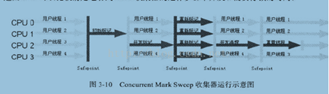
**优点**
并发收集、低停顿
**缺点**
1. CMS收集器对CPU资源非常敏感。在并发阶段，它虽然不会导致用户线程停顿，但是会因为占用了一部分线程而导致应用程序变慢，总吞吐量会降低。
2. CMS收集器无法处理浮动垃圾
浮动垃圾：由于CMS并发清理阶段用户线程还在运行着，伴随着程序运行自然就会有新的垃圾不断产生，这部分垃圾出现的标记过程之后，CMS无法在当次收集中处理掉它们，只好留待下一次GC中再清理。这些垃圾就是“浮动垃圾”。
3. CMS是一款“标记--清除”算法实现的收集器，容易出现大量空间碎片。
#### G1收集器
G1（Garbage-First）收集器，它是一款面向**服务端**应用的垃圾收集器;
基于**标记-整理**算法
**过程**：初始标记 → 并发标记 → 最终标记 → 筛选回收
初始标记仅仅只是标记一下GC Roots能直接关联到的对象，这个阶段需要停顿线程，但耗时很短；并发标记从GC Root开始对堆中对象进行可达性分析，递归扫描整个堆里的对象图，找出要回收的对象，这阶段耗时较长，但可与用户程序并发执行；最终标记对用户线程做一个短暂的暂停，用于处理并发标记阶段仍遗留下来的最后少量对象；筛选回收负责更新Region的统计数据，对各个Region的回收价值和成本进行排序，根据用户所期望的停顿时间来制定回收计划，可以自由选择任意多个Region构成回收集，然后把决定回收的那一部分Region的存活对象复制到空的Region中，再清理掉整个旧Region的全部空间。这里的操作涉及存活对象的移动，是必须暂停用户线程，由多个收集器线程并行完成的。
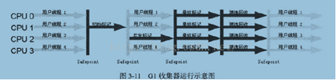
**特点**
1. 并行于并发：G1能充分利用CPU、多核环境下的硬件优势，使用多个CPU(CPU或者CPU核心)来缩短stop-The-World停顿时间。
2. 分代收集：G1将新生代，老年代的物理空间划分取消了。取而代之的是，G1算法将堆划分为若干个区域(Region)，它仍然属于分代收集器。不过，这些区域的一部分包含新生代，新生代的垃圾收集依然将存活对象拷贝到老年代或者Survivor空间。老年代也分成很多区域，G1收集器通过将对象从一个区域复制到另外一个区域，完成了清理工作。
3. 空间整合：与CMS的`标记--清理`算法不同，G1从整体来看是基于`标记--整理`算法实现的收集器；从局部上来看是基于`标记--复制`算法实现的。
4. 可预测的停顿：这是G1相对于CMS的另一个大优势，降低停顿时间是G1和CMS共同的关注点，但G1除了追求低停顿外，还能建立`可预测`的停顿时间模型，能让使用者明确指定在一个长度为M毫秒的时间片段内，
   
G1的适用场景：1.多核CPU,JVM内存占用较大的应用（至少4G）2.运行过程产生大量碎片需要压缩，3.更可控的GC停顿周期，防止高并发下的雪崩；
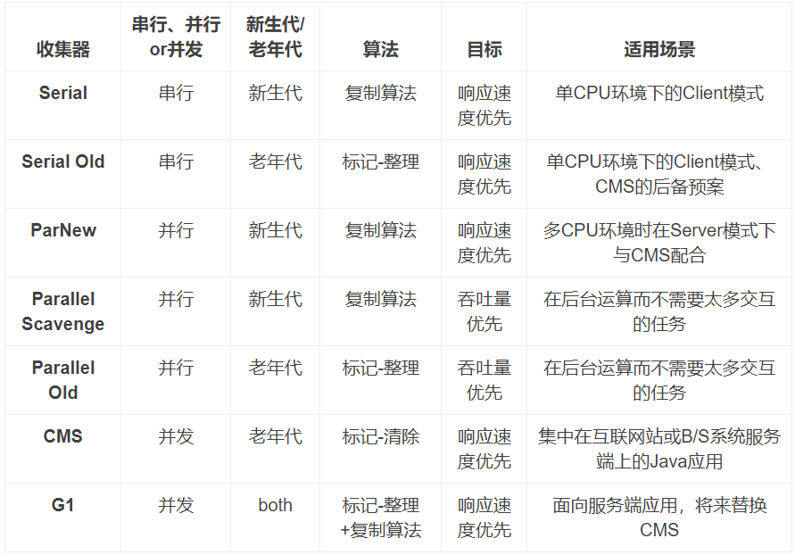

## GC触发条件
**Minor GC触发条件**
* eden区满时，触发MinorGC。即申请一个对象时，发现eden区不够用，则触发一次Minor GC。

**Full GC触发条件**
* 老生代空间不够分配新的内存
* Minor GC前，eden space和from space区大小大于to space且大于老年代内存，触发Full GC。

## GC调优
#### 调整各分区大小
各分区的大小对GC的性能影响很大。如何将各分区调整到合适的大小，分析活跃数据的大小是很好的切入点。
**活跃数据的大小**是指，应用程序稳定运行时长期存活对象在堆中占用的空间大小，也就是Full GC后堆中老年代占用空间的大小。可以通过GC日志中Full GC之后老年代数据大小得出，比较准确的方法是在程序稳定后，多次获取GC数据，通过取平均值的方式计算活跃数据的大小。活跃数据和各分区之间的比例关系如下
| 空间   | 倍数                                |
| ------ | ----------------------------------- |
| 总大小 | 3-4 倍活跃数据的大小                |
| 新生代 | 1-1.5 活跃数据的大小                |
| 老年代 | 2-3 倍活跃数据的大小                |
| 永久代 | 1.2-1.5 倍Full GC后的永久代空间占用 |
根据以上关系可以计算出堆内存的总大小
这部分设置仅仅是堆大小的初始值，后面的优化中，可能会调整这些值，具体情况取决于应用程序的特性和需求。
#### 优化步骤
GC优化一般步骤可以概括为：**确定目标**、**优化参数**、**验收结果**。
**1. 确定目标**
明确应用程序的系统需求是性能优化的基础，系统的需求是指应用程序运行时某方面的要求，譬如： - 高可用，可用性达到几个9。 - 低延迟，请求必须多少毫秒内完成响应。 - 高吞吐，每秒完成多少次事务。
明确系统需求之所以重要，是因为上述性能指标间可能冲突。比如通常情况下，缩小延迟的代价是降低吞吐量或者消耗更多的内存或者两者同时发生。
由于笔者所在团队主要关注高可用和低延迟两项指标，所以接下来分析，如何量化GC时间和频率对于响应时间和可用性的影响。通过这个量化指标，可以计算出当前GC情况对服务的影响，也能评估出GC优化后对响应时间的收益，这两点对于低延迟服务很重要。
**2. 优化参数**
假设单位时间T内发生一次持续25ms的GC，接口平均响应时间为50ms，且请求均匀到达，根据下图所示：

那么有(50ms+25ms)/T比例的请求会受GC影响，其中GC前的50ms内到达的请求都会增加25ms，GC期间的25ms内到达的请求，会增加0-25ms不等，如果时间T内发生N次GC，受GC影响请求占比=(接口响应时间+GC时间)×N/T 。可见无论降低单次GC时间还是降低GC次数N都可以有效减少GC对响应时间的影响。
通过收集GC信息，结合系统需求，确定优化方案，例如选用合适的GC回收器、重新设置内存比例、调整JVM参数等。进行调整后，将不同的优化方案分别应用到多台机器上，然后比较这些机器上GC的性能差异，有针对性的做出选择，再通过不断的试验和观察，找到最合适的参数。
**3. 验证结果**
将修改应用到所有服务器，判断优化结果是否符合预期，总结相关经验。
#### 优化案例
**1. Major GC和Minor GC频繁**
首先优化Minor GC频繁问题。通常情况下，由于年轻代空间较小，Eden区很快被填满，就会导致频繁Minor GC，因此可以通过`增大年轻代空间`来降低Minor GC的频率。例如在相同的内存分配率的前提下，新生代中的Eden区增加一倍，Minor GC的次数就会减少一半。
这时很多人有这样的疑问，扩容Eden区虽然可以减少Minor GC的次数，但会增加单次Minor GC时间么？ 首先，单次Minor GC时间由以下两部分组成：`T1（扫描新生代）和 T2（复制存活对象到Survivor区）`如下图。
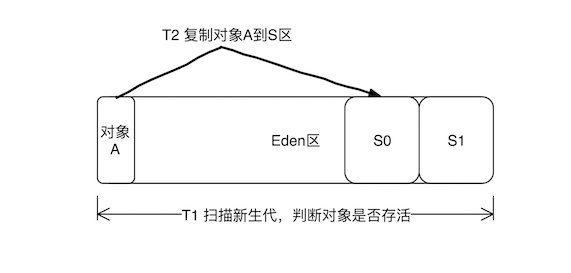
年轻代扩容后，Minor GC间隔增加，很多对象在此之间结束了自己的生命周期，不需要把它复制到Survivor区，而`复制对象的成本要远高于扫描成本`，所以，单次Minor GC时间更多取决于GC后存活对象的数量，而非Eden区的大小。因此如果堆中短期对象很多，那么扩容新生代，单次Minor GC时间不会显著增加。
- 小结：如何选择各分区大小应该依赖应用程序中对象生命周期的分布情况：如果应用存在大量的短期对象，应该选择较大的年轻代；如果存在相对较多的持久对象，老年代应该适当增大。

**2. 请求高峰期发生GC，导致服务可用性下降**
高峰期CMS在重标记（Remark）阶段耗时1.39s。Remark阶段是Stop-The-World（以下简称为STW）的，即在执行垃圾回收时，Java应用程序中除了垃圾回收器线程之外其他所有线程都被挂起，意味着在此期间，用户正常工作的线程全部被暂停下来，这是低延时服务不能接受的。本次优化目标是`降低Remark时间`。
新生代中对象的特点是“朝生夕灭”，这样如果Remark前执行一次Minor GC，大部分对象就会被回收。CMS就采用了这样的方式，在Remark前增加了一个可中断的并发预清理（CMS-concurrent-abortable-preclean），该阶段主要工作仍然是并发标记对象是否存活，只是这个过程可被中断。此阶段在Eden区使用超过2M时启动，当然2M是默认的阈值，可以通过参数修改。如果此阶段执行时等到了Minor GC，那么上述灰色对象将被回收，Reamark阶段需要扫描的对象就少了。
除此之外CMS为了避免这个阶段没有等到Minor GC而陷入无限等待，提供了参数CMSMaxAbortablePrecleanTime ，默认为5s，含义是如果可中断的预清理执行超过5s，不管发没发生Minor GC，都会中止此阶段，进入Remark。 根据GC日志红色标记2处显示，可中断的并发预清理执行了5.35s，超过了设置的5s被中断，期间没有等到Minor GC ，所以Remark时新生代中仍然有很多对象。
对于这种情况，CMS提供`CMSScavengeBeforeRemark`参数，用来保证Remark前强制进行一次Minor GC。
经过增加CMSScavengeBeforeRemark参数，单次执行时间>200ms的GC停顿消失，从监控上观察，GCtime和业务波动保持一致，不再有明显的毛刺。
- 小结：由于跨代引用的存在，CMS在Remark阶段必须扫描整个堆，同时为了避免扫描时新生代有很多对象，增加了可中断的预清理阶段用来等待Minor GC的发生。只是该阶段有时间限制，如果超时等不到Minor GC，Remark时新生代仍然有很多对象，我们的调优策略是，通过参数强制Remark前进行一次Minor GC，从而降低Remark阶段的时间。

**3. 发生Stop-The-World的GC**
本次优化目标是降低单次STW回收停顿时间，提高可用性。
锁定原因：根据日志发现Full GC后，Perm区变大了，推断是由于`永久代`空间不足容量扩展导致的。
找到原因后解决方法有两种： 1. 通过把-XX:PermSize参数和-XX:MaxPermSize设置成一样，强制虚拟机在启动的时候就把永久代的容量固定下来，避免运行时自动扩容。 2. CMS默认情况下不会回收Perm区，通过参数CMSPermGenSweepingEnabled、CMSClassUnloadingEnabled ，可以让CMS在Perm区容量不足时对其回收。
- 小结：对于性能要求很高的服务，建议将MaxPermSize和MinPermSize设置成一致（JDK8开始，Perm区完全消失，转而使用元空间。而元空间是直接存在内存中，不在JVM中），Xms和Xmx也设置为相同，这样可以减少内存自动扩容和收缩带来的性能损失。虚拟机启动的时候就会把参数中所设定的内存全部化为私有，即使扩容前有一部分内存不会被用户代码用到，这部分内存在虚拟机中被标识为虚拟内存，也不会交给其他进程使用。
#### 卡表
老年代可能持有新生代对象引用，所以Minor GC时也必须扫描老年代。
JVM是如何避免Minor GC时扫描全堆的？ 经过统计信息显示，老年代持有新生代对象引用的情况不足1%，根据这一特性JVM引入了`卡表`（card table）来实现这一目的

卡表的具体策略是将老年代的空间分成大小为512B的若干张卡（card）。卡表本身是单字节数组，数组中的每个元素对应着一张卡，当发生老年代引用新生代时，虚拟机将该卡对应的卡表元素设置为适当的值。如上图所示，卡表3被标记为脏（卡表还有另外的作用，标识并发标记阶段哪些块被修改过），之后Minor GC时通过扫描卡表就可以很快的识别哪些卡中存在老年代指向新生代的引用。这样虚拟机通过`空间换时间`的方式，避免了全堆扫描。

## GC会回收栈吗
不会
在Java内存运行时的各个部分中，程序计数器、虚拟机栈、本地方法栈这三个区域随线程生随线程死。栈中的栈帧随着方法的进入和退出有条不紊的进行着出入栈操作。这几个区域是不需要过多的考虑内存回收的问题，因为方法或者线程结束，内存自然就跟着被回收。 然而，Java堆和方法区则不同——一个接口中的多个实现类需要的内存可能不一样，一个方法中的多个分支需要的内存可能也不一样。这部分内存的分配是动态的，我们只有在程序运行期间才能知道会创建哪些对象。这部分内存，就是我们关注的重点

## JVM内存参数
#### 年轻代内存大小设置
-Xmn256m
设置JVM的新生代内存大小（－Xmn 是将NewSize与MaxNewSize设为一致。256m）,同下面两个参数
```
-XX:NewSize=256m
-XX:MaxNewSize=256m
```
还可以通过新生代和老年代内存的比值来设置新生代大小
-XX:NewRatio=3
设置新生代（包括Eden和两个Survivor区）与老年代的比值（除去持久代）。设置为3，则新生代与老年代所占比值为1：3，新生代占整个堆栈的1/4
**Eden内存大小设置**
新生代减去2*Survivor的内存大小就是Eden的大小。
**Survivor内存大小设置**
-XX:SurvivorRatio=8
设置为8,则两个Survivor区与一个Eden区的比值为2:8,一个Survivor区占整个新生代的1/10
#### 老年代内存大小设置
堆内存减去新生代内存
如上面设置的参数举例如下：
老年代初始内存为：512M-256M=256M
老年代最大内存为：1G-256M=768M
#### 栈内存大小设置
-Xss1m
每个线程都会产生一个栈。在相同物理内存下，减小这个值能生成更多的线程。如果这个值太小会影响方法调用的深度。
#### 元空间内存大小设置
元空间（Metaspace）(JDK8以前叫永久代)
```
-XX:MetaspaceSize=128m
-XX:MaxMetaspaceSize=512m（JDK8）
```
JDK8的永久代几乎可用完机器的所有内存，同样设一个128M的初始值，512M的最大值保护一下。
#### 直接内存大小设置
-XX:MaxDirectMemorySize
此参数的含义是当Direct ByteBuffer分配的堆外内存到达指定大小后，即触发Full GC。注意该值是有上限的，默认是64M，最大为sun.misc.VM.maxDirectMemory()，在程序中中可以获得
#### 设置新生代代对象进入老年代的年龄
-XX:MaxTenuringThreshold=15
设置垃圾最大年龄。如果设置为0的话，则新生代对象不经过Survivor区，直接进入老年代。对于老年代比较多的应用，可以提高效率。如果将此值设置为一个较大值，则新生代对象会在Survivor区进行多次复制，这样可以增加对象再新生代的存活时间，增加在新生代即被回收的概论。
最大值为15，因为对象头中用了4位进行存储垃圾年龄 【1111（二进制）=15（十进制）】。

## 直接内存
(Direct Memory)
直接内存是Java堆之外的，直接向系统申请的内存空间，所以直接内存不是虚拟机的一部分，也不是《Java虚拟机规范》中定义的内存区域，也有可能导致OOM。
#### 非直接缓存区
在jdk1.4之前，java的对象与系统之间的交互如下图，先从JVM需要从用户态切换到内核态时，这样的话读取写入一份数据需要经历四个步骤：jvm切换到内核态缓冲区读取->操作系统将数据拷贝用户缓冲区-->-再次切换到内核态并将用户缓存区数据拷贝进来->将内核态缓冲区写入socket buffer(cpu参与两次)
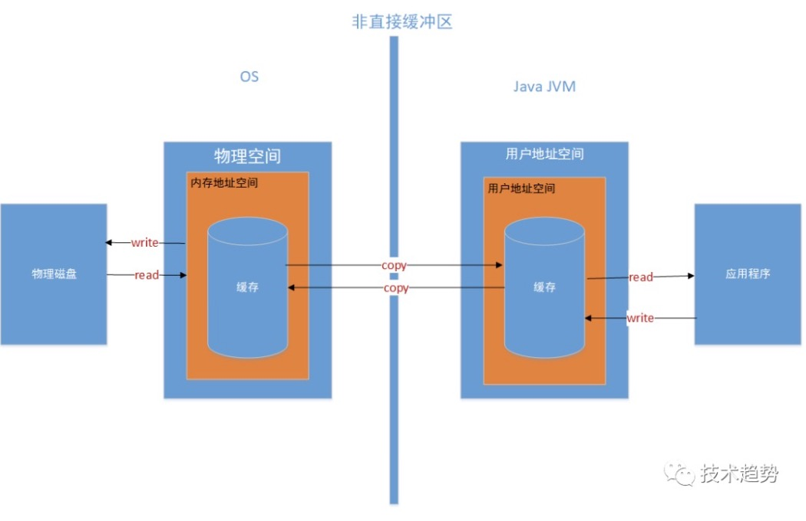
#### 直接缓存区
直接内存也称直接缓存区，主要是解决一个java读取慢的问题，jdk1.4以后jvm 引入了NIO在操作系统划出了一块直接的缓存区可以直接被java访问。就是所称的`零拷贝`。
用户->内核态缓冲区（cpu不参与）
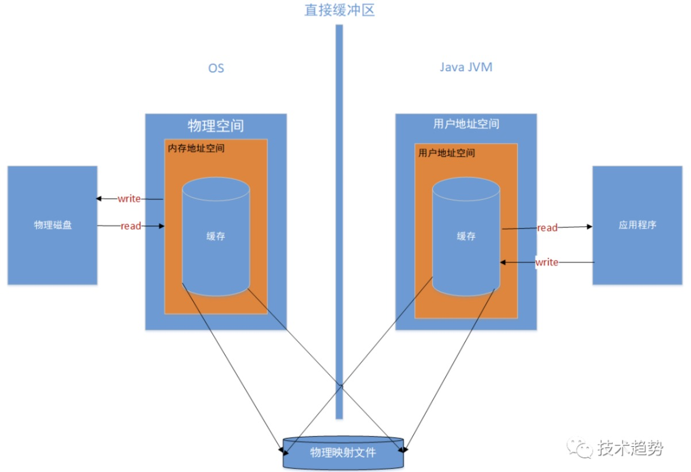

## JVM调优
#### 调优目标
吞吐量、延迟、内存占用三者类似CAP，构成了一个不可能三角，只能选择其中两个进行调优，不可三者兼得。
#### 调优步骤
一般情况下，JVM调优可通过以下步骤进行：
1. 分析系统系统运行情况：分析GC日志及dump文件，判断是否需要优化，确定瓶颈问题点；
2. 确定JVM调优量化目标；
3. 确定JVM调优参数（根据历史JVM参数来调整）；
4. 依次确定调优内存、延迟、吞吐量等指标；
5. 对比观察调优前后的差异；
6. 不断的分析和调整，直到找到合适的JVM参数配置；
7. 找到最合适的参数，将这些参数应用到所有服务器，并进行后续跟踪。
#### 常用调优策略
**1. 选择合适的垃圾回收器**
- CPU单核，那么毫无疑问Serial 垃圾收集器是你唯一的选择。
- CPU多核，关注吞吐量 ，那么选择PS+PO组合。
- CPU多核，关注用户停顿时间，JDK版本1.6或者1.7，那么选择CMS。
- CPU多核，关注用户停顿时间，JDK1.8及以上，JVM可用内存6G以上，那么选择G1。

**2. 调整内存大小**
现象：垃圾收集频率非常频繁。
原因：如果内存太小，就会导致频繁的需要进行垃圾收集才能释放出足够的空间来创建新的对象，所以增加堆内存大小的效果是非常显而易见的。
注意：如果垃圾收集次数非常频繁，但是每次能回收的对象非常少，那么这个时候并非内存太小，而可能是内存泄露导致对象无法回收，从而造成频繁GC。
**3. 设置符合预期的停顿时间**
现象：程序间接性的卡顿
原因：如果没有确切的停顿时间设定，垃圾收集器以吞吐量为主，那么垃圾收集时间就会不稳定。
注意：不要设置不切实际的停顿时间，单次时间越短也意味着需要更多的GC次数才能回收完原有数量的垃圾.
```
//GC停顿时间，垃圾收集器会尝试用各种手段达到这个时间
-XX:MaxGCPauseMillis 
```
**4. 调整内存区域大小比率**
现象：某一个区域的GC频繁，其他都正常。
原因：如果对应区域空间不足，导致需要频繁GC来释放空间，在JVM堆内存无法增加的情况下，可以调整对应区域的大小比率。
注意：也许并非空间不足，而是因为内存泄造成内存无法回收。从而导致GC频繁。
```
//survivor区和Eden区大小比率
指令：-XX:SurvivorRatio=6  //S区和Eden区占新生代比率为1:6,两个S区2:6
 
//新生代和老年代的占比
-XX:NewRatio=4  //表示新生代:老年代 = 1:4 即老年代占整个堆的4/5；默认值=2
```
**5. 调整对象升老年代的年龄**
现象：老年代频繁GC，每次回收的对象很多。
原因：如果升代年龄小，新生代的对象很快就进入老年代了，导致老年代对象变多，而这些对象其实在随后的很短时间内就可以回收，这时候可以调整对象的升级代年龄，让对象不那么容易进入老年代解决老年代空间不足频繁GC问题。
注意：增加了年龄之后，这些对象在新生代的时间会变长可能导致新生代的GC频率增加，并且频繁复制这些对象新生的GC时间也可能变长。
```
//进入老年代最小的GC年龄,年轻代对象转换为老年代对象最小年龄值，默认值7
-XX:InitialTenuringThreshol=7 
```
**6. 调整大对象的标准**
现象：老年代频繁GC，每次回收的对象很多,而且单个对象的体积都比较大。
原因：如果大量的大对象直接分配到老年代，导致老年代容易被填满而造成频繁GC，可设置对象直接进入老年代的标准。
注意：这些大对象进入新生代后可能会使新生代的GC频率和时间增加。
```
//新生代可容纳的最大对象,大于则直接会分配到老年代，0代表没有限制。
-XX:PretenureSizeThreshold=1000000 
```
**7. 调整GC的触发时机**
现象：CMS，G1 经常 Full GC，程序卡顿严重。
原因：G1和CMS  部分GC阶段是并发进行的，业务线程和垃圾收集线程一起工作，也就说明垃圾收集的过程中业务线程会生成新的对象，所以在GC的时候需要预留一部分内存空间来容纳新产生的对象，如果这个时候内存空间不足以容纳新产生的对象，那么JVM就会停止并发收集暂停所有业务线程（STW）来保证垃圾收集的正常运行。这个时候可以调整GC触发的时机（比如在老年代占用60%就触发GC），这样就可以预留足够的空间来让业务线程创建的对象有足够的空间分配。
注意：提早触发GC会增加老年代GC的频率。
```
//使用多少比例的老年代后开始CMS收集，默认是68%，如果频繁发生SerialOld卡顿，应该调小
-XX:CMSInitiatingOccupancyFraction

//G1混合垃圾回收周期中要包括的旧区域设置占用率阈值。默认占用率为 65%
-XX:G1MixedGCLiveThresholdPercent=65 
```
**8. 调整 JVM本地内存大小**
现象：GC的次数、时间和回收的对象都正常，堆内存空间充足，但是报OOM
原因： JVM除了堆内存之外还有一块堆外内存，这片内存也叫本地内存，可是这块内存区域不足了并不会主动触发GC，只有在堆内存区域触发的时候顺带会把本地内存回收了，而一旦本地内存分配不足就会直接报OOM异常。
注意： 本地内存异常的时候除了上面的现象之外，异常信息可能是OutOfMemoryError：Direct buffer memory。 解决方式除了调整本地内存大小之外，也可以在出现此异常时进行捕获，手动触发GC（System.gc()）。
```
XX:MaxDirectMemorySize
```

## 对象创建、内存分配
#### 对象创建方法
JVM遇到一条`new`指令时，首先检查这个指令的参数是否能在`常量池`中定位到一个类的符号引用，并且检查这个符号引用代表的类是否已被加载、连接和初始化过。如果没有，那必须先执行相应的类的加载过程。
#### 对象的内存分配
对象所需内存的大小在`类加载完成后`便完全确定（对象内存布局），为对象分配空间的任务等同于把一块确定大小的内存从Java堆中划分出来。
**指针碰撞**(标记整理)
所有用过的内存在一边，空闲内存在另一边，中间放着一个指针作为`分界点`的指示器，分配内存就是把指针往空闲内存那边挪一段与对象大小相等的距离。
**空闲列表**(标记清除)
虚拟机维护一个`列表`，记录哪些内存是可用的，分配的时候从列表中找到一块足够大的空间划分给对象，并更新列表。

## 内存分配机制
**栈上分配**
JVM通过`逃逸分析`确保对象不会被方法外部所引用，JVM不会创建该对象，而是将该对象`成员变量`分解若干个被这个方法使用的成员变量所代替，这些代替的成员变量在`栈帧或寄存器`上分配空间。
**堆分配**
1. `大对象`直接进入老年代：需要连续空间内存的对象(字符串、数组)，为了避免对象在S0-S1之间复制效率低下的问题
2. `长期存活的对象`进入老年代：内存回收的时候必须要识别哪些对象应该在新生代，那些对象在老年代。这里判断的重要依据就是GC对象的年龄，Young GC过后，年轻代依然存活的对象如果年龄达到了JVM所规定的GC年龄，则会被移动到老年代中。
3. 对象`动态年龄`判断：当前放对象的Survivor区域里(其中一块区域，放对象的那块s区)，一批对象的总大小大于这块Survivor区域内存大小的`50%`，那么此时大于等于这批对象年龄`最大值`的对象，就可以直接进入老年代了。动态年龄判断机制一般是在Young GC之后触发的
4. 老年代空间`分配担保`机制：年轻代每次minor gc之前JVM都会计算下老年代`剩余可用空间`，如果这个可用空间小于年轻代里现有的所有对象大小之和(包括垃圾对象)，就会触发一次`Full GC`，回收完还是没有足够空间存放新的对象就会发生`OOM`

## 对象的访问定位
Java是通过虚拟机栈中的局部变量表中的reference数据来操作Java堆上的具体对象。但reference只是虚拟机规范中规定指向一个对象的`引用`，它并没有定义这个引用通过何种方式去定位、访问堆中的对象的具体位置，所以对象访问方法也取决于虚拟机的实现而定的。目前主流的访问方式有使用`句柄`和`直接指针`两种。
#### 句柄访问
如果使用句柄访问，Java`堆`中将会划分出一块儿内存作为`句柄池`，reference中存储的就是对象的句柄地址，而句柄中包含了`对象实例数据`和`对象类型数据`的具体地址信息。实际上是采用了句柄池这样一个中间介质进行了`两次指针定位`，有效的避免了对象的移动或改变直接导致reference本身发生改变。句柄访问方式如下图所示：
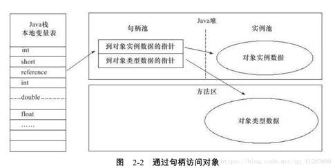
使用句柄访问最大的好处就是reference中存储的是`稳定`的句柄地址，在对象回收过程中或者其它对象需要移动的时，只会改变句柄中的实例数据的指针，而reference本身不需要做任何修改。
#### 直接指针访问
如果使用直接指针访问，那么Java堆对象的布局必须考虑如何放置访问`类型数据`的相关信息，而reference中存储的直接就是`对象地址`，而不再是句柄地址信息，相当于在reference与对象地址信息直接少了句柄池这样一个中间地址，reference中直接存储的就是对象地址。
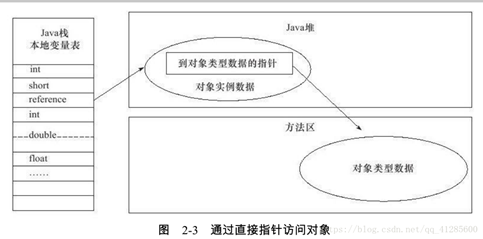
这种定位方式也就导致了在对象被移动时，reference本身必须发生`改变`。但是我们都知道，使用句柄访问方式时，相当于进行了两次指针定位，而直接指针访问方式恰好节省了这一次指针定位的`时间开销`，由于对象的访问在Java中非常的频繁，时间开销的减少也是一种可观的执行成本。例如，常见的HotSpot虚拟机就使用的是直接指针访问方式。

## 类加载机制 — 双亲委派
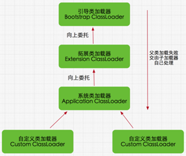
如果一个类加载器收到了类加载请求，它并不会自己先去加载，而是把这个请求`委托给父类`的加载器去执行，如果父类加载器还存在其父类加载器，则进一步向上委托，依次递归，请求最终将到达顶层的启动类加载器，如果父类加载器可以完成类加载任务，就成功返回，倘若父类加载器无法完成此加载任务，子加载器才会尝试自己去加载，这就是双亲委派模式
**优点**
1. 带有优先级的层次关系，通过这种层级关可以避免类的重复加载
2. 安全因素，java核心api中定义类型不会被随意替换，

## 类加载的过程
1. **加载**：根据查找路径找到相应的class文件，然后导入。类的加载方式分为隐式加载和显示加载两种。`隐式加载`指的是程序在使用new关键词创建对象时，会隐式的调用类的加载器把对应的类加载到jvm中。`显示加载`指的是通过直接调class.forName方法来把所需的类加载到jvm中。
2. **验证**：检查加载的class文件的`正确性`。
3. **准备**：给类中的静态变量分配`内存空间`，设置变量`初始值`。
4. **解析**：虚拟机将常量池中的`符号引用`替换成`直接引用`的过程。符号引用就理解为一个标示，而在直接引用直接指向内存中的地址。
5. **初始化**：对`静态变量`和`静态代码块`执行初始化工作。

## 主动引用、被动引用
**主动引用（会引起类的初始化）**
* 虚拟机启动时先初始化`main`方法所在的类
* `new`一个类的对象
* 调用类的`静态`成员(除`final`)和静态方法
* 对类进行`反射`调用
* 初始化一个类若其`父类`没被初始化，则先会初始化它的父类

**被动引用（不会引起类的初始化）**
* 通过子类引用父类的静态变量，只有`父类`会被初始化
* `数组`定义引用不会触发类的初始化
* 引用`常量`(常量在链接阶段已经存入类的常量池中了)

## JDBC破坏双亲委派机制
JDBC的Driver接口定义在JDK中，其实现由各个数据库的服务商来提供， DriverManager类中要加载各个实现了Driver接口的类，然后进行管理，但是DriverManager位于JAVA_HOME中jre/lib/rt.jar 包，由BootStrap类加载器加载，而其Driver接口的实现类是位于服务商提供的Jar包，根据类加载机制，当被装载的类引用了另外一个类的时候，虚拟机就会使用装载第一个类的类装载器装载被引用的类。也就是说`BootStrap类加载器`还要去加载jar包中的Driver接口的实现类。我们知道，BootStrap类加载器默认只负责加载JAVA_HOME中jre/lib/rt.jar 里所有的class，所以需要由子类加载器去加载Driver实现，这就破坏了双亲委派模型。在启动类加载器中有方法获取应用程序类加载器，然后通过它去加载就可以了。这就是所谓的线程上下文加载器。

## JVM监控工具
#### JPS
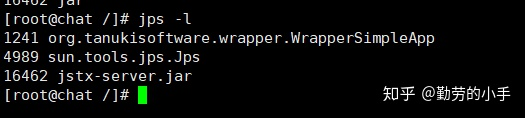
**使用场景** ：查看当前机器的所有Java进程信息（可追踪到应用进程ID 、启动类名、文件路径。）

**格式** ：jps 【选项 】 [hostid]
[hostid] 远程地址,可选参数，指定特定主机的IP或者域名，也可以指定具体协议端口，不指定则查看当前机器的相关信息，hostid所指机器必须开启jstatd服务。

**常用命令** ：jps -l
查看当前虚拟器运行的进程，输出主类全路径名称。
#### Jstat
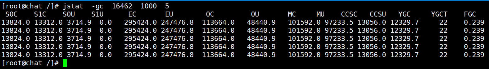
```
S0C 和 S0U    //S0区的总内存大小和已使用的内存大小。
S1C: 和S1U   //S1区的总内存大小和已使用的内存大小。。
EC 和 EU     //Eden区的总内存大小 和已使用的内存大小。
OC和OU       //Old区的总内存大小 和已使用的内存大小。
MC和MU       //方法区的总内存大小 和已使用的内存大小。
CCSC和CCSU   //压缩类空间大小 和已使用的内存大小。
YGC和 YGCT   //Young GC 的总次数 和消耗总时间。
FGC和 FGCT   //Full Gc的总次数和消耗总时间。
GCT         //所有GC的消耗时间。
```
**使用场景** ：用于查看各个功能和区域的统计信息（如：类加载、编译相关信息统计，各个内存区域GC概况和统计）

**格式** ： jstat 【选项】 【进程ID】 [间隔时间 ] [查询次数]
[间隔时间 ] 可选参数，每隔多长时间输出一次信息，单位为毫秒。
[查询次数] 可选参数，总共输出多少次信息。
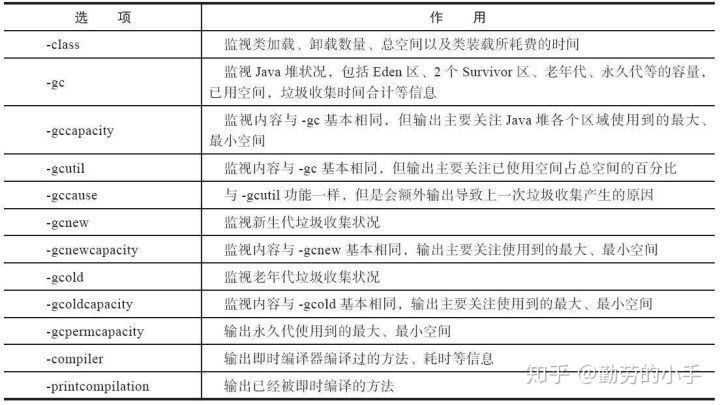

**常用指令** ：jstat -gc PID
查看即时内存使用情况、垃圾回收统计信息，监视Java堆状况，包括Eden区、2个Survivor区、老年代.永久代等的容量，已用空间，垃圾收集时间合计等信息。用于分析GC情况。
#### Jinfo
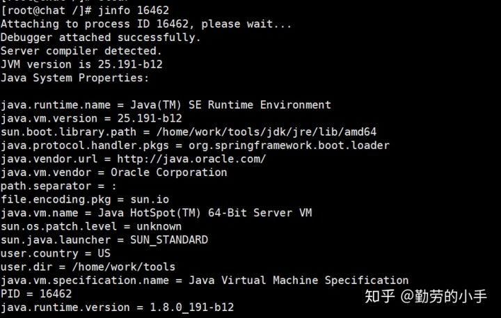
**使用场景** ：查看和调整JVM启动和运行参数。

**格式** ：jinfo 【选项】【具体选项参数名】【进程ID】

- 案例一：查看JVM整个系统参数信息
输出16462进程jvm的全部参数和系统属性
    ```shell
    jinfo 16462
    ```
- 案列二：查看某个具体参数
查看老年代内存大小
    ```shell
    jinfo -flag OldSize 16462
    ```
- 案列三：启用某个配置
启动GC日志打印
    ```shell
    jinfo -flag +PrintGCDetails 16462
    ```
- 案例四：修改某个参数值
修改当堆内存对象所占空间超过80%时进行扩容
    ```shell
    jinfo -flag MaxHeapFreeRatio=80 16462
    ```   
#### Jmap
**使用场景** ：监控堆内存使用情况和对象占用情况， 生成堆内存快照文件，查看堆内存区域配置信息。

**格式** ：jmap 【选项】【进程ID】
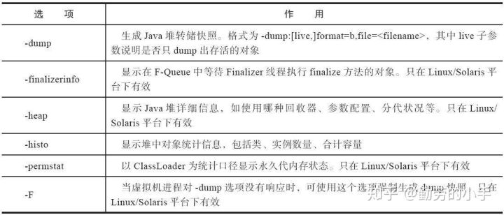
- 案例一：查看堆内存的配置和使用情况
    ```shell
    jmap -heap 18230
    ```
- 案例二：查看JVM中对应类型对象的数量、占用内存情况
    ```shell
    jmap -histo 18230 | sort -n -r -k 2 | head -10  # 统计实例最多的类 前十位有哪些
    jmap -histo 18230 | sort -n -r -k 3 | head -10  # 统计合计容量前十的类有哪些  
    ```
- 案例三：dump 堆快照
    ```shell
    jmap -dump:live, format=b, file=/home/myheapdump.hprof 18230
    # live   加上live代表只dump存活的对象
    # fomat  格式
    # filie  导出的文件名
    # 18230  java进程ID
    ```
#### Jstack
**使用场景** ：查看JVM线程信息 和生成线程快照。

**格式** ：jstack 【选项】【进程ID】
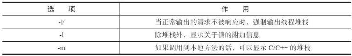
- 案例一：打印堆栈线程信息 ，输出到文件
    ```shell
    jstack -l 871055 > jstack.prof
    ```
#### 第三方在线监控工具(Arthas)
Arthas 是Alibaba开源的Java诊断工具，它可以帮助我们解决在线环境的以下问题
1. 监控到JVM的实时运行状态（涵盖Jps ,jstat ,jinfo ,jstack ,部分Jmap功能）。
2. 在不需要重新部署服务的情况下修改业务代码。
3. 以局视角来查看系统的运行状况。
- 案例一：查看系统实时运行状态（dashboard）
在控制台输入dashboard 回车后会看到下图对应的信息，这里主要展示了当前监控的进程信息、包括 实时的线程信息、内存分配和使用状态信息、系统环境信息。
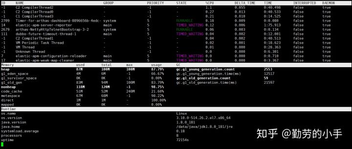
- 案例二：查看应用线程信息（thread）
thead 可现实应用的运行线程情况，功能和jstack类似。在控制台输入thread 可显示当前应用运行的线程信息。
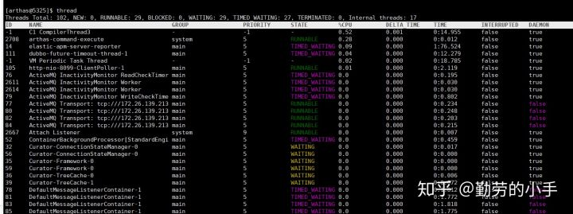

## JVM内存溢出
#### 程序计数器
**作用**：指向当前线程下一条需要执行的字节码指令的地址
**内存溢出**：不会发生
#### 虚拟机栈
**作用**：由栈帧组成、每个栈帧代表一次方法调用，其包含存储变量表、操作数栈和方法出口三个部分，方法执行完成后该栈帧将被弹出。
**内存溢出**：`StackOverflowError`和`OutOfMemoryError`。
**溢出原因**：
- `StackOverflowError`：如果请求的栈的深度大于虚拟机所允许的深度，将会抛出这个异常，如果使用虚拟机默认参数，一般达到1000到2000这样的深度没有问题。
- `OutOfMemoryError`：因为除掉堆内存和方法区容量，剩下的内存由虚拟机栈和本地方法栈瓜分，如果剩下的内存不足以满足更多的工作线程的运行、或者不足以拓展虚拟机栈的时候，就会抛出OutOfMemoryError异常。

**解决方法**：
`StackOverflowError`：
1. 首先栈溢出会输出异常信息，根据信息查看对应的方法调用是否出现无限调用、或者栈帧过大等代码逻辑上的问题，通过修改代码逻辑解决；
2. 如果确确实实需要更大的栈容量，可以检查并调大栈容量：-Xss16m。

`OutOfMemoryError`：
1. 首先检查是否创建过多的线程，减少线程数
2. 可以通过“减少最大堆容量”或“减少栈容量”来解决。
#### 本地方法栈
**作用**：与虚拟机栈唯一的不同是虚拟机栈执行的是java方法，而本地方法栈执行的是本地的C/C++方法
**内存溢出**：`StackOverflowError`和`OutOfMemoryError`
**溢出原因**：同虚拟机栈
**解决方法**：同虚拟机栈
#### 堆
**作用**：所有线程共享，存放对象实例
**内存溢出**：`OutOfMemoryError:Java heap space`
**溢出原因**：堆中没有足够内存完成实例分配，并且无法继续拓展时
**解决方法**：
1. 内存泄露检查：首先通过“内存溢出快照 + MAT等分析工具”，分析是否存在内存泄露现象，检查时可以怀疑的点比如集合、第三方库如数据库连接的使用、new关键字相关等。
2. 如果没有内存泄露，那么就是内存溢出，所有对象却是都还需要存活，这个时候就只能调大堆内存了：-Xms和-Xmx。
#### 方法区
**作用**：所有线程共享，存放已加载的class信息、常量、静态变量和即时编译后的代码
**内存溢出**：`OutOfMemoryError:PermGen space`
**溢出原因**：方法区没有足够内存完成内存分配存放运行时新加载的class信息
**解决方法**：
1. 内存泄露检查：检查是否加载过多class文件(jar文件)，或者重复加载相同的class文件(jar文件)多次
2. 通过-XX:PermSize=64M -XX:MaxPermSize=128M改大方法区大小
#### 运行时常量池
**作用**：方法区的一部分，存放常量
**内存溢出**：`OutOfMemoryError:PermGen space`
**溢出原因**：方法区没有足够的内存完成内存分配，存放运行时新创建的常量，比如String类的intern()方法，其作用是如果常量池已经包含一个相同的字符串，则返回其引用，否则将此String对象包含的字符串添加到常量池中。
**解决方法**：
1. 内存泄露检查：检查是否创建过多常量
2. 通过-XX:PermSize=64M -XX:MaxPermSize=128M改大方法区大小
#### 直接内存
**作用**：不属于JVM运行时数据区，也不是虚拟机规范中定义的内存区域，JDK1.4引入的NIO中包含通道Channel和缓冲区Buffer，应用程序从通道获取数据是先经过OS的内核缓冲区，再拷贝至Buffer，因为比较耗时，所以Buffer提供了一种直接操作操作系统缓冲区的方式，即ByteBuffer.allocateDirector(size)，这个方法返回DirectByteBuffer应用就是指向这个底层存储空间关联的缓冲区，即直接内存。
**内存溢出**：`OutOfMemoryError`
**溢出原因**：JVM所需内存 + 直接内存 > 机器物理内存(或操作系统级限制)，无法动态拓展
**判断方法**：内存泄露检查：例如内存占用较高，机器性能骤降，但是通过GC信息或者jstat发现GC很少，通过jmap获得快照分析后也没发现什么异常，而程序中又直接或者间接地用到了NIO，那么和可能就是直接内存泄露了。
**解决方法**：分析NIO相关的程序逻辑解决。