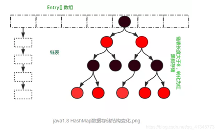
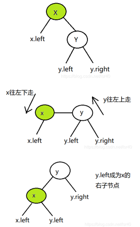
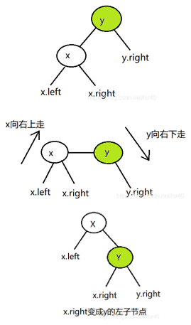
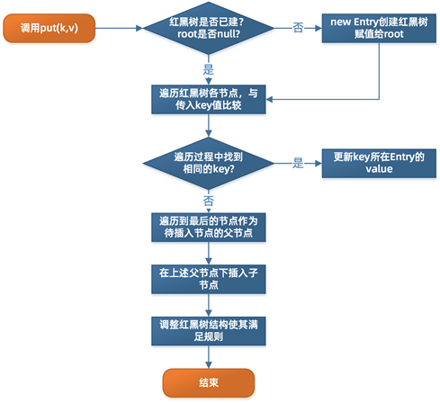
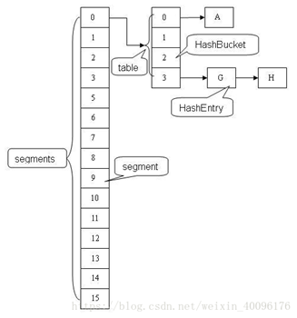
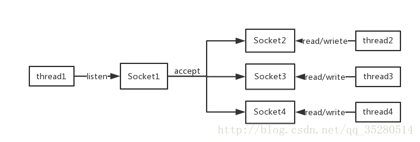
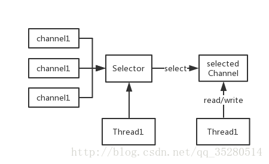
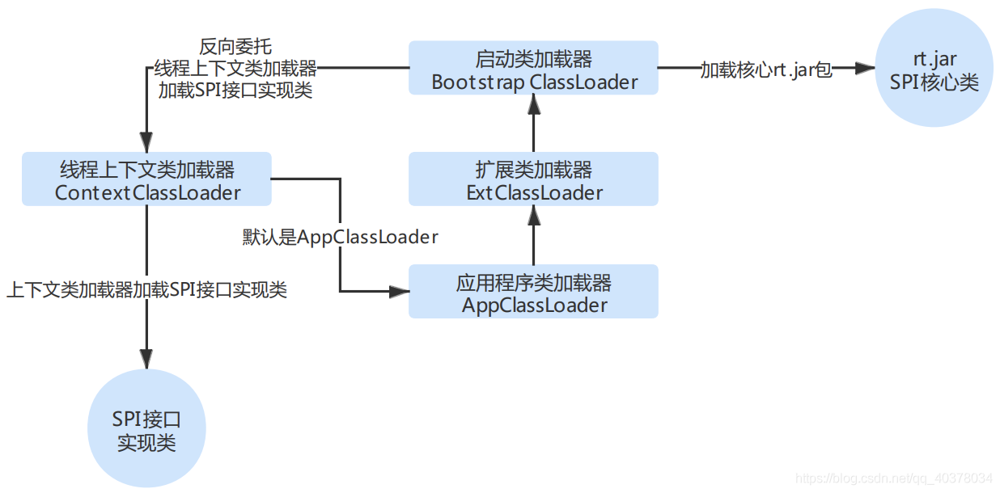

## final、finally、finalize的区别
**final**
final修饰符有三种用法：如果一个`类`被声明为final，意味着它不能再派生出新的子类，即不能被继承，将`变量`声明为final，可以保证它们在使用中不被改变，被声明为final的变量的引用中只能读取不可修改。被声明为final的`方法`也同样只能使用，不能在子类中被重写。
**finally**
通常放在try…catch…的后面构造总是执行代码块，这就意味着程序无论正常执行还是发生异常，这里的代码只要JVM不关闭都能执行，可以将释放外部资源的代码写在finally块中。
**finalize**
Object类中定义的方法，Java中允许使用finalize()方法在垃圾收集器将对象从内存中清除出去之前做必要的`清理`工作。这个方法是由垃圾收集器在销毁对象时调用的，通过重写finalize()方法可以整理系统资源或者执行其他清理工作。

## static关键字
static是一个修饰符，用于修饰成员。由static修饰的变量，方法称为静态变量，方法。
**static关键字修饰类**
普通类是不允许声明为静态的，只有`内部类`才可以
**static关键字修饰方法**
可以直接通过类名来进行调用
**static关键字修饰变量**
被static修饰的成员变量叫做静态变量，也叫做类变量，说明这个变量是属于这个类的，而不是属于是对象，没有被static修饰的成员变量叫做实例变量，说明这个变量是属于某个具体的对象的。
**static关键字修饰代码块**
静态代码块在类第一次被载入时执行。类初始化的顺序：父类静态代码块 → 子类静态代码块 → 父类构造函数 → 子类构造函数
**注意事项：**
1. 虽然静态成员也可以使用`对象.静态成员`，但这样不好区分静态成员和非静态成员。
2. 静态方法中不可以使用this关键字。
3. 静态方法中不可以直接调用非静态方法
4. 不能将方法中的局部变量设为静态的
5. 可以使用静态区域先执行类的初始化。

## String类是final修饰的
**安全**
```java
public static void main(String[] args){
    HashSet<StringBuilder> hs = new HashSet<StringBuilder>();
    StringBuilder sb1 = new StringBuilder("aaa");
    StringBuilder sb2 = new StringBuilder("aaabbb");
    hs.add(sb1);
    hs.add(sb2);            //这时候HashSet里是{"aaa","aaabbb"}

    StringBuilder sb3=sb1;
    sb3.append("bbb");      //这时候HashSet里是{"aaabbb","aaabbb"}
    System.out.println(hs);
}
```
因为`StringBuilder`没有不可变性的保护，sb3直接在原先"aaa"的地址上改。导致sb1的值也变了。这时候，`HashSet`上就出现了两个相等的键值"aaabbb"。破坏了`HashSet`键值的唯一性。所以千万不要用可变类型做`HashMap`和`HashSet`键值。
**线程安全**
不可变对象不能被写，所以线程安全。
**效率高**
如果是字符串`常量形式的声明`首先会查看`常量池`中是否存在这个常量，如果存在就不会创建新的对象，否则在在常量池中创建该字符串并创建引用，此后不论以此种方式创建多少个相同的字符串都是指向这一个地址的引用，而不再开辟新的地址空间放入相同的数据；但是字符串对象每次`new`都会在`堆区`形成一个新的内存区域并填充相应的字符串，不论堆区是否已经存在该字符串

## String、StringBuffer、StringBuilder的区别
**String - 字符串常量**
String的值是不可变的，这就导致每次对String的操作都会生成`新的String对象 `
**StringBuffer、StringBuilder - 字符串变量**
StringBuffer和StringBuilder类的对象能够被多次的修改，并且不产生新的未使用对象。StringBuilder的方法`不是线程安全`的（不能同步访问）。由于StringBuilder相较于StringBuffer有速度优势，所以多数情况下建议使用StringBuilder类。然而在应用程序要求线程安全的情况下，则必须使用StringBuffer类。StringBuffe很多方法都是synchronized修饰的：length()、append()。

## transient关键字
将`不需要序列化`的属性前添加关键字`transient`，序列化对象的时候，这个属性就不会被序列化。

## 红黑树
* 当`冲突`(链表长度)大于等于8时，就会将冲突的Entry转换为`红黑树`进行存储。


红黑树是一种`自平衡二叉查找树`，是一种特化的AVL树（平衡二叉树）。每一颗红黑树都是一颗`二叉排序树`。
#### 红黑树的特点
1. 每个结点要么是红的，要么是黑的。  
2. `根结点`是黑的。  
3. 每个`叶结点`（叶结点即指树尾端NIL指针或NULL结点）是黑的。  
4. 如果一个结点是红的，那么它的`俩个儿子`都是黑的。  
5. 对于任一结点而言，其到叶结点树尾端NIL指针的每一条路径都包含`相同数目的黑结点`。
#### 红黑树添加节点
* 规则：新添加的节点都为`红色`
1. 新节点位于`根节点`：将该节点直接设为`黑色`即可
2. 新节点的父节点是`黑色`时：不用动，这已经是一颗红黑树
3. 父节点和叔节点都是`红色`时：a.将父节点和叔节点设为`黑色`；b.将祖父节点设为`红色`；c.将祖父节点设为`当前节点`，并继续对新当前节点进行操作
4. 父节点是`红色`，叔节点是`黑色`时，又分如下四种情况：
当前节点是父亲的左孩子，父亲是祖父的左孩子(**Left-Left**)：a.将`祖父节点右旋`；b.交换父节点和祖父节点的颜色
当前节点是父亲的右孩子，父亲是祖父的左孩子(**Right-Left**)：a.将`父节点左旋`，并将父节点作为当前节点；b.然后再使用`Left-Left`情形
当前节点是父亲的右孩子，父亲是祖父的右孩子(**Right-Right**)：a.将`祖父节点左旋`;b.交换父节点和祖父节点的颜色
当前节点是父亲的左孩子，父亲是祖父的右孩子(**Left-Right**)：a.将`父节点右旋`，并将父节点作为当前节点；b.然后再使用`Right-Right`情形

**左旋**&emsp;&emsp;&emsp;&emsp;&emsp;&emsp;&emsp;&emsp;&emsp;&emsp;&emsp;&emsp;&emsp;&emsp;&emsp;&emsp;&emsp;&emsp;&emsp;**右旋**
<figure class="half">
    
    
</figure>
#### 红黑树删除节点
1. 删除的是`根节点`，则直接将根节点置为null;
2. 待删除节点的左右子节点`都为null`，删除时将该节点置为null;
3. 待删除节点的左右子节点`有一个有值`，则用有值的节点替换该节点即可；
4. 待删除节点的左右子节点`都不为null`，则找前驱或者后继，将前驱或者后继的值复制到该节点中，然后删除前驱或者后继（`前驱：左子树中值最大的节点，后继：右子树中值最小的节点`）；

## HashMap
#### HashMap底层数据结构
HashMap的主干是一个`Node数组`。它实现了Map.Entry接口。Entry是HashMap的`基本组成单元`，每一个Entry包含一个`key-value`键值对。代码如下
```java
static class Entry<K,V> implements Map.Entry<K,V> {
    final K key;
    V value;
    Entry<K,V> next;    //存储指向下一个Entry的引用，单链表结构
    int hash; 
    Entry(int h, K k, V v, Entry<K,V> n) {
        value = v;
        next = n;
        key = k;
        hash = h;
    }
}

static class Node<K,V> implements Map.Entry<K,V> {
    final int hash;
    final K key;
    V value;
    Node<K,V> next;

    ...
}

transient Node<K,V>[] table;

static final class TreeNode<K,V> extends LinkedHashMap.Entry<K,V> {
    TreeNode<K,V> parent;  // red-black tree links
    TreeNode<K,V> left;
    TreeNode<K,V> right;
    TreeNode<K,V> prev;    // needed to unlink next upon deletion
    boolean red;
    
    ...
} 
```
简单来说，HashMap由`数组 + 链表(红黑树)`组成的，数组是HashMap的主体，链表(红黑树)则是主要为了解决`哈希冲突`而存在的，在链表长度大于`8`并且表的长度大于`64`的时候会转化红黑树。如果定位到的数组位置不含链表（当前entry的next指向null）,那么查找，添加等操作很快，仅需一次寻址即可；如果定位到的数组包含链表，对于添加操作，其时间复杂度为O(n)，首先遍历链表，存在即覆盖，否则新增；对于查找操作来讲，仍需`遍历链表`，然后通过key对象的equals方法逐一比对查找。
#### HashMap扩容机制
变量**size**，它记录HashMap的底层Entry数组中`已用槽的数量`；
变量**threshold**，它是HashMap的`阈值`，（threshold = 容量*负载因子）    
变量**loadFactor**，负载因子，默认为`0.75`
* 负载因子是0.75的时候，空间利用率比较高，而且避免了相当多的Hash冲突，使得底层的链表或者是红黑树的高度比较低，提升了空间效率。

当发生`哈希冲突`并且`size大于阈值`的时候，需要进行数组扩容，扩容时，需要新建一个长度为之前数组`2倍`的新的数组，然后将当前的Entry数组中的元素全部传输过去，扩容后的新数组长度为之前的2倍。
元素在重新计算hash之后，因为n变为2倍，那么n-1的mask范围在高位多1bit(红色)，所以，元素的位置要么是在原位置，要么是在原位置再移动2次幂的位置。因此，我们在扩充HashMap的时候，不需要像JDK1.7的实现那样重新计算hash，只需要看看原来的hash值新增的那个bit是**1**还是**0**就好了，是0的话索引没变，是1的话索引变成“**原索引+oldCap**”
JDK8 是等链表整个 while 循环结束后，才给数组赋值，此时使用局部变量 `loHead` 和 `hiHead` 来保存链表的值，因为是局部变量，所以多线程的情况下，肯定是没有问题的。　　为什么有 loHead 和 hiHead 两个新老值来保存链表呢，主要是因为扩容后，链表中的元素的索引位置是可能发生变化的，代码注释中举了一个例子：　　数组大小是 8 ，在数组索引位置是 1 的地方挂着一个链表，链表有两个值，两个值的 hashcode 分别是是 9 和 33。当数组发生扩容时，新数组的大小是 16，此时 hashcode 是 33 的值计算出来的数组索引位置仍然是 1，我们称为老值(loHead)，而 hashcode 是 9 的值计算出来的数组索引位置却是 9，不是 1 了，索引位置就发生了变化，我们称为新值(hiHead)。
```java
void resize(int newCapacity) {
    int oldCap = (oldTab == null) ? 0 : oldTab.length;
    int oldThr = threshold;
    int newCap, newThr = 0;
    if (oldCap > 0) {
        if (oldCap >= MAXIMUM_CAPACITY) {
            threshold = Integer.MAX_VALUE;
            return oldTab;
        }
        else if ((newCap = oldCap << 1) < MAXIMUM_CAPACITY &&
                    oldCap >= DEFAULT_INITIAL_CAPACITY)
            newThr = oldThr << 1; // 默认原数组长度2倍
    }
    //...
    if (oldTab != null) {
    // 从索引 0 开始逐个遍历旧 table
    for (int j = 0; j < oldCap; ++j) {
        Node<K,V> e;
        if ((e = oldTab[j]) != null) {
            oldTab[j] = null;
            if (e.next == null)    // 链表只有一个元素
                newTab[e.hash & (newCap - 1)] = e;
            else if (e instanceof TreeNode)    // 红黑树，先不管
                ((TreeNode<K,V>)e).split(this, newTab, j, oldCap);
            else { // preserve order
                // 拆链表，拆成两个子链表：索引不变的元素链表和有相同偏移量的元素链表
                // 每个链表都保持原有顺序
                Node<K,V> loHead = null, loTail = null;
                Node<K,V> hiHead = null, hiTail = null;
                Node<K,V> next;
                do {
                    next = e.next;
                    if ((e.hash & oldCap) == 0) {
                        // 索引不变的元素链表
                        if (loTail == null)
                            loHead = e;
                        else    // 通过尾部去关联 next，维持了元素原有顺序
                            loTail.next = e;
                        loTail = e;
                    }
                    else {
                        // 相同偏移量的元素链表
                        if (hiTail == null)
                            hiHead = e;
                        else    // 通过尾部去关联 next，维持了元素原有顺序
                            hiTail.next = e;
                        hiTail = e;
                    }
                } while ((e = next) != null);
                if (loTail != null) {
                    loTail.next = null;
                    newTab[j] = loHead;
                }
                if (hiTail != null) {
                    hiTail.next = null;
                    newTab[j + oldCap] = hiHead;
                }
            }
        }
    }
}
}
```
#### HashMap put元素的过程
当准备添加一个key-value对时，首先通过`hash(key)`方法计算hash值，然后通过`indexFor(hash,length)`求该key-value对的存储位置，计算方法是`hash&(length-1)`，这就保证每一个key-value对都能存入HashMap中，当计算出的位置相同时，由于存入位置是一个链表，则把这个key-value对插入`链表尾`，在jdk1.8之前是插入头部的，在jdk1.8中是插入尾部的。
```java
public V put(K key, V value) {
    return putVal(hash(key), key, value, false, true);
}

//...putVal
for (int binCount = 0; ; ++binCount) {
    //e是p的下一个节点
    if ((e = p.next) == null) {
        //插入链表的尾部
        p.next = newNode(hash, key, value, null);
        //如果插入后链表长度大于8则转化为红黑树
        if (binCount >= TREEIFY_THRESHOLD - 1) // -1 for 1st
            treeifyBin(tab, hash);
        break;
    }
    //如果key在链表中已经存在，则退出循环
    if (e.hash == hash &&
        ((k = e.key) == key || (key != null && key.equals(k))))
        break;
    p = e;
}
//如果key在链表中已经存在，则修改其原先的key值，并且返回老的值
if (e != null) { // existing mapping for key
    V oldValue = e.value;
    if (!onlyIfAbsent || oldValue == null)
        e.value = value;
    afterNodeAccess(e);
    return oldValue;
}
```
#### 头插法存在的问题
链表成环：多线程HashMap扩容时发生
插入的时候和平时我们追加到尾部的思路是不一致的，是链表的头结点开始循环插入，导致插入的顺序和原来链表的顺序相反的。table 是共享的，table 里面的元素也是共享的，while 循环都直接修改 table 里面的元素的 next 指向，导致指向混乱。

#### 为什么HashMap容量为2的次幂
HashMap的数组长度一定保持2的次幂，比如16的二进制表示为10000，那么length-1就是15，二进制为01111，同理扩容后的数组长度为32，二进制表示为100000，length-1为31，二进制表示为011111。从下图可以我们也能看到这样会保证`低位全为1`，而扩容后只有一位差异，也就是多出了`最左位的1`，会使得获得的数组索引index更加均匀。如果低位全部为1，那么对于hash低位部分来说，任何一位的变化都会对结果产生影响，也就是说，要得到index=21这个存储位置，hash的低位只有这一种组合。减小哈希冲突出现的可能性。
#### HashMap和HashTable的区别
HashMap只实现`Map`接口，HashTable继承`Dictionary`类，实现Map接口。
HashMap是非线程安全的，HashTable是`线程安全`的，用Synchronize修饰方法。
HashMap计算hash：key的hash值高16位不变，低16位与高16位异或作为key最终的hash值。
Hashtable计算hash：直接使用对象自身的hash。
HashMap计算index = hash & (length-1)
Hashtable计算index = (hash & 0x7FFFFFFF) % tab.length
Hashtable默认的初始大小为11，之后每次扩充，容量变为原来的`2n+1`。HashMap默认的初始化大小为16。之后每次扩充，容量变为原来的`2倍`。

## Java的四种引用
**强引用**
是指创建一个对象并把这个对象赋给一个引用变量。
```java
Object object =new Object();
String str ="hello";
```
强引用有引用变量指向时永远不会被垃圾回收，JVM宁愿抛出OutOfMemory错误也不会回收这种对象。
**软引用**
如果一个对象具有软引用，内存空间足够，垃圾回收器就不会回收它；如果`内存空间不足`了，就会回收这些对象的内存。软引用可用来实现内存敏感的`高速缓存`,比如网页缓存、图片缓存等。使用软引用能防止内存泄露，增强程序的健壮性。   
**弱引用**
弱引用也是用来描述非必需对象的，当JVM进行垃圾回收时，`无论内存是否充足`，都会回收被弱引用关联的对象。在java中，用java.lang.ref.WeakReference类来表示。
**虚引用**
虚引用和前面的软引用、弱引用不同，它并不影响对象的生命周期。在java中用java.lang.ref.PhantomReference类表示。如果一个对象与虚引用关联，则跟`没有引用`与之关联一样，在任何时候都可能被垃圾回收器回收。

## ArrayList、LinkedList、Vector
**ArrayList**
作为List的主要实现类；主要特点有`线程不安全`，但是执行效率`高效`，底层实现是`数组`结构（Collections中定义了synchronizedList(List list)将此ArrayList转化为线程安全的）默认构造方法创建一个空数组，第一次添加元素时候，扩展容量为10，之后的扩充算法：原来数组大小+原来数组的一半（也就是1.5倍）。
**LinkedList**
对于频繁的`插入、删除`操作，我们建议使用此类，因为它的执行效率高；但是`内存`消耗比ArrayList大；底层实现的`双向链表`实现。
**Vector**
List的古老实现类；`线程安全`，效率低；底层使用`数组`实现的（如今逐渐被淘汰）默认构造方法创建一个大小为10的对象数组，如果增量为0的情况下每次扩容容量是翻倍，即为原来的2倍，而当增量>0的时候，扩充为原来的大小加增量。

## equals与==的区别
`基本数据类型`byte,short,char,int,long,float,double,boolean。他们之间的比较，用双等号 == ,比较的是他们的`值`。
equals()是Object里的方法。在Object的equals中，就是使用 == 来进行比较，比较的是`内存地址`。与==不同的是，在某些Object的子类中，覆盖了equals()方法，比如String中的equals()方法比较两个字符串对象的`内容`是否相同。

## Java序列化
**实现序列化**
* 让类实现`Serializable`接口,该接口是一个标志性接口,标注该类对象是可被序列
* 然后使用一个`输出流`来构造一个对象输出流并通过`writeObject(Obejct)`方法就可以将实现对象写出
* 如果需要反序列化,则可以用一个`输入流`建立对象输入流,然后通过`readObeject`方法从流中读取对象

**作用**
* 序列化就是一种用来处理`对象流`的机制,所谓对象流也就是将对象的内容进行流化,可以对流化后的对象进行`读写`操作,也可以将流化后的对象`传输`于网络之间;
* 为了解决对象流读写操作时可能引发的问题(如果不进行序列化,可能会存在数据`乱序`的问题)
* 序列化除了能够实现对象的持久化之外，还能够用于对象的`深度克隆`

## JDBC是什么
Java数据库连接(JDBC)是Java语言中用来规范客户端程序如何来访问数据库的`应用程序接口`，提供了诸如查询和更新数据库中数据的方法。
**JDBC驱动程序：**
* JDBC-ODBC桥
这种类型的驱动把所有JDBC的调用传递给ODBC，再让后者调用数据库本地驱动代码
* 本地API驱动
这种类型的驱动通过客户端加载数据库厂商提供的本地代码库（C/C++等）来访问数据库，而在驱动程序中则包含了Java代码。
* 网络协议驱动
这种类型的驱动给客户端提供了一个网络API，客户端上的JDBC驱动程序使用套接字（Socket）来调用服务器上的中间件程序，后者在将其请求转化为所需的具体API调用。
* 本地协议驱动
这种类型的驱动使用Socket，直接在客户端和数据库间通信。

## int 和 Integer
`int`是java的`基本数据类型`。
`Integer`继承了Object类，是`对象类型`，是 int 的`包装类`。
**区别**
* 值的存储
int 存储在`栈`中
Integer 对象的`引用`存储在`栈`空间中，对象的`数据`存储在`堆`空间中。
* 初始化
int 初始化值为`0`。
Integer 初始化值为`null`。
* 传参
int 是`值传递`，栈中的数据不可变。
Integer 对象是`引用传递`，引用不可变，但是引用指向的堆空间地址中的值是可以改变的。
* 泛型支持
泛型不支持int，但是支持Integer。
* 运算
int 可以直接做运算，是类的特性。
Integer 的对象可以调用该类的方法，但是在拆箱之前不能进行运算，需要转化为基本类型int。

## 反射
JAVA反射机制是在`运行状态`中，对于任意一个类，都能够知道这个类的所有属性和方法；对于任意一个对象，都能够调用它的任意方法和属性；这种动态获取信息以及动态调用对象方法的功能称为java语言的反射机制。
在日常的第三方应用开发过程中，经常会遇到某个类的某个成员变量、方法或是属性是私有的或是只对系统应用开放，这时候就可以利用Java的反射机制通过反射来获取所需的私有成员或方法。

## TreeMap
TreeMap存储K-V键值对，通过`红黑树`实现；天然支持排序，默认情况下通过Key值的自然顺序进行排序；
**put**

**remove**
1. 删除的是`根节点`，则直接将根节点置为null;
2. 待删除节点的左右子节点`都为null`，删除时将该节点置为null;
3. 待删除节点的左右子节点`有一个有值`，则用有值的节点替换该节点即可；
4. 待删除节点的左右子节点`都不为null`，则找前驱或者后继，将前驱或者后继的值复制到该节点中，然后删除前驱或者后继（`前驱：左子树中值最大的节点，后继：右子树中值最小的节点`）；

## ConcurrentHashMap

在ConcurrentHashMap中有个重要的概念就是Segment。我们知道HashMap的结构是`数组+链表`形式，从图中我们可以看出其实每个segment就类似于一个HashMap。Segment包含一个`HashEntry数组`，数组中的每一个HashEntry既是一个`键值对`，也是一个链表的`头节点`。在ConcurrentHashMap中有2的N次方个Segment，共同保存在一个名为`segments数组`当中。可以说，ConcurrentHashMap是一个`二级哈希表`。在一个总的哈希表下面，有若干个子哈希表。
为什么说ConcurrentHashMap的性能要比HashTable好，HashTables是用`全局同步锁`，而CconurrentHashMap采用的是`锁分段`，每一个Segment就好比一个自治区，读写操作高度自治，Segment之间互不干扰。
**Case1:不同Segment的并发写入**
不同Segment的写入是可以`并发`执行的。
**Case2:同一Segment的一写一读**
同一Segment的写和读是可以`并发`执行的。
**Case3:同一Segment的并发写入**
Segment的写入是需要`上锁`的，因此对同一Segment的并发写入会被阻塞。
由此可见，ConcurrentHashMap当中每个Segment各自持有一把锁。在保证线程安全的同时`降低了锁的粒度`，让并发操作效率更高。
**Get方法**
1. 为输入的Key做Hash运算，得到hash值。
2. 通过hash值，定位到对应的`Segment对象`
3. 再次通过hash值，定位到Segment当中数组的`具体位置`。

**Put方法**
1. 为输入的Key做Hash运算，得到hash值。
2. 通过hash值，定位到对应的`Segment对象`
3. 获取`可重入锁`
4. 再次通过hash值，定位到Segment当中数组的`具体位置`。
5. 插入或覆盖HashEntry对象。
6. 释放锁。

**size方法**
1. 遍历所有的Segment。
2. 把Segment的`元素数量`累加起来。
3. 把Segment的`修改次数`累加起来。
4. 判断所有Segment的总修改次数是否大于上一次的总修改次数。如果大于，说明`统计过程中有修改`，重新统计，尝试次数+1；如果不是。说明没有修改，统计结束。

在JDK1.8中ConcurrentHashMap的实现方式有了很大的改变，在JDK1.7中采用的是Segment + HashEntry，而Sement继承了ReentrantLock，所以自带锁功能，而在JDK1.8中则`取消了Segment`，作者认为Segment太过臃肿，采用`CAS + Synchronized`保证线程安全

## Collection和Collections
java.util.Collection是一个`集合接口`（集合类的一个顶级接口）。它提供了对集合对象进行基本操作的通用接口方法。Collection接口在Java 类库中有很多具体的实现。Collection接口的意义是为各种具体的集合提供了最大化的统一操作方式。
Collection   
├List   
│├LinkedList   
│├ArrayList   
│└Vector   
│　└Stack   
└Set 
java.util.Collections则是`集合类的一个工具类`，其中提供了一系列`静态方法`，用于对集合中元素进行`排序`、`搜索`以及`线程安全`等各种操作。

## Exception和Error
定义一个基类`java.lang.Throwable`作为所有异常的超类，有两个子类`Error`和`Exception`，分别表示错误和异常
1. Error是程序无法处理的错误，比如OutOfMemoryError
2. Exception是程序本身可以处理的异常，这种异常分两大类运行时异常和非运行时异常。程序中应当尽可能去处理这些异常。
    **运行时异常**：RuntimeException类及其子类异常，如`NullPointerException`、`IndexOutOfBoundsException`等。程序中可以选择捕获处理，也可以不处理。
    **非运行时异常**：RuntimeException以外的异常，类型上都属于Exception类及其子类。如`IOException`、`SQLException`等以及用户自定义的Exception异常。对于这种异常，JAVA编译器强制要求我们必需对出现的这些异常进行`catch并处理`

## interface和abstract
1. 抽象类可以有`构造方法`，接口中不能有构造方法。
2. 抽象类中可以有`普通成员变量`，接口中没有普通成员变量
3. 抽象类中可以包含`非抽象的普通方法`，接口中的所有方法必须都是抽象的，不能有非抽象的普通方法。
4. 抽象类中的抽象方法的访问类型可以是`public，protected`和，但接口中的抽象方法只能是`public`类型的，并且默认即为public abstract类型。
5. 抽象类中可以包含`静态方法`，接口中不能包含静态方法
6. 抽象类和接口中都可以包含`静态成员变量`，抽象类中的静态成员变量的访问类型可以任意，但接口中定义的变量只能是`public static final`类型，并且默认即为public static final类型。
7. 一个类可以`实现多个`接口，但只能`继承一个`抽象类。

## Java多态性
多态性是指允许`不同子类型`的对象对`同一消息`作出`不同的响应`。简单的说就是用同样的对象引用调用同样的方法但是做了不同的事情。多态性分为`编译时`的多态性和`运行时`的多态性。`方法重载`（overload）实现的是`编译时`的多态性（也称为前绑定），而`方法重写`（override）实现的是`运行时`的多态性（也称为后绑定）。运行时的多态是面向对象最精髓的东西，要实现多态需要做两件事：1). 方法重写（子类继承父类并重写父类中已有的或抽象的方法）；2). 对象造型（用`父类型引用引用子类型对象`，这样同样的引用调用同样的方法就会根据子类对象的不同而表现出不同的行为）。

## Java IO与NIO
|     IO     |    NIO     |
| :--------: | :--------: |
| 面向字节流 | 面向缓冲区 |
|    阻塞    |   非阻塞   |
**面向流与面向缓冲**
Java IO和NIO之间第一个最大的区别是，IO是面向流的，NIO是面向缓冲区的。 Java IO面向流意味着每次从流中读一个或多个字节，直至读取所有字节，它们`没有被缓存`在任何地方。此外，它`不能前后移动`流中的数据。如果需要前后移动从流中读取的数据，需要先将它缓存到一个缓冲区。 Java NIO的缓冲导向方法略有不同。数据读取到一个它稍后处理的缓冲区，需要时可在缓冲区中前后移动。这就增加了处理过程中的灵活性。但是，还需要检查是否该缓冲区中包含所有您需要处理的数据。而且，需确保当更多的数据读入缓冲区时，不要覆盖缓冲区里尚未处理的数据。
**阻塞与非阻塞IO**
Java IO的各种流是阻塞的。这意味着，当一个线程调用read() 或 write()时，该线程被阻塞，直到有一些数据被读取，或数据完全写入。该线程在此期间`不能再干任何事情`了。Java NIO的非阻塞模式，使一个线程从某`通道`发送请求读取数据，但是它仅能得到目前可用的数据，如果目前没有数据可用时，就什么都不会获取，而不是保持线程阻塞，所以直至数据变的可以读取之前，该线程可以继续做其他的事情。 `非阻塞写`也是如此。一个线程请求写入一些数据到某通道，但不需要等待它完全写入，这个线程同时可以去做别的事情。 线程通常将非阻塞IO的空闲时间用于在其它通道上执行IO操作，所以一个单独的线程现在可以管理多个输入和输出通道（channel）。
#### 工作流程
**IO**
由于Java IO是阻塞的，所以当面对多个流的读写时需要多个线程处理。例如在网络IO中，Server端使用一个线程监听一个端口，一旦某个连接被accept，创建新的线程来处理新建立的连接。 

**NIO**
Java NIO 提供 Selector 实现单个线程管理多个channel的功能。 


## 泛型实现
泛型是通过`类型擦除`来实现的，编译器在编译时擦除了所有类型相关的信息，所以在运行时不存在任何类型相关的信息List\<String>不能转为List\<Object>，因为泛型的类型不一样，这种转换只能在`子类与父类`之间转换，虽然Object是String的父类，但是List\<Object>和List\<String>在编译器看来，是两种完全不同的东西

## Lambda
一个接口如果只包含`一个`抽象方法，那么它就是一个`函数式接口`
对于`函数式接口`，可以使用**lambda表达式**创建该接口的`对象`
```java
public Interface Test{
    abstract void doTest(int a);
}

Test test = (a)->{
    System.out.println("do test: " + a);
};

test.doTest(10);
```

## 元注解
元注解负责注解其他注解
**@Target:** 用于描述注解的使用范围
**@Retention:** 表示需要在什么级别保存该注解信息，用于描述注解的生命周期
**@Document:** 说明该注解将被包含在javadoc中
**@Inherited:** 说明子类可以继承父类的该注解
```java
public class Test{
    @MyAnnotation(name = "aaa", schools={"a","b"})
    public void test{

    }
}

@Target(value = {ElementType.METHOD, ElementType.TYPE})
@Retention(value = RetentionPolicy.RUNTIME)
@Documented
@Inherited
public @interface MyAnnotation{
    // 注解参数：参数类型 + 参数名();
    String name() default "";
    int age() default 0;
    String[] schools();
    // 注解参数只有一个value的时候，使用时可以省略
    String value();
}
```

## synthetic
[视频地址](https://www.bilibili.com/video/BV1dy4y1V7ck?p=8)

用于解决`外部类`和`内部类`之间相互访问时的语法正确性问题
java编译器会将外部类和内部类编译成两个class
用`synthetic`关键字标注所有存在于`字节码`但不存在于`源码`中的`构造`
构造 => Field、Method、Constructor
**Field**
```java
public class FieldDemo{

    public String hello(){
        return "hello";
    }

    class FieldDemoInner{
        // synthetic FieldDemo this$0;

        public void sayHello{
            System.out.println(hello());
        }
    }
}
```
当内部类在没有外部类实例化`对象`的情况下依旧能直接调用外部类方法
编译时自动生成外部类对象属性
**Method**
```java
public class MethodDemo{

    class MethodDemoInner{
        private String name;

        /*
        synthetic String access$000(){
            return this.name;
        }

        synthetic void access$001(String name){
            this.name = name;
        }
        */
    }

    public void getInnerName(){
        return new MethodDemoInner.name;
    }

    public String setInnerName(String name){
        new MethodDemoInner.name = name;
    }
}
```
外部类能直接访问内部类的`private`属性
编译时根据使用情况自动生成` get set `方法
**Constructor**
```java
public class ConstructorDemo{

    public ConstructorDemoInner inner = new ConstructorDemoInner();

    class ConstructorDemoInner{
        private ConstructorDemoInner(){}

        /*
        synthetic ConstructorDemoInner(){}
        */
    }
}
```
外部类能直接实例化只有`private`构造器的内部类
编译时自动生成内部类的构造器

## NBAC
[视频地址](https://www.bilibili.com/video/BV1dy4y1V7ck?p=9)

Nested Based Access Control 基于嵌套类的访问控制

* JDK11之前，在内部类中`直接访问`外部类的`private`方法，由于synthetic的存在是可以正常访问的，但在内部类中`反射调用`外部类的`private`方法时会抛`Access`异常
* 为了解决这种二义性，从`JDK11`开始引入了`NBAC`来控制外部类与内部类之间的相互访问
* 在Class类中新增了 `nesttHost` 和 `nestMembers` 来指向嵌套宿主与嵌套成员
```java
public class Outer{
    class Inner{
        
    }

    public static void main(String[] args) throws Exception {
        Class netstHost = Outer.Inner.class.getNestHost(); // Outer
        Class netstHost = Outer.class.getNestHost(); // Outer

        Class<?> nestMembers =  Outer.Inner.class.getNestMembers(); // {Outer, Inner}
        Class<?> nestMembers =  Outer.class.getNestMembers(); // {Outer, Inner}
    }
}
```
由于 `nesttHost` 和 `nestMembers` 的存在JVM可以轻易验证两个类之间的嵌套关系，同时由于外部类和内部类都持有对方的引用，因此可以访问对方的`private`构造

## SPI
SPI（Service Provider Interface，服务提供者接口）是系统为第三方专门开放的扩展规范以及动态加载扩展点的机制。
#### SPI使用
- 先编写好服务接口的实现类，即服务提供类；
- 然后在`classpath`的`META-INF/services`目录下创建一个以`接口`全限定名命名的文本文件，并在该文件中写入`实现类`的全限定名（如果有多个实现类，以换行符分隔）；
- 最后调用JDK中的`java.util.ServiceLoader`组件中的`load()`方法，就会根据上述文件来发现并加载具体的`服务实现`。
#### JDBC中的SPI
JDBC是为用户通过Java访问数据库提供的统一接口，而数据库千变万化，因此借助SPI机制可以灵活地实现数据库驱动的插件化。

在使用旧版JDBC时，我们必须首先调用类似`Class.forName("com.mysql.jdbc.Driver")`的方法，通过反射来手动加载数据库驱动。JDBC中的接口是Java的核心包，在`rt.jar`中，这个jar是由`BootstrapClassLoadre`来加载的。而`Class.forName`使用的是当前类的类加载器，当前类的类加载器是`BootstrapClassLoader`，我们知道`BootstrapClassLoader`默认是加载`rt.jar`的。明显第三方实现不在`rt.jar`。这就破坏了双亲委派模型。

但是在新版JDBC中已经不用写了，只需直接调用`DriverManager.getConnection()`方法即可获得数据库连接。新版JDBC利用SPI机制来获取并加载驱动提供类（java.sql.Driver接口的实现类），SPI是采用`ContextClassLoader`来加载第三方实现类，这样就避免了父`BootstrapClassLoader`去应该由加载子`AppClassLoader`加载的类
#### ContextClassLoader
上下文类加载器，正常情况下，线程执行到某个类的时候，只能看到这个类对应加载器所加载的类。但是你可以为当前`线程`设置一个类加载器，然后可视范围就增加多一个类加载器加载的类

jdk内部类用`引导类加载器`加载，调SPI接口的方法依赖外部JAR包用`应用类加载器`加载，父加载器访问不到子加载器的类。但是可以设置当前线程的上下文类加载器，把当前线程上下文类加载器加载的类一并纳入可视范围

父ClassLoader可以使用当前线程`Thread.current.currentThread().getContextClassLoader()`所指定的classLoader加载的类。这就改变了父ClassLoader不能使用子ClassLoader加载的类的情况，即改变了双亲委托模型。

在双亲委托模型下，类加载器是由下至上的，即下层的类加载器会委托上层进行加载。但是对于`SPI`来说，有些接口是JAVA核心库提供的，而JAVA核心库是由`启动类加载器`来加载的，而这些接口的实现却来自于不同的jar包（厂商提供），JAVA的启动类加载器是不会加载其他来源的jar包，这样传统的双亲委托模型就无法满足SPI的要求。而通过给当前线程设置`上下文类加载器`，就可以设置的上下文类加载器来实现对于接口实现类的加载。

- ContextClassLoader默认为`AppClassLoader`
- 子线程ContextClassLoader默认为父线程的ContextClassLoader