## K8S 功能
- **服务发现和负载均衡**
  Kubernetes 可以使用 DNS 名称或自己的 IP 地址来曝露容器。 如果进入容器的流量很大， Kubernetes 可以负载均衡并分配网络流量，从而使部署稳定。
- **存储编排**
Kubernetes 允许你自动挂载你选择的存储系统，例如本地存储、公共云提供商等。
- **自动部署和回滚**
  你可以使用 Kubernetes 描述已部署容器的所需状态， 它可以以受控的速率将实际状态更改为期望状态。 例如，你可以自动化 Kubernetes 来为你的部署创建新容器， 删除现有容器并将它们的所有资源用于新容器。
- **自动完成装箱计算**
  Kubernetes 允许你指定每个容器所需 CPU 和内存（RAM）。 当容器指定了资源请求时，Kubernetes 可以做出更好的决策来为容器分配资源。
- **自我修复**
  Kubernetes 将重新启动失败的容器、替换容器、杀死不响应用户定义的运行状况检查的容器， 并且在准备好服务之前不将其通告给客户端。
- **密钥与配置管理**
  Kubernetes 允许你存储和管理敏感信息，例如密码、OAuth 令牌和 ssh 密钥。 你可以在不重建容器镜像的情况下部署和更新密钥和应用程序配置，也无需在堆栈配置中暴露密钥。

## K8S 网络
#### 基本原则
1. 每个Pod都拥有一个独立的IP地址，而且假定所有Pod都在一个可以直接连通的、扁平的网络空间中，不管是否运行在同一Node上都可以通过Pod的IP来访问。
2. k8s中Pod的IP是最小粒度IP。同一个Pod内所有的容器共享一个网络堆栈，该模型称为IP-per-Pod模型。
3. Pod由docker0实际分配的IP，Pod内部看到的IP地址和端口与外部保持一致。同一个Pod内的不同容器共享网络，可以通过localhost来访问对方的端口，类似同一个VM内的不同`进程`。
4. IP-per-Pod模型从端口分配、域名解析、服务发现、负载均衡、应用配置等角度看，Pod可以看作是一台独立的VM或物理机。
#### k8s对集群的网络要求
- 所有容器都可以不用NAT的方式同别的容器通信。
- 所有节点都可以在不用NAT的方式下同所有容器通信，反之亦然。
- 容器的地址和别人看到的地址是同一个地址。

以上的集群网络要求可以通过第三方开源方案实现，例如flannel。
#### 网络架构图
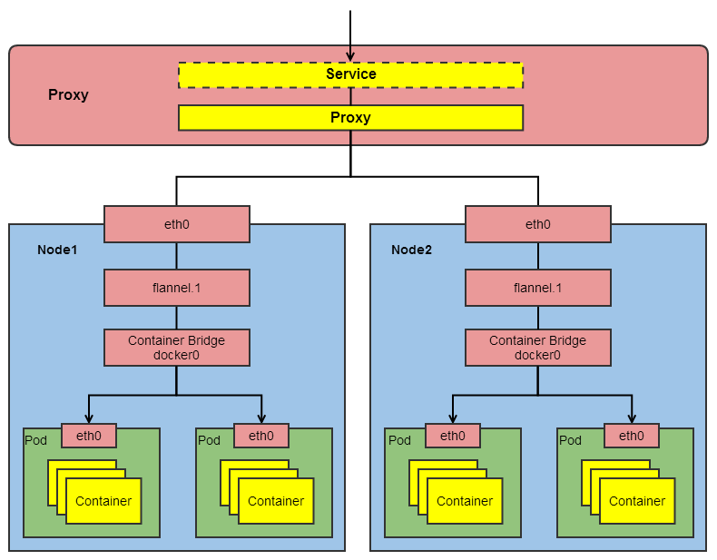
#### k8s集群IP概念汇总
由集群外部到集群内部：

| IP类型              | 说明                                                           |
| ------------------- | -------------------------------------------------------------- |
| Proxy-IP            | 代理层公网地址IP，外部访问应用的网关服务器。[实际需要关注的IP] |
| Service-IP          | Service的固定虚拟IP，Service-IP是内部，外部无法寻址到。        |
| Node-IP             | 容器宿主机的主机IP。                                           |
| Container-Bridge-IP | 容器网桥（docker0）IP，容器的网络都需要通过容器网桥转发。      |
| Pod-IP              | Pod的IP，等效于Pod中网络容器的Container-IP。                   |
| Container-IP        | 容器的IP，容器的网络是个隔离的网络空间。                       |

## K8S网络实现
1. 容器与容器之间的直接通信。
2. Pod与Pod之间的通信。
3. Pod到Service之间的通信。
4. 集群外部与内部组件之间的通信。
#### Pod网络
Pod作为kubernetes的最小调度单元，Pod是容器的集合，是一个逻辑概念，Pod包含的容器都运行在同一个宿主机上，这些容器将拥有同样的网络空间，容器之间能够互相通信，它们能够在本地访问其它容器的端口。 实际上Pod都包含一个网络容器，它不做任何事情，只是用来接管Pod的网络，业务容器通过加入网络容器的网络从而实现网络共享。Pod网络本质上还是容器网络，所以`Pod-IP`就是网络容器的`Container-IP`。
一般将容器云平台的网络模型打造成一个扁平化网络平面，在这个网络平面内，Pod作为一个网络单元同Kubernetes Node的网络处于同一层级。
#### 同Pod内部容器之间的通信
同一个Pod之间的不同容器因为共享同一个网络命名空间，所以可以直接通过`localhost`直接通信。
#### 同Node内部Pod之间的通信
同一个Node内，不同的Pod都有一个全局IP，可以直接通过Pod的IP进行通信。Pod地址和docker0在同一个网段。
在容器启动之前，会创建一个虚拟以太网接口对（`veth pair`），该接口对一端连着容器内部的`eth0` ，一端连着容器外部的`vethxxx`，vethxxx会绑定到容器运行时配置使用的网桥`bridge0`上，从该网络的IP段中分配IP给容器的eth0。
当同节点上的Pod-A发包给Pod-B时，包传送路线如下：
```
pod-a的eth0—>pod-a的vethxxx—>bridge0—>pod-b的vethxxx—>pod-b的eth0
```
因为相同节点的bridge0是相通的，因此可以通过bridge0来完成不同pod直接的通信，但是不同节点的bridge0是不通的，因此不同节点的pod之间的通信需要将不同节点的bridge0给连接起来。
#### 不同Node的Pod之间的通信
不同的Node之间，Node的IP相当于外网IP，可以直接访问，而Node内的docker0和Pod的IP则是内网IP，无法直接跨Node访问。需要通过Node的网卡进行转发。
所以不同Node之间的通信需要达到两个条件：

1. 对整个集群中的Pod-IP分配进行规划，不能有冲突（可以通过第三方开源工具来管理，例如`flannel`）。
2. 将`Node-IP`与该Node上的`Pod-IP`关联起来，通过Node-IP再转发到Pod-IP。

不同节点的Pod之间的通信需要将不同节点的`bridge0`给连接起来。连接不同节点的bridge0的方式有好几种，主要有overlay和underlay，或常规的三层路由。

不同节点的bridge0需要不同的IP段，保证Pod IP分配不会冲突，节点的`物理网卡eth0`也要和该节点的网桥`bridge0`连接。因此，节点a上的pod-a发包给节点b上的pod-b，路线如下：
```
节点a上的pod-a的eth0—>pod-a的vethxxx—>节点a的bridge0—>节点a的eth0
—>
节点b的eth0—>节点b的bridge0—>pod-b的vethxxx—>pod-b的eth0
```
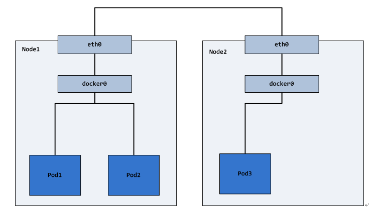
**1. Pod间实现通信**
例如：Pod1和Pod2（同主机），Pod1和Pod3(跨主机)能够通信
实现：因为Pod的Pod-IP是Docker网桥分配的，Pod-IP是同Node下全局唯一的。所以将不同Kubernetes Node的 Docker网桥配置成不同的IP网段即可。
**2. Node与Pod间实现通信**
例如：Node1和Pod1/ Pod2(同主机)，Pod3(跨主机)能够通信
实现：在容器集群中创建一个`覆盖网络(Overlay Network)`，联通各个节点，目前可以通过第三方网络插件来创建覆盖网络，比如`Flannel`和Open vSwitch等。
不同节点间的Pod访问也可以通过calico形成的Pod IP的路由表来解决。
#### Service网络
Service的就是在Pod之间起到`服务代理`的作用，对外表现为一个`单一`访问接口，将请求转发给Pod，Service的网络转发是Kubernetes实现服务编排的关键一环。Service都会生成一个虚拟IP，称为`Service-IP`， `Kuberenetes Porxy`组件负责实现Service-IP路由和转发，在容器覆盖网络之上又实现了虚拟转发网络。
Kubernetes Porxy实现了以下功能：
1. 转发访问Service的Service-IP的请求到Endpoints(即Pod-IP)。
2. 监控Service和Endpoints的变化，实时刷新转发规则。
3. 负载均衡能力。

## Flannel
Flannel是CoreOS团队针对Kubernetes设计的一个网络规划服务，简单来说，它的功能是让集群中的不同节点主机创建的Docker容器都具有`全集群唯一`的虚拟IP地址。

在默认的Docker配置中，每个节点上的Docker服务会分别负责所在节点容器的IP分配。这样导致的一个问题是，不同节点上容器可能获得`相同`的内外IP地址。

Flannel的设计目的就是为集群中的所有节点重新规划IP地址的使用规则，从而使得不同节点上的容器能够获得“同属一个内网”且”不重复的”IP地址，并让属于`不同节点`上的容器能够直接通过内网IP通信。
#### 覆盖网络
overlay network
运行在一个网上的网（`应用层网络`），并不依靠ip地址来传递消息，而是采用一种`映射机制`，把ip地址和identifiers做映射来资源定位。
#### Flannel实现
Flannel实质上是一种“覆盖网络(overlay network)”，也就是将TCP数据包装在另一种网络包里面进行`路由转发和通信`，目前已经支持UDP、VxLAN、AWS VPC和GCE路由等数据转发方式，默认的节点间数据通信方式是`UDP转发`。

1. 数据从源容器中发出后，经由所在主机的docker0虚拟网卡转发到flannel0虚拟网卡，这是个P2P的虚拟网卡，flanneld服务监听在网卡的另外一端。
2. Flannel通过`Etcd`服务维护了一张`节点间的路由表`。
3. 源主机的flanneld服务将原本的数据内容UDP封装后根据自己的路由表投递给目的节点的flanneld服务，数据到达以后被解包，然后直 接进入目的节点的flannel0虚拟网卡，然后被转发到目的主机的docker0虚拟网卡，最后就像本机容器通信一下的有docker0路由到达目标容器。
#### 为docker分配不同的IP段
Flannel通过`Etcd`分配了每个节点可用的IP地址段后，偷偷的修改了Docker的`启动参数`。
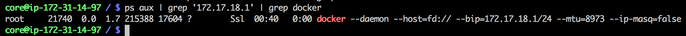
注意其中的“`--bip=172.17.18.1/24`”这个参数，它限制了所在节点容器获得的IP范围。
这个IP范围是由Flannel自动分配的，由Flannel通过保存在Etcd服务中的记录确保它们不会重复。

## Iptables
Linux 内核网络栈是一个纯内核态的东西，和用户层功能是天然隔离。但为了迎合各种各样用户层不同的需求，内核开放了一些口子出来供用户干预。使得用户层可以通过一些配置，改变内核的工作方式，从而实现特殊的需求。
Linux 在内核网络组件中很多关键位置布置了 netfilter 过滤器。Iptables 就是基于 netfilter 来实现的。
Iptables的实现可以简单归纳为`四表五链`
#### Iptables 中的五链
Linux 下的 netfilter 在内核协议栈的各个重要关卡埋下了`五个钩子`。每一个钩子都对应是一系列规则，以链表的形式存在，所以俗称五链。当网络包在协议栈中流转到这些关卡的时候，就会依次执行在这些钩子上注册的各种规则，进而实现对网络包的各种处理。
###### 接收过程
Linux 在网络包接收在 IP 层的入口函数是 `ip_rcv`。网络在这里包碰到的第一个 HOOK 就是 `PREROUTING`。当该钩子上的规则都处理完后，会进行路由选择。如果发现是本设备的网络包，进入 ip_local_deliver 中，在这里又会遇到 `INPUT` 钩子。
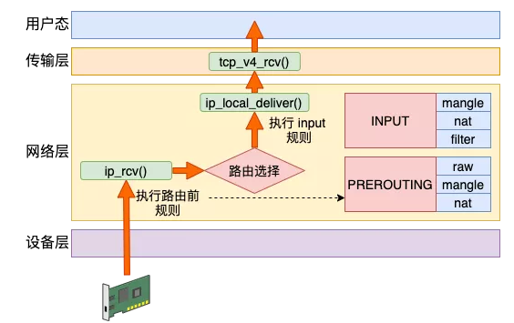
`ip_rcv`
```c
//file: net/ipv4/ip_input.c 
int ip_rcv(struct sk_buff *skb, ......){ 
    ...... 
    return NF_HOOK(NFPROTO_IPV4, NF_INET_PRE_ROUTING, skb, dev, NULL, 
               ip_rcv_finish); 
} 
```
NF_HOOK 这个函数会执行到 iptables 中 `pre_routing` 里的各种表注册的各种规则。当处理完后，进入 `ip_rcv_finish`。在这里函数里将进行`路由选择`。这也就是 `PREROUTING` 这一链名字得来的原因，因为是在路由前执行的。
`ip_rcv_finish`
```c
//file: net/ipv4/ip_input.c 
static int ip_rcv_finish(struct sk_buff *skb){ 
    ... 
    if (!skb_dst(skb)) { 
        int err = ip_route_input_noref(skb, iph->daddr, iph->saddr, 
                           iph->tos, skb->dev); 
        ... 
    } 
    ... 
    return dst_input(skb); 
} 
```
如果发现是`本地设备`上的接收，会进入 `ip_local_deliver` 函数。接着是又会执行到 LOCAL_IN 钩子，这也就是我们说的 `INPUT` 链。
```c
//file: net/ipv4/ip_input.c 
int ip_local_deliver(struct sk_buff *skb){ 
 ...... 
    return NF_HOOK(NFPROTO_IPV4, NF_INET_LOCAL_IN, skb, skb->dev, NULL, 
               ip_local_deliver_finish); 
} 
```
**总结下接收数据的处理流程是：PREROUTING链 -> 路由判断(是本机)-> INPUT链 -> ...**
###### 发送过程
Linux 在网络包发送的过程中，首先是发送的路由选择，然后碰到的第一个 HOOK 就是 `OUTPUT`，然后接着进入 `POSTROUTING` 链。
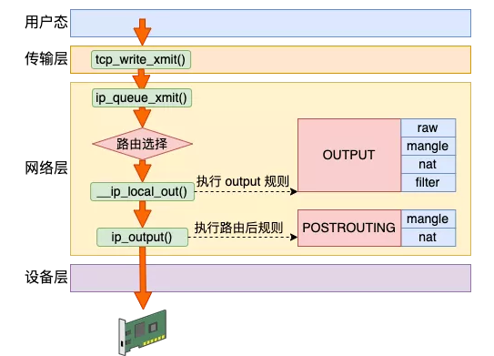
网络层发送的入口函数是 `ip_queue_xmit`
```c
//file: net/ipv4/ip_output.c 
int ip_queue_xmit(struct sk_buff *skb, struct flowi *fl) 
{ 
  // 路由选择过程 
  // 选择完后记录路由信息到 skb 上 
  rt = (struct rtable *)__sk_dst_check(sk, 0); 
  if (rt == NULL) { 
    // 没有缓存则查找路由项 
    rt = ip_route_output_ports(...); 
    sk_setup_caps(sk, &rt->dst); 
  } 
  skb_dst_set_noref(skb, &rt->dst); 
  ... 
  //发送 
  ip_local_out(skb); 
} 
```
这里先进行了发送时的路由选择，然后进入发送时的 IP 层函数 `__ip_local_out`。
```c
//file: net/ipv4/ip_output.c  
int __ip_local_out(struct sk_buff *skb) 
{ 
  struct iphdr *iph = ip_hdr(skb); 
  iph->tot_len = htons(skb->len); 
  ip_send_check(iph); 
  return nf_hook(NFPROTO_IPV4, NF_INET_LOCAL_OUT, skb, NULL, 
          skb_dst(skb)->dev, dst_output); 
} 
```
上面的 NF_HOOK 将发送数据包送入到 NF_INET_LOCAL_OUT (`OUTPUT`) 链。执行完后，进入 dst_output。
```c
//file: include/net/dst.h 
static inline int dst_output(struct sk_buff *skb) 
{ 
  return skb_dst(skb)->output(skb); 
} 
```
在这里获取到之前的选路，并调用选到的 output 发送。将进入 ip_output。
```c
//file: net/ipv4/ip_output.c 
int ip_output(struct sk_buff *skb) 
{ 
  ... 
  //再次交给 netfilter，完毕后回调 ip_finish_output 
  return NF_HOOK_COND(NFPROTO_IPV4, NF_INET_POST_ROUTING, skb, NULL, dev, 
    ip_finish_output, 
    !(IPCB(skb)->flags & IPSKB_REROUTED)); 
} 
```
**总结下发送数据包流程是：路由选择 -> OUTPUT链 -> POSTROUTING链 -> ...**
###### 转发过程
其实除了接收和发送过程以外，Linux 内核还可以像路由器一样来工作。它将接收到网络包(不属于自己的)，然后根据路由表选到合适的网卡设备将其转发出去。
这个过程中，先是经历接收数据的前半段。在 ip_rcv 中经过 `PREROUTING` 链，然后路由后发现不是本设备的包，那就进入 `ip_forward` 函数进行转发，在这里会遇到 `FORWARD` 链。最后还会进入 ip_output 进行真正的发送，遇到 `POSTROUTING` 链。
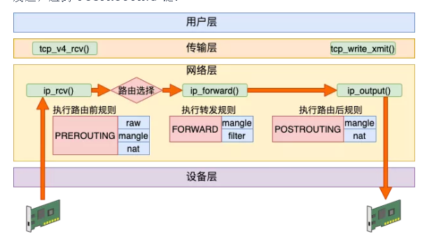
先是进入 IP 层入口 ip_rcv，在这里遇到 `PREROUTING` 链。
```c
//file: net/ipv4/ip_input.c 
int ip_rcv(struct sk_buff *skb, ......){ 
    ...... 
    return NF_HOOK(NFPROTO_IPV4, NF_INET_PRE_ROUTING, skb, dev, NULL, 
               ip_rcv_finish); 
} 
```
`PREROUTING` 链条上的规则都处理完后，进入 ip_rcv_finish，在这里路由选择，然后进入 dst_input。
```c
//file: include/net/dst.h 
static inline int dst_input(struct sk_buff *skb) 
{ 
  return skb_dst(skb)->input(skb); 
} 
```
转发过程的这几步和接收过程一模一样的。不过内核路径就要从上面的 input 方法调用开始分道扬镳了。非本设备的不会进入 ip_local_deliver，而是会进入到 `ip_forward`
```c
//file: net/ipv4/ip_forward.c 
int ip_forward(struct sk_buff *skb) 
{ 
  ...... 
  return NF_HOOK(NFPROTO_IPV4, NF_INET_FORWARD, skb, skb->dev, 
          rt->dst.dev, ip_forward_finish); 
} 
```
在 ip_forward_finish 里会送到 IP 层的发送函数 ip_output。
```c
//file: net/ipv4/ip_output.c 
int ip_output(struct sk_buff *skb) 
{ 
  ... 
  //再次交给 netfilter，完毕后回调 ip_finish_output 
  return NF_HOOK_COND(NFPROTO_IPV4, NF_INET_POST_ROUTING, skb, NULL, dev, 
    ip_finish_output, 
    !(IPCB(skb)->flags & IPSKB_REROUTED)); 
} 
```
在 ip_output 里会遇到 `POSTROUTING` 链。再后面的流程就和发送过程的下半段一样了。
**总结下转发数据过程：PREROUTING链 -> 路由判断(不是本设备，找到下一跳) -> FORWARD链 -> POSTROUTING链 -> ...**
###### 汇总
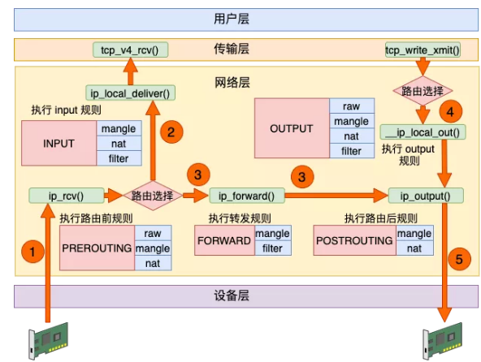
数据接收过程走的是 1 和 2，发送过程走的是 4 、5，转发过程是 1、3、5。有了这张图，我们能更清楚地理解 iptables 和内核的关系。
#### Iptables的四表
在上一节中，我们介绍了 iptables 中的五个链。在每一个链上都可能是由许多个`规则`组成的。在 `NF_HOOK` 执行到这个链的时候，就会把规则按照优先级挨个过一遍。如果有符合条件的规则，则执行规则对应的动作。
而这些规则根据用途的不同，又可以raw、mangle、nat 和 filter。
例如在 `PREROUTING` 链中的规则中，分别可以执行 row、mangle 和 nat 三种功能。
为什么不是全部四个表呢？这是由于功能的不同，不是所有功能都会完全使用到五个链。
- **row** 表的作用是将命中规则的包，跳过其它表的处理，它的优先级最高。所以只需要在接收和发送两大过程的最开头处把关，所以只需要用到 `PREROUTING` 和 `OUTPUT` 两个钩子。
- **mangle** 表的作用是根据规则修改数据包的一些标志位，比如 TTL。Mangle 表有可能会在任意位置都有可能会修改网络包，所以它是用到了`全部`的钩子位置。
- **nat** 表的作用是实现网络地址转换。分为 SNAT(Source NAT)和 DNAT(Destination NAT)两种，可能会工作在 `PREROUTING`、`INPUT`、`OUTPUT`、`POSTROUTING` 四个位置。
- **filter** 表的作用是过滤某些包，这是防火墙工作的基础。只在 `INPUT`、`OUTPUT` 和 `FORWARD` 这三步中工作就够了。

从整体上看，四链五表的关系如下图。
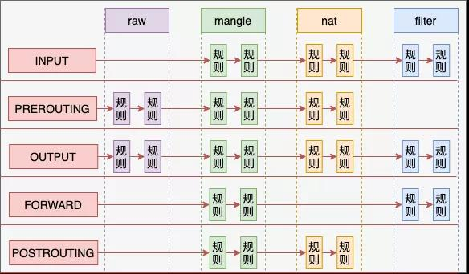
这里再多说一点，每个`命名空间`都是有自己独立的 `iptables` 规则的。我们拿 NAT 来举例，内核在遍历 NAT 规则的时候，是从 net(命名空间变量)的 ipv4.nat_table 上取下来的。NF_HOOK 最终会执行到 nf_nat_rule_find 函数。
`Docker` 容器就是基于命名空间来工作的，所以每个 Docker 容器中都可以配置自己独立的 iptables 规则。

## Iptables应用举例
#### SNAT
假如说我们有一台 Linux，它的 eth0 的 IP 是10.162.0.100，通过这个 IP 可以访问另外其它服务器。现在我们在这台机器上创建了个 Docker 虚拟网络环境 net1 出来，它的网卡 veth1 的 IP 是 192.168.0.2。
如果想让 192.168.0.2 能访问外部网络，则需要宿主网络命名空间下的设备工作帮其进行网络包转发。由于这是个私有的地址，只有这台 Linux 认识，所以它是无法访问外部的服务器的。这个时候如果想要让 net1 正常访问 10.162.0.101，就必须在转发时执行 `SNAT` - 源地址替换。
SNAT 工作在路由之后，网络包发送之前，也就是 `POSTROUTING` 链。我们在宿主机的命名空间里增加如下这条 `iptables` 规则。这条规则判断如果源是 192.168.0 网段，且目的不是 br0 的，统统执行源 IP 替换判断。
```
# iptables -t nat -A POSTROUTING -s 192.168.0.0/24 ! -o br0 -j MASQUERADE 
```
当数据包发出来的时候，先从 veth 发送到 br0。由于 br0 在宿主机的命名空间中，这样会执行到 `POSTROUTING` 链。在这个链有我们刚配置的 `SNAT` 规则。根据这条规则，内核将网络包中 192.168.0.2(外界不认识) 替换成母机的 IP 10.162.0.100(外界都认识)。同时还要`跟踪`记录链接状态。
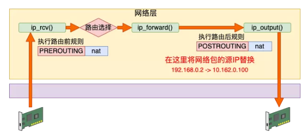
然后宿主机根据自己的路由表进行判断，选择默认发送设备将包从 eth0 网卡发送出去，直到送到 10.162.0.101。
接下来在 10.162.0.100 上会收到来自 10.162.0.101 的响应包。由于上一步记录过`链接跟踪`，所以宿主机能知道这个回包是给 192.168.0.2 的。再反替换并通过 br0 将返回送达正确的 veth 上。
#### DNAT
接着上面小节里的例子，假设我们想在 192.168.0.2 上提供 80 端口的服务。同样，外面的服务器是无法访问这个地址的。这个时候要用到 DNAT 目的地址替换。需要在数据包进来的时候，将其目的地址替换成 192.168.0.2:80 才行。
DNAT 工作在内核接收到网络包的第一个链中，也就是 `PREROUTING`。我们增加一条 DNAT 规则，具体的配置如下。
```
# iptables -t nat -A PREROUTING ! -i br0 -p tcp -m tcp --dport 8088 -j DNAT --to-destination 192.168.0.2:80 
```
当有外界来的网络包到达 eth0 的时候。由于 eth0 在母机的命名空间中，所以会执行到 `PREROUTING` 链。
该规则判断如果端口是 `8088` 的 TCP 请求，则将目的地址替换为 192.168.0.2:80。再通过 br0(192.168.0.1)转发数据包，数据包将到达真正提供服务的 192.168.0.2:80 上。
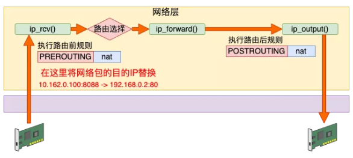
同样在 DNAT 中也会有`链接跟踪`记录，所以 192.168.0.2 给 10.162.0.101 的返回包中的源地址会被替换成 10.162.0.100:8088。之后 10.162.0.101 收到包，它一直都以为自己是真的和 10.162.0.100:8088 通信。
这样 net1 环境中的 veth1 也可以提供服务给外网使用了。事实上，单机的 Docker 就是通过这两小节介绍的 SNAT 和 DNAT 配置来进行网络通信的。
#### filter
Filter 表主要实现网络包的过滤。假如我们发现了一个恶意 IP 疯狂请求我们的服务器，对服务造成了影响。那么我们就可以用 filter 把它禁掉。其工作原理就是在接收包的 `INPUT` 链位置处进行判断，发现是恶意请求就尽早干掉不处理。避免进入到更上层继续浪费 CPU 开销。
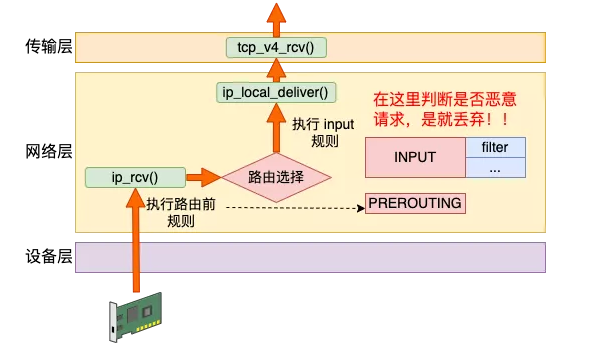
```
# iptables -I INPUT -s 1.2.3.4 -j DROP //封禁 
# iptables -D INPUT -s 1.2.3.4 -j DROP //解封 
```
当然也可以封禁某个 IP 段。
```
# iptables -I INPUT -s 121.0.0.0/8 -j DROP //封禁 
# iptables -I INPUT -s 121.0.0.0/8 -j DROP //解封 
```

## K8S负载均衡 - IPVS
`Kubernetes` 中的 `Service` 就是一组同 label 类型 `Pod` 的服务抽象，为服务提供了负载均衡和反向代理能力，在集群中表示一个微服务的概念。`kube-proxy` 组件则是 Service 的具体实现，了解了 `kube-proxy` 的工作原理，才能洞悉服务之间的通信流程，再遇到网络不通时也不会一脸懵逼。
kube-proxy 有三种模式：`userspace`、`iptables` 和 `IPVS`，其中 userspace 模式不太常用。iptables 模式最主要的问题是在服务多的时候产生太多的 `iptables 规则`，**非增量式更新**会引入一定的时延，`大规模`情况下有明显的性能问题。为解决 iptables 模式的性能问题，v1.11 新增了 IPVS 模式，采用**增量式更新**，并可以保证 service 更新期间连接保持不断开。
#### iptables实现负载均衡
通过API Server的Watch接口实时跟踪Service与Endpoint的变更信息，并更新对应的iptables规则，Client的请求流量则通过iptables的NAT机制"直接路由"到目标Pod
#### IPVS实现负载均衡
IPVS则专门用于高性能负载均衡，并使用更高效的数据结构（Hash表），允许几乎无限的规模扩张，在IPVS模式下，使用iptables的扩展ipset，而不是直接调用iptables来生成规则链。iptables规则链是一个线性的数据结构，ipset则引入了带索引的数据结构，因此当规则很多时，也可以很高效地查找和匹配。可以将ipset简单理解为一个IP（段）的集合，这个集合的内容可以是IP地址、IP网段、端口等，iptables可以直接添加规则对这个“可变的集合”进行操作，这样做的好处在于可以大大减少iptables规则的数量，从而减少性能损耗
#### 异同
iptables与IPVS都是基于Netfilter实现的，但因为定位不同，二者有着本质的差别：iptables是为防火墙而设计的；IPVS则专门用于高性能负载均衡，并使用更高效的数据结构（Hash表），允许几乎无限的规模扩张 与iptables相比，IPVS拥有以下明显**优势**：
- 为大型集群提供了更好的可扩展性和性能
- 支持比iptables更复杂的复制均衡算法（最小负载、最少连接、加权等）
- 支持服务器健康检查和连接重试等功能
- 可以动态修改ipset的集合，即使iptables的规则正在使用这个集合

**Iptables**：
- 灵活，功能强大
- 规则遍历匹配和更新，呈`线性`时延 

**IPVS**：
- 工作在内核态，有更好的性能
- 调度算法丰富：rr，wwr，lc，wlc，ip hash...

## K8S服务发现
Kubernetes使用`CoreDNS`进行服务发现。
使用 DNS 在集群中做服务发现其实是一件比较容易的事情，这主要是因为绝大多数的计算机上都会安装 DNS 服务，所以这其实就是一种内置的、默认的服务发现方式，不过使用 DNS 做服务发现也会有一些问题，因为在默认情况下 DNS 记录的失效时间是 600s，这对于集群来讲其实并不是一个可以接受的时间，在实践中我们往往会启动单独的 DNS 服务满足服务发现的需求。
#### CoreDNS
CoreDNS 其实就是一个 DNS 服务，而 DNS 作为一种常见的服务发现手段，所以很多开源项目以及工程师都会使用 CoreDNS 为集群提供服务发现的功能，Kubernetes 就在集群中使用 CoreDNS 解决服务发现的问题。
#### CoreDNS架构
整个 CoreDNS 服务都建立在一个使用 Go 编写的 HTTP/2 Web 服务器 `Caddy` 上

CoreDNS 的大多数功能都是由`插件`来实现的，插件和服务本身都使用了 Caddy 提供的一些功能，所以项目本身也不是特别的复杂。
#### CoreDNS插件
作为基于 Caddy 的 Web 服务器，CoreDNS 实现了一个插件链的架构，将很多 DNS 相关的逻辑都抽象成了一层一层的插件，包括 Kubernetes 等功能，每一个插件都是一个遵循如下协议的结构体：
```go
type (
	Plugin func(Handler) Handler

	Handler interface {
		ServeDNS(context.Context, dns.ResponseWriter, *dns.Msg) (int, error)
		Name() string
	}
)
```
所以只需要为插件实现 `ServeDNS` 以及 `Name` 这两个接口并且写一些用于配置的代码就可以将插件集成到 CoreDNS 中。
#### Corefile
另一个 CoreDNS 的特点就是它能够通过简单易懂的 DSL 定义 DNS 服务，在 Corefile 中就可以组合多个插件对外提供服务：
```go
coredns.io:5300 {
    file db.coredns.io
}

example.io:53 {
    log
    errors
    file db.example.io
}

example.net:53 {
    file db.example.net
}

.:53 {
    kubernetes
    proxy . 8.8.8.8
    log
    errors
    cache
}
```
对于以上的配置文件，CoreDNS 会根据每一个代码块前面的区和端点对外暴露两个端点提供服务：
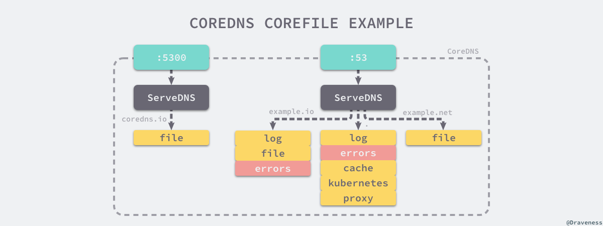
该配置文件对外暴露了两个 DNS 服务，其中一个监听在 5300 端口，另一个在 53 端口，请求这两个服务时会根据不同的域名选择不同区中的`插件`进行处理。
#### CoreDNS原理
CoreDNS 可以通过四种方式对外直接提供 DNS 服务，分别是 UDP、gRPC、HTTPS 和 TLS：

但是无论哪种类型的 DNS 服务，最终都会调用以下的 ServeDNS 方法，为服务的调用者提供 DNS 服务：
```go
func (s *Server) ServeDNS(ctx context.Context, w dns.ResponseWriter, r *dns.Msg) {
	m, _ := edns.Version(r)

	ctx, _ := incrementDepthAndCheck(ctx)

	b := r.Question[0].Name
	var off int
	var end bool

	var dshandler *Config

	w = request.NewScrubWriter(r, w)

	for {
		if h, ok := s.zones[string(b[:l])]; ok {
			ctx = context.WithValue(ctx, plugin.ServerCtx{}, s.Addr)
			if r.Question[0].Qtype != dns.TypeDS {
				rcode, _ := h.pluginChain.ServeDNS(ctx, w, r)
 			dshandler = h
		}
		off, end = dns.NextLabel(q, off)
		if end {
			break
		}
	}

	if r.Question[0].Qtype == dns.TypeDS && dshandler != nil && dshandler.pluginChain != nil {
		rcode, _ := dshandler.pluginChain.ServeDNS(ctx, w, r)
		plugin.ClientWrite(rcode)
		return
	}

	if h, ok := s.zones["."]; ok && h.pluginChain != nil {
		ctx = context.WithValue(ctx, plugin.ServerCtx{}, s.Addr)

		rcode, _ := h.pluginChain.ServeDNS(ctx, w, r)
		plugin.ClientWrite(rcode)
		return
	}
}
```
最重要的就是调用了『插件链』的 `ServeDNS` 方法，将来源的请求交给一系列插件进行处理，如果我们使用以下的文件作为 Corefile：
```go
example.org {
    file /usr/local/etc/coredns/example.org
    prometheus     # enable metrics
    errors         # show errors
    log            # enable query logs
}
```
那么在 CoreDNS 服务启动时，对于当前的 example.org 这个组，它会依次加载 file、log、errors 和 prometheus 几个插件

## Ingress
Ingress是授权入站连接到达集群服务的`规则集合`。您可以给Ingress配置外部可访问的URL、负载均衡、SSL、基于名称的虚拟主机等。
Service是基于`四层TCP和UDP`协议转发的，而Ingress可以基于`七层的HTTP和HTTPS`协议转发，可以通过域名和路径做到更细粒度的划分，如下图所示。
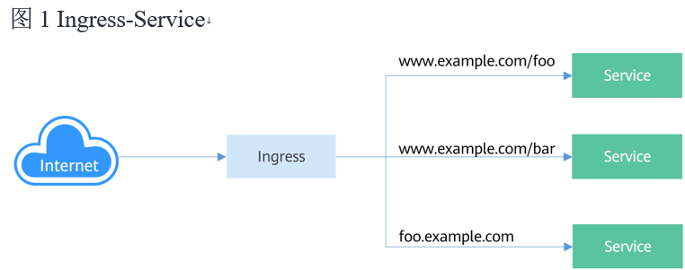
要想使用Ingress功能，必须在Kubernetes集群上安装Ingress Controller。Ingress Controller有很多种实现，最常见的就是Kubernetes官方维护的`NGINX Ingress Controller`
外部请求首先到达Ingress Controller，Ingress Controller根据Ingress的`路由规则`，查找到对应的`Service`，进而通过Endpoint查询到Pod的IP地址，然后将请求转发给Pod。