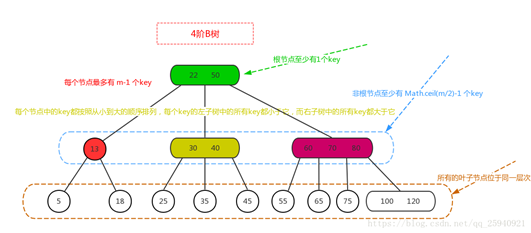
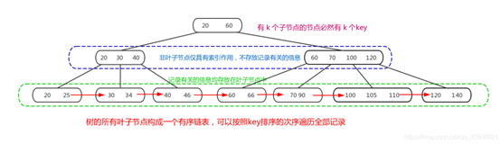
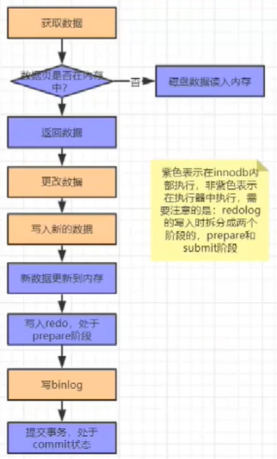
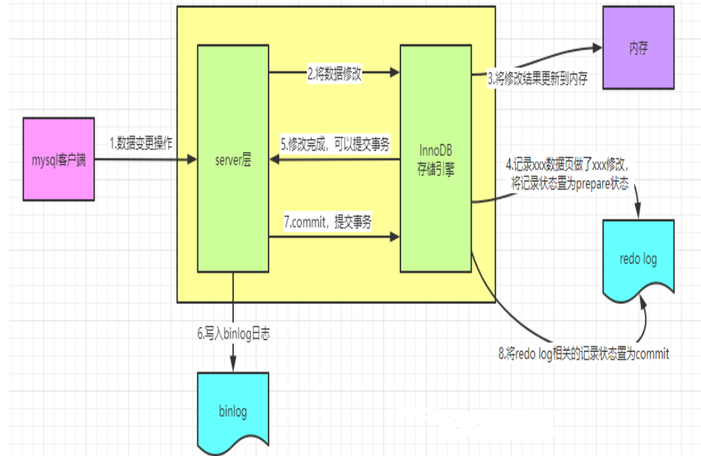
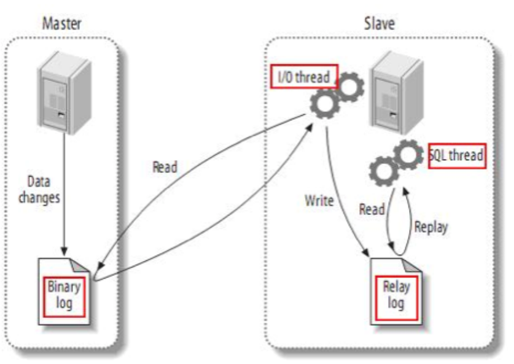
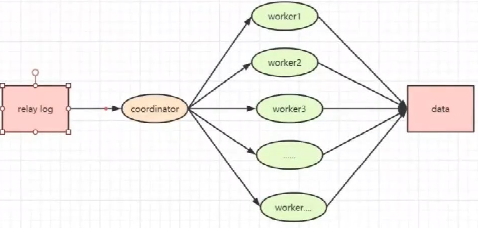
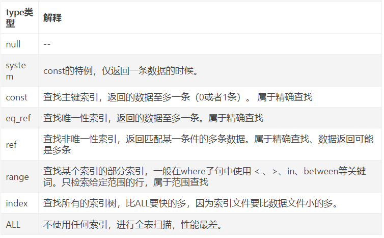
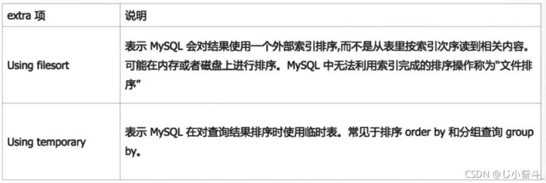
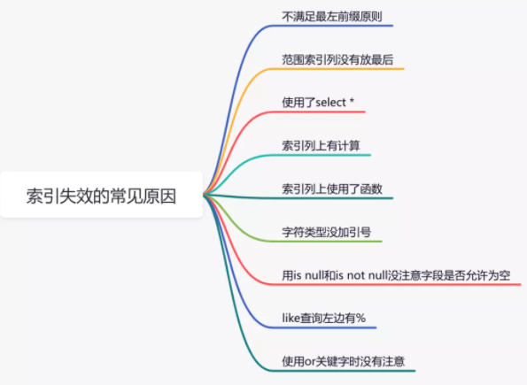

## 索引
索引（Index）是帮助MySQL高效获取数据的`数据结构`(B+树)。
在数据之外，数据库系统还维护着满足特定查找算法的数据结构，这些数据结构以某种方式引用（指向）数据，这样就可以在这些数据结构上实现高级查找算法。这种数据结构，就是索引。
**优点**
* 有效缩短数据的检索时间
* 为用来排序或者是分组的字段添加索引可以加快分组和排序顺序

**缺点**
* 创建索引和维护索引需要时间成本、空间成本
* 会降低表的增删改的效率，因为每次增删改索引需要进行动态维护，导致时间变长

## 索引的类型
1. 普通索引（单列索引）
2. 复合索引（组合索引）
复合索引遵守“最左前缀”原则，即在查询条件中使用了复合索引的第一个字段，索引才会被使用
3. 唯一索引
和普通索引类似，主要的区别在于，唯一索引限制列的值必须唯一，但允许存在空值（只允许存在一条空值）
4. 主键索引
一个表只能有一个主键，不允许有空值。一般是在建表的时候同时创建主键索引
5. 全文索引
全文索引主要用来查找文本中的关键字，而不是直接与索引中的值相比较。

## 聚簇索引和非聚簇索引
`Innodb`使用的是`聚簇索引`，`MyISam`使用的是`非聚簇索引`
**聚簇索引**
聚簇索引就是按照每张表的`主键`构造一颗B+树，同时叶子节点中存放的就是整张表的行记录数据，也将聚集索引的叶子节点称为数据页。这个特性决定了索引组织表中`数据也是索引的一部分`，每张表只能拥有一个聚簇索引。
Innodb通过主键聚集数据，如果没有定义主键，innodb会选择非空的唯一索引代替。如果没有这样的索引，innodb会隐式的定义一个主键来作为聚簇索引。
**非聚簇索引**
将`数据存储与索引分开`结构，索引结构的叶子节点指向了数据的对应行，myisam通过key_buffer把索引先缓存到内存中，当需要访问数据时（通过索引访问数据），在内存中直接搜索索引，然后通过索引找到磁盘相应数据

## MySQL索引数据结构
#### B树
一颗`m阶`的B树（B-tree） 定义如下：
1. 每个节点最多有 `m-1` 个key；
2. 根节点至少有1个key；
3. 非根节点至少有 `(m/2)-1` 个key；(向上取整)
4. 每个节点中的key都按照从小到大的顺序排列，每个key的左子树中的所有key都小于它，而右子树中的所有key都大于它；
5. 所有叶子节点都位于`同一层`，即根节点到每个叶子节点的长度都相同。


**插入**
若插入节点的key还未“`丰满`”，则直接插入，若节点插入节点的key已“`丰满`”，则插入节点之后`分裂`，再以分裂之后的父节点看作向上层插入的节点调整，直至满足该 m 阶的B树。
**删除**
1. 若删除非叶子节点， 找`后继`节点替换之，将问题转化为删除叶子节点；
2. 若删除叶子节点，且叶子节点的key数`大于`定义中的最小值，则`直接删除`即可，无需调整，
3. 若删除叶子节点，且叶子节点的key数`等于`定义中的最小值，则将节点删除，此时树肯定需要`调整`，即：
   * 若删除节点的`相邻兄弟节点`的key数`大于`定义中的最小值，则父节点的1个key`下移`与待删除的节点合并，相邻兄弟节点的1个key`上移`与父节点合并，完成调整；
   * 若删除节点的`相邻兄弟节点`的key数`等于`定义的最小值，则父节点的1个key`下移`与待删除的节点及相邻兄弟节点，`三者合并`成一个节点，若下移1个key后的父节点的key数陷入“贫穷”，则将`父节点`看作当前待删除的节点，重复判断。
#### B+树
1. 有` k `个子节点的节点必然有` k `个key；
2. 非叶子节点仅具有`索引`作用，跟记录有关的信息均存放在`叶子节点`中。
3. 树的所有叶子节点构成一个`有序链表`，可以按照key排序的次序遍历全部记录。


**优点**
* 由于B+树在内部节点上不包含数据信息，因此在内存页中能够存放更多的key。数据存放的更加`紧密`，具有更好的空间局部性。因此访问叶子节点上关联的数据也具有更好的缓存命中率。
* B+树的叶子结点都是`相链`的，因此对整棵树的遍历只需要一次线性遍历叶子结点即可。而且由于数据顺序排列并且相连，所以便于`区间查找和搜索`。而B树则需要进行每一层的递归遍历，相邻的元素可能在内存中不相邻，所以缓存命中性没有B+树好。

## 脏读、不可重复读、幻读
**脏读**
某个事务已更新一份数据，另一个事务在此时读取了同一份数据，由于某些原因，前一个`回滚`了操作，则后一个事务所读取的数据就会是不正确的。
**不可重复读**
在一个事务的两次查询之中数据不一致，这可能是两次查询`过程中间`插入了一个事务更新的原有的数据。
**幻读**
事务A 按照一定条件进行数据读取， 期间事务B 插入了相同搜索条件的新数据，事务A再次按照原先条件进行读取时，发现了事务B 新插入的数据 称为幻读。
-第1类丢失更新：事务A撤销时，把已经提交的事务B的更新数据覆盖了。
-第2类丢失更新：事务A覆盖事务B已经提交的数据，造成事务B所做的操作丢失。

## MySQL隔离级别
|    隔离级别     |  脏读  | 不可重复读 |  幻读  |                                                                                       |
| :-------------: | :----: | :--------: | :----: | :-----------------------------------------------------------------------------------: |
| READ UNCOMMITED |  允许  |    允许    |  允许  |                      所有事务都可以看到其他未提交事务的执行结果                       |
| READ COMMITTED  | 不允许 |    允许    |  允许  |                        一个事务只能看见已经提交事务所做的改变                         |
| REPEATABLE READ | 不允许 |   不允许   |  允许  | MySQL的默认事务隔离级别，它确保同一事务的多个实例在并发读取数据时，会看到同样的数据行 |
|  SERIALIZABLE   | 不允许 |   不允许   | 不允许 |        每个读的数据行上加上共享锁。在这个级别，可能导致大量的超时现象和锁竞争         |
**解决脏读**
修改时加`排他锁`(写锁)，直到`事务提交`后才释放，读取时加`共享锁`(读锁)，其他事务只能读取，不能再有更新操作 。防止脏读。
**解决不可重复读**
innodb引擎采用了`mvcc`（多版本并发控制）来解决不可重复读问题。mvcc是利用在每条数据后面加了隐藏的两列（`创建版本号`和`删除版本号`）当执行查询的时, 当前查询版本号>= 创建版本号 并且 >删除版本号 , MVCC可以在大多数情况下代替行级锁,使用MVCC,能降低其系统开销。
**解决幻读**
Mysql官方给出的幻读解释是：只要在一个事务中，第二次select`多出了row`就算幻读。

## MVCC多版本并发控制
多版本并发控制（MVCC）是一种用来解决`不可重复读`的并发控制，MVCC为事务分配单向增长的时间戳，为每个修改保存一个`版本`，版本与事务时间戳关联，读操作只读该事务开始前的数据库的快照。 
一个支持MVCC的数据库，在更新某些数据时，并非使用新数据覆盖旧数据，而是标记旧数据是`过时`的，同时在其他地方新增一个数据版本。因此，同一份数据有`多个版本`存储，但只有一个是最新的。
InnoDB的MVCC，通过在每行记录后面保存两个隐藏的列来实现：一个保存了行的`创建时间`，一个保存行的`过期时间`（删除时间），当然，这里的时间并不是时间戳，而是`系统版本号`，每开始一个新的事务，系统版本号就会递增
**select操作**
InnoDB只查找创建版本`早于`（包含`等于`）当前事务版本的数据行。可以确保事务读取的行，要么是事务开始前就已存在，或者事务自身插入或修改的记录。
行的删除版本要么`未定义`，要么`大于`当前事务版本号。可以确保事务读取的行，在事务开始之前未删除。
**insert操作**
将新插入的行保存当前版本号为创建时间。
**delete操作**
将删除的行保存当前版本号为过期时间。
**update操作**
变为`insert`和`delete`操作的组合，insert的行保存当前版本号为`创建时间`，delete则保存当前版本号到原来的行作为`过期时间`。
由于旧数据并不真正的删除，所以必须对这些数据进行清理，innodb会开启一个后台线程执行清理工作，具体的规则是将删除`版本号小于当前系统版本`的行删除，这个过程叫做purge。

## 数据库事务
数据库事务(transaction)是访问并可能操作各种数据项的一个数据库`操作序列`，这些操作要么全部执行,要么全部不执行，是一个`不可分割`的工作单位。事务由事务开始与事务结束之间执行的全部数据库操作组成。
**事务的ACID属性**
**原子性**(atomicity)
整个事务中的所有操作，要么全部完成，要么全部不完成，不可能停滞在中间某个环节。 事务在执行过程中发生错误，会被`回滚`（Rollback）到事务开始前的状态，就像这个事务从来没有执行过一样。 
**一致性**(consistency)
在事务开始之前和事务结束以后，数据库数据的`一致性约束`没有被破坏。例如：现有完整性约束 A+B=100，如果一个事务改变了 A，那么必须得改变 B，使得事务结束后依然满足 A+B=100，否则事务失败。
**隔离性**(isolation)
事务的执行不受`其他事务`的干扰，
**持久性**(durability)
对于任意已提交事务，系统必须保证该事务对数据库的改变不被丢失，即使数据库出现故障。

## MySQL存储引擎InnoDB和MyISAM的区别
1. InnoDB支持事务，MyISAM不支持，对于InnoDB每一条SQL语言都默认`封装成事务`，自动提交，这样会影响速度，所以最好把多条SQL语言放在begin和commit之间，组成一个事务； 
2. InnoDB支持`外键`，而MyISAM不支持。
3. InnoDB是`聚簇索引`（数据库表行中数据的物理顺序与键值的逻辑（索引）顺序相同），使用B+Tree作为索引结构，数据文件是和（主键）索引绑在一起的（表数据文件本身就是按B+Tree组织的一个索引结构），必须要有主键，通过主键索引效率很高。但是辅助索引需要两次查询，先查询到主键，然后再通过主键查询到数据(`回表`)。MyISAM是`非聚簇索引`，也是使用B+Tree作为索引结构，索引和数据文件是`分离`的，索引保存的是数据文件的指针。主键索引和辅助索引是独立的。也就是说：InnoDB的B+树主键索引的叶子节点就是数据文件，辅助索引的叶子节点是主键的值；而MyISAM的B+树主键索引和辅助索引的叶子节点都是数据文件的地址指针。
4. InnoDB不保存表的`具体行数`，执行select count(*) from table时需要全表扫描。而MyISAM用一个变量保存了整个表的行数。
5. InnoDB支持表、行(默认)级锁，而MyISAM支持表级锁
* 如果是`读多写少`的项目,可以考虑使用MyISAM,MyISAM索引和数据是分开的，而且其索引是压缩的，可以更好地利用内存。所以它的查询性能明显优于INNODB。压缩后的索引也能节约一些磁盘空间。MyISAM拥有全文索引的功能，这可以极大地优化LIKE查询的效率。
* 如果你的应用程序一定要使用事务，毫无疑问你要选择INNODB引擎

## MySQL有哪些锁
#### 按锁粒度分类
**行级锁**
行级锁是mysql中锁定`粒度最细`的一种锁。表示只针对当前操作的行进行加锁。行级锁能大大减少数据库操作的冲突，其加锁粒度最小，但加锁的开销也最大。行级锁分为共享锁和排他锁
特点：开销大，加锁慢，会出现`死锁`。发生锁冲突的概率最低，并发度也最高。
**表级锁**
表级锁是mysql中锁定`粒度最大`的一种锁，表示对当前操作的整张表加锁，它实现简单，资源消耗较少，被大部分mysql引擎支持。最常使用的MyISAM与InnoDB都支持表级锁定。表级锁定分为表共享读锁（共享锁）与表独占写锁（排他锁）
特点：开销小，加锁快，不会出现死锁。发生锁冲突的概率最高，并发度也最低。
**页级锁**
页级锁是 MySQL 中锁定粒度介于行级锁和表级锁`中间`的一种锁。表级锁速度快，但冲突多，行级冲突少，但速度慢。因此，采取了折衷的页级锁，一次锁定`相邻的一组`记录。BDB 支持页级锁。
特点：开销和加锁时间界于表锁和行锁之间；会出现死锁；锁定粒度界于表锁和行锁之间，并发度一般。
#### 按锁级别分类
**共享锁**
共享锁又称`读锁`，是读取操作创建的锁。其他用户可以并发读取数据，但任何事务都不能对数据进行修改（获取数据上的排他锁），直到已释放所有共享锁。
如果事务T对数据A加上共享锁后，则其他事务只能对A再加共享锁，不能加排他锁。获准共享锁的事务`只能读数据`，不能修改数据。
用法：SELECT … LOCK IN SHARE MODE;
**排他锁**
排他锁又称`写锁`、独占锁，如果事务T对数据A加上排他锁后，则其他事务不能再对A加任何类型的封锁。获准排他锁的事务既能读数据，又能修改数据。
用法：SELECT … FOR UPDATE;

## SQL语句的执行过程
一条查询的sql语句先执行的是`FROM`，负责把数据库的表文件加载到`内存`中去；`WHERE`会把所示表中的数据进行过滤，取出`符合条件`的记录行，生成一张`临时表`；`GROUP BY`会把临时表`切分`成若干临时表；`ORDER BY`对以上的临时表进行`排序`；LIMIT取排序后的数据。

## 数据更新流程
1. 执行器先从引擎中找到数据，如果在内存中直接返回，如果不在内存中，查询后返回
2. 执行器拿到数据之后会先修改数据，然后调用引擎接口重新写入数据
3. 引擎将数据更新到内存，同时写数据到redo中，此时处于`prepare`阶段，并通知执行器执行完成，随时可以操作
4. 执行器生成这个操作的binlog
5. 执行器调用引擎的事务提交接口，引擎把刚刚写完的redo改成`commit`状态，更新完成


先将`redo log`置为`prepare`状态，再写`bin log`，让将`redo log`置为`commit`状态，这种方式叫做`二阶段提交`，这种方式可以防止崩溃恢复时的`数据不一致`问题，当`redo log`处于`prepare`状态，`bin log`中没有记录，直接根据`redo log`进行回滚；当`redo log`处于`prepare`状态，`bin log`中有记录，就将未提交的事务更改为`commit`状态

## 数据库三范式
1NF：每个属性都不可再分
2NF：属性完全依赖于主键。 
3NF：属性不依赖于其它非主属性。

## MySQL日志
#### bin log
binlog是用于记录数据库表结构和表数据变更的二进制日志，比如`insert、update、delete、create、truncate`等等操作，不会记录select、show操作，因为没有对数据本身发生变更。binlog会记录下每条变更的sql语句，还有执行`开始时间`，`结束时间`，`事务id`等等信息。
**主从复制**
一般在公司中做一主二从的结构时，就需要`master`节点打开`binlog`日志，从机订阅`binlog`日志的信息，因为`binlog`日志记录了数据库数据的变更，所以当master发生数据变更时，从机也能随着master节点的数据变更而变更，做到主从复制的效果。
**数据恢复**
因为`binlog`记录了数据库的变更，所以可以用于数据恢复。有个字段叫`Position`，这个参数是用于记录binlog日志的指针。当我们需要恢复数据时，只要指定`--start-position`和`--stop-position`，或者指定`--start-datetime`和`--stop-datetime`，那么就可以恢复指定区间的数据。
#### redo log
redo log又称重做日志文件，用于记录`事务`操作的变化，记录的是数据`修改之后`的值，不管事务`是否提交`都会记录下来。在实例和介质失败（media failure）时，redo log文件就能派上用场，如数据库掉电，InnoDB存储引擎会使用`redo log`恢复到掉电前的时刻，以此来保证数据的完整性。
不可以使用redo log文件恢复，只能使用binlog文件恢复。因为redo log文件不会存储`历史`所有的数据的变更，当内存数据刷新到`磁盘`中，redo log的数据就`失效`了，也就是redo log文件内容是会被`覆盖`的。

#### undo log
undo log的作用主要用于`回滚`，mysql数据库的事务的`原子性`就是通过undo log实现的。我们都知道原子性是指对数据库的一系列操作，要么全部成功，要么全部失败。undo log主要存储的是数据的`逻辑变化`日志，比如说我们要`insert`一条数据，那么undo log就会生成一条对应的`delete`日志。简单点说，undo log记录的是数据`修改之前`的数据，因为需要支持回滚。
undo log另一个作用是实现多版本控制(`MVCC`)，undo记录中包含了记录`更改前`的镜像，如果更改数据的事务未提交，对于隔离级别大于等于`read commit`的事务而言，不应该返回更改后数据，而应该返回`老版本`的数据。

## 组提交
组提交(group commit)是mysql处理日志的一种优化方式，主要为了解决写日志时`频繁刷磁盘`的问题。组提交伴随着mysql的发展，已经支持了`redo log`和`bin log`的组提交。
#### redo log组提交
组提交思想是，将多个事务redo log的刷盘动作`合并`，减少磁盘顺序写。Innodb的日志系统里面，每条redo log都有一个`LSN(Log Sequence Number)`，LSN是`单调递增`的。每个事务执行更新操作都会包含一条或多条redo log。
假设现在有三个并发事务(tx1,tx2,tx3)依次到达，这三个事务所对应的LSN的值分别是50,120,160。组提交流程如下：
1. tx1是第一个到达的，会被选为这组的`leader`;
2. 等trx1要开始`写盘`的时候，由于二阶段提交，这个组里面已经有了三个事务，这时候`LSN`也变成了`160`;
3. trx1去写盘的时候，带的就是`LSN=160`,因此等trx1返回时，所有LSN小于等于160的redo log都已经被持久化到磁盘;
4. 这时候trx2和trx3就可以`直接返回`了

## MySQL主从复制
MySQL以`日志`的方式进行主从复制，其中`bin log`属于mysql服务，`redo log`和`undo log`属于innodb存储引擎，MySQL通过`bin log`实现主从复制，slave节点使用`IO Thread`同步master节点的`bin log`，存储在中继日志`relay log`中，`SQL Thread`根据日志进行恢复，这个过程叫做`重放`

#### 主从复制延迟
1. 主从同步过程中的延时问题主要存在于`SQL Thread`的重放过程，因为前面对日志文件的读写都是`顺序`的，时间损耗很低，但在重放过程中由于执行sql语句需要大量的`寻址`操作，会消耗大量时间
2. 备库充当了`读库`，一般情况下主要写的压力在于主库，那么备库会提供一部分读的压力，而如果备库的查询`压力过大`的话，备库的查询消耗了大量的CPU资源，那么必不可少的就会影响同步的速度
3. 从库在同步数据的同时，可能跟其他查询的线程发生`锁抢占`的情况，此时也会发生延时。
4. `大事务`执行，如果主库的一个事务执行了10分钟，而binlog的写入必须要等待事务完成之后，才会传入备库，那么此时在开始执行的时候就已经延迟了10分钟了
#### 并行复制
5.6之前`IO Thread`与`SQL Thread`都是单线程进行操作，当MySQL服务器并发量很大的时候，单一的`SQL Thread`难以支撑，这时候需要起多个线程`MTS(Multi-Thread Slave)`，但多线程重放会出现`并发问题`
5.6之后引入了`并行复制`的概念

通过上图我们可以发现其实所谓的并行复制，就是在中间添加了一个`分发`的环节，也就是说原来的`SQL Thread`变成了现在的`coordinator`组件，当日志来了之后，`coordinator`负责读取日志信息以及分发事务，真正的日志执行的过程是放在了`worker`线程上，多个线程并行的去执行。
**分发规则**
1. 更新同一行的多个事务，必须要分发到同一个worker中执行
2. 同一个事务不能被拆开，必须要放到同一个worker中执行

对于并行复制，存在以下几个粒度：`库、表、行`，粒度越小，效率越高，以`库`为级别的并行复制，在worker上加`库名`作为标识；以`表`为级别的并行复制，在worker上加`库名.表名`作为标识；以`行`为级别的并行复制，在worker上加`库名.表名+行的唯一标识`作为标识。

由于MySQL中日志提交采用了`组提交`的方式，具有以下特性：
- 能够在同一组里提交的事务，一定不会修改同一行。
- 主库上可以并行执行的事务，备库上也一定是可以并行执行的。

MySQL5.7的并行复制策略是：
1. 同时处于prepare状态的事务，在备库执行时是可以并行的。
2. 处于prepapre状态的事务，与处于commit状态的事务之间，在备库执行时也是可以并行的。

## 什么是“回表”
MySQL 中的索引有很多中不同的分类方式，可以按照数据结构分，可以按照逻辑角度分，也可以按照物理存储分，其中，按照物理存储方式，可以分为`聚簇索引`和`非聚簇索引`。
我们日常所说的`主键索引`，其实就是`聚簇索引`（Clustered Index）;主键索引之外，其他的都称之为非主键索引，非主键索引也被称为`二级索引`（Secondary Index），或者叫作辅助索引。
对于主键索引和非主键索引，使用的数据结构都是`B+Tree`，唯一的区别在于`叶子结点`中存储的内容不同：
- 主键索引的叶子结点存储的是一行完整的`数据`。
- 非主键索引的叶子结点存储的则是`主键值`。

如果是通过非主键索引来查询数据，例如 select * from user where username='javaboy'，那么此时需要先搜索 username 这一列索引的 B+Tree，搜索完成后得到`主键`的值，然后再去搜索主键索引的 B+Tree，就可以获取到一行完整的数据。
对于第二种查询方式而言，一共搜索了`两棵` B+Tree，第一次搜索 B+Tree 拿到主键值后再去搜索主键索引的 B+Tree，这个过程就是所谓的`回表`。
如果`查询的列`本身就存在于索引中，那么即使使用二级索引，一样也是`不需要`回表的。

## 最左匹配原则
最左优先，以最左边的为起点任何连续的索引都能匹配上。同时遇到范围查询(>、<、between、like)就会停止匹配。(MySQL会通过优化器，自动优化索引顺序)
当创建(a,b,c)复合索引时，想要索引生效的话，只能使用 a和ab、ac和abc三种组合
使用`like`模糊查询，如果索引列是`字符`类型，那么`前缀匹配`用的是索引，后缀和中缀只能全表扫描了
#### 为什么最左匹配
mysql创建`复合索引`时，首先会对最左边字段`排序`，也就是第一个字段，然后再在保证第一个字段有序的情况下，再排序第二个字段，以此类推。
#### 多个单列索引
多个单列索引在多条件查询时优化器会选择最优索引策略，可能只用一个索引，也可能将多个索引全用上。但多个单列索引底层会建立多个B+索引树，比较占用磁盘空间，也会浪费一定搜索效率，故如果只有多条件联合查询时最好建复合索引

## sql优化
**从数据库设计方面考虑**
* 表与表之间的业务联系要明确
* 表字段尽量使用数值型：
* 属性尽量使用定长
* 建立合理的索引

**从SQL语句优化方面考虑**
* 尽量将要输出的字段写出来（不要SELECT *）
* 合理使用连表查询
* 查询的时候要注意是否走索引
* 使用索引遵循最佳左前缀

**读写分离与分库分表**
#### 如何定位并优化慢查询Sql
**1. 根据慢日志定位慢查询SQL**
查看相关变量
```sql
show variables like '%quer%';
```
- `slow_query_log` 慢日志，值为OFF表示关闭，需要将它打开。
- `slow_query_log_flie` 慢日志的记录文件。
- `long_query_time` 表示每次执行sql花费多少秒。就会被记录到慢日志中。
```sql
set global slow_query_log = on;
set global long_query_time = 1;
```
查看相关状态
```sql
show status like '%slow_queries%';
```
- `Slow_queries` 慢查询数量（每次重新连接数据库都会清0）

**2. 使用explain等工具分析SQL**
在分析和查询性能的时候，`explain`会非常管用，这个关键字呢一般会放置在select 查询语句前面，用于描述MySql如何进行查询操作，以及MySql成功返回结果集需要执行的函数。explain可以帮我们分析select查询语句，让我们知道查询效率低下的原因，从而改进我们的查询。
`explain`的结果由多列组成，其中有两列对调优SQL非常的重要，就是`type`和`Extra`
- `type`表示MySql找到需要数据行的方式

从下到上逐渐变好，使用的索引至少要达到`range`级别。其中`index`和`All`表明本次查询走的是`全表扫描`。因此当我们看到查询语句是慢查询语句type是这两个值中的一个的时候，证明语句是`需要优化`了的。
- `extra`中出现以下2项意味着MYSQL根本不能使用索引，效率会受到重大影响。应尽可能对此进行优化。


**3. 修改SQL或者尽量让SQL走索引**
#### SQL优化技巧
**1. 避免使用select \***
```sql
select * from user where id=1;
```
在实际业务场景中，可能我们真正需要使用的只有其中一两列。查了很多数据，但是不用，白白浪费了数据库资源，比如：内存或者cpu。
此外，多查出来的数据，通过网络IO传输的过程中，也会增加数据传输的时间。
还有一个最重要的问题是：select *不会走覆盖`索引`，会出现大量的`回表`操作，而从导致查询sql的性能很低。
```sql
select name,age from user where id=1;
```
**2. 用union all代替union**
我们都知道sql语句使用`union`关键字后，可以获取`去重`后的数据。而如果使用`union all`关键字，可以获取`所有`数据，包含重复的数据。
```sql
(select * from user where id=1) 
union 
(select * from user where id=2);
```
`去重`的过程需要遍历、排序和比较，它更耗时，更消耗cpu资源。所以如果能用`union all`的时候，尽量不用`union`。
```sql
(select * from user where id=1) 
union all
(select * from user where id=2);
```
除非是有些特殊的场景，比如union all之后，结果集中出现了`重复`数据，而业务场景中是不允许产生重复数据的，这时可以使用union。
**3. 小表驱动大表**
小表驱动大表，也就是说用小表的数据集驱动大表的数据集。假如有order和user两张表，其中order表有10000条数据，而user表有100条数据。这时如果想查一下，所有有效的用户下过的订单列表。
可以使用`in`关键字实现：
```sql
select * from order
where user_id in (select id from user where status=1)
```
也可以使用`exists`关键字实现： 
```sql
select * from order
where exists (select 1 from user where order.user_id = user.id and status=1)
```
前面提到的这种业务场景，使用in关键字去实现业务需求，更加合适。
因为如果sql语句中包含了`in`关键字，则它会优先执行`in里面`的子查询语句，然后再执行`in外面`的语句。如果in里面的数据量很少，作为条件查询速度更快。
而如果sql语句中包含了`exists`关键字，它优先执行`exists左边`的语句（即主查询语句）。然后把它作为`条件`，去跟右边的语句匹配。如果匹配上，则可以查询出数据。如果匹配不上，数据就被过滤掉了。
这个需求中，order表有10000条数据，而user表有100条数据。order表是大表，user表是小表。如果order表在左边，则用in关键字性能更好。
- `in` 适用于左边大表，右边小表。
- `exists` 适用于左边小表，右边大表。

**4. 批量操作**
```java
for(Order order: list){
   orderMapper.insert(order):
}
```
```sql
insert into order(id,code,user_id) 
values(123,'001',100);
```
该操作需要多次请求数据库，才能完成这批数据的插入。
```java
orderMapper.insertBatch(list):
```
```sql
insert into order(id,code,user_id) 
values(123,'001',100),(124,'002',100),(125,'003',101);
```
需要远程请求一次数据库，sql性能会得到提升，数据量越多，提升越大。
但需要注意的是，不建议一次批量操作`太多`的数据，如果数据太多数据库响应也会很慢。批量操作需要把握一个度，建议每批数据尽量控制在`500`以内。如果数据多于500，则分多批次处理。
**5. 多用limit**
- `增量查询`
   ```sql
   select * from user 
   where id>#{lastId} and create_time >= #{lastCreateTime} 
   limit 100;
   ```
   按id和时间升序，每次只同步一批数据，这一批数据只有100条记录。每次同步完成之后，保存这100条数据中最大的id和时间，给同步下一批数据的时候用。
- `分页`
   列表页在查询数据时，为了避免一次性返回过多的数据影响接口性能，我们一般会对查询接口做分页处理
   ```sql
   select id,name,age 
   from user limit 10,20;
   ```
   如果表中数据量少，用`limit`关键字做分页，没啥问题。但如果表中数据量很多，用它就会出现性能问题。
   ```sql
   select id,name,age 
   from user limit 1000000,20;
   ```
   mysql会查到1000020条数据，然后丢弃前面的1000000条，只查后面的20条数据，这个是非常浪费资源的。
   ```sql
   select id,name,age 
   from user where id > 1000000 limit 20;
   ```
   先找到上次分页最大的id，然后利用id上的索引查询。不过该方案，要求id是连续的，并且有序的。
   还能使用`between`优化分页。
   ```sql
   select id,name,age 
   from user where id between 1000000 and 1000020;
   ```
**6. 用连接查询代替子查询**
`子查询`的例子如下：
```sql
select * from order
where user_id in (select id from user where status=1)
```
子查询语句可以通过`in`关键字实现，一个查询语句的条件落在另一个select语句的查询结果中。程序先运行在嵌套在`最内层`的语句，再运行`外层`的语句。
缺点是mysql执行子查询时，需要创建`临时表`，查询完毕后，需要再删除这些临时表，有一些额外的性能消耗。
可以改成`连接查询`。具体例子如下：
```sql
select o.* from order o
inner join user u on o.user_id = u.id
where u.status=1
```
**7. join时要注意**
我们在涉及到多张表联合查询的时候，一般会使用`join`关键字。
join表的数量不应该超过`3`个
如果实现业务场景中需要查询出另外几张表中的数据，可以在a、b、c表中`冗余专门的字段`，比如：在表a中冗余d_name字段，保存需要查询出的数据。

join使用最多的是`left join`和`inner join`。
- `left join`：求两个表的`交集`外加`左表`剩下的数据。
- `inner join`：求两个表`交集`的数据。

如果两张表使用`inner join`关联，mysql会`自动选择`两张表中的`小表`，去驱动`大表`，所以性能上不会有太大的问题。
如果两张表使用`left join`关联，mysql会默认用`left join`关键字`左边`的表，去驱动它`右边`的表。如果左边的表数据很多时，就会出现性能问题。
**8. 控制索引的数量**
索引能够显著的提升查询sql的性能，但索引数量并非越多越好。
因为表中新增数据时，需要同时为它`创建索引`，而索引是需要额外的`存储空间`的，而且还会有一定的性能消耗。
单表的索引数量应该尽量控制在`5`个以内，并且单个索引中的字段数不超过`5`个
mysql使用的B+树的结构来保存索引的，在insert、update和delete操作时，需要更新B+树索引。如果索引过多，会消耗很多额外的性能。
能够建`联合索引`，就别建`单个索引`，可以删除无用的单个索引
**9. 选择合理的字段类型**
`char`表示固定字符串类型，该类型的字段存储空间的固定的，会浪费存储空间。
`varchar`表示变长字符串类型，该类型的字段存储空间会根据实际数据的长度调整，不会浪费存储空间。 
我们在选择字段类型时，应该遵循这样的`原则`：
- 能用数字类型，就不用字符串，因为字符的处理往往比数字要慢。
- 尽可能使用小的类型，比如：用bit存布尔值，用tinyint存枚举值等。
- 长度固定的字符串字段，用char类型。
- 长度可变的字符串字段，用varchar类型。
- 金额字段用decimal，避免精度丢失问题。

**10. 提升group by的效率**
我们有很多业务场景需要使用`group by`关键字，它主要的功能是`去重`和`分组`。
通常它会跟`having`一起配合使用，表示分组后再根据一定的条件过滤数据。
```sql
select user_id,user_name from order
group by user_id
having user_id <= 200;
```
这种写法性能不好，它先把所有的订单根据用户id分组之后，再去过滤用户id大于等于200的用户。
```sql
select user_id,user_name from order
where user_id <= 200
group by user_id
```
使用`where`条件在分组前，就把多余的数据过滤掉了，这样分组时效率就会更高一些。
**11. 索引优化**


## 视图
视图就是一张`虚拟的表`，是一个表中的数据经过某种筛选后的显示方式，视图由一个预定义的查询`select`语句组成。
视图包含行和列，就像一个真实的表。视图中的字段就是来自一个或多个数据库中的真实的表中的字段。我们可以向视图添加`SQL函数`、`WHERE`以及`JOIN`语句，我们也可以提交数据，就像这些来自于某个单一的表。
与包含数据的表不一样，视图只包含使用时`动态检索`数据的查询；不包含任何列或数据。使用视图可以简化复杂的sql操作，隐藏具体的细节，保护数据；视图创建后，可以使用与表相同的方式利用它们。
视图不能被`索引`，也不能有关联的触发器或默认值，如果视图本身内有order by 则对视图再次order by将被覆盖。
```sql
CREATE VIEW view_name AS
SELECT column_name(s)
FROM table_name
WHERE condition
```