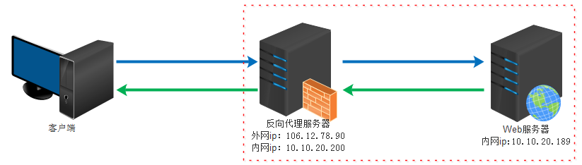
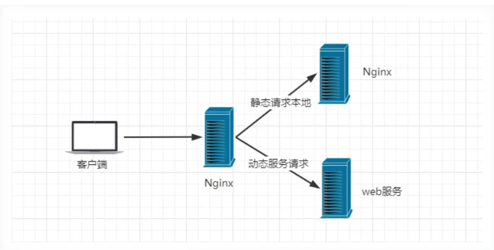
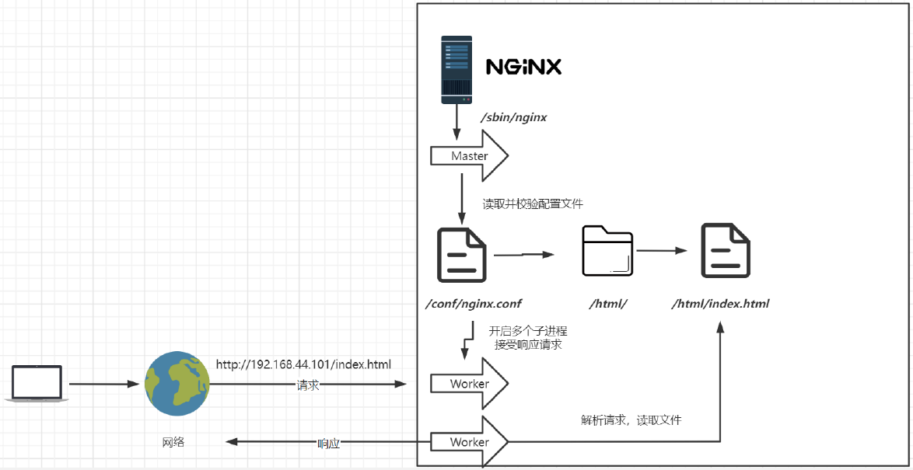
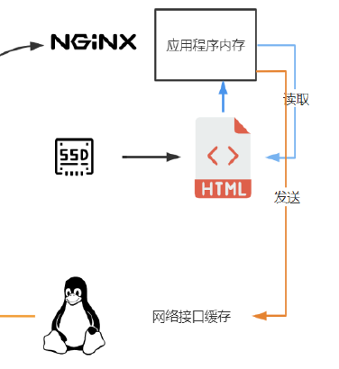
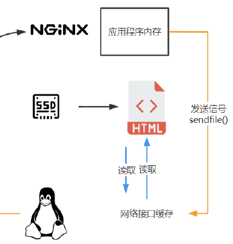

## 什么是Nginx
Nginx (engine x)是一个高性能的`HTTP`和`反向代理`web服务器，同时也提供了IMAP/POP3/SMTP（邮件）服务。其特点是占有内存少，并发能力强。
#### 正向代理
代理客户端
正向代理类似一个`跳板机`，代理访问外部资源
比如我们国内访问谷歌，直接访问访问不到，我们可以通过一个正向代理服务器，请求发到代理服，代理服务器能够访问谷歌，这样由代理去谷歌取到返回数据，再返回给我们，这样我们就能访问谷歌了

**作用**
1. 访问原来无法访问的资源，如google
2. 可以做缓存，加速访问资源
3. 对客户端访问授权，上网进行认证
4. 代理可以记录用户访问记录（上网行为管理），对外隐藏用户信息
#### 反向代理
代理服务器
反向代理（Reverse Proxy）实际运行方式是指以`代理服务器`来接受internet上的连接请求，然后将请求转发给`内部网络`上的服务器，并将从服务器上得到的结果返回给internet上请求连接的客户端，此时代理服务器对外就表现为`一个`服务器

**作用**
1. 保证内网的安全，阻止web攻击，大型网站，通常将反向代理作为公网访问地址，Web服务器是内网
2. 负载均衡，通过反向代理服务器来优化网站的负载
#### 负载均衡
**轮询**
**加权轮询**
**iphash** 对客户端请求的ip进行hash操作，然后根据hash结果来将同一个`客户端`的ip请求分发给同一台`服务器`进行处理，可以解决`session`不共享的问题。（redis也能实现，也推荐使用redis）
**least_conn** 最少连接访问
**url_hash** 根据用户访问的url定向转发请求
**fair** 根据后端服务器响应时间转发请求
#### 动静分离
在我们的软件开发中，有一些请求需要后台处理，有些请求不需要经过后台处理的（如：css、html、jsp、js等等文件），这些不需要经过后台处理的文件称之为`静态文件`。让动态网站里的动态网页根据一定规则把不变的资源和经常变的资源区分开来，动静资源做好了拆分以后，我们就可以根据静态资源的特点将其做`缓存`操作。提高资源响应的速度。


## Nginx常用命令
```shell
cd /usr/local/bin/sbin/
./nginx     # 启动
./nginx -s stop        # 停止
./nginx -s quit        # 安全退出
./nginx -s reload    # 重新加载配置文件
ps aux|grep nginx    # 查看nginx进程
```

## Nginx安装与使用
#### 目录结构
- conf：用来存放配置文件相关
- html：用来存放静态文件的默认目录 html、css等
- sbin：nginx的主程序
#### 运行
执行`nginx/sbin/nginx`
访问`ip:80`
修改`nginx/conf/nginx.conf`文件

## Nginx开机自启
#### 注册为系统服务
创建服务脚本
```shell
vi /usr/lib/systemd/system/nginx.service
```
服务脚本内容
```shell
[Unit]
Description=nginx - web server
After=network.target remote-fs.target nss-lookup.target
[Service]
Type=forking
PIDFile=/usr/local/nginx/logs/nginx.pid
ExecStartPre=/usr/local/nginx/sbin/nginx -t -c /usr/local/nginx/conf/nginx.conf
ExecStart=/usr/local/nginx/sbin/nginx -c /usr/local/nginx/conf/nginx.conf
ExecReload=/usr/local/nginx/sbin/nginx -s reload
ExecStop=/usr/local/nginx/sbin/nginx -s stop
ExecQuit=/usr/local/nginx/sbin/nginx -s quit
PrivateTmp=true
[Install]
WantedBy=multi-user.target
```
重新加载系统服务
```shell
systemctl daemon-reload
```
启动服务
```shell
systemctl start nginx.service
```
#### 开机启动
```shell
systemctl enable nginx.service
```

## Nginx运行原理
- `主进程`master读取并校验配置文件，fork出`子进程`worker，用于解析响应请求
- 当重新加载`配置文件`时，主进程等待子进程将正在处理的请求`处理完毕`，并且`不允许`子进程继续接收请求，等请求处理完毕后，杀掉子进程再创建出新的子进程


## Nginx配置
`worker_processes 1`; 默认为1，表示开启一个业务进程
`worker_connections 1024`; 单个业务进程可接受连接数
`include mime.types`; 引入mine.types配置文件，该文件定义了所有文件后缀名和浏览器解析方式之间的映射
`default_type application/octet-stream`; 如果mime类型没匹配上，默认使用二进制流的方式传输。
`sendfile on`; 使用linux的sendfile(socket, file, len) 高效网络传输，也就是数据0拷贝。
| 开启             | 不开启          |
| ---------------- | --------------- |
|  |  |
#### 虚拟主机
原本一台服务器只能对应一个站点，通过虚拟主机技术可以虚拟化成多个站点同时对外提供服务
对多个`域名`发起请求经过dns解析得到同一个ip地址-Nginx服务器的ip地址，需要在`请求头`中携带请求的域名信息，Nginx才能根据不同域名从不同地方获取到资源
```properties
server {
    listen 80;              # 监听端口号
    server_name localhost;  # 域名/主机名

    location / {            # 匹配路径
        root html;          # 文件根目录，相对于nginx主目录下的相对路径
        index index.html index.htm; # 默认页名称
    }

    error_page 500 502 503 504 /50x.html; # 报错编码对应页面

    location = /50x.html {
        root html;
    }
}
```
我们可以在同一servername中匹配多个域名
```properties
server_name vod.mmban.com www1.mmban.com;
```
通配符匹配
```properties
server_name *.mmban.com
```
正则匹配
```properties
server_name ~^[0-9]+\.mmban\.com$;
```
#### 反向代理
```properties
# 负载均衡策略
upstream lb{
    server 127.0.0.1:8080 weight=1;
    server 127.0.0.1:8081 weight=1;
}

server {
    listen 80；
    server_name localhost；

    location / {
        # root html
        # index index.html index.htm
        proxy_pass http://lb;
    }
}
```
#### 动静分离
```properties
location ~*/(css|img|js) {
    root /usr/local/nginx/static;
    index index.html index.htm;
}
```
#### URLRewrite
隐藏真实后端地址
```shell
rewrite <regex> <replacement> [flag];
关键字  正则     替代内容       flag标记
flag标记:
last #本条规则匹配完成后，继续向下匹配新的location URI规则
break #本条规则匹配完成即终止，不再匹配后面的任何规则
redirect #返回302临时重定向，浏览器地址会显示跳转后的URL地址
permanent #返回301永久重定向，浏览器地址栏会显示跳转后的URL地址
```
```properties
rewrite ^/([0-9]+).html$ /index.jsp?pageNum=$1 break;
```
#### 防盗链
服务器某些内部静态资源只允许服务器自己访问
`Referer: http://xxx/xxx.html`
http协议规定了，当`第一次`访问某个站点时，`Request Header`里不存在`Referer`这个属性，只有从`第二次`访问开始才携带`Reference`属性，表示这次请求是从哪个页面来的
在需要防盗链的`location`中配置
```properties
valid_referers 192.168.44.101;
if ($invalid_referer) {
    return 403;
}
```

## 高可用
单一nginx服务器挂掉会导致服务整体下线，当有多台nginx服务器时，请求应该发向哪一台，不能在它们之前再加一台负载均衡器，因为这样会陷入`逻辑循环`。
解决方案：在nginx服务器内部安装`keepalived`，`keepalived`之间可以相互通信来互相检测对方的健康状态，多台nginx服务器分为`主机`和`备用机`，`虚拟`出一个ip地址，让主机持有，当主机宕机，就由备用机持有，这个虚拟ip地址由`keepalived`管理
安装keepalived
```shell
yum install keepalived
```
后配置文件在`/etc/keepalived/keepalived.conf`
```properties
# 第一台机器
! Configuration File for keepalived
global_defs {
    router_id lb111
}
vrrp_instance atguigu {
    state MASTER    # 角色
    interface ens33 # 网卡
    virtual_router_id 51
    priority 100
    advert_int 1
    authentication {
        auth_type PASS
        auth_pass 1111
    }
    virtual_ipaddress {
        192.168.44.200
    }
}
```
```properties
# 第二台机器
! Configuration File for keepalived
global_defs {
    router_id lb110
}
vrrp_instance atguigu {
    state BACKUP
    interface ens33
    virtual_router_id 51
    priority 50
    advert_int 1
    authentication {
        auth_type PASS
        auth_pass 1111
    }
    virtual_ipaddress {
        192.168.44.200
    }
}
```
启动keepalived
```shell
systemctl start keepalived
```