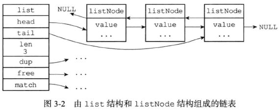
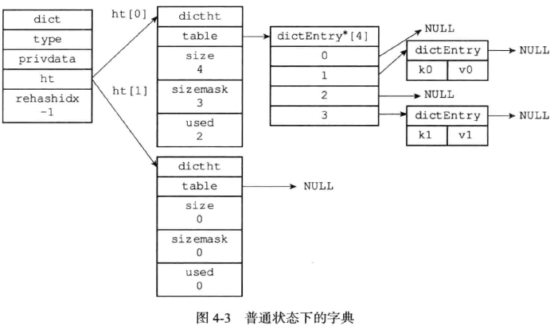
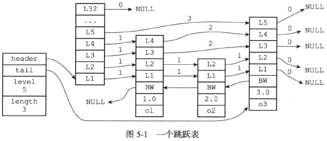
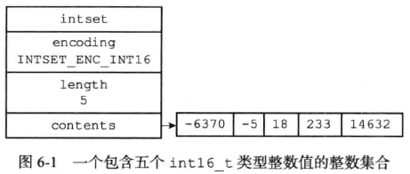
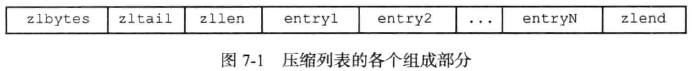
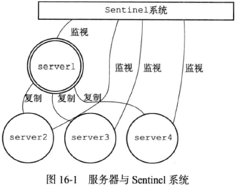

## Redis数据类型
**五大基本数据类型**
字符串(STRING)、列表(LIST)、哈希(HASH)、集合(SET)、有序集合(ZSET)
**三种特殊数据类型**
地理位置(Geospatial)、基数统计(Hyperloglog)、位图(Bitmap)

## Redis数据结构
#### 简单动态字符串SDS

大多数情况下，Redis使用SDS作为字符串的表示
和C字符串相比，SDS的**优点**：
1. 常数复杂度获取字符串长度
SDS的`len`属性记录了字符串的长度，而C字符串想要知道长度需要进行一次遍历操作
2. 杜绝缓冲区溢出
C字符串创建之初已经分配好了空间，当使用strcat的时候就有可能发生溢出；SDS在修改的时候会检查空间，在需要的时候自动扩展
3. 减少修改字符串长度时所需的内存重新分配次数
C字符串每次修改都要对底层的数组进行扩缩容；**空间预分配**：SDS的`free`属性记录了未使用空间大小，如果修改后SDS小于1MB，会再给SDS分配和len属性同等的未使用空间，如果大于1MB，就分配1MB的未使用空间。**惰性空间释放**：在字符串缩短的时候多余的空间并不释放，而是在`free`属性中记录，SDS提供了API可以在需要的时候真正释放SDS的未使用空间
4. 二进制安全
C字符串使用空字符`'\0'`作为结束，只能保存文本数据；SDS可以直接将空字符保存，因为SDS使用len属性而不是空字符判断结束，所以可以直接保存二进制数据
#### 链表
当一个`列表键`包含的元素数量`比较多`，又或者列表键中的元素都是`比较长`的字符串时，Redis就会使用链表作为列表键的底层实现

1. 双端：链表节点listNode带有prev和next指针，指向前置和后置节点
2. 无环：表头的prev和表尾的next都指向null
3. 带表头指针和表尾指针：list结构带有head指针和tail指针，获取表头和表尾节点的复杂度均是O(1)
4. 带长度计数器：list结构len属性用于计数
#### 字典
当一个`哈希键`包含的键值对`比较多`，又或者键值对中的元素都是`比较长`的字符串时，Redis就会使用字典作为哈希键的底层实现
当一个`集合键`不只包含`整数`值元素，或这个集合的元素`数量多`时，Redis就会使用字典作为集合键的底层实现

1. Redis中的字典使用哈希表作为底层实现，每个字典带有两个哈希表，一个平时使用，另一个仅在进行`rehash`时使用
2. 哈希表具体的hash过程为：先使用具体的hash算法计算出key的hash值，在用`hash & sizemask`计算出索引位置
3. 哈希表使用`链地址法`解决键的hash冲突，同一个索引多个键值对会形成一个单向链表，新节点加入会插入到`表头`的位置
4. 对哈希表进行扩缩容的操作时，要先将 ht[0] 现有的键值对`rehash`到ht [1] 里，当全部迁移完成后，将 ht[1] 设置为 ht[0] ，并在 ht[1] 处再新建一个空白hash表。这个过程不是一次性完成，而是`渐进式`完成的
5. 负载因子大于`1`的时候进行扩容、小于`0.1`的时候进行缩容
6. 渐进式rehash：设置`rehashidx=0`，当程序每次对字典进行`增删改查`的操作的时候，除了完成该操作，还会将 ht[1] 中所有`rehashidx`位置的键值对rehash到 ht[0] 中，并将`rehashidx+1`
#### 跳表
当一个`有序集合`包含的元素数量`比较多`，又或者有序集合中元素的成员是`比较长`的字符串时, Redis就会使用跳表来作为有序集合健的底层实现

1. Redis的跳表由`zskiplistNode`和`zskiplist`两个结构定义，其中 zskiplistNode结构用于表示跳表节点，而zskiplist结构则用于保存跳表节点的相关信息，比如节点的数量，以及指向表头节点和表尾节点的指针等等。
2. 每次`创建`一个新跳表节点的时候，程序都根据`幂次定律`(powerlaw，越大的数出现的概率越小)随机生成一个介于`1到32`之间的值作为level数组的大小，这个大小就是跳表节点的`层高`
3. 在跳表中，多个节点可以包含相同的`分值`，但节点成员对象必须是唯一的。节点按各自所保存的`分值`从小到大排序，分值相同时，按照成员对象大小排序。
#### 整数集合
当一个`集合键`只包含`整数`值元素，且这个集合的元素`数量不多`时，Redis就会使用整数集合作为集合键的底层实现

1. 整数集合的底层实现为contents`数组`，以`有序、无重复`的方式保存集合元素，在需要时，会根据新添加的元素类型改变这个数组的类型
2. 升级：当新元素的类型比现有元素类型都`长`时，进行升级：根据新元素的类型`扩展`底层数组空间大小；将现有元素转换成与新元素`相同`的类型，在此之间维持有序性质不变；最后将新元素加入
3. 整数集合只支持`升级`，不支持降级
#### 压缩列表
当一个`列表键`只包含`少量`列表项，且每个列表项要么是`小整数`，要么是长度比较`短`的字符串，Redis就会使用压缩列表作为列表键的底层实现
当一个`哈希键`只包含`少量`键值对，且每个键值对的键和值要么是`小整数`，要么是长度比较`短`的字符串，Redis就会使用压缩列表作为哈希键的底层实现
当一个`有序集合`只包含`少量`元素，且每个元素的成员都是比较`短`的字符串时, Redis就会使用压缩列表来作为有序集合健的底层实现

1. 压缩列表包含多个节点，每个节点保存一个`字节数组`或者`整数值`
2. `添加`新节点到压缩列表，或从压缩列表中`删除`节点，可能会引发`连锁更新`，但几率并不高
3. 连锁更新：对压缩列表进行空间重分配的时候，改变前一个节点的空间，后续所有节点的空间都要跟着改变

## Redis的过期删除策略
惰性删除 + 定期删除
**定期删除：**
每隔一定的时间，`抽取`一定数量的key，并清除其中`已过期`的key。 
**惰性删除：**
只有当`访问`一个key时，才会判断该key是否已过期，过期则清除，返回空回复。CPU友好，内存不友好

## Redis内存持久化
#### RDB
Redis DataBase
* RDB策略下会定期将Redis`快照`写入RDB文件，RDB文件用于保存和还原Redis数据库中所有键值对数据，写入时会生成`临时`RDB文件，写入完成后会替换掉正式RDB文件
* SAVE命令由`服务器进程`直接执行，所以会`阻塞`服务器
* BGSAVE命令由`子进程`执行，该命令`不会阻塞`服务器
* Redis配置文件中保存了所有`save条件`，当任意一条被满足，就会自动执行BGSAVE命令(save 60 10000： 60秒内对数据库进行了至少10000次修改)

**优点**
1. RDB文件`紧凑`，全量备份，非常适合用于进行备份和灾难恢复。
2. 生成RDB文件的时候，redis主进程会fork()一个`子进程`来处理所有保存工作，主进程不需要进行任何磁盘IO操作。
3. RDB 在恢复`大数据集`时的速度比 AOF 的恢复速度要`快`。

**缺点**
当进行快照持久化时，会开启一个子进程专门负责快照持久化，子进程会拥有父进程的内存数据，父进程修改内存子进程不会反应出来，所以在快照`持久化期间`修改的数据不会被保存，此时宕机可能丢失数据。
#### AOF
Append Only File
* AOF策略将所有`写操作`以日志的形式`增量`记录在一个.aof文件中来记录数据库状态，无限追加
* 命令请求先保存到AOF`缓冲区`当中，再`定时`写入AOF文件
* 服务器只要重新`载入并执行`AOF中保存的命令就能恢复
* 为解决AOF文件体积膨胀的问题，Redis提供了`AOF重写`功能，通过读取数据库当前`状态`来实现。AOF重写会生成一个`新`的AOF文件，与原AOF文件保存的数据库状态一样，体积更小
* AOF重写时，Redis会维护一个AOF`重写缓冲区`，用来再子进程创建新AOF文件期间，记录所有写操作。当新AOF文件创建完成后，再将缓冲区的内容`追加`到新AOF文件当中，使得新旧AOF文件保持同步，最后用新AOF文件`替代`旧AOF文件

**优点**
1. AOF可以更好的保护数据`不丢失`，一般AOF会每隔1秒，通过一个后台线程执行一次fsync操作，最多丢失1秒钟的数据。
2. AOF日志文件的命令通过非常可读的方式进行记录，这个特性非常适合做灾难性的误删除的`紧急恢复`。比如某人不小心用flushall命令清空了所有数据，只要这个时候后台rewrite还没有发生，那么就可以立即拷贝AOF文件，将最后一条flushall命令给删了，然后再将该AOF文件放回去，就可以通过恢复机制，自动恢复所有数据

**缺点**
1. 对于同一份数据来说，AOF日志文件通常比RDB数据快照文件`更大`
2. AOF开启后，支持的`写QPS`会比RDB支持的写QPS低，因为AOF一般会配置成每秒fsync一次日志文件

## 主从复制
**作用**
1. 数据冗余：主从复制实现了数据的`热备份`，是持久化之外的另一种数据冗余方式
2. 故障恢复：主节点出现问题时，可以有从节点提供服务，实现快速的故障恢复；实际上是一种服务的冗余
3. 负载均衡：主从复制的基础上配合`读写分离`，由主节点提供写服务，从节点提供读服务。尤其是读多写少的场景下，可以大大提高redis并发量
4. 高可用的基石：主从复制是`哨兵模式`和实现`集群`的基础

**实现**
* 主服务器通过向从服务器发送命令来`更新`从服务器的状态，从服务器通过向主服务器发送命令进行`心跳检测`，以及命令丢失检测(检查复制偏移量)。
* 主从复制分为`完整重同步`和`部分重同步`，其中完整重同步用于处理`初次复制`的情况；部分重同步用于处理断线后`继续复制`的情况。
* 部分重同步通过复制`偏移量`、复制积压`缓冲区`、服务器`运行ID`三部分实现
* 主服务器每`传播`N字节数据，就将其复制偏移量加上N；从服务器每`收到`N字节数据，就将其复制偏移量加上N
* 当从服务器断线重连后，主服务器`对比复制偏移量`可以得知哪些数据未同步，如果在复制积压`缓冲区`中，则执行`部分`重同步操作，将这些数据进行同步；如果已经不存在于复制积压缓冲区中，则执行`完整`重同步操作

## 哨兵模式
Sentinel只是一个运行在特殊模式下的`Redis服务器`，拥有与普通Redis服务器不同的`命令表`

1. Sentinel会向监视的主服务器创建`命令连接`和`订阅链接`，其中命令连接用于向主服务器`发送命令`，订阅连接用于`接收消息`
2. Sentinel通过向主服务器发送`INFO`命令获得其属下所有`从服务器`的信息，并向这些从服务器建立`命令连接`和`订阅连接`
3. 多个监视同一主服务器的Sentinel通过被监视服务器的`__sentinel__:hello`频道发送消息来告知其他Sentinel自己的存在；每个Sentinel也会接收这个频道的消息来向其他Sentinel创建`命令连接`
4. Sentinel每秒一次向其他实例(包括`主服务器`、`从服务器`、其他`Sentinel`)发送`PING`命令，根据回复来判断实例是否下线。当一个实例连续发送无效回复时，该Sentinel会将该实例判断为**主观下线**
5. 当Sentinel将一个主服务器判断为`主观下线`后，会向其他Sentinel发起投票，看它们是否同意该主服务器进入主观下线状态
6. 当Sentinel收集到足够投票后，会将该服务器判断为**客观下线**
7. 当Sentinel将主服务器判断为`客观下线`后，会要求其他Sentinel将自己设置为`领头Sentinel`
8. 每个Sentinel在一次选举纪元中只能选择`一个`Sentinel作为领头Sentinel，遵循`先到先得`的规则
9.  若存在一个Sentinel，被`半数以上`的Sentinel设置为领头Sentinel，则选举结束，由它来进行`故障转移`操作；若不存在这样的Sentinel，则一段时间后再次选举

## Redis为什么这么快
1. Redis是完全基于`内存`的数据库
2. 数据结构`简单`，操作节省时间
3. 处理网络请求使用的是`单线程`，避免了不必要的上下文切换和锁的竞争维护。
4. 使用了I/O多路复用模型。（I/O指的是`网络I/O`，多路指的是多个`网络连接`，复用指的是复用`一个线程`）
   * 在Redis中的I/O多路复用程序会监听`多个客户端`连接的Socket
   * 每当有客户端通过Socket流向Redis发送请求进行操作时，I/O多路复用程序会将其放入一个`队列`中。
   * 同时I/O多路复用程序会同步、有序、每次传送一个任务给处理器处理。
   * I/O多路复用程序会在上一个请求`处理完毕`后再继续分派下一个任务。（同步）

**为什么是单线程**
因为Redis是基于`内存`的操作，`CPU`不是Redis的瓶颈，Redis的瓶颈最有可能是机器`内存大小`或者`网络带宽`。既然单线程容易实现，而且CPU不会成为瓶颈，那就顺理成章地采用单线程的方案了

## Redis内存优化 - 共享对象池
对象共享池指Redis内部维护`[0-9999]`的整数对象池。创建大量的整数类型redisObject存在内存开销，每个redisObject内部结构至少占16字节，甚至超过了整数`自身`空间消耗。所以Redis内存维护一个[0-9999]的整数对象池，用于节约内存。 除了整数值对象，其他类型如list,hash,set,zset内部元素也可以使用整数对象池。因此开发中在满足需求的前提下，尽量使用整数对象以节省内存。

## MemCache和Redis的区别
**MemCache**
MemCache的工作流程如下：先检查客户端的请求数据是否在MemCache中，如有，直接把请求数据返回，不再对数据库进行任何操作；如果请求的数据不在MemCache中，就去查`数据库`，把从数据库中获取的数据返回给客户端，同时把数据`缓存`一份到MemCache中（MemCache客户端不负责，需要程序明确实现）；每次`更新`数据库的同时更新MemCache中的数据，保证一致性；当分配给MemCache`内存空间`用完之后，会使用`LRU`（Least Recently Used，最近最少使用）策略加上`到期失效`策略，失效数据首先被替换，然后再替换掉最近未使用的数据。
Memcache是一个高性能的分布式的内存对象缓存系统，通过在内存里维护一个统一的巨大的hash表，它能够用来存储各种格式的数据，包括图像、视频、文件以及数据库检索的结果等。简单的说就是将数据调用到内存中，然后从内存中读取，从而大大提高读取速度。
**区别**
1. Redis和MemCache都是将数据存放在`内存`中。
2. Redis不仅仅支持简单的k/v类型的数据，同时还提供list，set，hash等数据结构的存储。 
3. 过期策略--MemCache在`set`时就指定，例如set key1 0 0 8,即永不过期。Redis可以通过例如`expire` 设定，例如expire name 10 
4. 分布式--设定MemCache集群（`平行关系`）;redis可以做`一主多从`。
5. 存储数据安全--MemCache挂掉后，数据没了；redis可以定期保存到磁盘（`持久化`）,支持持久化，服务器重启，缓存依然可以获取。
6. MemCache是`多线程`，Redis是`单线程`

## 缓存穿透、缓存击穿、缓存雪崩
#### 缓存穿透
查询一个`不存在`的数据，导致这个不存在的数据每次请求都要到`数据库`去查询
解决方案：**布隆过滤器 / 缓存空对象**
直观的说，bloom算法类似一个hash set，用来判断某个元素（key）是否在某个集合中。
和一般的hash set不同的是，这个算法无需存储key的值，对于每个key，只需要k个比特位，每个存储一个标志，用来判断key是否在集合中。
**算法**
1. 首先需要k个hash函数，每个函数可以把key散列成为1个整数
2. 初始化时，需要一个长度为`n比特`的数组，每个比特位初始化为0
3. 某个key加入集合时，用k个hash函数计算出k个散列值，并把数组中对应的比特位`置为1`
4. 判断某个key是否在集合时，用k个hash函数计算出k个散列值，并查询数组中对应的比特位，如果所有的比特位都是1，认为在集合中；若有一个比特位为0，则认为不存在。

**优点**
不需要存储key，节省空间
**缺点**
1. 算法判断key在集合中时，有一定的概率key其实不在集合中，所以布隆过滤器用于判断key不在集合中时是准确的；判断key在集合中是不准确的
2. 无法删除
#### 缓存击穿
`热频Key`持续接受高并发访问，当key`失效瞬间`就会穿透缓存直接请求`数据库`
解决方案：**设置热点Key永不过期 / 互斥锁**
#### 缓存雪崩
缓存`集中过期` / Redis`宕机`
解决方案：
集中过期：**数据预热**，`手动加载`不同的key，设置`不同`的过期时间，尽量均匀失效
宕机：**Redis集群**（异地多活）

## 高并发系统设计
总共有10亿个红包，在某个时间一起来抢红包，如何设计
1. 限流策略。比如在压力测试中我们测到系统1亿QPS达到了极限，那么超过的部分直接返回已经抢完，通过Nginx的lua脚本可以查redis看到QPS数据从而可以动态调节
2. 作弊拦截。通过对UA、IP规则直接将抢红包的作弊流量拦截掉
3. 异步削峰。对Redis中的红包预减数量，立即返回抢红包成功请用户等待，然后把发送消息发给消息队列，进行流量的第二次削峰，让后台服务慢慢处理
4. 服务逻辑。比如业务逻辑是使用事务控制对数据库的创建红包记录，减红包数量的操作，那么创建操作要放到减数量操作之前，从而避免减数量update的行锁持有时间
5. 机器配置。当然是服务器机器配置约高越好，数据库配置越猛越好，高并发抢红包主要是CPU的负载较高，要选择偏向CPU性能的机器

## Redis实现分布式锁
redis的**String类型**就可以实现。
因为redis是一个单独的非业务服务，不会受到其他业务服务的限制，所有的业务服务都可以向redis发送写入命令，且只有一个业务服务可以写入命令成功，那么这个写入命令成功的服务即获得了锁，可以进行后续对资源的操作，其他未写入成功的服务，则进行其他处理。
#### 锁的获取
**setnx**命令：表示`SET if Not exists`，即如果 key 不存在，才会设置它的值，否则什么也不做。
两个客户端同时向redis`写入`try_lock，客户端1写入成功，即获取分布式锁成功。客户端2写入失败，则获取分布式锁失败。
#### 锁的释放
当客户端1操作完后，释放锁资源，即`删除`try_lock。那么此时客户端2再次尝试获取锁时，则会获取锁成功。
#### 问题
假如客户端1在获取到锁资源后，服务宕机了，那么这个try_lock会一直存在redis中，那么其他服务就永远无法获取到锁了。
如何解决这个问题呢？
#### 解决死锁
设置键`过期时间`，超过这个时间即给key删除掉。
这样的话，就算当前服务获取到锁后宕机了，这个key也会在一定时间后被删除，其他服务照样可以继续获取锁。
给serverLock键设置一个10秒的过期时间，10秒后会自动删除该键。
这样虽然解决了上面说的问题，但是又会引入`新的问题`。
假如服务A加锁成功，锁会在10s后自动释放，但由于业务复杂，执行时间过长，10s内还没执行完，此时锁已经被redis自动释放掉了。此时服务B就重新获取到了该锁，服务B开始执行他的业务，服务A在执行到第12s的时候执行完了，那么服务A会去释放锁，则此时释放的却是服务B刚获取到的锁。

我们可以这样做，在锁将要过期的时候，如果服务还没有处理完业务，那么将这个锁再`续一段时间`。比如设置key在10s后过期，那么再开启一个`守护线程`，在第8s的时候检测服务是否处理完，如果没有，则将这个key再续10s后过期。
在`Redisson`（Redis SDK客户端）中，就已经帮我们实现了这个功能，这个自动续时的我们称其为”看门狗”。
#### Redis集群
上面是针对单Redis实例的情况
涉及到redis集群，就会有新的问题出现，假设是主从集群，且主从数据并`不是强一致性`。当主节点宕机后，主节点的数据还未来得及同步到从节点，进行主从切换后，新的主节点并没有老的主节点的全部数据，这就会导致刚写入到老的主节点的锁在新的主节点并没有，其他服务来获取锁时还是会加锁成功。此时则会有2个服务都可以操作公共资源，此时的分布式锁则是不安全的。
#### RedLock
要实现RedLock，需要至少`5个实例`（官方推荐），且每个实例都是`master`，不需要从库和哨兵。
1. 客户端先获取当前时间戳`T1`
2. 客户端依次向5个master实例发起`加锁命令`，且每个请求都会设置超时时间（毫秒级，注意：不是锁的超时时间），如果某一个master实例由于网络等原因导致加锁失败，则立即向下一个master实例申请加锁。
3. 当客户端加锁成功的请求`大于等于3`个时，且再次获取当前时间戳`T2`，
4. 当`时间戳T2 - 时间戳T1 < 锁的过期时间`。则客户端加锁成功，否则失败。
5. 加锁成功，开始操作公共资源，进行后续业务操作
6. 加锁失败，向所有redis节点发送`锁释放命令`
#### NPC问题
N：Network Delay，网络延迟
P：Process Pause，进程暂停（GC）
C：Clock Drift，时钟漂移
1. 客户端 1 请求锁定节点 A、B、C、D、E
2. 客户端 1 的拿到锁后，进入 GC（时间比较久）
3. 所有 Redis 节点上的锁都过期了
4. 客户端 2 获取到了 A、B、C、D、E 上的锁
5. 客户端 1 GC 结束，认为成功获取锁
6. 客户端 2 也认为获取到了锁，发生【冲突】
