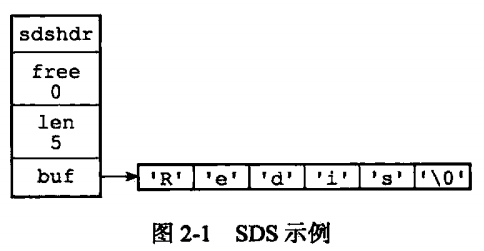

## Redis数据类型
**五大基本数据类型**
字符串(STRING)、列表(LIST)、哈希(HASH)、集合(SET)、有序集合(ZSET)
**三种特殊数据类型**
地理位置(Geospatial)、基数统计(Hyperloglog)、位图(Bitmap)

## Redis数据结构
#### 简单动态字符串SDS

大多数情况下，Redis使用SDS作为字符串的表示
和C字符串相比，SDS的**优点**：
1. 常数复杂度获取字符串长度
SDS的`len`属性记录了字符串的长度，而C字符串想要知道长度需要进行一次遍历操作
2. 杜绝缓冲区溢出
C字符串创建之初已经分配好了空间，当使用strcat的时候就有可能发生溢出；SDS在修改的时候会检查空间，在需要的时候自动扩展
3. 减少修改字符串长度时所需的内存重新分配次数
C字符串每次修改都要对底层的数组进行扩缩容；**空间预分配**：SDS的`free`属性记录了未使用空间大小，如果修改后SDS小于1MB，会再给SDS分配和len属性同等的未使用空间，如果大于1MB，就分配1MB的未使用空间。**惰性空间释放**：在字符串缩短的时候多余的空间并不释放，而是在`free`属性中记录，SDS提供了API可以在需要的时候真正释放SDS的未使用空间
4. 二进制安全
C字符串使用空字符`'\0'`作为结束，只能保存文本数据；SDS可以直接将空字符保存，因为SDS使用len属性而不是空字符判断结束，所以可以直接保存二进制数据

