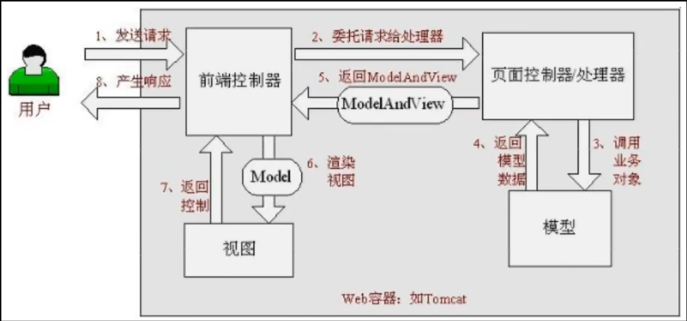
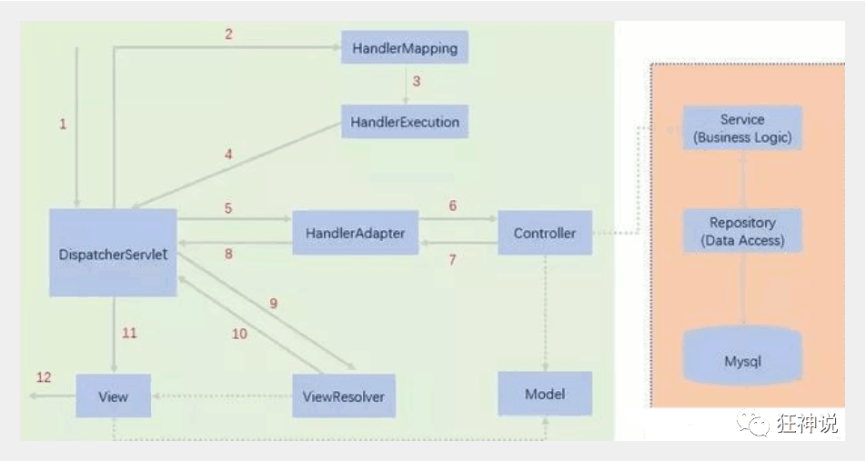

## Spring的IoC
XML解析 + 工厂模式 + 反射
1. IoC（Inversion of Control）是指`容器控制`程序对象之间的关系，而不是传统实现中，由`程序代码`直接操控。控制权由应用代码中转到了外部容器(第三方)，控制权的转移就是是所谓`控制反转`。对于Spring而言，就是由Spring来控制对象的生命周期和对象 之间的关系；IoC的实现方式是`依赖注入（DI）`。从名字上理解，所谓依赖注入，即组件之间的依赖关系由容器在`运行期`决定，即由容器动态地将某种依赖关系注入到组件之中
2. 在Spring的工作方式中，所有的类都会在spring容器中`登记`，告诉Spring这是个什么东西，你需要什么东西，然后Spring会在系统运行到适当的时候，把你要的东西主动给你，同时也把你交给其他需要你的东西。所有的类的`创建、销毁`都由Spring来控制，也就是说控制对象生存周期的不再是引用它的对象，而是Spring。对于某个具体的对象而言，以前是它控制其他对象，现在是所有对象都被Spring控制，所以这叫控制反转
3. 在系统运行中，动态的向某个对象提供它所需要的其他对象
4. `依赖注入`的思想是通过`反射`机制实现的，在实例化一个类时，它通过反射调用类中`set`方法将事先保存在`HashMap`中的类属性注入到类中。 总而言之，在传统的对象创建方式中，通常由调用者来创建被调用者的实例，而在Spring中创建被调用者的工作由`Spring`来完成，然后`注入`调用者，即所谓的依赖注入or控制反转。 注入方式有两种：依赖注入和设置注入

IoC的优点：降低了组件之间的`耦合`，降低了业务对象之间替换的复杂性，使之能够灵活的管理对象。
**实现**
第一步：配置xml文件
```xml
<bean id="dic" class="com.zhy.springIoc.model.Dic"></bean>
```
第二步：创建工厂类 使用 dom4j解析配置 + 反射
```java
public static Dic getDic(){
    // 使用dom4j解析xml文件
    // 根据id值dic，获取对象的class属性
    String classValue = "class属性";
    // 使用反射创建类对象
    Class clazz = Class.forName(classValue);
    // 得到相应的对象
    Dic dic = clazz.newInstance();
    return dic;
}
```
**IoC创建对象**
\<Bean>：		写在XML中
@Component：    组件，放在类上，说明类被Spring管理了

## Spring 扩展原理
#### BeanFactoryPostProcessor
**BeanPostProcessor** Bean后置处理器，Bean创建对象初始化前后工作
**BeanFactoryPostProcessor** BeanFactory后置处理器，BeanFactory标准初始化之后调用(`postProcessBeanFactory`)：所有的Bean定义`已经`加载，但Bean`实例`还未创建
在`invokeBeanFactoryPostProcessors(beanFactory)`方法执行
如何找到所有的`BeanFactoryPostProcessor`并执行它们的方法：
```java
String[] postProcessorNames = beanFactory.getBeanNamesForType(BeanFactoryPostProcessor.class, true, false);
for (String ppName : postProcessorNames) {
    //在BeanFactory中找到所有类型是BeanFactoryPostProcessor的组件
    beanFactory.getBean(ppName, BeanFactoryPostProcessor.class);
    //...
}
```
#### BeanDefinitionRegistryPostProcessor
`BeanDefinitionRegistryPostProcessor`是`BeanFactoryPostProcessor`的子接口
在所有的Bean定义`将要`加载，但Bean`实例`还未创建时调用(`postProcessBeanDefinitionRegistry`)，先于`BeanFactoryPostProcessor`执行
`BeanDefinitionRegistry`是Bean的定义信息的保存中心，之后`BeanFactory`就是按照`BeanDefinitionRegistry`中保存的每一个Bean定义信息创建Bean实例
在`invokeBeanFactoryPostProcessors(beanFactory)`方法执行
如何找到所有的`BeanDefinitionRegistryPostProcessor`并执行它们的方法：
```java
String[] postProcessorNames = beanFactory.getBeanNamesForType(BeanDefinitionRegistryPostProcessor.class, true, false);
for (String ppName : postProcessorNames) {
    //在BeanFactory中找到所有类型是BeanDefinitionRegistryPostProcessor的组件
   beanFactory.getBean(ppName, BeanDefinitionRegistryPostProcessor.class);
    //...
}
```
#### ApplicationListener
Spring提供的`事件驱动`功能，用来监听容器中发布的事件: `ApplicationEvent`及其子类。继承`ApplicationListener`并重写`onApplicationEvent(event)`
Spring在特定位置调用`publishEvent(xxxEvent)`发布事件，`ApplicationListener`就会监听到这些事件
获取容器的`事件派发器`，执行`getApplicationEventMulticaster().multicastEvent(applicationEvent, eventType)`
在`multicastEvent`中，遍历所有注册的`ApplicationListener`
```java
for (ApplicationListener<?> listener : getApplicationListeners(event, type)) {
    if (executor != null) {
        // 异步
        executor.execute(() -> invokeListener(listener, event));
    }else {
        // 同步
        invokeListener(listener, event);
    }
}
```
调用`listener.onApplicationEvent(event)`

#### @EventListener
功能与`ApplicationListener`相似
```java
@Service
public class UserService{
    @EventListener(classes={ApplicationEvent.class})
    public void listen(ApplicationEvent event){
        // ...
    }
}
```
利用`EventListenerMethodProcessor`来解析方法上的`@EventListener`
`EventListenerMethodProcessor`实现`SmartInitializingSingleton`接口
`SmartInitializingSingleton`接口定义`afterSingletonsInstantiated()`方法，在所有单实例Bean创建完成之后执行

## Spring容器创建原理
`refresh()` 方法 - 容器创建，刷新
1. `prepareRefresh()` 预处理
   1. `initpropertySources()` 初始化属性，用于子类自定义属性
   2. `getEnvironment().validateRequiredProperties()` 属性校验
   3. `this.earlyApplicationEvents = new LinkedHashSet<>()` 保存容器早期事件
2. `ConfigurableListableBeanFactory beanFactory = obtainFreshBeanFactory()` 获取Bean工厂
   1. `refreshBeanFactory()` 刷新Bean工厂
      1. `this.beanFactory = new DefaultListableBeanFactory()` 创建了一个Bean工厂
      2. 设置id
   2. `getBeanFactory()` 把刚才创建的Bean工厂返回
3. `prepareBeanFactory(beanFactory)` Bean工厂预准备，设置Bean工厂
   1. 设置类加载器、支持的表达式解析器……
   2. `addBeanPostProcessor`；添加部分`BeanPostProcessor`(ApplicationContextAwareProcessor)
   3. `ignoreDependencyInterface`；设置忽略的自动装配接口EnvironmentAware、EmbeddedValueResolverAware……
   4. `registerResolvableDependency`；注册可以解析的自动装配组件，能直接在任何组件中@Autowired`自动注入`这些组件`BeanFactory`、`ResourceLoader`、`ApplicationEventPublisher`、`ApplicationContext`
   5. 向`BeanFactory`中注册一些能用的组件；`environment`【ConfigurableEnvironment】、`systemProperties`【Map<String, Object>】、`systemEnvironment`【Map<String, Object>】、`applicationStartup`【ApplicationStartup】
4. `postProcessBeanFactory(beanFactory)` Bean工厂准备工作完成后进行的`后置处理`工作，用于子类做自定义设置

**以上是BeanFactory创建及准备工作**

5. `invokeBeanFactoryPostProcessors(beanFactory)` 执行Bean工厂的后置处理器，在BeanFactory标准初始化之后执行；两个接口：`BeanFactoryPostProcessor`、`BeanDefinitionRegistryPostProcessor`
   1. `invokeBeanFactoryPostProcessors`
      1. 获取所有`BeanDefinitionRegistryPostProcessor`
            ```java
            List<BeanDefinitionRegistryPostProcessor> registryProcessors = new ArrayList<>();

            for (BeanFactoryPostProcessor postProcessor : beanFactoryPostProcessors) {
                if (postProcessor instanceof BeanDefinitionRegistryPostProcessor) {
                    BeanDefinitionRegistryPostProcessor registryProcessor =
                            (BeanDefinitionRegistryPostProcessor) postProcessor;
                    registryProcessor.postProcessBeanDefinitionRegistry(registry);
                    registryProcessors.add(registryProcessor);
                }
                else {
                    regularPostProcessors.add(postProcessor);
                }
            }
            ```
      2. 按照`顺序`执行接口的`postProcessBeanDefinitionRegistry`
6. `registerBeanPostProcessors(beanFactory)`注册Bean的后置处理器，拦截Bean创建过程
   1. `beanFactory.getBeanNamesForType(BeanPostProcessor.class...)`获取所有`BeanPostProcessor`
   2. `registerBeanPostProcessors(beanFactory, priorityOrderedPostProcessors)`依次注册`BeanPostProcessor`
        ```java
        PriorityOrdered -> Ordered -> 其他
        ```
7. `initMessageSource()`初始化`MessageSource`组件(国际化功能；消息绑定、消息解析)
   1. 获取`BeanFactory`、查看是否有id为`"messageSource"`的Bean
        ```java
        ConfigurableListableBeanFactory beanFactory = getBeanFactory();
		if (beanFactory.containsLocalBean(MESSAGE_SOURCE_BEAN_NAME)){...}
        ```
   2. 如果有，直接赋值给`this.messageSource`，如果没有，创建一个`DelegatingMessageSource`并注册到容器中
8. `initApplicationEventMulticaster()`初始化事件派发器(用于`事件驱动`开发)
   1. 获取`BeanFactory`、查看是否有id为`"applicationEventMulticaster"`的Bean
        ```java
        ConfigurableListableBeanFactory beanFactory = getBeanFactory();
		if (beanFactory.containsLocalBean(APPLICATION_EVENT_MULTICASTER_BEAN_NAME)){...}
        ```
   2. 如果有，直接赋值给`this.applicationEventMulticaster`，如果没有，创建一个`SimpleApplicationEventMulticaster`并注册到容器中
9. `onRefresh()`留给子容器自定义，子类可以重写该方法
10. `registerListeners()`给容器中注册所有项目里的`ApplicationListener`
    1. 从容器中拿到所有`ApplicationListener`，添加到事件派发器中
        ```java
        String[] listenerBeanNames = getBeanNamesForType(ApplicationListener.class, true, false);
		for (String listenerBeanName : listenerBeanNames) {
		    getApplicationEventMulticaster().addApplicationListenerBean(listenerBeanName);
		}
        ```
11. `finishBeanFactoryInitialization(beanFactory)`初始化所有剩下的`单实例`Bean
    1. 调用`beanFactory.preInstantiateSingletons()`初始化剩下的单实例Bean
       1. 获取所有Bean定义信息，利用`getBean(beanName)`执行创建过程
            ```java
            // 获取所有Bean的name
            List<String> beanNames = new ArrayList<>(this.beanDefinitionNames);
            for (String beanName : beanNames) {
                // 获取Bean的定义信息
                RootBeanDefinition bd = getMergedLocalBeanDefinition(beanName);
                // 不是抽象，是单例，不是懒加载
                if (!bd.isAbstract() && bd.isSingleton() && !bd.isLazyInit()) {
                    if (isFactoryBean(beanName)) {
                        // 如果是FactoryBean，走相关逻辑
                        getBean(beanName);
                    }
                    else {
                        getBean(beanName);
                    }
                }
            }
            ```
          1. `Object sharedInstance = getSingleton(beanName)`先获取缓存`Map<String, Object>`中保存的单实例Bean，如果获取不到，执行创建流程
          2. `markBeanAsCreated(beanName)`先把Bean标记为`已创建`解决多线程问题
          3. `RootBeanDefinition mbd = getMergedLocalBeanDefinition(beanName)`获取Bean的定义信息
          4. `mbd.getDependsOn()`获取该Bean依赖的所有Bean，如果有，则递归调用`getBean(beanName)`先创建这些依赖的Bean
                ```java
                String[] dependsOn = mbd.getDependsOn();
				if (dependsOn != null) {
                    for (String dep : dependsOn) {
                        if (isDependent(beanName, dep)) {
                            // A依赖B的同时B依赖A，抛出循环依赖异常
                        }
                        registerDependentBean(dep, beanName);
                        try {
                            getBean(dep);
                        }
                        catch (NoSuchBeanDefinitionException ex) {...}
                    }
				}
                ```
          5. 解决所有依赖之后，调用`createBean()`创建Bean
                ```java
                if (mbd.isSingleton()) {
                    sharedInstance = getSingleton(beanName, () -> 
                        // ...
                        return createBean(beanName, mbd, args);
                    });
                    beanInstance = getObjectForBeanInstance(sharedInstance, name, beanName, mbd);
				}
                ```
             1. `Object bean = resolveBeforeInstantiation(beanName, mbdToUse)`让`InstantiationAwareBeanPostProcessor`后置处理器拦截，触发`postProcessBeforeInstantiation`，看是否需要返回`代理对象`
                ```java
                try {
                    Object bean = resolveBeforeInstantiation(beanName, mbdToUse);
                    if (bean != null) {
                        return bean;
                    }
		        }
                ```
             2. 如果没有代理对象，调用`Object beanInstance = doCreateBean(beanName, mbdToUse, args)`返回Bean实例
                1. 【创建Bean实例】`createBeanInstance(beanName, mbd, args)`利用`工厂方法`或Bean的`构造器`创建出Bean实例
                2. `applyMergedBeanDefinitionPostProcessors(mbd, beanType, beanName)`调用`MergedBeanDefinitionPostProcessor`的`postProcessMergedBeanDefinition`方法
                3. 将生成的Bean对象提前加入缓存用来解决`循环依赖`
                4. 【Bean属性赋值】`populateBean(beanName, mbd, instanceWrapper)`对Bean对象的属性赋值
                   1. 赋值之前，获取所有`InstantiationAwareBeanPostProcessor`后置处理器，执行`postProcessAfterInstantiation`
                   2. `applyPropertyValues(beanName, mbd, bw, pvs)`利用反射调用`setter`方法为Bean的属性赋值
                5. 【Bean初始化】`exposedObject = initializeBean(beanName, exposedObject, mbd)`进行Bean的初始化
                   1. `invokeAwareMethods(beanName, bean)`执行`Aware`接口的方法
                   2. 【初始化之前】`wrappedBean = applyBeanPostProcessorsBeforeInitialization(wrappedBean, beanName)`执行`所有`后置处理器`postProcessBeforeInitialization`方法
                   3. 【初始化】`invokeInitMethods(beanName, wrappedBean, mbd)`执行初始化方法
                      1. 该Bean是否是InitializationBean接口的实现，执行该接口规定的初始化方法
                      2. 该Bean是否指定了自定义初始化方法，执行自定义初始化方法
                   4. 【初始化之后】`wrappedBean = applyBeanPostProcessorsAfterInitialization(wrappedBean, beanName)`执行`所有`后置处理器`postProcessAfterInitialization`方法
                6. `registerDisposableBeanIfNecessary(beanName, bean, mbd)`注册Bean的销毁方法
          6. 在`getSingleton(beanName, singletonFactory)`执行完 `singletonObject = singletonFactory.getObject()`后，调用`addSingleton(beanName, singletonObject)`注册生成的Bean对象，IOC容器实际就是这些`Map<String, Object>`
       2. 所有Bean对象创建完成之后，再次遍历，判断它们是否是`SmartInitializingSingleton`接口的实现，若是，则执行对应的`afterSingletonsInstantiated`方法，用于`事件驱动`
12. `finishRefresh()`完成IOC的创建
    1. `initLifecycleProcessor()`初始化`BeanFactory生命周期`相关的后置处理器`LifecycleProcessor`，将这些Processor也注册进容器
    2. `getLifecycleProcessor().onRefresh()`回调`onRefresh()`方法
    3. 发布容器刷新完成事件`publishEvent(new ContextRefreshedEvent(this))`
#### 总结
1. 容器在启动的时候，先保存所有注册进来的Bean的`定义信息`: `xml`注册Bean、`注解`注册Bean`(@Bean @Service @Controller...)`
2. 容器在合适的时机创建Bean
   1. 用到Bean的时候，利用`getBean`创建Bean，创建好后保存在容器中
   2. 统一创建剩下的所有Bean，也是利用`getBean`，在`finishBeanFactoryInitialization()`
3. 后置处理器：每一个Bean创建完成后，都会使用各种后置处理器增强Bean的功能，如`AutowiredAnnotationBeanPostProcessor`处理自动注入、`AnnotationAwareAspectJAutoProxyCreator`创建代理对象做AOP...
4. 事件驱动模型：`ApplicationListener`事件监听、`ApplicationEventMulticaster`事件派发

## Spring的AOP
Spring中的AOP有6种增强方式，分别是：`Before` 前置增强、`After` 后置增强、`Around` 环绕增强、`AfterReturning` 最终增强、`AfterThrowing` 异常增强、`DeclareParents` 引入增强
#### AOP术语
1. **JoinPoint**（连接点）：程序执行过程中的一个点，如方法的执行或异常的处理。在Spring AOP中，连接点总是表示`方法的执行`。通俗的讲，连接点即表示类里面可以被增强的`方法`
2. **PointCut**（切入点）：是与连接点匹配的不同类型的表达，Spring框架使用AspectJ表达切入点。可以将切入点理解为`需要被拦截的JoinPoint`
3. **Advice**（通知）：所谓通知是指拦截到JoinPoint之后所要做的事情就是通知，通知分为前置通知、后置通知、异常通知、最终通知和环绕通知(切面要完成的`功能`)
4. **Aspect**（切面）：Aspect切面表示`PointCut`（切入点）和`Advice`（通知）的结合，在spring中它是一个类

#### 实现原理
**动态代理**
自动生成代理类，利用反射，`getClass`得到代理类，`invoke`执行方法
1. 接口         -- 定义操作
2. 真实角色     -- 实现操作
3. 代理角色     -- 调用真实角色实现操作、附加操作
4. 客户         -- 访问代理角色

`Java`动态代理： 利用`反射`机制生成一个实现代理接口的`匿名类`，`Proxy`提供了创建动态代理类和实例的静态方法，在调用具体方法前调用`InvocationHandler`来处理
**Proxy:** 创建代理实例
**InvocationHandler:** 调用处理程序并返回结果
`cglib`动态代理： 利用`asm`开源包，对代理对象类的class文件加载进来，通过`修改其字节码`生成子类来处理
```java
public class ProxyInvocationHandler implements InvocationHandler{
    // 被代理的接口
    private Object target;

    public void setTarget(Object target){
        this.target = target;
    }

    // 生成得到的代理类
    public Object getProxy(){
        return Proxy.newProxyInstance(this.getClass().getClassLoader(), target.getClass().getInterfaces, this);
    }

    // 处理代理实例，并返回结果
    public Object invoke(Object proxy, Method method, Object[] args){
        Object result = method.invoke(target, args);
        return result;
    }
}
```
#### 通过注解实现AOP
编写一个注解实现的增强类
```java
@Aspect
public class AnnotationPointcut {
    @Before("execution(* com.kuang.service.UserServiceImpl.*(..))")
    public void before(){
        System.out.println("---------方法执行前---------");
    }
 
    @After("execution(* com.kuang.service.UserServiceImpl.*(..))")
    public void after(){
        System.out.println("---------方法执行后---------");
    }
 
    @Around("execution(* com.kuang.service.UserServiceImpl.*(..))")
    public void around(ProceedingJoinPoint jp) throws Throwable {
        System.out.println("环绕前");
        //执行目标方法proceed
        Object proceed = jp.proceed();
        System.out.println("环绕后");
    }
}
```
在xml文件中配置，注册bean，并增加支持注解的配置
```xml
<!--第三种方式:注解实现-->
<bean id="annotationPointcut" class="com.kuang.config.AnnotationPointcut"/>
<!--开启注解支持-->
<aop:aspectj-autoproxy/>
```
#### BeanPostProcessor
`BeanPostProcessor`接口是bean的后置处理器，可以在bean`初始化`前后进行一些处理工作
```java
public interface BeanPostProcessor {
    @Nullable
    default Object postProcessBeforeInitialization(Object bean, String beanName) throws BeansException {
        return bean;
    }

    @Nullable
    default Object postProcessAfterInitialization(Object bean, String beanName) throws BeansException {
        return bean;
    }
}
```
#### Aware
组件想要使用Spring容器`底层`的一些组件(ApplicationContext, BeanFactory，xxx)，就要实现xxxAware，在`创建对象`的时候会调用接口中规定的`set`方法注入相关组件
```java
public interface ApplicationContextAware extends Aware {
    void setApplicationContext(ApplicationContext applicationContext) throws BeansException;
}
```
xxxAware的功能使用xxxProcessor(`BeanPostProcessor`)来处理
后置处理器在bean初始化的时候判断它是否`实现`了xxxAware，如果实现了，则调用对应的set方法

## SpringAOP底层原理
核心：**@EnableAspectJAutoProxy**
```java
@Import(AspectJAutoProxyRegistrar.class)
public @interface EnableAspectJAutoProxy {}
```
`AspectJAutoProxyRegistrar`通过实现`ImportBeanDefinitionRegistrar`接口自定义注册组件，向容器中注册一个`AnnotationAwareAspectJAutoProxyCreator`
```java
class AspectJAutoProxyRegistrar implements ImportBeanDefinitionRegistrar {
	@Override
	public void registerBeanDefinitions(
			AnnotationMetadata importingClassMetadata, BeanDefinitionRegistry registry) {

		AopConfigUtils.registerAspectJAnnotationAutoProxyCreatorIfNecessary(registry);

		AnnotationAttributes enableAspectJAutoProxy =
				AnnotationConfigUtils.attributesFor(importingClassMetadata, EnableAspectJAutoProxy.class);
		if (enableAspectJAutoProxy != null) {
			if (enableAspectJAutoProxy.getBoolean("proxyTargetClass")) {
				AopConfigUtils.forceAutoProxyCreatorToUseClassProxying(registry);
			}
			if (enableAspectJAutoProxy.getBoolean("exposeProxy")) {
				AopConfigUtils.forceAutoProxyCreatorToExposeProxy(registry);
			}
		}
	}

}
```
#### AnnotationAwareAspectJAutoProxyCreator
```java
AnnotationAwareAspectJAutoProxyCreator
    -> AbstractAutoProxyCreator
        implements SmartInstantiationAwareBeanPostProcessor, BeanFactoryAware
```
一个`后置处理器`，一个`Aware`
#### 创建流程
1. 传入配置类，创建ioc容器
2. 注册配置类，调用`refresh()`刷新容器
3. `refresh()`中调用`registerBeanPostProcessors(beanFactory)`注册bean后置处理器拦截bean的创建
   1. 获取容器中已经定义的所有`BeanPostProcessor`(尚未创建对象)
        ```java
        String[] postProcessorNames = beanFactory.getBeanNamesForType(BeanPostProcessor.class, true, false);
        ```
   2. 遍历`postProcessorNames`从`beanFactory`拿bean对象，如果没有则创建。实际上就是`创建对象`并保存在容器中
        ```java
        // 正确逻辑是，先处理实现了PriorityOrdered的processor，再处理实现了Ordered的processor，最后是其他processor
        for(String ppName : postProcessorNames){
            // 初次创建时，在factory中找不到bean对象，所以触发创建对象的操作，这里涉及到spring三次缓存
            BeanPostProcessor pp = beanFactory.getBean(ppName, BeanPostProcessor.class);
        }
        ```
       1. 调用`doCreateBean`创建对象
            ```java
            // 创建Bean实例
            instanceWrapper = createBeanInstance(beanName, mbd, args);
            // Bean实例赋值
            populateBean(beanName, mbd, instanceWrapper);
            // 初始化Bean
            exposedObject = initializeBean(beanName, exposedObject, mbd);
            ```
           1. `initializeBean`中调用`invokeAwareMethods`处理Aware接口，在这里，就是调用`BeanFactoryAware`的`setBeanFactory`方法
                ```java
                private void invokeAwareMethods(String beanName, Object bean) {
                    if (bean instanceof Aware) {
                        if (bean instanceof BeanNameAware) {
                            ((BeanNameAware) bean).setBeanName(beanName);
                        }
                        if (bean instanceof BeanClassLoaderAware) {
                            ClassLoader bcl = getBeanClassLoader();
                            if (bcl != null) {
                                ((BeanClassLoaderAware) bean).setBeanClassLoader(bcl);
                            }
                        }
                        if (bean instanceof BeanFactoryAware) {
                            ((BeanFactoryAware) bean).setBeanFactory(AbstractAutowireCapableBeanFactory.this);
                        }
                    }
                }
                ```
           2. 调用`applyBeanPostProcessorsBeforeInitialization`应用后置处理器的`BeforeInitialization`方法
                ```java
                for (BeanPostProcessor processor : getBeanPostProcessors()) {
                    Object current = processor.postProcessBeforeInitialization(result, beanName);
                    if (current == null) {
                        return result;
                    }
                    result = current;
                }
                ```
            1. 调用`invokeInitMethods`执行初始化方法
            2. 调用`applyBeanPostProcessorsAfterInitialization`应用后置处理器的`AfterInitialization`方法
                ```java
                for (BeanPostProcessor processor : getBeanPostProcessors()) {
                    Object current = processor.postProcessAfterInitialization(result, beanName);
                    if (current == null) {
                        return result;
                    }
                    result = current;
                }
                ```
        1. BeanPostProcessor(`AnnotationAwareAspectJAutoProxyCreator`)创建成功
    1. 把创建好的`BeanPostProcessor`组成一个list，统一注册到`BeanFactory`中
        ```java
        registerBeanPostProcessors(beanFactory, priorityOrderedPostProcessors);

        private static void registerBeanPostProcessors(
			ConfigurableListableBeanFactory beanFactory, List<BeanPostProcessor> postProcessors) {

            if (beanFactory instanceof AbstractBeanFactory) {
                ((AbstractBeanFactory) beanFactory).addBeanPostProcessors(postProcessors);
            }
            else {
                for (BeanPostProcessor postProcessor : postProcessors) {
                    beanFactory.addBeanPostProcessor(postProcessor);
                }
            }
        }
        ```
4. `refresh()`中调用`finishBeanFactoryInitialization(beanFactory)`完成BeanFactory初始化工作(创建剩下的单实例)
    1. `遍历`容器中的所有Bean，依次调用`getBean(beanName)`方法创建对象，获取不到则创建，所有创建好的Bean都会被缓存起来
        ```java
        List<String> beanNames = new ArrayList<>(this.beanDefinitionNames);

        for (String beanName : beanNames) {
            RootBeanDefinition bd = getMergedLocalBeanDefinition(beanName);
            if (!bd.isAbstract() && bd.isSingleton() && !bd.isLazyInit()) {
                if (isFactoryBean(beanName)) {
                    //...
                }
                else {
                    getBean(beanName);
                }
            }
        }
        ```
        getBean -> doGetBean -> createBean
        1. 调用`createBean`创建Bean
           1. `resolveBeforeInstantiation(beanName, mbdToUse);`解析BeforeInstantiation，希望后置处理器在这里能返回一个`代理对象`，如果不能，就继续调用`doCreateBean`
                ```java
                // 遍历InstantiationAwareBeanPostProcessor执行它的postProcessBeforeInstantiation方法
                bean = applyBeanPostProcessorsBeforeInstantiation(targetType, beanName);
                if (bean != null) {
                    // 遍历BeanPostProcessor执行它的postProcessAfterInitialization
                    bean = applyBeanPostProcessorsAfterInitialization(bean, beanName);
                }
                ```
                **【BeanPostProcessor在Bean对象初始化前后调用】**
                **【InstantiationAwareBeanPostProcessor在Bean对象创建前后调用】**
        2. 在`AnnotationAwareAspectJAutoProxyCreator`的bean对象创建之前，由于它实现了`InstantiationAwareBeanPostProcessor`接口，所以会执行对应的`postProcessBeforeInstantiation`方法，每一个Bean创建之前，都会调用上述方法
            ```java
            if (!StringUtils.hasLength(beanName) || !this.targetSourcedBeans.contains(beanName)) {
                // 判断当前bean是否在advisedBeans中(保存了所有需要增强的Bean)
                if (this.advisedBeans.containsKey(cacheKey)) {
                    return null;
                }
                // 判断当前bean是否是基础类型或切面、是否需要跳过
                if (isInfrastructureClass(beanClass) || shouldSkip(beanClass, beanName)) {
                    this.advisedBeans.put(cacheKey, Boolean.FALSE);
                    return null;
                }
            }
            ```
        3. 在`AnnotationAwareAspectJAutoProxyCreator`的bean对象初始化之后，由于它实现了`InstantiationAwareBeanPostProcessor`接口，这个接口本身也是`BeanPostProcessor`接口，所以会执行对应的`postProcessAfterInitialization`方法
            ```java
            public Object postProcessAfterInitialization(@Nullable Object bean, String beanName) {
                if (bean != null) {
                    Object cacheKey = getCacheKey(bean.getClass(), beanName);
                    if (this.earlyProxyReferences.remove(cacheKey) != bean) {
                        return wrapIfNecessary(bean, beanName, cacheKey);
                    }
                }
                return bean;
            }
            ```
            1. 获取当前bean的所有`增强器`(通知方法)
                ```java
                Object[] specificInterceptors = getAdvicesAndAdvisorsForBean(bean.getClass(), beanName, null);
                ```
                找到能在当前bean使用的增强器(哪些通知方法是需要切入当前bean方法的)
                ```java
                protected List<Advisor> findEligibleAdvisors(Class<?> beanClass, String beanName) {
                    List<Advisor> candidateAdvisors = findCandidateAdvisors();
                    List<Advisor> eligibleAdvisors = findAdvisorsThatCanApply(candidateAdvisors, beanClass, beanName);
                    extendAdvisors(eligibleAdvisors);
                    if (!eligibleAdvisors.isEmpty()) {
                        eligibleAdvisors = sortAdvisors(eligibleAdvisors);
                    }
                    return eligibleAdvisors;
                }
                ```
            2. 保存当前bean到`advisedBeans`当中，调用`createProxy`创建代理对象
                ```java
                if (specificInterceptors != DO_NOT_PROXY) {
                    this.advisedBeans.put(cacheKey, Boolean.TRUE);
                    Object proxy = createProxy(
                            bean.getClass(), beanName, specificInterceptors, new SingletonTargetSource(bean));
                    this.proxyTypes.put(cacheKey, proxy.getClass());
                    return proxy;
                }
                ```
                1. 将上一步提取出的`增强器`(通知方法)保存到`proxyFactory`
                    ```java
                    Advisor[] advisors = buildAdvisors(beanName, specificInterceptors);
                    proxyFactory.addAdvisors(advisors);
                    proxyFactory.setTargetSource(targetSource);
                    customizeProxyFactory(proxyFactory);
                    ```
                2. 调用`proxyFactory.getProxy`获取代理对象，有`JdkDynamicAopProxy`和`CglibAopProxy`
        4. 给容器中返回的是增强了的`代理对象`
#### 调用流程
当目标方法执行时，使用的是容器中组件的`代理对象`(cglib/jdk增强后的对象)，该对象保存了详细信息(增强器、目标对象、……)
1. 执行`CglibAopProxy.DynamicAdvisedInterceptor.intercept`方法
   1. 根据`ProxyFactory`对象获取将要执行的`目标方法`的拦截器链
        ```java
        List<Object> chain = this.advised.getInterceptorsAndDynamicInterceptionAdvice(method, targetClass);
        ```
      1. 调用`advisorChainFactory.getInterceptorsAndDynamicInterceptionAdvice`方法获取拦截器链
         1. 获取所有增强器(`Advisor`)，遍历，将其包装成`Interceptor[] interceptors`
            ```java
            Advisor[] advisors = config.getAdvisors();
            List<Object> interceptorList = new ArrayList<>(advisors.length);
            for (Advisor advisor : advisors) {
                if (advisor instanceof PointcutAdvisor) {
                    PointcutAdvisor pointcutAdvisor = (PointcutAdvisor) advisor;
                    // ...
                    MethodInterceptor[] interceptors = 
                    // 这里面将advisor.getAdvice()转为MethodInterceptor，如果不能直接转使用适配器进行一次包装
                    registry.getInterceptors(advisor);
                    interceptorList.addAll(Arrays.asList(interceptors));
                } //...
            }
            return interceptorList;
            ```
   2. 如果没有拦截器链，直接执行目标方法，如果有，则创建一个`CglibMethodInvocation`对象并调用它的`proceed`方法
        ```java
        if (chain.isEmpty() && CglibMethodInvocation.isMethodProxyCompatible(method)) {
            Object[] argsToUse = AopProxyUtils.adaptArgumentsIfNecessary(method, args);
            retVal = methodProxy.invoke(target, argsToUse);
        }
        else {
            retVal = new CglibMethodInvocation(proxy, target, method, args, targetClass, chain, methodProxy).proceed();
        }
        ```
        1. `this.currentInterceptorIndex`记录当前拦截器索引，初始值为-1，如果没有拦截器，到了最后一个拦截器，直接执行目标方法
            ```java
            if (this.currentInterceptorIndex == this.interceptorsAndDynamicMethodMatchers.size() - 1) {
                return invokeJoinpoint();
            }
            ```
        2. 每次调用，更新`this.currentInterceptorIndex`，取出对应的Interceptor，执行它的`invoke`方法，每一个Interceptor等待下一个拦截器执行完成返回以后再来执行
            ```java
            Object interceptorOrInterceptionAdvice =
				this.interceptorsAndDynamicMethodMatchers.get(++this.currentInterceptorIndex);
            if (interceptorOrInterceptionAdvice instanceof InterceptorAndDynamicMethodMatcher) {
                //...
            }
            else {
                return ((MethodInterceptor) interceptorOrInterceptionAdvice).invoke(this);
            }
            ```
#### 总结
1. `@EnableAspectJAutoProxy`开启AOP功能
2. `@EnableAspectJAutoProxy`会向容器中注册一个组件`AnnotationAwareAspectJAutoProxyCreator`
3. `AnnotationAwareAspectJAutoProxyCreator`是一个后置处理器
4. 容器创建流程：
   1. `registerBeanPostProcessors()`注册后置处理器，创建`AnnotationAwareAspectJAutoProxyCreator`对象
   2. `finishBeanFactoryInitialization()`初始化剩下的单实例bean
      1. 创建`业务逻辑组件`和`切面组件`
      2. `AnnotationAwareAspectJAutoProxyCreator`这个后置处理器会来拦截创建过程
      3. 组件创建完成后，后置处理器执行`postProcessAfterInitialization`，判断组件是否需要增强，将切面的通知方法，包装成增强器(`Advisor`)，为业务逻辑组件创建一个`代理对象`(cglib)，代理对象中就有所有的增强器
5. 执行目标方法：
   1. 实际上是`代理对象`执行目标方法
   2. `CglibAopProxy.intercept()`
      1. 得到目标方法的`拦截器链`(`Advisor`包装成`Interceptor`)
      2. 利用拦截器的链式机制，依次执行每一个拦截器
         正常：前置通知 -> 目标方法 -> 后置通知 -> 返回通知
         异常：前置通知 -> 目标方法 -> 后置通知 -> 异常通知

## Bean作用域
**singleton**
此取值时表明容器中创建时只存在`一个`实例，所有引用此bean都是单一实例。此外，singleton类型的bean定义从容器启动到`第一次`被请求而实例化开始，只要容器不销毁或退出，该类型的bean的单一实例就会`一直存活`，典型单例模式，如同servlet在web容器中的生命周期
**prototype**
spring容器在进行输出prototype的bean对象时，会每次都`重新生成`一个新的对象给请求方，虽然这种类型的对象的实例化以及属性设置等工作都是由容器负责的，但是只要准备完毕，并且对象实例返回给请求方之后，容器就不在拥有当前对象的引用，请求方需要`自己负责`当前对象后继生命周期的管理工作，包括该对象的销毁
**request**
Spring容器会为每个`HTTP请求`创建一个全新的RequestPrecessor对象，当请求结束后，该对象的生命周期即告结束，如同java web中request的生命周期
**session**
对于web应用来说，放到session中最普遍的就是用户的`登录信息`，Spring容器会为每个独立的session创建属于自己的全新的UserPreferences实例，比request scope的bean会存活`更长`的时间，其他的方面没区别

## Spring自动装配
自动装配就是让应用程序上下文为你找出依赖项的过程。Spring会在`上下文`中自动查找，并自动给`bean`装配与其关联的`属性`
#### 通过xml文件实现自动装配
在xml配置文件中的bean标签中加入一个属性autowire即可，例如：
```xml
<bean id="people" class="com.kuang.pojo.Peopel" autowire="byName">
    <property name="name" value="张三"/>
</bean>
```
使用autowire关键字声明bean的自动装配方式。其可选值为byName、byType等
**byName**
autowire属性为byName，那么Spring会根据class属性找到实体类，然后查询实体类中所有`setter`方法的名字，根据setter方法后面的`名字`（例如SetDog，则setter方法后面的名字为dog）再到配置文件中寻找一个与该名字相同`id`的Bean，注入进来。

**byType**
设置autowire属性为byType，那么Spring会自动寻找一个与该属性类型相同的Bean，注入进来。

#### 通过注解实现自动装配
注解是通过`反射`来实现的
xml文件配置如下
```xml
<beans>
    <context:annotation-config/>

    <bean id="cat" class="com.kuang.pojo.Cat"/>
    <bean id="dog" class="com.kuang.pojo.Dog"/>
    <bean id="people" class="com.kuang.pojo.Peopel">
        <property name="name" value="张三"/>
    </bean>
</beans>
```
然后在实体类的对应`属性`上添加`@Autowired`注解（也可以把注解放到对应属性的`setter`上），people类中依赖Dog类和Cat类。所以在people类中的dog和cat属性上要加上`@Autowired`，实现自动装配
```java
public class Peopel {
    @Autowired
    private Cat cat;
    @Autowired
    private Dog dog;
    private String name;
    //...
}
```
* 注解方法装配属性的过程：spring会默认优先根据（被注解修饰的）`属性类型`去容器中找对应的组件（bean），找到就赋值；若找到多个相同类型的组件，再将`属性名称`作为组件（bean）的id去容器中查找。
* `@Qualifier`注解可以和使用Autowired搭配使用：@Qualifier指定需要装配的`组件id`，而不是使用属性名。当ioc容器根据属性类型去容器中找找到`多个相同类型`的组件，再将属性的`名称`作为组件（bean）的id去容器中查找`找不到`时就是用这两个注解搭配，指定需要装配的bean的id
```java
public class Peopel {
    @Autowired
    @Qualifier(value = "cat")
    private Cat cat;
}
```
#### 其他自动注入注解
@Controller注解 -   只能用controller层的类上
@Service注解 -      只能用在service层的类上
@Repository注解 -   只能用在dao层的类上
@Component注解 -    无法按照上面三个注解分类,就用此注解

## Spring解决循环依赖
循环依赖：就是N个类循环（嵌套）引用。
通俗的讲就是N个Bean`互相引用`对方，最终形成`闭环`。用一副经典的图示可以表示成这样（A、B、C都代表对象，虚线代表引用关系）：

```java
@Service
public class A {
    @Autowired
    private B b;
}

@Service
public class B {
    @Autowired
    private A a;
}
```
**解决方法：三级缓存**
* singletonObjects：一级缓存，用于保存`实例化`、`注入`、`初始化`完成的bean实例
* earlySingletonObjects：二级缓存，用于保存`实例化`完成的bean实例
* singletonFactories：三级缓存，用于保存bean创建`工厂`，以便于后面扩展有机会创建代理对象。
  

1. 先从`一级缓存`singletonObjects中去获取。（如果获取到就直接return）
2. 如果获取不到或者对象正在创建中（isSingletonCurrentlyInCreation()），那就再从`二级缓存`earlySingletonObjects中获取。（如果获取到就直接return）
3. 如果还是获取不到，且允许singletonFactories（allowEarlyReference=true）通过getObject()获取。就从`三级缓存`singletonFactory.getObject()获取。

让我们来分析一下“A的某个field或者setter依赖了B的实例对象，同时B的某个field或者setter依赖了A的实例对象”这种循环依赖的情景。

1. A 调用doCreateBean()创建Bean对象：由于还未创建，从第1级缓存singletonObjects查不到，此时只是一个半成品（提前暴露的对象），放入`第3级缓存`singletonFactories。
2. A在属性填充时发现自己需要B对象，但是在三级缓存中均未发现B，于是创建B的半成品，放入`第3级缓存`singletonFactories。
3. B在属性填充时发现自己需要A对象，从第1级缓存singletonObjects和第2级缓存earlySingletonObjects中未发现A，但是在第3级缓存singletonFactories中发现A，将A放入`第2级缓存`earlySingletonObjects，同时从第3级缓存singletonFactories`删除`。
4. 将A注入到对象B中。
5. B完成属性填充，执行初始化方法，将自己放入`第1级缓存`singletonObjects中（此时B是一个完整的对象），同时从`第3级缓存`singletonFactories和`第2级缓存`earlySingletonObjects中删除。
6. A得到“对象B的完整实例”，将B注入到A中。
7. A完成属性填充，执行初始化方法，并放入到`第1级缓存`singletonObjects中。

## Spring常用注解
**声明bean的注解**
@Component 组件，没有明确的角色
@Service 在业务逻辑层使用（service层）
@Repository 在数据访问层使用（dao层）
@Controller 在展现层使用，控制器的声明（controller层）
**注入bean的注解**
@Autowired：由Spring提供
@Inject：由JSR-330提供
@Resource：由JSR-250提供
@Qualifier 与 @Primary 都可以用于bean的歧义性问题
**java配置类相关注解**
@Configuration 声明当前类为配置类，相当于xml形式的Spring配置
@Bean 注解在方法上，声明当前方法的返回值为一个bean，替代xml中的方式
@Configuration 声明当前类为配置类，其中内部组合了@Component注解，表明这个类是一个bean
@ComponentScan 用于对Component进行扫描，相当于xml中的context:component-scan/（类上）
**切面（AOP）相关注解**
@Aspect 声明一个切面（类上）
使用@After、@Before、@Around定义建言（advice），可直接将拦截规则（切点）作为参数。
@After 在方法执行之后执行
@Before 在方法执行之前执行
@Around 在方法执行之前与之后执行
@PointCut 声明切点
@PostConstruct 由JSR-250提供，在构造函数执行完之后执行，等价于xml配置文件中bean的initMethod
@PreDestory 由JSR-250提供，在Bean销毁之前执行，等价于xml配置文件中bean的destroyMethod
**@Bean的属性支持**
@Scope 设置Spring容器如何新建Bean实例（方法上，得有@Bean）
其设置类型包括：
Singleton （单例,一个Spring容器中只有一个bean实例，默认模式）,
Protetype （每次调用新建一个bean）,
Request （web项目中，给每个http request新建一个bean）,
Session （web项目中，给每个http session新建一个bean）,
GlobalSession（给每一个 global http session新建一个Bean实例）
**@Value注解**
@Value 为属性注入值（属性上）
支持如下方式的注入：
》注入普通字符
@Value("Michael Jackson")
String name;
》注入操作系统属性
@Value("#{systemProperties['os.name']}")
String osName;
》注入表达式结果
@Value("#{ T(java.lang.Math).random() * 100 }")
String randomNumber;
》注入其它bean属性
@Value("#{domeClass.name}")
String name;

## Servlet工作流程
1. 当客户端第一次访问该servlet时，服务器创建这个servlet`实例对象`
2. 紧接着调用servlet的`init`方法完成这个servlet对象的`初始化`
3. 服务器创建代表请求的`request对象`，和代表响应的`response对象`，调用servlet的`service方法`，响应客户端请求
4. service方法执行，向代表响应的`response`对象中`写入`将要回送给浏览器的数据
5. `服务器`从response对象中取出相应的数据，构建一个`http响应`，回写给客户机浏览器
6. 浏览器接受响应数据，解析数据进行显示

## Spring-Mybatis事务管理
**声明式事务**
AOP
```xml
<!-- 开启事务管理 -->
<bean id="transactionManager" class="org.springframework.jdbc.datasource.DataSourceTransactionManager">
  <constructor-arg ref="dataSource" />
</bean>
```
**编程式事务**
代码侵入
```java
TransactionStatus status = transactionManager.getTransaction(new DefaultTransactionDefinition());
try{
    userMapper.insertUser(user);
}catch(Exception e){
    transaction.rollback(status);
    throw e;
}
transactionManager.commit(status);
```

## SpringMVC
Spring的web框架围绕`DispatcherServlet`设计，DispatcherServlet是一个前置控制器，作用是将请求分发到不同的处理器

```xml
<web-app ...>
   <!--1.注册DispatcherServlet-->
   <servlet>
       <servlet-name>springmvc</servlet-name>
       <servlet-class>org.springframework.web.servlet.DispatcherServlet</servlet-class>
       <!--关联一个springmvc的配置文件:【servlet-name】-servlet.xml-->
       <init-param>
           <param-name>contextConfigLocation</param-name>
           <param-value>classpath:springmvc-servlet.xml</param-value>
       </init-param>
       <!--启动级别-1-->
       <load-on-startup>1</load-on-startup>
   </servlet>
 
   <!--/ 匹配所有的请求；（不包括.jsp）-->
   <!--/* 匹配所有的请求；（包括.jsp）-->
   <servlet-mapping>
       <servlet-name>springmvc</servlet-name>
       <url-pattern>/</url-pattern>
   </servlet-mapping>
</web-app>
```
**接口模式**
```xml
<beans ...>
    <!-- 处理器映射器 -->
    <bean class="org.springframework.web.servlet.handler.BeanNameUrlHandlerMapping"/>
    <!-- 处理器适配器 -->
    <bean class="org.springframework.web.servlet.mvc.SimpleControllerHandlerAdapter"/>

    <!--视图解析器:DispatcherServlet给他的ModelAndView-->
    <bean class="org.springframework.web.servlet.view.InternalResourceViewResolver" id="InternalResourceViewResolver">
        <!--前缀-->
        <property name="prefix" value="/WEB-INF/jsp/"/>
        <!--后缀-->
        <property name="suffix" value=".jsp"/>
    </bean>

    <!--BeanNameUrlHandlerMapping:Bean-->
    <bean id="/hello" class="com.kuang.controller.HelloController"/>
</beans>
```
**注解模式**
```xml
<beans ...>
    <!-- 自动扫描包，让指定包下的注解生效,由IOC容器统一管理 -->
    <context:component-scan base-package="com.kuang.controller"/>
    <!-- 让Spring MVC不处理静态资源 -->
    <mvc:default-servlet-handler />
    <!-- 注解模式 -->
    <mvc:annotation-driven />

    <!-- 视图解析器 -->
    <bean class="org.springframework.web.servlet.view.InternalResourceViewResolver" id="internalResourceViewResolver">
        <!-- 前缀 -->
        <property name="prefix" value="/WEB-INF/jsp/" />
        <!-- 后缀 -->
        <property name="suffix" value=".jsp" />
    </bean>
</beans>
```
#### SpringMVC执行原理

1. 用户发出请求，`DispatcherServlet`接收请求并拦截请求。
2. `HandlerMapping`为处理器映射。DispatcherServlet调用HandlerMapping,HandlerMapping根据请求url查找Handler。
3. `HandlerExecution`表示具体的Handler,其主要作用是根据url查找控制器，如上url被查找控制器为：hello。
4. HandlerExecution将解析后的信息传递给DispatcherServlet,如解析控制器映射等。
5. `HandlerAdapter`表示处理器适配器，其按照特定的规则去执行Handler。
6. Handler让具体的`Controller`执行。
7. Controller将具体的执行信息返回给HandlerAdapter,如`ModelAndView`。
8. HandlerAdapter将视图逻辑名或模型传递给DispatcherServlet。
9. DispatcherServlet调用视图解析器(`ViewResolver`)来解析HandlerAdapter传递的逻辑视图名。
10. 视图解析器将解析的逻辑视图传给DispatcherServlet。
11. DispatcherServlet根据视图解析器解析的视图结果，调用具体的`视图`。
12. 最终视图呈现给用户。

## @PathVariable
在Spring MVC中可以使用`@PathVariable`注解，让`方法参数`的值对应绑定到一个`URI模板变量`上
```java
@Controller
public class RestFulController {
    //映射访问路径
    @RequestMapping("/commit/{p1}/{p2}")
    public String index(@PathVariable int p1, @PathVariable int p2, Model model){
        int result = p1+p2;
        //Spring MVC会自动实例化一个Model对象用于向视图中传值
        model.addAttribute("msg", "结果："+result);
        //返回视图位置
        return "test";
    }
}
```