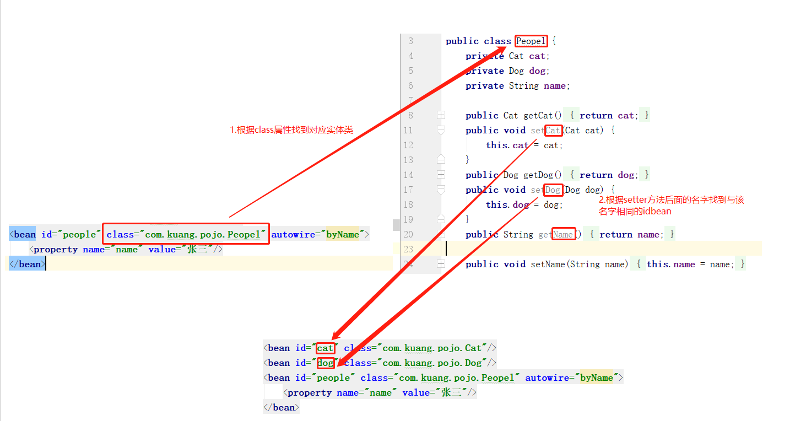
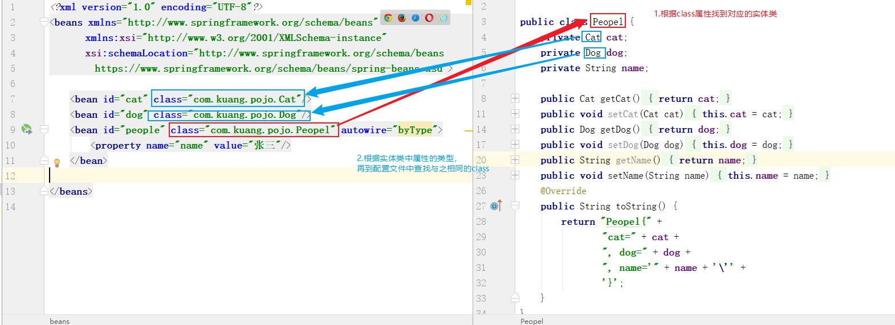
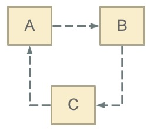
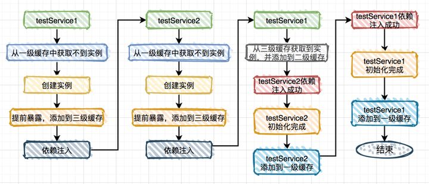

## Spring的IoC
XML解析 + 工厂模式 + 反射
1. IoC（Inversion of Control）是指`容器控制`程序对象之间的关系，而不是传统实现中，由`程序代码`直接操控。控制权由应用代码中转到了外部容器(第三方)，控制权的转移就是是所谓`控制反转`。对于Spring而言，就是由Spring来控制对象的生命周期和对象 之间的关系；IoC的实现方式是`依赖注入（DI）`。从名字上理解，所谓依赖注入，即组件之间的依赖关系由容器在`运行期`决定，即由容器动态地将某种依赖关系注入到组件之中
2. 在Spring的工作方式中，所有的类都会在spring容器中`登记`，告诉Spring这是个什么东西，你需要什么东西，然后Spring会在系统运行到适当的时候，把你要的东西主动给你，同时也把你交给其他需要你的东西。所有的类的`创建、销毁`都由Spring来控制，也就是说控制对象生存周期的不再是引用它的对象，而是Spring。对于某个具体的对象而言，以前是它控制其他对象，现在是所有对象都被Spring控制，所以这叫控制反转
3. 在系统运行中，动态的向某个对象提供它所需要的其他对象
4. `依赖注入`的思想是通过`反射`机制实现的，在实例化一个类时，它通过反射调用类中`set`方法将事先保存在`HashMap`中的类属性注入到类中。 总而言之，在传统的对象创建方式中，通常由调用者来创建被调用者的实例，而在Spring中创建被调用者的工作由`Spring`来完成，然后`注入`调用者，即所谓的依赖注入or控制反转。 注入方式有两种：依赖注入和设置注入

IoC的优点：降低了组件之间的`耦合`，降低了业务对象之间替换的复杂性，使之能够灵活的管理对象。
**实现**
第一步：配置xml文件
```xml
<bean id="dic" class="com.zhy.springIoc.model.Dic"></bean>
```
第二步：创建工厂类 使用 dom4j解析配置 + 反射
```java
public static Dic getDic(){
    // 使用dom4j解析xml文件
    // 根据id值dic，获取对象的class属性
    String classValue = "class属性";
    // 使用反射创建类对象
    Class clazz = Class.forName(classValue);
    // 得到相应的对象
    Dic dic = clazz.newInstance();
    return dic;
}
```
**IoC创建对象**
\<Bean>：		写在XML中
@Component：    组件，放在类上，说明类被Spring管理了

## Spring的AOP
Spring中的AOP有6种增强方式，分别是：`Before` 前置增强、`After` 后置增强、`Around` 环绕增强、`AfterReturning` 最终增强、`AfterThrowing` 异常增强、`DeclareParents` 引入增强
#### AOP术语
1. **JoinPoint**（连接点）：程序执行过程中的一个点，如方法的执行或异常的处理。在Spring AOP中，连接点总是表示`方法的执行`。通俗的讲，连接点即表示类里面可以被增强的`方法`
2. **PointCut**（切入点）：是与连接点匹配的不同类型的表达，Spring框架使用AspectJ表达切入点。可以将切入点理解为`需要被拦截的JoinPoint`
3. **Advice**（通知）：所谓通知是指拦截到JoinPoint之后所要做的事情就是通知，通知分为前置通知、后置通知、异常通知、最终通知和环绕通知(切面要完成的`功能`)
4. **Aspect**（切面）：Aspect切面表示`PointCut`（切入点）和`Advice`（通知）的结合，在spring中它是一个类

#### 实现原理
**动态代理**
自动生成代理类，利用反射，`getClass`得到代理类，`invoke`执行方法
1. 接口         -- 定义操作
2. 真实角色     -- 实现操作
3. 代理角色     -- 调用真实角色实现操作、附加操作
4. 客户         -- 访问代理角色

`Java`动态代理： 利用`反射`机制生成一个实现代理接口的`匿名类`，`Proxy`提供了创建动态代理类和实例的静态方法，在调用具体方法前调用`InvocationHandler`来处理
**Proxy:** 创建代理实例
**InvocationHandler:** 调用处理程序并返回结果
`cglib`动态代理： 利用`asm`开源包，对代理对象类的class文件加载进来，通过`修改其字节码`生成子类来处理
```java
public class ProxyInvocationHandler implements InvocationHandler{
    // 被代理的接口
    private Object target;

    public void setTarget(Object target){
        this.target = target;
    }

    // 生成得到的代理类
    public Object getProxy(){
        return Proxy.newProxyInstance(this.getClass().getClassLoader(), target.getClass().getInterfaces, this);
    }

    // 处理代理实例，并返回结果
    public Object invoke(Object proxy, Method method, Object[] args){
        Object result = method.invoke(target, args);
        return result;
    }
}
```
#### 通过Spring API实现AOP
编写增强类，一个前置增强一个后置增强
```java
public class Log implements MethodBeforeAdvice {
    @Override
    public void before(Method method, Object[] objects, Object o) throws Throwable {
        System.out.println( o.getClass().getName() + "的" + method.getName() + "方法被执行了");
    }
}
```
```java
public class AfterLog implements AfterReturningAdvice {
    @Override
    public void afterReturning(Object returnValue, Method method, Object[] args, Object target) throws Throwable {
        System.out.println("执行了" + target.getClass().getName()
        +"的"+method.getName()+"方法,"
        +"返回值："+returnValue);
    }
}
```
在xml文件中注册
```xml
<beans>
    <!--注册bean-->
    <bean id="userService" class="com.kuang.service.UserServiceImpl"/>
    <bean id="log" class="com.kuang.log.Log"/>
    <bean id="afterLog" class="com.kuang.log.AfterLog"/>
    <!--aop的配置-->
    <aop:config>
        <!--切入点  expression:表达式匹配要执行的方法-->
        <aop:pointcut id="pointcut" expression="execution(* com.kuang.service.UserServiceImpl.*(..))"/>
        <!--执行环绕; advice-ref执行方法 . pointcut-ref切入点-->
        <aop:advisor advice-ref="log" pointcut-ref="pointcut"/>
        <aop:advisor advice-ref="afterLog" pointcut-ref="pointcut"/>
    </aop:config>
</beans>
```
#### 通过自定义类实现AOP
定义自己的切入类
```java
public class DiyPointcut {
    public void before(){
        System.out.println("---------方法执行前---------");
    }
    public void after(){
        System.out.println("---------方法执行后---------");
    }
}
```
在xml文件中配置
```xml
<bean id="diy" class="com.kuang.config.DiyPointcut"/>

<aop:config>
    <!--第二种方式：使用AOP的标签实现-->
    <aop:aspect ref="diy">
        <aop:pointcut id="diyPonitcut" expression="execution(* com.kuang.service.UserServiceImpl.*(..))"/>
        <aop:before pointcut-ref="diyPonitcut" method="before"/>
        <aop:after pointcut-ref="diyPonitcut" method="after"/>
    </aop:aspect>
</aop:config>
```
#### 通过注解实现AOP
编写一个注解实现的增强类
```java
@Aspect
public class AnnotationPointcut {
    @Before("execution(* com.kuang.service.UserServiceImpl.*(..))")
    public void before(){
        System.out.println("---------方法执行前---------");
    }
 
    @After("execution(* com.kuang.service.UserServiceImpl.*(..))")
    public void after(){
        System.out.println("---------方法执行后---------");
    }
 
    @Around("execution(* com.kuang.service.UserServiceImpl.*(..))")
    public void around(ProceedingJoinPoint jp) throws Throwable {
        System.out.println("环绕前");
        //执行目标方法proceed
        Object proceed = jp.proceed();
        System.out.println("环绕后");
    }
}
```
在xml文件中配置，注册bean，并增加支持注解的配置
```xml
<!--第三种方式:注解实现-->
<bean id="annotationPointcut" class="com.kuang.config.AnnotationPointcut"/>
<!--开启注解支持-->
<aop:aspectj-autoproxy/>
```

## Bean作用域
**singleton**
此取值时表明容器中创建时只存在`一个`实例，所有引用此bean都是单一实例。此外，singleton类型的bean定义从容器启动到`第一次`被请求而实例化开始，只要容器不销毁或退出，该类型的bean的单一实例就会`一直存活`，典型单例模式，如同servlet在web容器中的生命周期
**prototype**
spring容器在进行输出prototype的bean对象时，会每次都`重新生成`一个新的对象给请求方，虽然这种类型的对象的实例化以及属性设置等工作都是由容器负责的，但是只要准备完毕，并且对象实例返回给请求方之后，容器就不在拥有当前对象的引用，请求方需要`自己负责`当前对象后继生命周期的管理工作，包括该对象的销毁
**request**
Spring容器会为每个`HTTP请求`创建一个全新的RequestPrecessor对象，当请求结束后，该对象的生命周期即告结束，如同java web中request的生命周期
**session**
对于web应用来说，放到session中最普遍的就是用户的`登录信息`，Spring容器会为每个独立的session创建属于自己的全新的UserPreferences实例，比request scope的bean会存活`更长`的时间，其他的方面没区别

## Spring自动装配
自动装配就是让应用程序上下文为你找出依赖项的过程。Spring会在`上下文`中自动查找，并自动给`bean`装配与其关联的`属性`
#### 通过xml文件实现自动装配
在xml配置文件中的bean标签中加入一个属性autowire即可，例如：
```xml
<bean id="people" class="com.kuang.pojo.Peopel" autowire="byName">
    <property name="name" value="张三"/>
</bean>
```
使用autowire关键字声明bean的自动装配方式。其可选值为byName、byType等
**byName**
autowire属性为byName，那么Spring会根据class属性找到实体类，然后查询实体类中所有`setter`方法的名字，根据setter方法后面的`名字`（例如SetDog，则setter方法后面的名字为dog）再到配置文件中寻找一个与该名字相同`id`的Bean，注入进来。

**byType**
设置autowire属性为byType，那么Spring会自动寻找一个与该属性类型相同的Bean，注入进来。

#### 通过注解实现自动装配
注解是通过`反射`来实现的
xml文件配置如下
```xml
<beans>
    <context:annotation-config/>

    <bean id="cat" class="com.kuang.pojo.Cat"/>
    <bean id="dog" class="com.kuang.pojo.Dog"/>
    <bean id="people" class="com.kuang.pojo.Peopel">
        <property name="name" value="张三"/>
    </bean>
</beans>
```
然后在实体类的对应`属性`上添加`@Autowired`注解（也可以把注解放到对应属性的`setter`上），people类中依赖Dog类和Cat类。所以在people类中的dog和cat属性上要加上`@Autowired`，实现自动装配
```java
public class Peopel {
    @Autowired
    private Cat cat;
    @Autowired
    private Dog dog;
    private String name;
    //...
}
```
* 注解方法装配属性的过程：spring会默认优先根据（被注解修饰的）`属性类型`去容器中找对应的组件（bean），找到就赋值；若找到多个相同类型的组件，再将`属性名称`作为组件（bean）的id去容器中查找。
* `@Qualifier`注解可以和使用Autowired搭配使用：@Qualifier指定需要装配的`组件id`，而不是使用属性名。当ioc容器根据属性类型去容器中找找到`多个相同类型`的组件，再将属性的`名称`作为组件（bean）的id去容器中查找`找不到`时就是用这两个注解搭配，指定需要装配的bean的id
```java
public class Peopel {
    @Autowired
    @Qualifier(value = "cat")
    private Cat cat;
}
```
#### 其他自动注入注解
@Controller注解 -   只能用controller层的类上
@Service注解 -      只能用在service层的类上
@Repository注解 -   只能用在dao层的类上
@Component注解 -    无法按照上面三个注解分类,就用此注解

## Spring解决循环依赖
循环依赖：就是N个类循环（嵌套）引用。
通俗的讲就是N个Bean`互相引用`对方，最终形成`闭环`。用一副经典的图示可以表示成这样（A、B、C都代表对象，虚线代表引用关系）：

```java
@Service
public class A {
    @Autowired
    private B b;
}

@Service
public class B {
    @Autowired
    private A a;
}
```
**解决方法：三级缓存**
* singletonObjects：一级缓存，用于保存`实例化`、`注入`、`初始化`完成的bean实例
* earlySingletonObjects：二级缓存，用于保存`实例化`完成的bean实例
* singletonFactories：三级缓存，用于保存bean创建`工厂`，以便于后面扩展有机会创建代理对象。
  

1. 先从`一级缓存`singletonObjects中去获取。（如果获取到就直接return）
2. 如果获取不到或者对象正在创建中（isSingletonCurrentlyInCreation()），那就再从`二级缓存`earlySingletonObjects中获取。（如果获取到就直接return）
3. 如果还是获取不到，且允许singletonFactories（allowEarlyReference=true）通过getObject()获取。就从`三级缓存`singletonFactory.getObject()获取。

## Spring常用注解
**声明bean的注解**
@Component 组件，没有明确的角色
@Service 在业务逻辑层使用（service层）
@Repository 在数据访问层使用（dao层）
@Controller 在展现层使用，控制器的声明（controller层）
**注入bean的注解**
@Autowired：由Spring提供
@Inject：由JSR-330提供
@Resource：由JSR-250提供
@Qualifier 与 @Primary 都可以用于bean的歧义性问题
**java配置类相关注解**
@Configuration 声明当前类为配置类，相当于xml形式的Spring配置
@Bean 注解在方法上，声明当前方法的返回值为一个bean，替代xml中的方式
@Configuration 声明当前类为配置类，其中内部组合了@Component注解，表明这个类是一个bean
@ComponentScan 用于对Component进行扫描，相当于xml中的context:component-scan/（类上）
**切面（AOP）相关注解**
@Aspect 声明一个切面（类上）
使用@After、@Before、@Around定义建言（advice），可直接将拦截规则（切点）作为参数。
@After 在方法执行之后执行
@Before 在方法执行之前执行
@Around 在方法执行之前与之后执行
@PointCut 声明切点
@PostConstruct 由JSR-250提供，在构造函数执行完之后执行，等价于xml配置文件中bean的initMethod
@PreDestory 由JSR-250提供，在Bean销毁之前执行，等价于xml配置文件中bean的destroyMethod
**@Bean的属性支持**
@Scope 设置Spring容器如何新建Bean实例（方法上，得有@Bean）
其设置类型包括：
Singleton （单例,一个Spring容器中只有一个bean实例，默认模式）,
Protetype （每次调用新建一个bean）,
Request （web项目中，给每个http request新建一个bean）,
Session （web项目中，给每个http session新建一个bean）,
GlobalSession（给每一个 global http session新建一个Bean实例）
**@Value注解**
@Value 为属性注入值（属性上）
支持如下方式的注入：
》注入普通字符
@Value("Michael Jackson")
String name;
》注入操作系统属性
@Value("#{systemProperties['os.name']}")
String osName;
》注入表达式结果
@Value("#{ T(java.lang.Math).random() * 100 }")
String randomNumber;
》注入其它bean属性
@Value("#{domeClass.name}")
String name;

## Servlet工作流程
1. 当客户端第一次访问该servlet时，服务器创建这个servlet`实例对象`
2. 紧接着调用servlet的`init`方法完成这个servlet对象的`初始化`
3. 服务器创建代表请求的`request对象`，和代表响应的`response对象`，调用servlet的`service方法`，响应客户端请求
4. service方法执行，向代表响应的`response`对象中`写入`将要回送给浏览器的数据
5. `服务器`从response对象中取出相应的数据，构建一个`http响应`，回写给客户机浏览器
6. 浏览器接受响应数据，解析数据进行显示

## Spring-Mybatis事务管理
**声明式事务**
AOP
```xml
<!-- 开启事务管理 -->
<bean id="transactionManager" class="org.springframework.jdbc.datasource.DataSourceTransactionManager">
  <constructor-arg ref="dataSource" />
</bean>
```
**编程式事务**
代码侵入
```java
TransactionStatus status = transactionManager.getTransaction(new DefaultTransactionDefinition());
try{
    userMapper.insertUser(user);
}catch(Exception e){
    transaction.rollback(status);
    throw e;
}
transactionManager.commit(status);
```