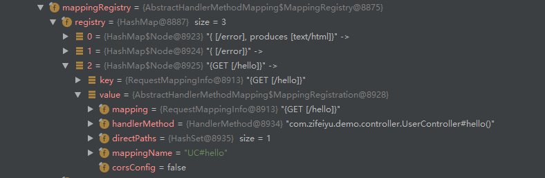

## SpringBoot
* 自动配置`Tomcat`
  * 引入Tomcat依赖
  * 配置Tomcat
* 自动配置`SpringMVC`
  * 引入SpringMVC全套组件
  * 自动配置SpringMVC常用组件（功能）
* 自动配置web场景功能，如：字符编码问题
* 默认包结构
  * `主程序`所在包及其之下所有`子包`里面的组件都会被默认扫描，无需以前的
  * 或者使用`@ComponentScan`指定扫描路径
* 各种配置拥有`默认值`
  * 默认配置最终映射到`@ConfigurationProperties`修饰的类中，类会在容器中创建对象
#### pom.xml
* `spring-boot-dependencies`: 核心依赖，在父工程中
* `spring-boot-starter`: 启动器，springboot将功能场景封装成一个个启动器，如`spring-boot-starter-web`、`spring-boot-starter-test`
#### @SpringBootApplication
标注在某个类上说明这个类是SpringBoot的主启动类
```java
@SpringBootApplication
public class SpringbootApplication {
    public static void main(String[] args) {
        // 1. 返回IOC容器
        ConfigurableApplicationContext run = SpringApplication.run(DemoApplication.class, args);
        // 2. 查看容器里注入的所有组件
        String[] names = run.getBeanDefinitionNames();
        for (String name : names) {
            System.out.println(name);
        }
        // 3. 从容器中获取组件
        User user = run.getBean("user", User.class);
    }
}
```

## SpringBoot底层注解
#### @Configuration
* 配置类中使用`@Bean`标注方法，向容器中注册`组件`，默认`单例`
* 配置类本身也是组件
* @Configuration的`proxyBeanMethod`属性表示是否`代理`Bean方法(true/false)
* 全量配置`Full`(proxyBeanMethods = true) 手动调用Bean方法时也会向容器中`检查`是否有对象
* 轻量配置`Lite`(proxyBeanMethods = false) 手动调用Bean方法时就新`创建`一个对象
```java
@Configuration // 告诉SpringBoot这是一个配置类 == 配置文件
public class MyConfig {
    
    @Bean // 向容器中添加组件，方法名为组件id，返回类型为组件类型，返回值为组件在容器中的实例
    public User user(){
        return new User("zhangsan", 18);
    }
}
```
#### @Import
用于导入组件，向`容器`中自动创建出`组件`，默认组件id为组件的`全类名`
```java
@Import({User.class})
@Configuration
public class MyConfig{
    //……
}
```
`ImportSelector`接口，返回需要导入的组件`全类名`数组
```java
public interface ImportSelector {
    // importingClassMetadata 标注了@Import的类的所有注解信息
    String[] selectImports(AnnotationMetadata importingClassMetadata);
}
```
```java
@Import({User.class, MyImportSelector.class})
@Configuration
public class MyConfig{
    //……
}
```
`ImportBeanDefinitionRegistrar`接口，手动注册组件
```java
public interface ImportBeanDefinitionRegistrar {
    /*
    * importingClassMetadata 当前被@Import修饰的类的注解信息
    * registry BeanDefinition注册类
    * 可以调用BeanDefinitionRegistry.registerBeanDefinition手动注册组件
    */
    default void registerBeanDefinitions(AnnotationMetadata importingClassMetadata, BeanDefinitionRegistry registry,
            BeanNameGenerator importBeanNameGenerator) {

        registerBeanDefinitions(importingClassMetadata, registry);
    }
}
```
```java
public class MyImportBeanDefinitionRegistrar implements ImportBeanDefinitionRegistrar {
    @Override
    public void registerBeanDefinitions(AnnotationMetadata importingClassMetadata, BeanDefinitionRegistry registry) {
        boolean condition = registry.containsBeanDefinition("user");
        if (condition) {
            RootBeanDefinition rootBeanDefinition = new RootBeanDefinition(Car.class);
            registry.registerBeanDefinition("car", rootBeanDefinition);
        }
    }
}
```
#### @Conditional
条件装配，满足Conditional指定的条件则进行组件注入
`@ConditionalOnBean`：容器中`有`指定组件则进行相应操作
`@ConditionalOnMissingBean`：容器中`没有`指定组件则进行相应操作
```java
@Configuration
@ConditionalOnBean(name = "user")// 容器中有id=user的才执行
public class MyConfig1 {

    @ConditionalOnBean(Pet.class)// 容器中有Pet组件才注册
    @Bean
    public User user(){
        return new User("zhangsan", 18);
    }
}
```
#### @ImportResource
曾经的配置文件难以迁移，允许导入`配置文件`让其中定义的组件生效
```java
@Configuration
@ImportResource("classpath:beans.xml")
public class MyConfig{
    //……
}
```
#### @ConfigurationProperties
可以将`配置文件`(application.properties)中定义的值作为组件的属性值
```properties
my.car.brand=BMW
my.car.price=100000
```
1. @Component + @ConfigurationProperties
```java
@Component
@ConfigurationProperties("my.car")
public class Car {
    private String brand;
    private int price;
    //……
}
```
2. @EnableConfigurationProperties + @ConfigurationProperties
```java
@Configuration
@EnableConfigurationProperties(Car.class)
public class MyConfig{
    //……
}

@ConfigurationProperties("my.car")
public class Car {
    private String brand;
    private int price;
    //……
}
```

## SpringBoot自动配置原理
`@SpringBootApplication`下方三个核心注解
```java
@SpringBootConfiguration
@EnableAutoConfiguration
@ComponentScan(excludeFilters = { @Filter(type = FilterType.CUSTOM, classes = TypeExcludeFilter.class),
		@Filter(type = FilterType.CUSTOM, classes = AutoConfigurationExcludeFilter.class) })
public @interface SpringBootApplication {}
```
#### @SpringBootConfiguration
本质上是一个`@Configuration`，代表当前是一个配置类
#### @EnableAutoConfiguration
```java
@AutoConfigurationPackage
@Import(AutoConfigurationImportSelector.class)
public @interface EnableAutoConfiguration {}
```
**1. @AutoConfigurationPackage**
利用`Registrar`给容器中导入`一系列组件`，制定了默认的包规则
将指定的一个包(`main所在包`)下的所有`组件`导入
```java
@Import(AutoConfigurationPackages.Registrar.class) // 给容器中导入组件
public @interface AutoConfigurationPackage {}
```
Registrar
```java
/**
* {@link ImportBeanDefinitionRegistrar} to store the base package from the importing configuration.
*/
static class Registrar implements ImportBeanDefinitionRegistrar, DeterminableImports {

    @Override
    public void registerBeanDefinitions(AnnotationMetadata metadata, BeanDefinitionRegistry registry) {
        // 利用metadata获取包名(Application所在包)，将包下的注解批量注册
        register(registry, new PackageImports(metadata).getPackageNames().toArray(new String[0]));
    }

    @Override
    public Set<Object> determineImports(AnnotationMetadata metadata) {
        return Collections.singleton(new PackageImports(metadata));
    }
}
```
**2. @Import(AutoConfigurationImportSelector.class)**
```java
public String[] selectImports(AnnotationMetadata annotationMetadata) {
    if (!isEnabled(annotationMetadata)) {
        return NO_IMPORTS;
    }
    // 获取所有自动配置的集合
    AutoConfigurationEntry autoConfigurationEntry = getAutoConfigurationEntry(annotationMetadata);
    return StringUtils.toStringArray(autoConfigurationEntry.getConfigurations());
}
```
1. `List<String> configurations = getCandidateConfigurations(annotationMetadata, attributes)`获取到所有需要导入到容器中的配置类名
   1. `List<String> configurations = SpringFactoriesLoader.loadFactoryNames(getSpringFactoriesLoaderFactoryClass(), getBeanClassLoader())`
      1. 通过调用`loadSpringFactories(ClassLoader classLoader)`返回一个`Map<String, List<String>>`，根据`FactoryClass`的name获取到对应的list，这里的name为`EnableAutoConfiguration`的全类名
         1. 扫描`META-INF/spring.factories`位置下的所有文件，如`spring-boot-autoconfigure-2.6.4.jar`下就有`META-INF/spring.factories`，文件里写死了启动时需要加载的所有配置类
2. 所有场景的自动配置在启动的时候默认全部加载，但最终会按照条件装配规则(`@Conditional`)按需配置
#### @ComponentScan
指定要扫描哪些包
#### 总结
- SpringBoot会先加载所有的自动配置类，`xxxxAutoConfiguration`
- 每个自动配置类按照条件(`@Conditional`)按需生效，配置类中的值会从`xxxxProperties`中拿，`xxxxProperties`和配置文件进行了绑定
- 生效的配置类会向容器中注册很多组件，这些注册的组件就对应实现相应功能
- 如果用户在应用中手动注册了某些组件，以用户注册的优先.
   - 用户自己使用`@Bean`替换底层组件
   - 用户去看这个组件是获取的`配置文件`的什么值，就在自己项目的配置文件中去定义对应的值

## SpringBoot Web开发
#### SpringMVC自动配置
Spring MVC自动配置类：`WebMvcAutoConfiguration`
```java
@Configuration(proxyBeanMethods = false)
@Import(EnableWebMvcConfiguration.class)
@EnableConfigurationProperties({ WebMvcProperties.class, WebProperties.class })
public static class WebMvcAutoConfigurationAdapter implements WebMvcConfigurer, ServletContextAware {}
```
`WebMvcProperties == "spring.mvc"`
`WebProperties == "spring.web"`

#### 静态资源访问
将静态资源放在类路径下的`/static` `/public` `/resources` `/META-INF/resources`目录，访问时使用当前项目`根路径/ + 静态资源名 `
原理：静态映射默认拦截了所有请求`/**`
- `spring.web.resources.add-mappings=false` ：禁用静态资源访问
- `spring.mvc.static-path-pattern=/xxx/**` ： 修改访问静态资源时请求的前缀
- `spring.web.resources.static-locations=[classpath:/xxx/]` ：修改静态资源存放的路径

- 一个请求进来先找`Controller`能不能处理，如果不能处理再交给`静态资源`处理器

在`WebMvcAutoConfiguration`中
```java
public void addResourceHandlers(ResourceHandlerRegistry registry) {
    // 是否禁用静态资源
    if (!this.resourceProperties.isAddMappings()) {
        logger.debug("Default resource handling disabled");
        return;
    }
    // 将/webjars/**请求映射到classpath:/META-INF/resources/webjars/
    addResourceHandler(registry, "/webjars/**", "classpath:/META-INF/resources/webjars/");
    // 获取spring.mvc.static-path-pattern，默认值是/**
    addResourceHandler(registry, this.mvcProperties.getStaticPathPattern(), (registration) -> {
        // 获取spring.web.resources.static-locations
        registration.addResourceLocations(this.resourceProperties.getStaticLocations());
        if (this.servletContext != null) {
            ServletContextResource resource = new ServletContextResource(this.servletContext, SERVLET_LOCATION);
            registration.addResourceLocations(resource);
        }
    });
}
```

## SpringBoot请求处理
#### REST映射
在每一个`Controller`层方法上使用
```java
@RequestMapping(value = "/user", method = RequestMethod.GET)
// 或
@GetMapping("/user")
```
声明一个请求映射
- 表单提交时只能选择`GET POST`两种请求方式，其他无法识别的请求默认按照GET处理
- 如果需要使用其他方法，需要在`POST`请求时携带`"_method"`参数，值为方法名（`PUT DELETE`）

**HiddenHttpMethodFilter**
```java
public static final String DEFAULT_METHOD_PARAMETER_NAME = "_method";

private String methodParamName = DEFAULT_METHOD_PARAMETER_NAME;

public Mono<Void> filter(ServerWebExchange exchange, WebFilterChain chain) {
    // 如果不是POST，直接放行
    if (exchange.getRequest().getMethod() != HttpMethod.POST) {
        return chain.filter(exchange);
    }
    // 提取出_method参数的值
    return exchange.getFormData()
            .map(formData -> {
                String method = formData.getFirst(this.methodParamName);
                return StringUtils.hasLength(method) ? mapExchange(exchange, method) : exchange;
            })
            .flatMap(chain::filter);
}

private ServerWebExchange mapExchange(ServerWebExchange exchange, String methodParamValue) {
    // 获取对应请求方法
    HttpMethod httpMethod = HttpMethod.resolve(methodParamValue.toUpperCase(Locale.ENGLISH));
    Assert.notNull(httpMethod, () -> "HttpMethod '" + methodParamValue + "' not supported");
    if (ALLOWED_METHODS.contains(httpMethod)) {
        return exchange.mutate().request(builder -> builder.method(httpMethod)).build();
    }
    else {
        return exchange;
    }
}
```
如果使用其他工具能直接发`PUT DELETE`方法，那就不走相关逻辑
#### 请求映射原理
所有请求到达后，都会先进入`DispatherServlet`，它是由`HttpServlet`继承而来
```
DispatcherServlet -> FrameworkServlet -> HttpServletBean -> HttpServlet
```
- 在`FrameworkServlet`中重写了`HttpServlet`的`doGet`、`doPost`、`doPut`、`doDelete`等方法，都走`processRequest(request, response)`，在内部调用`doService(request, response)`
```java
@Override
protected final void doGet(HttpServletRequest request, HttpServletResponse response) throws ServletException, IOException {
    processRequest(request, response);
}

protected final void processRequest(HttpServletRequest request, HttpServletResponse response) throws ServletException, IOException {
    // ...
    try {
        doService(request, response);
    }
    // ...
}
```
- 在`DispatcherServlet`中实现了`doService`方法，在内部调用`doDispatch(request, response)`，遍历所有`HandlerMapping`找`Handler`
```java
@Override
protected void doService(HttpServletRequest request, HttpServletResponse response) throws Exception {
    // ...
    try {
        doDispatch(request, response);
    }
    // ...
}

protected void doDispatch(HttpServletRequest request, HttpServletResponse response) throws Exception {
    // 为请求找到Controller的对应方法
    mappedHandler = getHandler(processedRequest);
    if (mappedHandler == null) {
        noHandlerFound(processedRequest, response);
        return;
    }
}

protected HandlerExecutionChain getHandler(HttpServletRequest request) throws Exception {
    if (this.handlerMappings != null) {
        // 从所有HandlerMapping找对应的Handler
        for (HandlerMapping mapping : this.handlerMappings) {
            HandlerExecutionChain handler = mapping.getHandler(request);
            if (handler != null) {
                return handler;
            }
        }
    }
    return null;
}
```
- `HandlerMapping`：处理器映射，包括`RequestMappingHandlerMapping`、`WelcomePageHandlerMapping`、`BeanNameUrlHandlerMapping`、`RouterFunctionMapping`、`SimpleUrlHandlerMapping`等
- `RequestMappingHandlerMapping`：`@RequestMapping`的处理器映射，保存了所有`@RequestMapping`和`Handler`的映射关系，具体在
```java
RequestMappingHandlerMapping -> RequestMappingInfoHandlerMapping -> 
AbstractHandlerMethodMapping.mappingRegistry.registry

private final Map<T, MappingRegistration<T>> registry = new HashMap<>();
```

- `mapping.getHandler(request)`最终会调用AbstractHandlerMethodMapping中的`getHandlerInternal(request)`方法，在内部调用`lookupHandlerMethod(lookupPath, request)`根据请求和路径找到对应的`Handler`
```java
protected HandlerMethod getHandlerInternal(HttpServletRequest request) throws Exception {
    // 获取请求路径信息("/hello")
    String lookupPath = initLookupPath(request);
    this.mappingRegistry.acquireReadLock();
    try {
        HandlerMethod handlerMethod = lookupHandlerMethod(lookupPath, request);
        return (handlerMethod != null ? handlerMethod.createWithResolvedBean() : null);
    }
    finally {
        this.mappingRegistry.releaseReadLock();
    }
}

protected HandlerMethod lookupHandlerMethod(String lookupPath, HttpServletRequest request) throws Exception {
    List<Match> matches = new ArrayList<>();
    List<T> directPathMatches = this.mappingRegistry.getMappingsByDirectPath(lookupPath);
    if (directPathMatches != null) {
        // 向matches中放入合适的Handler
        addMatchingMappings(directPathMatches, matches, request);
    }
    if (matches.isEmpty()) {
        // 没找到合适的，放入默认Handler
        addMatchingMappings(this.mappingRegistry.getRegistrations().keySet(), matches, request);
    }
    if (!matches.isEmpty()) {
        Match bestMatch = matches.get(0);
        // 一类特定请求只能被一个Handler处理
        if (matches.size() > 1) {
            // 各种复杂对比、排序...
            // 发现多个Handler，抛出异常
            throw new IllegalStateException("Ambiguous handler methods mapped for '" + uri + "': {" + m1 + ", " + m2 + "}");
        }
        request.setAttribute(BEST_MATCHING_HANDLER_ATTRIBUTE, bestMatch.getHandlerMethod());
        handleMatch(bestMatch.mapping, lookupPath, request);
        // 返回Controller对应的方法
        return bestMatch.getHandlerMethod();
    }
    else {
        return handleNoMatch(this.mappingRegistry.getRegistrations().keySet(), lookupPath, request);
    }
}
```
- 如果需要自定义映射处理，也可以实现`HandlerMapping`注册到容器中
#### 注解参数解析
在上一步中，为请求找到了特定的`Handler`，接下来，根据`Handler`找到`HandlerAdapter`
```java
// Determine handler adapter for the current request.
HandlerAdapter ha = getHandlerAdapter(mappedHandler.getHandler());
//...
// Actually invoke the handler.
mv = ha.handle(processedRequest, response, mappedHandler.getHandler());
```
- 在`getHandlerAdapter(Handler)`中，遍历所有的`HandlerAdapter`，找到支持对应`Handler`的`HandlerAdapter`，包括
- `RequestMappingHandlerAdapter`、`HandlerFunctionAdapter`、`HttpRequestHandlerAdapter`、`SimpleControllerHandlerAdapter`
```java
for (HandlerAdapter adapter : this.handlerAdapters) {
    if (adapter.supports(handler)) {
        return adapter;
    }
}
```
- `RequestMappingHandlerAdapter`：支持方法上标注`@RequestMapping`
- `HandlerFunctionAdapter`：支持函数式编程
- 一般请求默认找的都是**RequestMappingHandlerAdapter**
- 找到`HandlerAdapter`后，调用它的`handle`方法执行目标方法，返回一个`ModelAndView`
- 在`handle`方法中，调用`invokeHandlerMethod(request, response, handlerMethod)`执行目标方法
```java
ModelAndView mav;
mav = invokeHandlerMethod(request, response, handlerMethod);
```
- 在`invokeHandlerMethod`方法中，为目标方法设置**参数解析器**，用于解析目标方法的所有参数值，`HandlerMethodArgumentResolver`
```java
ServletInvocableHandlerMethod invocableMethod = createInvocableHandlerMethod(handlerMethod);
if (this.argumentResolvers != null) {
    invocableMethod.setHandlerMethodArgumentResolvers(this.argumentResolvers);
}
```
- `RequestParamMethodArgumentResolver`：处理`@RequestParam`注解
- `PathVariableMethodArgumentResolver`：处理`@PathVariable`注解
- `RequestHeaderMethodArgumentResolver`：处理`@RequestHeader`注解
- ...
- `HandlerMethodArgumentResolver`接口定义了两个方法
```java
boolean supportsParameter(MethodParameter parameter);
Object resolveArgument(MethodParameter parameter, @Nullable ModelAndViewContainer mavContainer, NativeWebRequest webRequest, @Nullable WebDataBinderFactory binderFactory) throws Exception;
```
- `supportsParameter`用于验证这个解析器是否支持该参数，`resolveArgument`用于解析该参数
- 设置完参数解析器，在`invokeHandlerMethod`方法中，为目标方法设置**返回值处理器**，用于支持目标方法多种类型的返回值，`HandlerMethodReturnValueHandler`
```java
if (this.returnValueHandlers != null) {
    invocableMethod.setHandlerMethodReturnValueHandlers(this.returnValueHandlers);
}
```
- `ModelAndViewMethodReturnValueHandler`：可以返回`ModelAndView`
- `ResponseBodyEmitterReturnValueHandler`：可以标注`@ResponseBody`
- ...
- 在设置完**参数解析器**和**返回值处理器**后，调用`invokeAndHandle`执行目标方法
```java
invocableMethod.invokeAndHandle(webRequest, mavContainer);
```
- 在`invokeAndHandle`中，调用`invokeForRequest(webRequest, mavContainer, providedArgs)`真正执行目标方法
```java
Object returnValue = invokeForRequest(webRequest, mavContainer, providedArgs);
```
```java
public Object invokeForRequest(NativeWebRequest request, @Nullable ModelAndViewContainer mavContainer, Object... providedArgs) throws Exception {
    Object[] args = getMethodArgumentValues(request, mavContainer, providedArgs);
    return doInvoke(args);
}
```
- `getMethodArgumentValues`解析目标方法的所有参数值，`doInvoke`通过反射调用目标方法
- 在`getMethodArgumentValues`中，调用`getMethodParameters()`获取方法所有参数的详细信息，包括它的位置、注解、类型等
```java
MethodParameter[] parameters = getMethodParameters();
Object[] args = new Object[parameters.length];
for (int i = 0; i < parameters.length; i++) {
    MethodParameter parameter = parameters[i];
    if (!this.resolvers.supportsParameter(parameter)) {
        throw new IllegalStateException(formatArgumentError(parameter, "No suitable resolver"));
    }
    try {
        args[i] = this.resolvers.resolveArgument(parameter, mavContainer, request, this.dataBinderFactory);
    }catch(){...}
}
return args
```
- 遍历所有参数信息，调用`this.resolvers.supportsParameter`判断当前解析器是否支持该参数，最后调用`this.resolvers.resolveArgument`解析这个参数的值
- 在`this.resolvers.supportsParameter`中，先从缓存中找，找不到就遍历所有参数解析器，看是否支持该参数，支持就加到缓存中
```java
private HandlerMethodArgumentResolver getArgumentResolver(MethodParameter parameter) {
    HandlerMethodArgumentResolver result = this.argumentResolverCache.get(parameter);
    if (result == null) {
        for (HandlerMethodArgumentResolver resolver : this.argumentResolvers) {
            if (resolver.supportsParameter(parameter)) {
                result = resolver;
                this.argumentResolverCache.put(parameter, result);
                break;
            }
        }
    }
    return result;
}
```
- 在`this.resolvers.resolveArgument`中，先调用`getArgumentResolver`获取可以处理该参数的解析器，然后调用这个解析器的`resolveArgument`解析参数
```java
public Object resolveArgument(MethodParameter parameter, @Nullable ModelAndViewContainer mavContainer, NativeWebRequest webRequest, @Nullable WebDataBinderFactory binderFactory) throws Exception {
    HandlerMethodArgumentResolver resolver = getArgumentResolver(parameter);
    return resolver.resolveArgument(parameter, mavContainer, webRequest, binderFactory);
}
```
- 在`resolver.resolveArgument`中，调用`resolveName`解析参数
```java
Object arg = resolveName(resolvedName.toString(), nestedParameter, webRequest);
```
- 以`RequestParamMethodArgumentResolver`为例，在`resolveName`中，获取到原始的`HttpServletRequest`，然后解析该request中的参数
```java
protected Object resolveName(String name, MethodParameter parameter, NativeWebRequest request) throws Exception {
    HttpServletRequest servletRequest = request.getNativeRequest(HttpServletRequest.class);
    if (servletRequest != null) {
        Object mpArg = MultipartResolutionDelegate.resolveMultipartArgument(name, parameter, servletRequest);
        if (mpArg != MultipartResolutionDelegate.UNRESOLVABLE) {
            return mpArg;
        }
    }
}
```
- 以`PathVariableMethodArgumentResolver`为例，由于`UrlPathHelper`会将路径参数解析出来放入请求域中，所以这里只需要从请求中取出对应名字的参数。
```java
protected Object resolveName(String name, MethodParameter parameter, NativeWebRequest request) throws Exception {
    Map<String, String> uriTemplateVars = (Map<String, String>) request.getAttribute(
            HandlerMapping.URI_TEMPLATE_VARIABLES_ATTRIBUTE, RequestAttributes.SCOPE_REQUEST);
    return (uriTemplateVars != null ? uriTemplateVars.get(name) : null);
}
```
#### Servlet API参数解析
除了支持注解传参，也可以把`Servlet API`当作参数传入controller层的方法中，如`HttpServletRequest`
- `Servlet API`参数由`ServletRequestMethodArgumentResolver`解析
- 在`ServletRequestMethodArgumentResolver`中，获取到原始请求并返回
```java
public Object resolveArgument(MethodParameter parameter, @Nullable ModelAndViewContainer mavContainer,
			NativeWebRequest webRequest, @Nullable WebDataBinderFactory binderFactory) throws Exception {
    Class<?> paramType = parameter.getParameterType();
    // WebRequest / NativeWebRequest / ServletWebRequest
    if (WebRequest.class.isAssignableFrom(paramType)) {
        if (!paramType.isInstance(webRequest)) {
            throw new IllegalStateException(
                    "Current request is not of type [" + paramType.getName() + "]: " + webRequest);
        }
        return webRequest;
    }
    // ServletRequest / HttpServletRequest / MultipartRequest / MultipartHttpServletRequest
    if (ServletRequest.class.isAssignableFrom(paramType) || MultipartRequest.class.isAssignableFrom(paramType)) {
        return resolveNativeRequest(webRequest, paramType);
    }
    // HttpServletRequest required for all further argument types
    return resolveArgument(paramType, resolveNativeRequest(webRequest, HttpServletRequest.class));
}
```
#### 复杂参数解析
**Map、Model**
Map和Model里的数据在目标方法执行完成后会被放入`request`请求域中，就像`request.setAttribute`
- Map和Model由`MapMethodProcessor`和`ModelMethodProcessor`解析，都会返回`mavContainer.getModel()`，它是一个`BindingAwareModelMap`对象，它既是`Model`，也是`Map`，一个请求中返回的多个`BindingAwareModelMap`实际指向的是一个对象
- `DispatcherServlet`中，目标方法执行完成后，将所有数据放在`ModelAndViewContainer`，包含要去的页面地址`View`和`Model`数据
```java
ModelAndView mv = null;
//...
// Actually invoke the handler.
mv = ha.handle(processedRequest, response, mappedHandler.getHandler());
// ...
processDispatchResult(processedRequest, response, mappedHandler, mv, dispatchException);
```
- 调用`processDispatchResult`处理派发结果，将`Model`数据放入请求域中

**RedirectAttributes**
重定向时携带数据
**ServletResponse**
Servlet API的Response

#### 自定义对象参数解析
除了`注解`、`Servlet API`、`复杂参数`，还可以将参数绑定在`自定义对象`上
- 自定义对象参数由`ServletModelAttributeMethodProcessor`解析(判断参数类型是否为`简单类型`，不是简单类型则进行解析)
- `ServletModelAttributeMethodProcessor`的`resolveArgument`中，会调用`createAttribute`创建一个空对象，类型即为参数类型
```java
// ...
Object attribute = null;
BindingResult bindingResult = null;
// ...
attribute = createAttribute(name, parameter, binderFactory, webRequest);
// ...
if (bindingResult == null) {
    WebDataBinder binder = binderFactory.createBinder(webRequest, attribute, name);
    if (binder.getTarget() != null) {
        if (!mavContainer.isBindingDisabled(name)) {
            bindRequestParameters(binder, webRequest);
        }
        // ...
    }
    // ...
    bindingResult = binder.getBindingResult();
}
```
- 调用`binderFactory.createBinder`创建`WebDataBinder`对象，作用是将`请求参数`中的值绑定到指定的`JavaBean`里面
- 调用`bindRequestParameters(binder, webRequest)`绑定参数，其中`webRequest`是原始请求
- 参数绑定的过程中需要进行类型转换，`GenericConversionService`根据`源类型`和`目标类型`获取到对应的`Converter`，进行转换
- 如果要自定义`Converter<S, T>`，在自定义的`WebMvcConfigurer`下重写`addFormatters(FormatterRegistry registry)`，在里面调用`registry.addConverter(myConverter)`

## SpringBoot响应处理
#### 响应JSON
jakson + @ResponseBody
- 在`RequestMappingHandlerAdapter`的`invokeHandlerMethod`中，为目标方法设置了**参数解析器**和**返回值处理器**
```java
ServletInvocableHandlerMethod invocableMethod = createInvocableHandlerMethod(handlerMethod);
if (this.argumentResolvers != null) {
    invocableMethod.setHandlerMethodArgumentResolvers(this.argumentResolvers);
}
if (this.returnValueHandlers != null) {
    invocableMethod.setHandlerMethodReturnValueHandlers(this.returnValueHandlers);
}
// ...
invocableMethod.invokeAndHandle(webRequest, mavContainer);
```
- 返回值处理器`HandlerMethodReturnValueHandler`接口定义了两个方法
```java
boolean supportsReturnType(MethodParameter returnType);
```
- 用于判断该返回值处理器是否支持特定的返回参数类型
```java
void handleReturnValue(@Nullable Object returnValue, MethodParameter returnType ModelAndViewContainer mavContainer, NativeWebRequest webRequest) throws Exception;
```
- 用于对返回值进行处理
- 接下来调用`invocableMethod.invokeAndHandle(webRequest, mavContainer)`执行目标方法
```java
public void invokeAndHandle(ServletWebRequest webRequest, ModelAndViewContainer mavContainer, Object... providedArgs) throws Exception {
    Object returnValue = invokeForRequest(webRequest, mavContainer, providedArgs);
    setResponseStatus(webRequest);
    //...
    try {
        this.returnValueHandlers.handleReturnValue(returnValue, getReturnValueType(returnValue), mavContainer, webRequest);
    }
    catch (Exception ex) {...}
}
```
- 在`invokeAndHandle`中调用`this.returnValueHandlers.handleReturnValue`进行返回值处理
```java
public void handleReturnValue(@Nullable Object returnValue, MethodParameter returnType, ModelAndViewContainer mavContainer, NativeWebRequest webRequest) throws Exception {
    HandlerMethodReturnValueHandler handler = selectHandler(returnValue, returnType);
    handler.handleReturnValue(returnValue, returnType, mavContainer, webRequest);
}
```
- `selectHandler`根据`返回值`和`返回类型`寻找合适的返回值处理器
- `handleReturnValue`使用获取到的`返回值处理器`对返回值进行处理
```java
private HandlerMethodReturnValueHandler selectHandler(@Nullable Object value, MethodParameter returnType) {
    boolean isAsyncValue = isAsyncReturnValue(value, returnType);
    for (HandlerMethodReturnValueHandler handler : this.returnValueHandlers) {
        if (isAsyncValue && !(handler instanceof AsyncHandlerMethodReturnValueHandler)) {
            continue;
        }
        if (handler.supportsReturnType(returnType)) {
            return handler;
        }
    }
    return null;
}
```
- 在`selectHandler`中，遍历所有的返回值处理器，调用`handler.supportsReturnType`判断则个返回值处理器是否支持当前返回类型，从而找到合适的返回值处理器
- `ModelAndViewMethodReturnValueHandler`用于处理`ModelAndView`类型的返回值
- `RequestResponseBodyMethodProcessor`用于处理有`@ResponseBody`注解修饰的返回值
- ...
```java
public void handleReturnValue(@Nullable Object returnValue, MethodParameter returnType,
        ModelAndViewContainer mavContainer, NativeWebRequest webRequest)
        throws IOException, HttpMediaTypeNotAcceptableException, HttpMessageNotWritableException {
    mavContainer.setRequestHandled(true);
    ServletServerHttpRequest inputMessage = createInputMessage(webRequest);
    ServletServerHttpResponse outputMessage = createOutputMessage(webRequest);
    writeWithMessageConverters(returnValue, returnType, inputMessage, outputMessage);
}
```
- 在`RequestResponseBodyMethodProcessor`的`handleReturnValue`中，调用`writeWithMessageConverters`处理返回值，将数据写为`json`
```java
protected <T> void writeWithMessageConverters(@Nullable T value, MethodParameter returnType, ServletServerHttpRequest inputMessage, ServletServerHttpResponse outputMessage) throws IOException, HttpMediaTypeNotAcceptableException, HttpMessageNotWritableException {
    if (isResourceType(value, returnType)) {
        // 处理流数据
    }
    MediaType selectedMediaType = null;
    MediaType contentType = outputMessage.getHeaders().getContentType();
    boolean isContentTypePreset = contentType != null && contentType.isConcrete();
    if (isContentTypePreset) {
        // 已经获取到了内容类型
    }else {
        HttpServletRequest request = inputMessage.getServletRequest();
        // 浏览器能接收哪些内容类型
        List<MediaType> acceptableTypes = getAcceptableMediaTypes(request);
        // 服务请能生成哪些内容类型
        List<MediaType> producibleTypes = getProducibleMediaTypes(request, valueType, targetType);
        // 将两者进行匹配，匹配成功的放入mediaTypesToUse
        List<MediaType> mediaTypesToUse = new ArrayList<>();
        for (MediaType requestedType : acceptableTypes) {
            for (MediaType producibleType : producibleTypes) {
                if (requestedType.isCompatibleWith(producibleType)) {
                    mediaTypesToUse.add(getMostSpecificMediaType(requestedType, producibleType));
                }
            }
        }
        // 为selectedMediaType赋值
        for (MediaType mediaType : mediaTypesToUse) {
            if (mediaType.isConcrete()) {
                selectedMediaType = mediaType;
                break;
            }
            else if (mediaType.isPresentIn(ALL_APPLICATION_MEDIA_TYPES)) {
                selectedMediaType = MediaType.APPLICATION_OCTET_STREAM;
                break;
            }
        }
    }
    if (selectedMediaType != null) {
        // 遍历消息转换器，看哪个消息转换器能用于该种内容类型的转换
        for (HttpMessageConverter<?> converter : this.messageConverters) {
            GenericHttpMessageConverter genericConverter = (converter instanceof GenericHttpMessageConverter ? (GenericHttpMessageConverter<?>) converter : null);
            // 调用converter的canWrite方法查看该消息转换器是否支持从valueType到selectedMediaType的转换
            if (genericConverter != null  ((GenericHttpMessageConverter) converter).canWrite(targetType, valueType, selectedMediaType) : converter.canWrite(valueType, selectedMediaType)) {
                if (genericConverter != null) {
                    // 调用converter的write方法进行转换
                    genericConverter.write(body, targetType, selectedMediaType, outputMessage);
                } else {
                    ((HttpMessageConverter) converter).write(body, selectedMediaType, outputMessage);
                }
            }
        }
    }
}
```
- 消息转换器`HttpMessageConverter`接口定义的其中两个方法
```java
boolean canRead(Class<?> clazz, @Nullable MediaType mediaType);
```
- 用于判断能否将`mediaType`（json等）转为`clazz`
```java
boolean canWrite(Class<?> clazz, @Nullable MediaType mediaType);
```
- 用于判断能否将`clazz`转为`mediaType`（json等）
- `StringHttpMessageConverter`支持`String`类型的返回值
- `StringHttpMessageConverter`支持`MultiValueMap`类型的返回值
- `MappingJackson2HttpMessageConverter`支持`所有`返回类型
- ...
- 在消息转换器`AbstractHttpMessageConverter`的`canWrite`中，获取所有支持的`mediaType`，和浏览器提供的`mediaType`比较，看是否能够匹配
```java
protected boolean canWrite(@Nullable MediaType mediaType) {
    for (MediaType supportedMediaType : getSupportedMediaTypes()) {
        if (supportedMediaType.isCompatibleWith(mediaType)) {
            return true;
        }
    }
    return false;
}
```
- 在`AbstractGenericHttpMessageConverter`的`write`方法中，最后调用`writeInternal(t, type, outputMessage)`将`type`类型的`t`对象写入`outputMessage`
```java
public final void write(final T t, @Nullable final Type type, @Nullable MediaType contentType, HttpOutputMessage outputMessage) throws IOException, HttpMessageNotWritableException {
    final HttpHeaders headers = outputMessage.getHeaders();
    addDefaultHeaders(headers, t, contentType);
    // 添加一些默认的请求头
    if (outputMessage instanceof StreamingHttpOutputMessage) {
        // ...
    }
    else {
        writeInternal(t, type, outputMessage);
        outputMessage.getBody().flush();
    }
}
```
- 以`MappingJackson2HttpMessageConverter`为例，它的`writeInternal`方法就是调用`jackson`框架将对象转化为`json`

#### 内容协商
HTTP协议会以`请求头`的方式告诉服务请他可以接受什么样的内容类型，q值代表权重
```properties
Accept: text/html,application/xhtml+xml,application/xml;q=0.9,image/avif,image/webp,image/apng,*/*;q=0.8,application/signed-exchange;v=b3;q=0.9
```
- 可以通过改变`Accept`的值来获得不同类型的返回值
- 在上一步中知道，在进行返回值转换时会分别获取`浏览器`能接收哪些内容类型和`服务器`能生成哪些内容类型
```java
// 浏览器能接收哪些内容类型
List<MediaType> acceptableTypes = getAcceptableMediaTypes(request);
// 服务请能生成哪些内容类型
List<MediaType> producibleTypes = getProducibleMediaTypes(request, valueType, targetType);
```
- 在`getAcceptableMediaTypes`中，最终会调用`HeaderContentNegotiationStrategy`的`resolveMediaTypes`获取`浏览器`能接收哪些内容类型
```java
public List<MediaType> resolveMediaTypes(NativeWebRequest request) throws HttpMediaTypeNotAcceptableException {
    // 获取header里的Accept数据
    String[] headerValueArray = request.getHeaderValues(HttpHeaders.ACCEPT);
    if (headerValueArray == null) {
        return MEDIA_TYPE_ALL_LIST;
    }
    // 数据处理
    List<String> headerValues = Arrays.asList(headerValueArray);
    try {
        List<MediaType> mediaTypes = MediaType.parseMediaTypes(headerValues);
        MediaType.sortBySpecificityAndQuality(mediaTypes);
        return !CollectionUtils.isEmpty(mediaTypes) ? mediaTypes : MEDIA_TYPE_ALL_LIST;
    }
    catch (InvalidMediaTypeException ex) {...}
}
```
- `resolveMediaTypes`会从请求中获取请求头的`Accept`数据进行解析
- 在`getProducibleMediaTypes`中，遍历所有的消息转换器`HttpMessageConverter`，调用它的`canWrite`方法判断能否将源类型转换为目标类型，将找到的`converter`调用`getSupportedMediaTypes`获取它支持的所有`MediaTypes`放到`result`里
```java
protected List<MediaType> getProducibleMediaTypes(HttpServletRequest request, Class<?> valueClass, @Nullable Type targetType) {
    // ...
    List<MediaType> result = new ArrayList<>();
    // 遍历所有HttpMessageConverter
    for (HttpMessageConverter<?> converter : this.messageConverters) {
        if (converter instanceof GenericHttpMessageConverter && targetType != null) {
            // 调用canWrite方法
            if (((GenericHttpMessageConverter<?>) converter).canWrite(targetType, valueClass, null)) {
                // 调用getSupportedMediaTypes方法
                result.addAll(converter.getSupportedMediaTypes(valueClass));
            }
        }
        else if (converter.canWrite(valueClass, null)) {
            result.addAll(converter.getSupportedMediaTypes(valueClass));
        }
    }
    return (result.isEmpty() ? Collections.singletonList(MediaType.ALL) : result);
}
```
- 最后将`acceptableTypes`和`producibleTypes`两者进行匹配，选取最佳`converter`
```java
List<MediaType> mediaTypesToUse = new ArrayList<>();
for (MediaType requestedType : acceptableTypes) {
    for (MediaType producibleType : producibleTypes) {
        if (requestedType.isCompatibleWith(producibleType)) {
            mediaTypesToUse.add(getMostSpecificMediaType(requestedType, producibleType));
        }
    }
}
// 为selectedMediaType赋值
for (MediaType mediaType : mediaTypesToUse) {
    if (mediaType.isConcrete()) {
        selectedMediaType = mediaType;
        break;
    }
    else if (mediaType.isPresentIn(ALL_APPLICATION_MEDIA_TYPES)) {
        selectedMediaType = MediaType.APPLICATION_OCTET_STREAM;
        break;
    }
}
```
#### 基于请求参数的内容协商
浏览器发送的请求默认无法修改请求头信息
- 开启基于请求参数的内容协商
```properties
spring.mvc.contentnegotiation.favor-parameter: true
```
- 在请求中带上参数`format`，里面指定数据类型，如`format=xml`、`format=json`
- 之前在获取`浏览器`能接收哪些内容类型时，只有一种基于`请求头`的内容协商策略`HeaderContentNegotiationStrategy`，现在多了一个基于`请求参数`的内容协商策略`ParameterContentNegotiationStrategy`
- `ParameterContentNegotiationStrategy`会从请求中获取请求参数的`format`值，再查找映射得到对应的`MediaType`
- 多个内容协商策略同时存在时，只要有一个策略能找到精确匹配的MediaType，就返回
```java
public List<MediaType> resolveMediaTypes(NativeWebRequest request) throws HttpMediaTypeNotAcceptableException {
    for (ContentNegotiationStrategy strategy : this.strategies) {
        List<MediaType> mediaTypes = strategy.resolveMediaTypes(request);
        // 如果得到的结果是 */* ，继续遍历
        if (mediaTypes.equals(MEDIA_TYPE_ALL_LIST)) {
            continue;
        }
        return mediaTypes;
    }
    return MEDIA_TYPE_ALL_LIST;
}
```
#### 自定义MessageConverter
- 如果要自定义`MessageConverter`，在自定义的`WebMvcConfigurer`下重写`extendMessageConverters(List<HttpMessageConverter<?>> converters)`
#### 自定义ContentNegotiationStrategy
- 如果要自定义`ContentNegotiationStrategy`，在自定义的`WebMvcConfigurer`下重写`configureContentNegotiation(ContentNegotiationConfigurer configurer)`，在里面调用`configurer.strategies(List<ContentNegotiationStrategy> strategies)`

## SpringBoot 拦截器
HandlerInterceptor接口定义了三个方法：
```java
boolean preHandle(HttpServletRequest request, HttpServletResponse response, Object handler)
```
- 目标方法执行之前
```java
void postHandle(HttpServletRequest request, HttpServletResponse response, Object handler, @Nullable ModelAndView modelAndView)
```
- 目标方法执行之后
```java
void afterCompletion(HttpServletRequest request, HttpServletResponse response, Object handler, @Nullable Exception ex)
```
- 页面渲染完成之后
#### 自定义拦截器
- 定义自己的拦截器，实现`HandlerInterceptor`
```java
public class MyInterceptor implements HandlerInterceptor {

    @Override
    public boolean preHandle(HttpServletRequest request, HttpServletResponse response, Object handler) throws Exception {
        return false;
    }

    @Override
    public void postHandle(HttpServletRequest request, HttpServletResponse response, Object handler, ModelAndView modelAndView) throws Exception {

    }

    @Override
    public void afterCompletion(HttpServletRequest request, HttpServletResponse response, Object handler, Exception ex) throws Exception {

    }
}
```
- 在自定义的配置类里注册自定义的拦截器，配置拦截规则
```java
@Configuration
public class MyConfiguration implements WebMvcConfigurer {
    @Override
    public void addInterceptors(InterceptorRegistry registry) {
        registry.addInterceptor(new MyInterceptor())
                .addPathPatterns("/**") // 拦截所有请求，包括静态资源请求
                .excludePathPatterns("/", "/login");
    }
}
```
#### 拦截器原理
- 在`DispatcherServlet`的`doDispatch`中
```java
HandlerExecutionChain mappedHandler = null;
// ...
mappedHandler = getHandler(processedRequest);
```
- 为当前请求获取`Handler`，`HandlerExecutionChain.interceptorList`中放有所有的`HandlerInterceptor`
```java
public class HandlerExecutionChain {
    // ...
    private final Object handler;

    private final List<HandlerInterceptor> interceptorList = new ArrayList<>();
    // ...
}
```
- 在目标方法执行前，会执行`mappedHandler.applyPreHandle`；目标方法执行之后，会执行`mappedHandler.applyPostHandle`
```java
if (!mappedHandler.applyPreHandle(processedRequest, response)) {
    return; // 如果有拦截器返回false，不执行目标方法
}
// Actually invoke the handler.
mv = ha.handle(processedRequest, response, mappedHandler.getHandler());
// ...
mappedHandler.applyPostHandle(processedRequest, response, mv);
```
- 在`applyPreHandle`中，顺序遍历拦截器，执行拦截器的`preHandle`方法
```java
boolean applyPreHandle(HttpServletRequest request, HttpServletResponse response) throws Exception {
    for (int i = 0; i < this.interceptorList.size(); i++) {
        HandlerInterceptor interceptor = this.interceptorList.get(i);
        if (!interceptor.preHandle(request, response, this.handler)) {
            triggerAfterCompletion(request, response, null);
            return false;
        }
        this.interceptorIndex = i;
    }
    return true;
}
```
- 如果在执行过程中，有拦截器返回`false`，则调用`triggerAfterCompletion`
```java
void triggerAfterCompletion(HttpServletRequest request, HttpServletResponse response, @Nullable Exception ex) {
    for (int i = this.interceptorIndex; i >= 0; i--) {
        HandlerInterceptor interceptor = this.interceptorList.get(i);
        try {
            interceptor.afterCompletion(request, response, this.handler, ex);
        }
        catch (Throwable ex2) {
            logger.error("HandlerInterceptor.afterCompletion threw exception", ex2);
        }
    }
}
```
- 倒序遍历已经执行的拦截器，调用拦截器的`afterCompletion`方法
- 在`applyPostHandle`中，倒序遍历拦截器，执行拦截器的`postHandle`方法
```java
void applyPostHandle(HttpServletRequest request, HttpServletResponse response, @Nullable ModelAndView mv) throws Exception {
    for (int i = this.interceptorList.size() - 1; i >= 0; i--) {
        HandlerInterceptor interceptor = this.interceptorList.get(i);
        interceptor.postHandle(request, response, this.handler, mv);
    }
}
```
- 在任何步骤产生异常，都会触发`triggerAfterCompletion`
- 在`DispatcherServlet`的`processDispatchResult`中，页面渲染完成之后，调用`mappedHandler.triggerAfterCompletion`
```java
void triggerAfterCompletion(HttpServletRequest request, HttpServletResponse response, @Nullable Exception ex) {
    for (int i = this.interceptorIndex; i >= 0; i--) {
        HandlerInterceptor interceptor = this.interceptorList.get(i);
        try {
            interceptor.afterCompletion(request, response, this.handler, ex);
        }
        catch (Throwable ex2) {
            logger.error("HandlerInterceptor.afterCompletion threw exception", ex2);
        }
    }
}
```
- 在`triggerAfterCompletion`中，倒序遍历所有拦截器，执行拦截器的`afterCompletion`方法

## SpringBoot 文件上传
#### 文件上传实现
- 在`Controller`层使用`@RequestPart`和`MultipartFile`接收文件，可以支持单文件和多文件
```java
@PostMapping("/upload")
public String upload(@RequestPart("img") MultipartFile img,
                    @RequestPart("imgs") MultipartFile[] imgs) throws IOException {
    if(!img.isEmpty()){
        String filename = img.getOriginalFilename();
        // 文件保存
        img.transferTo(new File("D:\\photos\\" + filename));
    }
    return "";
}
```
- 在`MultipartAutoConfiguration`中定义了关于文件上传的配置，绑定了`MultipartProperties`，配置前缀为`spring.servlet.multipart`
- 使用`spring.servlet.multipart.max-file-size`定义单个文件大小，默认1MB
- 使用`spring.servlet.multipart.max-request-size`定义请求总大小，默认10MB
#### 文件上传原理 - 文件参数解析器
- 在`MultipartAutoConfiguration`中自动配置了`StandardServletMultipartResolver`(文件上传解析器)
- 在`DispatcherServlet`的`doDispatch`中，首先调用`checkMultipart`判断当前请求是否是一个文件上传请求
```java
HttpServletRequest processedRequest = request;
boolean multipartRequestParsed = false;
// ...
processedRequest = checkMultipart(request);
multipartRequestParsed = (processedRequest != request);
```
- 在`checkMultipart`中，使用文件上传解析器`MultipartResolver`，首先调用它的`isMultipart`方法，判断当前请求是否是文件上传请求；然后调用它的`resolveMultipart`处理该请求
```java
protected HttpServletRequest checkMultipart(HttpServletRequest request) throws MultipartException {
    if (this.multipartResolver != null && this.multipartResolver.isMultipart(request)) {
        // ...
        try {
            return this.multipartResolver.resolveMultipart(request);
        }
        catch (MultipartException ex) {...}
    }
    // If not returned before: return original request.
    return request;
}
```
- 在`isMultipart`中，通过判断请求的内容类型`(Content-Type)`是否以`"multipart/"`开头来判断该请求是否为一个文件上传请求
```java
public boolean isMultipart(HttpServletRequest request) {
    return StringUtils.startsWithIgnoreCase(request.getContentType(),
            (this.strictServletCompliance ? MediaType.MULTIPART_FORM_DATA_VALUE : "multipart/"));
}
```
- 在`resolveMultipart`中，将原始请求封装为`StandardMultipartHttpServletRequest`对象
```java
public MultipartHttpServletRequest resolveMultipart(HttpServletRequest request) throws MultipartException {
    return new StandardMultipartHttpServletRequest(request, this.resolveLazily);
}
```
- 在`StandardMultipartHttpServletRequest`对象创建过程中，调用`parseRequest`解析原始请求
```java
public StandardMultipartHttpServletRequest(HttpServletRequest request, boolean lazyParsing) throws MultipartException {
    super(request);
    if (!lazyParsing) {
        parseRequest(request);
    }
}
```
- 在`parseRequest`中，通过`request.getParts()`获取原始请求中的文件信息`(Part对象)`，这是sevlet提供的方法，遍历所有文件将`Part`封装为`MultipartFile`，调用`part.getName()`获取请求参数名，根据参数名和`MultipartFile`的映射关系放入`MultiValueMap<String, MultipartFile> files`，最后调用`setMultipartFiles(files)`将这个映射关系存入`this.multipartFiles`
- `MultiValueMap`是spring定义的一个数据结构，它的`value`是一个`list`，可以存放多个元素
```java
private void parseRequest(HttpServletRequest request) {
    try {
        // 获取原始请求的文件信息
        Collection<Part> parts = request.getParts();
        this.multipartParameterNames = new LinkedHashSet<>(parts.size());
        // 
        MultiValueMap<String, MultipartFile> files = new LinkedMultiValueMap<>(parts.size());
        // 遍历这些文件，放入files中
        for (Part part : parts) {
            String headerValue = part.getHeader(HttpHeaders.CONTENT_DISPOSITION);
            ContentDisposition disposition = ContentDisposition.parse(headerValue);
            String filename = disposition.getFilename();
            if (filename != null) {
                if (filename.startsWith("=?") && filename.endsWith("?=")) {
                    filename = MimeDelegate.decode(filename);
                }
                // 记录参数名与MultipartFile的映射关系
                files.add(part.getName(), new StandardMultipartFile(part, filename));
            }
            else {
                this.multipartParameterNames.add(part.getName());
            }
        }
        // 将映射关系存入this.multipartFiles
        setMultipartFiles(files);
    }
    catch (Throwable ex) {
        handleParseFailure(ex);
    }
}
```
- 继续执行目标方法，在参数解析这一步，`@RequestPart`修饰的参数由`RequestPartMethodArgumentResolver`解析，将请求中的文件内容封装成`MultipartFile`
- 在`RequestPartMethodArgumentResolver`的`resolveArgument`中，调用 `MultipartResolutionDelegate.resolveMultipartArgument`处理文件参数
```java
HttpServletRequest servletRequest = request.getNativeRequest(HttpServletRequest.class);
RequestPart requestPart = parameter.getParameterAnnotation(RequestPart.class);
String name = getPartName(parameter, requestPart); // 获取参数名称
Object arg = null;
Object mpArg = MultipartResolutionDelegate.resolveMultipartArgument(name, parameter, servletRequest);
if (mpArg != MultipartResolutionDelegate.UNRESOLVABLE) {
    arg = mpArg;
}
// ...
```
- 在`resolveMultipartArgument`中，调用`StandardMultipartHttpServletRequest`的`getFile(name)`、`getFiles(name)`获取文件
```java
public static Object resolveMultipartArgument(String name, MethodParameter parameter, HttpServletRequest request) throws Exception {
    if (MultipartFile.class == parameter.getNestedParameterType()) {
        // 单文件
        return multipartRequest.getFile(name);
    }else if (isMultipartFileCollection(parameter)) {
        // 文件集合
        List<MultipartFile> files = multipartRequest.getFiles(name);
        return (!files.isEmpty() ? files : null);
    }else if (isMultipartFileArray(parameter)) {
        //文件数组
        List<MultipartFile> files = multipartRequest.getFiles(name);
        return (!files.isEmpty() ? files.toArray(new MultipartFile[0]) : null);
    }// ...
}
```
- 在`getFile(name)`、`getFiles(name)`中，由于`StandardMultipartHttpServletRequest`初始化的时候已经将请求参数名和文件的映射关系放在了一个`MultiValueMap<String, MultipartFile>`结构中，直接调用`getFirst(name)`、`get(name)`获取文件集合
```java
@Override
public MultipartFile getFile(String name) {
    return getMultipartFiles().getFirst(name);
}

@Override
public List<MultipartFile> getFiles(String name) {
    List<MultipartFile> multipartFiles = getMultipartFiles().get(name);
    if (multipartFiles != null) {
        return multipartFiles;
    }
    else {
        return Collections.emptyList();
    }
}
```

## SpringBoot 异常处理
SpringBoot使用`/error`处理所有错误，浏览器客户端会返回一个错误`页面`，其他客户端会返回一个包含错误信息的`JSON`
#### 异常处理原理
在`ErrorMvcAutoConfiguration`中自动配置了异常处理
- 向容器中注册了`BasicErrorController`，处理`/error`路径的请求，如果是浏览器请求，返回`ModelAndView("error", model)`；否则返回一个`JSON`
- 向容器中注册一个名为`"error"`的`View`
- 在`DispatchServlet的doDispatch`中，执行目标方法全过程产生的异常会被catch住放在`dispatchException`，最后调用`processDispatchResult`
```java
try{
    // ...
    HandlerAdapter ha = getHandlerAdapter(mappedHandler.getHandler());
    // ...
    mv = ha.handle(processedRequest, response, mappedHandler.getHandler());
    // ...
}catch (Exception ex) {
    dispatchException = ex;
}catch (Throwable err) {
    dispatchException = new NestedServletException("Handler dispatch failed", err);
}
processDispatchResult(processedRequest, response, mappedHandler, mv, dispatchException);
```
- 在`processDispatchResult`中，调用`processHandlerException`处理异常
```java
private void processDispatchResult(HttpServletRequest request, HttpServletResponse response, @Nullable HandlerExecutionChain mappedHandler, @Nullable ModelAndView mv, @Nullable Exception exception) throws Exception {
    if (exception != null) {
        if (exception instanceof ModelAndViewDefiningException) {
            // ...
        }
        else {
            Object handler = (mappedHandler != null ? mappedHandler.getHandler() : null);
            mv = processHandlerException(request, response, handler, exception);
            errorView = (mv != null);
        }
    }
    // ...
}
```
- 在`processHandlerException`中，遍历`HandlerExceptionResolver`，调用它的`resolveException`处理异常
```java
protected ModelAndView processHandlerException(HttpServletRequest request, HttpServletResponse response, @Nullable Object handler, Exception ex) throws Exception {
    ModelAndView exMv = null;
    if (this.handlerExceptionResolvers != null) {
        for (HandlerExceptionResolver resolver : this.handlerExceptionResolvers) {
            exMv = resolver.resolveException(request, response, handler, ex);
            if (exMv != null) {
                break;
            }
        }
    }
    if (exMv != null) {
        // ...
        return exMv;
    }
    throw ex;
}
```
- 默认没有`HandlerExceptionResolver`能处理异常，最后会被抛出，servlet底层会发送`/error`请求

## SpringBoot 定制化
web应用，实现`WebMvcConfigurer`，使用`@Configuration`修饰，在里面重写方法

## 最佳实践
- 引入相关场景依赖
- 查看有哪些自动配置（配置文件中定义`debug=true`），是否需要修改
#### Lombok
简化`java bean`开发
```xml
<dependency>
    <groupId>org.projectlombok</groupId>
    <artifactId>lombok</artifactId>
</dependency>
```
- `@Data`生成getter setter
- `@ToString`生成toString方法
- `@AllargsConstructor`生成有参构造器
- `@NoArgsConstructor`生成无参构造器
- `@EqualsAndHashCode`重新Equals和hashCode方法
- `Slf4j`注入日志类，`"log.info()"`
#### dev tools
热部署
```xml
<dependency>
    <groupId>org.springframework.boot</groupId>
    <artifactId>spring-boot-devtools</artifactId>
    <optional>true</optional>
</dependency>
```
#### Spring Initializr
idea 快速创建
#### yaml
除了默认在`resources`目录下的`application.properties`文件，还可以使用`yaml`文件，使用`@ConfigurationProperties(prefix = "xxx")`和文件内的指定前缀相绑定，`properties`文件优先级比`yaml`高
- `key: value` kv之间有空格，大小写敏感
- 使用`缩进`表示层级关系
- 字符串无需加引号，如果要加，`'\n'`会将\n作为字符串输出、`"\n"`会将\n作为换行符输出

**对象**
```yaml
# 行内写法
k: {k1: v1, k2: v2, k3: v3}
# 一般写法
k:
  k1: v1
  k2: v2
  k3: v3
```
**数组**
```yaml
# 行内写法
k: [v1, v2, v3]
# 一般写法
k:
  - v1
  - v2
  - v3
```
#### 配置提示
导入`configuration-processor`编写配置文件绑定自定义类的时候会有提示
```xml
<dependency>
    <groupId>org.springframework.boot</groupId>
    <artifactId>spring-boot-configuration-processor</artifactId>
    <optional>true</optional>
</dependency>
```
#### 常用参数注解
**@PathVariable** 获取路径参数
```java
@GetMapping("/getUser/{id}")
public Map<String, Object> getUser(@PathVariable("id") int id) {
    // ...
}
```
**@RequestHeader** 获取请求头
```java
@GetMapping("/getUser")
public Map<String, Object> getUser(@RequestHeader("User-Agent") String userAgent,
                                   @RequestHeader HttpHeaders httpHeaders) {
   // 可以直接使用org.springframework.http.HttpHeaders类绑定请求头信息
}
```
**@RequestParam** 获取请求参数
```java
@GetMapping("/getUser")
public Map<String, Object> getUser(@RequestParam("age") Integer age) {
    // 获取/getUser?age=xxx的参数
}
```
**@CookieValue** 获取Cookie信息
```java
@GetMapping("/getUser")
public Map<String, Object> getUser(@CookieValue("_ga") String ga,
                                   @CookieValue Cookie cookie) {
    // 可以直接使用javax.servlet.http.Cookie类绑定Cookie信息
    String name = cookie.getName(); // _ga
    String value = cookie.getValue();
}
```
**@RequestBody** 获取POST请求时的表单信息
```java
@PostMapping("/getUser")
public Map<String, Object> postUser(@RequestBody User user) {
    // 和自定义类绑定
}
```
**@RequestAttribute** 获取请求域中的参数
**@ResponseBody** 将Java对象的返回值解析为浏览器能获取的数据类型
```java
@GetMapping("/goto")
public String goToSuccess(HttpServletRequest request) {
    request.setAttribute("msg", "succ");
    return "forward:/success"; // 将请求转发到 /success
}

@ResponseBody
@GetMapping("/success")
public Map<String, Object> success(@RequestAttribute("msg") String msg,
                                   HttpServletRequest request) {
    Object msg1 = request.getAttribute("msg");
    return new HashMap<>();
}
```
**@MatrixVariable** 获取矩阵变量，SpringBoot默认`禁用`矩阵变量(`UrlPathHelper`解析的时候会把路径分号信息移除)
```java
// /users/1;age=18;name=zhangsan
@GetMapping("/users/{id}")
public Map<String, Object> users(@MatrixVariable("age") Integer age,
                                 @MatrixVariable("name") String name) {
    // ...
}
```