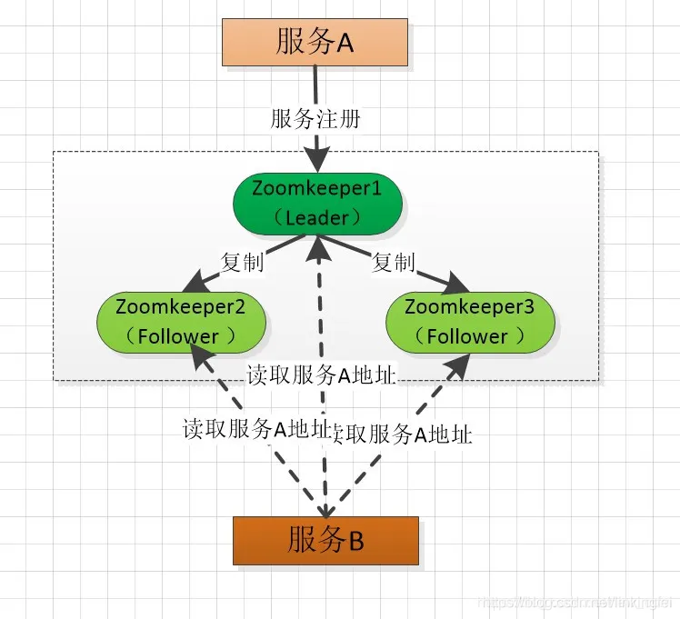

## 什么是分布式系统
分布式是相对`中心化`而来，强调的是任务在`多个`物理隔离的节点上进行。中心化带来的主要问题是可靠性，若中心节点宕机则整个系统不可用，分布式除了解决部分中心化问题，也倾向于`分散负载`，但分布式会带来很多的其他问题，最主要的就是`一致性`。
`集群`就是逻辑上处理同一任务的机器集合，可以属于同一机房，也可分属不同的机房。分布式这个概念可以运行在某个集群里面，某个集群也可作为分布式概念的一个节点。
- **分布式**：`不同`的业务模块部署在不同的服务器上或者同一个业务模块分拆多个子业务，部署在不同的服务器上，解决`高并发`的问题
- **集群**：`同一`个业务部署在多台机器上，提高系统`可用性`

## 分布式要点
#### CAP
CAP 理论的定义很简单，CAP 三个字母分别代表了分布式系统中三个`相互矛盾`的属性：
- **Consistency(一致性)**：每时每刻每个节点上的同一份数据都是一致的。这就要求任何更新都是原子的，即要么全部成功，要么全部失败。
- **Availiablity(可用性)**：每个请求都能接受到一个响应。换个说法：任意时刻系统都可以提供读写服务
- **Partition(分区容错)**：分布式系统中的某个节点或者网络分区出现了故障的时候，整个系统仍然能对外提供满足一致性和可用性的服务。也就是说部分故障不影响整体使用。

CAP 理论指出：无法设计一种分布式协议，使得`同时`完全具备CAP三个属性，即1)该种协议下的副本始终是强一致性，2)服务始终是可用的，3)协议可以容忍任何网络分区异常；分布式系统协议只能在CAP这三者间所有折中。在分布式系统中，是必须要求系统能够分区容错的，所以，必须满足`分区容错性`。因此，`一致性`和`可用性`就需要根据系统需求二选一了。
#### Paxos协议
Paxos协议是少数在工程实践中证实的`强一致性`、`高可用`的去中心化分布式协议。Paxos协议的流程较为复杂，但其基本思想却不难理解，类似于人类社会的`投票`过程。Paxos协议中，有一组完全`对等`的参与节点（称为accpetor），这组节点各自就某一事件做出决议，如果某个决议获得了`超过半数`节点的同意则生效。Paxos协议中只要有超过一半的节点正常，就可以工作，能很好对抗宕机、网络分化等异常情况。
#### 两阶段提交协议
两阶段提交协议是一种典型的“中心化副本控制”协议。在该协议中，参与的节点分为两类：一个中心化`协调者`节点（coordinator）和N个`参与者`节点（participant）。
第一阶段，协调者`询问`所有的参与者是否可以提交事务（请参与者投票），所有参与者向协调者投票。
第二阶段，协调者根据所有参与者的投票结果做出是否事务可以`全局提交`的决定，并通知所有的参与者执行该决定。
在一个两阶段提交流程中，参与者不能改变自己的投票结果。两阶段提交协议的可以全局提交的前提是`所有`的参与者都同意提交事务，只要有一个参与者投票选择放弃(abort)事务，则事务必须被放弃。

## 数据一致性问题
在数据的`复制`中，由于存在多个数据副本，就会存在主数据与副本数据`一致性`的问题。在同一份数据的副本中，一般有一个副本为主副本，其他的备副本。在数据的复制过程中，复制的方式分为两种分别如下：
- 强同步复制，数据的写操作需要同步到主副本和`所有`的备副本，并且全部写入成功后，才返回成功状态。这样，当系统出现异常时，切换到其他任何一个备份副本时，数据是一致的。但是，强同步复制`性能不好`，而且可用性比较差。如果，在复制过程中，如果某个备份节点出现故障，这时，会阻塞数据的正常写服务。
- 异步复制，当数据写入操作成功后，当数据成功复制到`主副本`时，甚至还没复制时，写操作就返回成功状态。这样，异步复制的性别比较好，但是，当主备出现故障时可能出现数据`丢失`。

## CAP使用场景
#### AP模式
- 有的网页对一致性要求不是那么高，对商品价格进行更改，但是要保障用户仍然能顺利的访问网页。但是会在付款的时候对价格进行再次验证。

`eureka`服务注册与发现中心集群，在集群中，新增一个eureka实例时，集群中的实例是`相互复制`其注册的服务实例数据。示例如下：

如图，在服务B向Eureka2注册成功后，此时，Eureka2还没向Eureka3复制成功就挂掉了，此时，在Eureka的服务注册与发现中心集群中造成了`数据不一致`。当服务A通过服务注册于发现中心集群通过Eureka3来拿服务B的地址时，就无法拿到。
mysql数据集群与redis集群，由于mysql和redis的数据复制都是采用的`异步复制`，所以mysql数据集群与redis集群都属于`AP`类型，在集群中获取数据时，会存在数据不一致的情况。
#### CP模式
- 有些系统中一致性是本质要求，例如Redis分布式存储，ZooKeeper任何时候访问ZK都可以获得一致性的结果。极端情况下可能丢弃一些请求，从而保障一致性。

`zookeeper`服务注册与发现中心集群，在集群中，包含一个`Leader`节点，其余全部为`Follower`节点。Leader节点负责`读和写`操作，Follower节点只负责`读`操作。当客户端向集群发出写请求时，写请求会`转发`到Leader节点，Leader写操作完成后，采用`广播`的形式，向其余Follower节点`复制`数据，Follower节点也写成功，返回给客户端成功。流程如图：

如图，在服务A向zookeeper集群注册时，写请求会被`转发`到Leader节点(zookeeper1)，此时，Leader节点写入成功后，会`通知`zookeeper2和zookeeper3节点进行复制，并且复制成功了才会向服务A`返回`注册成功的状态。此后，服务B通过集合获取服务A的地址，无论从哪个节点都能获取服务A的服务地址。
- 数据库两阶段提交，第一阶段，事务协调器要求每个涉及到事务的数据库预提交(precommit)此操作，并反映是否可以提交。第二阶段，事务协调器要求每个数据库提交数据。如果有任何一个数据库否决此次提交，那么所有数据库操作的数据都会回滚。
- Kafka集群（ack=all的配置时），Kafka消息集群中，生产者生成消息时，采用`ack=all`的配置时，消息成功写入分区，以及其所有分区`副本`后才算写入成功。此时，消费者从集群中获取的数据都是`一致`的。

## 为什么CAP不能同时满足
对于CAP理论中，分布式系统要保障整体的服务，因此（Partition tolerance）`分区容错性`必然存在。那么为什么CA不能同时存在？因为分区之间的`通信`可能通信失败。
1. 假设有两个数据分区DB1和DB2，存储着相同的一个数据，都是Version0。
2. 有写请求进来，修改了DB1中的数据到Version1，正常情况下需要将修改同步到DB2，但是由于之间通信故障，DB2数据没能成功修改。
3. 当有读请求进来，请求DB1，返回正确数据Version1，请求DB2，由于数据没有成功修改，要么牺牲`一致性`，返回Version0，要么牺牲`可用性`，等故障恢复后再返回数据，阻塞掉请求。
