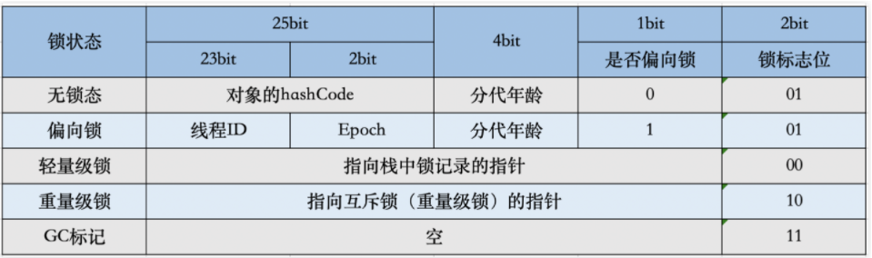

## 进程、线程、纤程
**进程**：是程序在处理机上的一次执行过程，是操作系统进行`资源分配和调度`的一个独立单位
**线程**：是进程的一个实体，是`CPU调度和分派`的基本单位，是比进程更小的能独立运行的基本单位。线程的划分尺度小于进程，这使得多线程程序的并发性高；进程在执行时通常拥有独立的内存单元，而线程之间可以`共享内存`。
**纤程(协程)**：是用户态的线程，是线程中的线程，协程的调度完全由用户控制，不需要经过OS(操作系统)。协程拥有自己的`寄存器`上下文和`栈`。协程调度切换时，将寄存器上下文和栈保存到其他地方，在切回来的时候，恢复先前保存的寄存器上下文和栈，直接操作栈则基本没有内核切换的开销，可以不加锁的访问全局变量，所以上下文的切换非常快。线程进程都是`同步`机制，而协程则是`异步`

* 进程是拥有`系统资源`的一个独立单位，而线程自己基本上不拥有系统资源，只拥有一点在运行中必不可少的资源(如程序计数器,一组寄存器和栈)，和其他线程共享本进程的相关资源如内存、I/O、cpu等
* 在进程切换时，涉及到整个当前进程CPU环境的保存环境的设置以及新被调度运行的CPU环境的设置，而线程切换只需保存和设置少量的`寄存器`的内容，并不涉及存储器管理方面的操作，可见，进程切换的开销远大于线程切换的开销
* 线程在`切换`的过程中需要保存当前线程Id、线程状态、堆栈、寄存器状态等信息。其中寄存器主要包括SP PC EAX等寄存器，其主要功能如下：SP:堆栈指针，指向当前栈的栈顶地址；PC:程序计数器，存储下一条将要执行的指令；EAX:累加寄存器，用于加法乘法的缺省寄存器
* 线程之间的通信更方便，同一进程下的线程共享全局变量等数据，而进程之间的通信需要以进程间通信(IPC)的方式进行
* 多线程程序只要有一个线程崩溃，整个程序就崩溃了，但多进程程序中一个进程崩溃并不会对其它进程造成影响，因为进程有自己的独立地址空间，因此多进程更加健壮

**线程独占哪些资源**
线程ID；一组寄存器的值；线程自身的栈（堆是共享的）

## 进程的生命周期


## 进程通信
**管道(pipe)**
管道是一种`半双工`的通信方式，同一时间数据只能单向流动，而且只能在具有亲缘关系的进程间使用。进程的亲缘关系通常是指`父子进程`关系。
**命名管道 (namedpipe)**
有名管道也是`半双工`的通信方式，但是它允许`无亲缘`关系进程间的通信。
**信号量(semaphore)**
信号量是一个`计数器`，可以用来控制多个进程对`共享资源`的访问。它常作为一种`锁机制`，防止某进程正在访问共享资源时，其他进程也访问该资源。因此，主要作为`进程间`以及同一进程内不同`线程间`的`同步手段`。
**消息队列(messagequeue)**
消息队列是由消息的链表，存放在内核中并由消息队列标识符标识。消息队列克服了信号传递信息少、管道只能承载无格式字节流以及缓冲区大小受限等缺点。
**信号(sinal)**
信号是一种比较复杂的通信方式，用于通知接收进程某个事件已经发生。
**共享内存(shared memory)**
共享内存就是映射一段能被`其他进程`所访问的内存，这段共享内存由一个进程创建，但多个进程都可以访问。共享内存是最快的 IPC 方式，它是针对其他进程间通信方式运行效率低而专门设计的。它往往与其他通信机制，如信号量，配合使用，来实现进程间的同步和通信。
**套接字(socket)**
套接口也是一种进程间通信机制，与其他通信机制不同的是，它可用于`不同设备`及其间的进程通信。

## 进程同步
进程的同步是`目的`，而进程间通信是实现进程同步的`手段`
**管程Monitor**
管程将共享变量以及对这些共享变量的操作`封装`起来，形成一个具有一定接口的功能模块，这样只能通过管程提供的某个过程才能访问管程中的资源。进程只能`互斥`地使用管程，使用完之后必须释放管程并唤醒入口等待队列中的进程。
**生产者-消费者问题**
使用一个`缓冲区`来存放数据，只有缓冲区没有满，生产者才可以写入数据；只有缓冲区不为空，消费者才可以读出数据
```java
// 伪代码描述 
// 定义信号量 full记录缓冲区物品数量 empty代表缓冲区空位数量 mutex为互斥量
semaphore full = 0, empty = n, mutex = 1;
// 生产者进程
void producer(){
	do{
   	  P(empty);
	  P(mutex);
     // 生产者进行生产
   	  V(mutex);
   	  V(full);
 	} while(1);
}
void consumer(){
	do{
	  P(full);
	  P(mutex);
    	// 消费者进行消费
	  V(mutex);
	  V(empty);
 	} while(1);
}
```
**哲学家就餐问题**
有五位哲学家围绕着餐桌坐，每一位哲学家要么思考，要么吃饭。为了吃饭，哲学家必须拿起两双筷子（分别放于左右两端）不幸的是，筷子的数量和哲学家相等，所以每只筷子必须由两位哲学家共享。
**读者-写者问题**
只要求读文件的进程称为“Reader进程”，其它进程则称为“Writer进程”。允许多个进程同时读一个共享对象，但不允许一个Writer进程和其他Reader进程或Writer进程同时访问共享对象

## 同步和互斥
**同步**：多个进程因为合作而使得进程的执行有一定的先后`顺序`。比如某个进程需要另一个进程提供的消息，获得消息之前进入阻塞态；
**互斥**：多个进程在同一时刻只有一个进程能进入临界区

## 并发、并行、异步
**并发**：在一个`时间段`中同时有多个程序在运行，但其实任一`时刻`，只有一个程序在CPU上运行，宏观上的并发是通过不断的切换实现的；
**并行**（和串行相比）：在`多CPU`系统中，多个程序无论宏观还是微观上都是同时执行的
**异步**（和同步相比）：同步是顺序执行，异步是在等待某个资源的时候继续做自己的事

## 僵尸进程
一个子进程`结束`后，它的父进程并没有`等待`它（调用wait或者waitpid），那么这个子进程将成为一个僵尸进程。僵尸进程是一个`已经死亡`的进程，但是并没有真正被销毁。它已经放弃了几乎所有内存空间，没有任何可执行代码，也不能被调度，仅仅在进程表中保留一个位置，记载该进程的进程ID、终止状态以及资源利用信息(CPU时间，内存使用量等等)供父进程收集，除此之外，僵尸进程不再占有任何`内存`空间。这个僵尸进程可能会一直留在系统中直到系统重启。
**危害**：占用`进程号`，而系统所能使用的进程号是有限的。

以下情况`不会`产生僵尸进程：
* 该进程的`父进程`结束了。每个进程结束的时候，系统都会`扫描`是否存在子进程，如果有则用`Init`进程接管，成为该进程的父进程，并且会调用`wait`等待其结束。
* 父进程调用`wait`或者`waitpid`等待子进程结束（需要每隔一段时间查询子进程是否结束）。wait系统调用会使父进程`暂停`执行，直到它的一个子进程结束为止。waitpid则可以加入WNOHANG(wait-no-hang)选项，如果没有发现结束的子进程，就会立即返回，不会将调用waitpid的进程阻塞。同时，waitpid还可以选择是等待任一子进程（同wait），还是等待指定pid的子进程，还是等待同一进程组下的任一子进程，还是等待组ID等于pid的任一子进程；
* 子进程结束时，系统会产生SIGCHLD(signal-child)信号，可以注册一个`信号处理函数`，在该函数中调用waitpid，等待所有结束的子进程（注意：一般都需要循环调用waitpid，因为在信号处理函数开始执行之前，可能已经有多个子进程结束了，而信号处理函数只执行一次，所以要循环调用将所有结束的子进程回收）；
* 也可以用signal(SIGCLD, SIG_IGN)(signal-ignore)通知`内核`，表示忽略SIGCHLD信号，那么子进程结束后，内核会进行回收。

**孤儿进程**
一个`父进程`已经结束了，但是它的`子进程`还在运行，那么这些子进程将成为孤儿进程。孤儿进程会被`Init`（进程ID为1）接管，当这些孤儿进程结束时由Init完成状态收集工作。

## 进程的异常控制流
**陷阱**
陷阱是`有意`造成的“异常”，是执行一条指令的结果。陷阱是`同步`的。陷阱的主要作用是实现`系统调用`。比如，进程可以执行` syscall n `指令向内核请求服务。当进程执行这条指令后，会中断当前的控制流，陷入到`内核态`，执行相应的系统调用。内核的处理程序在执行结束后，会将结果返回给进程，同时退回到用户态。进程此时继续执行下一条指令。
**中断**
中断由处理器外部的`硬件`产生，不是执行某条指令的结果，也`无法预测`发生时机。由于中断独立于当前执行的程序，因此中断是`异步`事件。中断包括 I/O 设备发出的 I/O 中断、各种定时器引起的时钟中断、调试程序中设置的断点等引起的调试中断等。
**异常**
异常是一种错误情况，是执行当前指令的结果，可能被错误处理程序`修正`，也可能直接终止应用程序。异常是`同步`的。这里特指因为执行当前指令而产生的`错误情况`，比如除法异常、缺页异常等。有些书上为了区分，也将这类“异常”称为“故障”。
**信号**
信号是一种`更高层`的软件形式的异常，同样会中断进程的控制流，可以由进程进行处理。一个信号代表了一个`消息`。信号的作用是用来`通知进程`发生了某种系统事件。

## 线程的生命周期

其中`Running`表示运行状态，`Runnable`表示就绪状态（万事俱备，只欠CPU），`Blocked`表示阻塞状态，阻塞状态又有多种情况，可能是因为调用wait()方法进入`等待池`，也可能是执行同步方法或同步代码块进入`等锁池`，或者是调用了sleep()方法或join()方法等待休眠或其他线程结束，或是因为发生了I/O中断。

## sleep()和wait()的区别
* sleep()方法是`Thread类`的静态方法；wait()是`Object类`的方法。
* sleep()方法需要规定休眠`时间`。
* sleep()方法执行时对象的`锁依然保持`，因此休眠时间结束后会自动恢复到就绪状态；wait()方法导致当前线程`放弃对象的锁`，进入对象的等待池（wait pool），只有调用对象的`notify()`方法（或notifyAll()方法）时才能唤醒等待池中的线程进入等锁池（lock pool），如果线程重新获得对象的锁就可以进入就绪状态。

## sleep()和yield()的区别
* sleep()方法给其他线程运行机会时不考虑线程的`优先级`，因此会给优先级低的线程以运行的机会，而yield()方法只会给相同优先级或者更高优先级的线程以运行机会。
* 线程执行sleep()方法后会转入`阻塞`状态，所以，执行sleep()方法的线程在指定的时间内肯定不会被执行，而yield()方法只是使当前线程重新回到`可执行`状态，所以执行yield()方法的线程有可能在进入到可执行状态后马上又被执行。
* sleep()方法声明抛出InterruptedException，而yield()方法没有声明任何异常。
* sleep()方法比yield()方法（跟操作系统）具有更好的`可移植性`。

## join()
* 线程插队，thread.join()将使thread线程立刻执行
* 如果没有中断操作，join()的线程会一直执行直到结束，其他线程`阻塞`

## 线程同步
**临界区**
临界区对应着一个CriticalSection对象，当线程需要访问`保护数据`时，调用EnterCriticalSection函数；当对保护数据的操作完成之后，调用LeaveCriticalSection函数`释放`对临界区对象的拥有权，以使另一个线程可以夺取临界区对象并访问受保护的数据。
**互斥量**
互斥与临界区很相似，但是使用时相对复杂一些（互斥量为`内核`对象），不仅可以在同一应用程序的`线程间`实现同步，还可以在不同的`进程间`实现同步，从而实现资源的安全共享。
**信号量**
信号量的用法和互斥的用法很相似，不同的是它可以同一时刻允许`多个线程`访问同一个资源。
PV操作
count表示系统中某类资源的使用情况，大于0时表示可用资源数，小于0时`绝对值`表示阻塞的进程数
P操作：count-1，如果count >= 0，进程继续执行，否则阻塞该进程，并加入等待队列
V操作：count+1，如果count <= 0，从等待队列中移出一个进程，使其变为就绪状态。
**事件**
事件分为`手动置位`事件和`自动置位`事件。事件Event内部包含一个`使用计数`（所有内核对象都有），一个布尔值表示是手动置位事件还是自动置位事件，另一个布尔值用来表示事件有无触发。由SetEvent()来触发，由ResetEvent()来设成未触发。

## 线程的上下文切换
CPU通过分配`时间片`来执行任务，当一个任务的时间片用完，就会切换到另一个任务。在切换之前会`保存`上一个任务的状态，当下次再切换到该任务，就会加载这个状态。
任务从保存到再加载的过程就是一次上下文切换。在切出时，操作系统会将线程的进度信息保存到`内存`。在切入时，操作系统需要从内存中加载线程的上下文。一般包括通用`寄存器`和`程序计数器`的内容。

## synchronized 和 volatile
**synchronized**它会阻止其它线程获取当前对象的`锁`，这样就使得当前对象中被synchronized关键字保护的代码块无法被其它线程访问，也就无法并发执行。
**volatile**关键字解决的是`内存可见性`的问题。修改volatile变量时会强制将修改后的值刷新的`主内存`中。修改volatile变量后会导致其他线程工作内存中对应的变量值失效。因此，再读取该变量值的时候就需要重新从读取主内存中的值。 
- **应用范围**：
volatile关键字是对变量进行上锁，锁住的是单个变量，而synchronized还能对方法以及代码块进行上锁。
- **是否保证原子性**：
在多线程环境下，volatile可以保证可见性和有序性，不能保证原子性，而synchronized在保证可见性和有序性的基础上，还可以保证原子性。
volatile变量的原子性与synchronized的原子性是不同的。synchronized的原子性是指，只要声明为synchronized的方法或代码块，在执行上就是原子操作，synchronized能保证被锁住的整个代码块的原子性。而volatile是不修饰方法或代码块的，它只用来修饰变量，对于单个volatile变量的读和写操作都具有原子性，但类似于volatile++这种复合操作不具有原子性。所以volatile的原子性是受限制的。所以，在多线程环境中，volatile并不能保证原子性。
- **使用场景**：
volatile主要用于解决共享变量的数据可见性问题，而synchronized主要用于保证访问数据的同步性（同时也能保证可见性）。
- **保证有序性的方式**：
volatile的有序性是通过禁止指令重排序来实现的。synchronized无法禁止指令重排，但是可以通过单线程机制来保证有序性。由于synchronized修饰的代码，在同一时刻只能被一个线程访问，从根本上避免了多线程的情况。而单线程环境下，在本线程内观察到的所有操作都是天然有序的，所以synchronized可以通过单线程的方式来保证程序的有序性。
- **性能方面**：
volatile是线程同步的轻量级实现，性能高于synchronized。多线程访问volatile修饰的变量时不会发生阻塞（主要是因为volatile采用CAS加锁），而访问synchronized修饰的资源时会发生阻塞。

**区别**
1. volatile本质是在告诉jvm当前变量在寄存器（工作内存）中的值是不确定的，需要从`主存`中读取； synchronized则是`锁定`当前变量，只有当前线程可以访问该变量，其他线程被阻塞住。
2. volatile仅能使用在`变量`级别；synchronized则可以使用在`变量、方法、类`级别
3. volatile仅能实现变量的修改`可见性`，不能保证原子性；而synchronized则可以保证变量的修改`可见性和原子性`
4. volatile`不会`造成线程的阻塞；synchronized可能`会`造成线程的阻塞。
5. volatile标记的变量不会被编译器优化；synchronized标记的变量可以被编译器优化

## synchronized方法 和 synchronized块
* 同步方法的`同步监视器`是`this`
* 同步块`synchronized(obj){}`中的obj是`同步监视器`，可以是任何对象
* 同步监视器要设定为需要改变的对象

## synchronized实现原理
Java 虚拟机中的同步(Synchronization)基于进入和退出`管程(Monitor)`对象实现， 无论是显式同步(有明确的 monitorenter 和 monitorexit 指令,即同步代码块)还是隐式同步都是如此。在 Java 语言中，同步用的最多的地方可能是被 synchronized 修饰的同步方法。同步方法 并不是由 monitorenter 和 monitorexit 指令来实现同步的，而是由方法调用指令读取运行时常量池中方法的 ACC_SYNCHRONIZED 标志来隐式实现的，
#### Java对象头与Monitor
在JVM中，对象在内存中的布局分为三块区域：对象头、实例变量和填充数据。
- 实例变量：存放类的属性数据信息，包括父类的属性信息，如果是数组的实例部分还包括数组的长度，这部分内存按4字节对齐。
- 填充数据：由于虚拟机要求对象起始地址必须是8字节的整数倍。填充数据不是必须存在的，仅仅是为了字节对齐，这点了解即可。

一般而言，synchronized使用的锁对象是存储在Java**对象头**里的，jvm中采用2个字来存储对象头(如果对象是数组则会分配3个字，多出来的1个字记录的是数组长度)，其主要结构是由`Mark Word`和`Class Metadata Address`组成，其结构说明如下表：

| 虚拟机位数 | 头对象结构             | 说明                                                                  |
| ---------- | ---------------------- | --------------------------------------------------------------------- |
| 32/64bit   | Mark Word              | 存储对象的hashCode、锁信息或分代年龄或GC标志等信息                    |
| 32/64bit   | Class Metadata Address | 类型指针指向对象的类元数据，JVM通过这个指针确定该对象是哪个类的实例。 |
其中Mark Word在默认情况下存储着对象的HashCode、分代年龄、锁标记位等以下是32位JVM的Mark Word默认存储结构

`重量级锁`也就是通常说synchronized的对象锁，锁标识位为10，其中指针指向的是`monitor对象`（也称为管程或监视器锁）的起始地址。每个对象都存在着一个 monitor 与之关联，对象与其 monitor 之间的关系有存在多种实现方式，如monitor可以与对象一起创建销毁或当线程试图获取对象锁时自动生成，但当一个 monitor 被某个线程持有后，它便处于锁定状态。在Java虚拟机(HotSpot)中，monitor是由`ObjectMonitor`实现的
ObjectMonitor中有两个队列，`_WaitSet` 和 `_EntryList`，用来保存`ObjectWaiter`对象列表( 每个等待锁的线程都会被封装成ObjectWaiter对象)，`_owner`指向持有ObjectMonitor对象的线程，当多个线程同时访问一段同步代码时，首先会进入 `_EntryList` 集合，当线程获取到对象的monitor 后进入 _Owner 区域并把monitor中的owner变量设置为当前线程同时monitor中的计数器count加1，若线程调用 wait() 方法，将释放当前持有的monitor，owner变量恢复为null，count自减1，同时该线程进入 `_WaitSet`集合中等待被唤醒。若当前线程执行完毕也将释放monitor(锁)并复位变量的值，以便其他线程进入获取monitor(锁)。

由此看来，monitor对象存在于每个Java对象的对象头中(存储的指针的指向)，synchronized锁便是通过这种方式获取锁的，也是为什么Java中任意对象可以作为锁的原因，同时也是notify/notifyAll/wait等方法存在于顶级对象Object中的原因(关于这点稍后还会进行分析)
#### synchronized代码块底层原理
```java
public class SyncCodeBlock {
   public int i;
   public void syncTask(){
       //同步代码库
       synchronized (this){
           i++;
       }
   }
}
```
```java
3: monitorenter  //进入同步方法
//..........省略其他  
15: monitorexit   //退出同步方法
16: goto          24
//省略其他.......
21: monitorexit //退出同步方法
```
从字节码中可知同步语句块的实现使用的是`monitorenter` 和 `monitorexit` 指令，其中monitorenter指令指向同步代码块的开始位置，monitorexit指令则指明同步代码块的结束位置，当执行monitorenter指令时，当前线程将试图获取 objectref(即对象锁) 所对应的 `monitor` 的持有权，当 objectref 的 monitor 的进入`计数器`为 0，那线程可以成功取得 monitor，并将计数器值设置为 1，取锁成功。如果当前线程已经拥有 objectref 的 monitor 的持有权，那它可以重入这个 monitor (关于重入性稍后会分析)，重入时计数器的值也会加 1。倘若其他线程已经拥有 objectref 的 monitor 的所有权，那当前线程将被阻塞，直到正在执行线程执行完毕，即monitorexit指令被执行，执行线程将释放 monitor(锁)并设置计数器值为0 ，其他线程将有机会持有 monitor 。
值得注意的是编译器将会确保无论方法通过何种方式完成，方法中调用过的每条 monitorenter 指令都有执行其对应 monitorexit 指令，而无论这个方法是正常结束还是异常结束。为了保证在方法异常完成时 monitorenter 和 monitorexit 指令依然可以正确配对执行，编译器会自动产生一个**异常处理器**，这个异常处理器声明可处理所有的异常，它的目的就是用来执行 monitorexit 指令。从字节码中也可以看出多了一个monitorexit指令，它就是异常结束时被执行的释放monitor 的指令。
#### synchronized方法底层原理
方法级的同步是`隐式`，即无需通过字节码指令来控制的，它实现在方法调用和返回操作之中。JVM可以从方法常量池中的`方法表结构`(method_info Structure) 中的 `ACC_SYNCHRONIZED` 访问标志区分一个方法是否同步方法。当方法调用时，调用指令将会 检查方法的 ACC_SYNCHRONIZED 访问标志是否被设置，如果设置了，执行线程将先持有monitor（虚拟机规范中用的是管程一词）， 然后再执行方法，最后再方法完成(无论是正常完成还是非正常完成)时释放monitor。
#### synchronized的优化
锁的状态总共有四种，无锁状态、偏向锁、轻量级锁和重量级锁。随着锁的竞争，锁可以从偏向锁升级到轻量级锁，再升级的重量级锁，但是锁的升级是单向的，也就是说只能从低到高升级，不会出现锁的降级
在Java早期版本中，synchronized属于重量级锁，效率低下，因为管程（monitor）是依赖于底层的操作系统的**Mutex Lock**来实现的，而操作系统实现线程之间的切换时需要从`用户态`转换到`核心态`，这个状态之间的转换需要相对比较长的时间，时间成本相对较高，这也是为什么早期的synchronized效率低的原因，Java 6之后，为了减少获得锁和释放锁所带来的性能消耗，引入了轻量级锁和偏向锁

## volatile实现原理
#### volatile作用
1. 保证此变量对所有线程的可见性
2. 禁止指令重排序优化：在单线程环境下，编译器和处理器为了提高运行速度，会在不影响运行结果的前提下对指令进行重排序。而在多线程环境下，这种重排序就会造成错误的结果。JMM通过在修改volatile变量之后插入一个`内存屏障`，来禁止重排序时内存屏障之后的指令被重排序到内存屏障之前
#### volatile实现原理
对于用`volatile`修饰的变量，对其写操作时会额外执行一个`Lock`指令，这个Lock指令的作用如下
1. 将该处理器的工作内存写回到主内存：即保证主内存中的值是最新的，为其他处理器读取到最新的值提供基础
2. 使其他处理器的工作内存失效：如果其他处理器的工作内容仍然有效，则不会从主内存中重新取值，所以需要先使其他处理器的工作内存失效，然后让其从主内存中重新读取

## Java Lock
java.util.concurrent.locks.Lock 是一个类似于synchronized 块的线程同步机制。但是 Lock比 synchronized 块`更加灵活`。Lock是个`接口`，有个实现类是ReentrantLock。
#### Lock和syncronized的区别
- synchronized是Java语言的关键字。Lock是一个类。
- synchronized不需要用户去手动释放锁，发生异常或者线程结束时自动释放锁;Lock则必须要用户去`手动释放锁`，如果没有主动释放锁，就有可能导致出现死锁现象。
- lock可以配置`公平策略`,实现线程按照先后顺序获取锁。
- 提供了`trylock`方法 可以试图获取锁，获取到或获取不到时，返回不同的返回值 让程序可以灵活处理。
- lock()和unlock()可以在不同的方法中执行,可以实现同一个线程在上一个方法中lock()在后续的其他方法中unlock(),比syncronized灵活的多。
#### Lock接口抽象方法 
- `void lock()`：获取锁，如果锁不可用，则出于线程调度的目的，当前线程将被禁用，并且在获取锁之前处于休眠状态。
- `boolean tryLock()`：如果锁可用立即返回true，如果锁不可用立即返回false；
- `void unlock()`：释放锁。释放锁的操作放在finally块中进行，以保证锁一定被被释放，防止死锁的发生。
#### ReentrantLock
重入锁也叫做递归锁，指的是同一线程 外层函数获得锁之后 ，内层递归函数仍然有获取该锁的代码，但不受影响。避免死锁问题的,synchronized也可重入。
#### ReentrantReadWriteLock（读写锁） 
读写锁，可以分别获取读锁或写锁。也就是说将数据的读写操作分开，分成2个锁来分配给线程，从而使得多个线程可以同时进行读操作。读锁使用共享模式；写锁使用独占模式；读锁可以在没有写锁的时候被多个线程同时持有，写锁是独占的。当有读锁时，写锁就不能获得；而当有写锁时，除了获得写锁的这个线程可以获得读锁外，其他线程不能获得读锁
- `writeLock()`：获取写锁。
- `readLock()`：获取读锁。

## Java Condition
任意一个Java对象，都拥有一组监视器方法（定义在Object类中），主要包括`wait`，`notify`，`notifyAll`方法，这些方法与`synchornized`关键字相配合，可以实现等待/通知模式。
`Condition`接口也提供了类似的Object的监视器方法，与`Lock`配合可以实现等待/通知模式。但是这两者在使用方式以及功能上还是有差别的。
Condition定义了`等待/通知`两种类型的方法，当前线程调用这些方法时，需要提前获取到Condition对象关联的锁。Condition对象是由Lock对象创建出来的，换句话说，**Condition是依赖Lock对象的**。
Condition调用`await`方法后，当前线程会释放锁并在此等待，而其他线程调用Condition对象的`singal`方法，通知当前线程，当前线程才从await方法返回，并且在返回前已经获取了锁。
#### Condition实现
Condition的实现，主要包括**等待队列**，**等待**和**通知**。
**等待队列**
等待队列是一个`FIFO`的队列，在队列中的每个节点都包含了一个线程引用，该线程就是在Condition对象上等待的线程，
如果一个线程调用了`Condition.await`方法，那么该线程将会释放锁，构造成节点并加入等待队列进入等待状态。

如图所示，Condition拥有`首节点`和`尾节点`的引用，而新增节点只需要将原有的尾节点的nextWaiter指向它，并且更新尾节点即可。上述节点引用更新的过程并没有使用CAS保证，因为调用await的线程必定是获取了锁的线程，也就是说，这个过程是由`锁`来保证线程安全的。
在Object的监视器模型上，一个对象拥有一个同步队列和一个等待队列，而并发包中的Lock拥有一个同步队列和多个等待队列，其关系图如图所示。

**等待**
调用Condition的`await`方法，会使当前线程进入等待队列并释放锁，同时线程状态变为等待状态。从await方法返回时，当前线程一定获取了Condition相关联的`锁`。
如果从队列（同步队列和等待队列）的角度来看await方法，调用await方法时，相当于`同步队列的首节点移动到了等待队列中`。
同步队列的首节点不会直接加入到等待队列，而是通过`addConditionWaiter`方法把当前线程构造成一个新的节点并将其加入等待队列。

**通知**
通过调用Condition的`singal`方法，将会唤醒在等待队列中`等待时间最长`的节点（首节点），在唤醒节点之前，会将节点移到`同步队列`中。
通过调用AQS的enq方法，等待队列的头结点线程安全的移动到同步队列。当节点移动到同步队列后，当前线程的状态如果处于`取消`或者`被中断`的状态，或者更新该节点的状态失败则会`唤醒`这个线程。
被唤醒后的线程将从await方法的while循环中退出（isOnSyncQueue返回true，因为节点已经在同步队列中），进而调用AQS的acquireQueued方法加入到获取同步状态的竞争中。
Condition的`singalAll`方法，相当于对等待队列的每个节点均执行一次singal方法，效果就是将等待队列中所有节点全部移动到同步队列，并唤醒每个节点的线程。

## JAVA锁

#### 乐观锁 & 悲观锁
- 悲观锁: 认为自己在使用数据的时候`一定有`别的线程来修改数据，因此在获取数据的时候会先加锁，确保数据不会被别的线程修改。Java中，`synchronized`关键字和`Lock`的实现类都是悲观锁。
- 乐观锁: 认为自己在使用数据时`不会`有别的线程修改数据，所以不会添加锁，只是在更新数据的时候去判断之前有没有别的线程更新了这个数据。如果这个数据没有被更新，当前线程将自己修改的数据成功写入。如果数据已经被其他线程更新，则根据不同的实现方式执行不同的操作（例如报错或者自动重试）。乐观锁在Java中是通过使用无锁编程来实现，最常采用的是CAS算法，Java原子类中的递增操作就通过CAS自旋实现的。
#### 自旋锁 & 适应性自旋锁
阻塞或唤醒一个Java线程需要操作系统切换CPU状态来完成，这种状态转换需要耗费处理器时间。如果同步代码块中的内容过于简单，状态转换消耗的时间有可能比用户代码执行的时间还要长。

在许多场景中，同步资源的锁定时间很短，为了这一小段时间去切换线程，线程挂起和恢复现场的花费可能会让系统得不偿失。如果物理机器有多个处理器，能够让两个或以上的线程同时并行执行，我们就可以让后面那个请求锁的线程不放弃CPU的执行时间，看看持有锁的线程是否很快就会释放锁。

而为了让当前线程“稍等一下”，我们需让当前线程进行自旋，如果在自旋完成后前面锁定同步资源的线程已经释放了锁，那么当前线程就可以不必阻塞而是直接获取同步资源，从而避免切换线程的开销。这就是`自旋锁`。

自旋等待虽然避免了线程切换的开销，但它要占用处理器时间。如果锁被占用的时间很短，自旋等待的效果就会非常好。反之，如果锁被占用的时间很长，那么自旋的线程只会白浪费处理器资源。

自适应意味着自旋的时间（次数）不再固定，而是由`前一次`在`同一个`锁上的自旋时间及锁的拥有者的状态来决定。如果在同一个锁对象上，自旋等待刚刚成功获得过锁，并且持有锁的线程正在运行中，那么虚拟机就会认为这次自旋也是很有可能再次成功，进而它将允许自旋等待持续相对更长的时间。如果对于某个锁，自旋很少成功获得过，那在以后尝试获取这个锁时将可能省略掉自旋过程，直接阻塞线程，避免浪费处理器资源。
#### 公平锁 & 非公平锁
- 公平锁：多个线程按照申请锁的`顺序`来获取锁，线程直接进入队列中排队，队列中的第一个线程才能获得锁。公平锁的优点是等待锁的线程不会饿死。缺点是整体`吞吐效率`相对非公平锁要低，等待队列中除第一个线程以外的所有线程都会阻塞，CPU唤醒阻塞线程的开销比非公平锁大。
- 非公平锁是多个线程加锁时直接尝试获取锁，获取不到才会到等待队列的队尾等待。但如果此时锁刚好可用，那么这个线程可以`无需阻塞`直接获取到锁，所以非公平锁有可能出现后申请锁的线程先获取锁的场景。非公平锁的优点是可以减少唤起线程的开销，整体的吞吐效率高，因为线程有几率不阻塞直接获得锁，CPU不必唤醒所有线程。缺点是处于等待队列中的线程可能会饿死，或者等很久才会获得锁。
#### 可重入锁 & 非可重入锁
- 可重入锁：又名递归锁，是指在同一个线程在`外层`方法获取锁的时候，再进入该线程的`内层`方法会自动获取锁（前提锁对象得是同一个对象或者class），不会因为之前已经获取过还没释放而阻塞。Java中`ReentrantLock`和`synchronized`都是可重入锁，可重入锁的一个优点是可一定程度避免`死锁`。
当线程尝试获取锁时，可重入锁先尝试获取并更新`status`值，如果`status == 0`表示没有其他线程在执行同步代码，则把status置为1，当前线程开始执行。如果`status != 0`，则判断当前线程是否是获取到这个锁的线程，如果是的话执行`status+1`，且当前线程可以再次获取锁。而非可重入锁是直接去获取并尝试更新当前status的值，如果`status != 0`的话会导致其获取锁失败，当前线程阻塞。
#### 独享锁 & 共享锁
- 独享锁: 也叫排他锁，是指该锁一次只能被`一个线程`所持有。如果线程T对数据A加上排它锁后，则其他线程不能再对A加任何类型的锁。获得排它锁的线程即能读数据又能修改数据。JDK中的`synchronized`和JUC中`Lock`的实现类就是互斥锁。
- 共享锁: 指该锁可被`多个线程`所持有。如果线程T对数据A加上共享锁后，则其他线程只能对A再加`共享锁`，不能加排它锁。获得共享锁的线程只能读数据，不能修改数据。

## 锁升级
无锁 -> 偏向锁 -> 轻量级锁 -> 重量级锁
偏向锁，轻量级锁都是`乐观锁`，重量级锁是`悲观锁`。
1. 无锁没有对资源进行锁定，所有的线程都能访问并修改同一个资源，但同时只有`一个`线程能修改成功。无锁的特点就是修改操作在循环内进行，线程会不断的尝试修改共享资源。如果没有冲突就修改成功并退出，否则就会继续循环尝试。
2. 在大多数情况下，锁总是由同一线程多次获得。当`第一个线程`来访问同步代码块的时候，它会偏向这个线程，此时，对象持有`偏向锁`。这个线程在修改对象头成为偏向锁的时候使用`CAS`操作，并将对象头中的`ThreadID`改成自己的ID，之后再次访问这个对象时，只需要对比ID，不需要再使用CAS修改对象头。
3. 一旦有`第二个线程`访问这个对象，因为偏向锁不会主动释放，所以第二个线程可以看到对象时偏向状态，这时表明在这个对象上已经存在竞争了，检查原来持有该对象锁的线程是否依然存活，如果挂了，则可以将对象变为`无锁`状态，然后重新偏向新的线程，如果原来的线程依然存活，则马上执行那个线程的操作栈，检查该对象的使用情况，如果仍然需要持有偏向锁，则偏向锁升级为`轻量级锁`。
4. 轻量级锁认为竞争存在，但是竞争的程度很轻，一般两个线程对于同一个锁的操作都会错开，或者说稍微等待一下（CAS自旋），另一个线程就会释放锁。 但是当`自旋`超过一定的次数，或者一个线程在持有锁，一个在自旋，又有`第三个`来访时，轻量级锁膨胀为`重量级锁`，重量级锁使除了拥有锁的线程以外的线程都阻塞（底层信号量）

## 锁消除
消除锁是虚拟机另外一种锁的优化，这种优化更彻底，Java虚拟机在JIT编译时(可以简单理解为当某段代码即将第一次被执行时进行编译，又称`即时编译`)，通过对运行上下文的扫描，去除不可能存在共享资源竞争的锁，通过这种方式消除没有必要的锁，可以节省毫无意义的请求锁时间，如下StringBuffer的append是一个同步方法，但是在add方法中的StringBuffer属于一个局部变量，并且不会被其他线程所使用，因此StringBuffer不可能存在共享资源竞争的情景，JVM会自动将其锁消除。

## 锁的分类


## CAS原理
**CAS：比较并替换**
使用了3个基本操作数：内存地址V，旧的预期值A，要修改的新值B。
更新一个变量的时候，只有当变量的`预期值`A和内存地址V当中的`实际值`相同时，才会将内存地址V对应的值修改为B。
**优点**
乐观锁避免了悲观锁独占对象的现象，同时也提高了`并发性能`
**缺点**
1. CPU可能开销较大
在并发量比较高的情况下，如果许多线程反复尝试更新某一个变量，却又一直更新不成功，循环往复，会给CPU带来很大的压力。
2. 不能保证代码块的原子性
CAS机制所保证的只是一个`变量`的原子性操作，而不能保证整个`代码块`的原子性。比如需要保证3个变量共同进行原子性的更新，就不得不使用悲观锁了。
3. ABA问题。
CAS的核心思想是通过比对内存值与预期值是否一样而判断内存值是否被改过，但这个判断逻辑不严谨，假如内存值原来是A，后来被一条线程改为B，最后又被改成了A，则CAS认为此内存值并没有发生改变，但实际上是有被其他线程改过的，这种情况对依赖过程值的情景的运算结果影响很大。解决的思路是引入`版本号`，每次变量更新都把版本号加一。
#### CAS实现
java.util.concurrent包中的原子类，就是通过CAS来实现了乐观锁，AtomicInteger的定义：

- unsafe： 获取并操作内存的数据。
- valueOffset： 存储value在AtomicInteger中的偏移量。
- value： 存储AtomicInteger的int值，该属性需要借助volatile关键字保证其在线程间是可见的。

查看AtomicInteger的自增函数incrementAndGet()的源码时，发现自增函数底层调用的是unsafe.getAndAddInt()。
```java
// AtomicInteger 自增方法
public final int incrementAndGet() {
  return unsafe.getAndAddInt(this, valueOffset, 1) + 1;
}

public final int getAndAddInt(Object o, long offset, int delta) {
   int v;
   do {
       v = getIntVolatile(o, offset);
   } while (!compareAndSwapInt(o, offset, v, v + delta));
   return v;
}
```
getAndAddInt()循环获取给定对象o中的偏移量处的值v，然后判断内存值是否等于v。如果相等则将内存值设置为 v + delta，否则返回false，继续循环进行重试，直到设置成功才能退出循环。整个“比较+更新”操作封装在`compareAndSwapInt()`中，在JNI里是借助于一个`CPU指令`完成的，属于原子操作，可以保证多个线程都能够看到同一个变量的修改值


## 死锁
死锁是指两个或两个以上的`进程`在执行过程中，由于`竞争资源`或者由于`彼此通信`而造成的一种阻塞的现象。
#### 产生死锁的原因
* 竞争资源。
* 进程推进顺序不当。

#### 死锁产生的必要条件
* 互斥条件：一个资源每次只能被一个进程使用。
* 请求和保持条件：一个进程因请求资源而阻塞时，对已获得的资源保持不放。
* 不可剥夺条件：进程已获得的资源，在末使用完之前，不能强行剥夺，只能在进程使用完时由自己释放。
* 循环等待条件：若干进程之间形成一种头尾相接的循环等待资源关系。

#### 死锁的处理
**预防死锁**
通过设置一些限制条件，去`破坏`产生死锁的必要条件
破坏“占有并等待”条件:
* 创建进程时，要求它申请所需的全部资源，系统或满足其所有要求，或什么也不给它。这是所谓的 “ 一次性分配”方案。
* 要求每个进程提出新的资源申请前，释放它所占有的资源。这样，一个进程在需要资源S时，须先把它先前占有的资源R释放掉，然后才能提出对S的申请，即使它可能很快又要用到资源R。

破坏“不可抢占”条件：
* 如果占有某些资源的一个进程进行进一步资源请求被拒绝，则该进程必须释放它最初占有的资源，如果有必要，可再次请求这些资源和另外的资源。
* 如果一个进程请求当前被另一个进程占有的一个资源，则操作系统可以抢占另一个进程，要求它释放资源。

破坏“循环等待”条件：
* 将系统中的所有资源统一编号，进程可在任何时刻提出资源申请，但所有申请必须按照资源的编号顺序（升序）提出。这样做就能保证系统不出现死锁。

**避免死锁**
在资源分配过程中，使用某种方法避免系统进入不安全的状态，从而避免发生死锁（银行家算法）
**检测和解除死锁**
允许死锁的发生，但是通过系统的检测之后，采取一些措施，将死锁清除掉
死锁解除的主要方法有：
* 资源剥夺法：挂起某些死锁进程，并抢占它的资源，将这些资源分配给其他的死锁进程。但应防止被挂起的进程长时间得不到资源，而处于资源匮乏的状态。
* 撤销进程法：强制撤销部分、甚至全部死锁进程并剥夺这些进程的资源。撤销的原则可以按进程优先级和撤销进程代价的高低进行。
* 进程回退法：让一（多）个进程回退到足以回避死锁的地步，进程回退时自愿释放资源而不是被剥夺。要求系统保持进程的历史信息，设置还原点。

## 银行家算法
#### 算法数据结构
1. **可利用资源向量**Available。这是一个含有 m 个元素的数组，其中的每一个元素代表一类可利用的资源数目，其初始值是系统中所配置的该类`全部可用资源`的数目，其数值随该类资源的分配和回收而动态地改变。如果 Available[j] = K，则表示系统中现Rj类资源K个。
2. **最大需求矩阵**Max。这是一个n x m的矩阵，它定义了系统中n个进程中的每个进程对m类资源的`最大需求`。如果Max[i,j] = K，则表示进程i需要Rj 类资源的最大数目为K。
3. **分配矩阵**Allocation。这也是一个n x m的矩阵，它定义了系统中每一类资源当前`已分配`给每一进程的资源数。如果 Allocation[i,jl = K，则表示进程i当前己分得Rj类资源的数目为K。
4. **需求矩阵**Need.这也是一个n×m的矩阵，用以表示每一个进程`尚需`的各类资源数。如果Need[i,j] = K，则表示进程i还需要Rj类资源K个方能完成其任务。

上述三个矩阵间存在下述关系:
Need[i,j] = Max[i,j] - allocation[i, j]
#### 算法具体过程
设 Request；是进程Pi的`请求向量`，如果 Requesti[j] = K，表示进程Pi需要K个Rj类型的资源。当Pi发出资源请求后，系统按下述步骤进行检査:
1. 如果 Requesti[j] ≤ Need[i,j]便转向步骤(2)；否则认为出错，因为它所需要的资源数已超过它所宣布的最大值。
2. 如果 Requesti[j] ≤ Available[j]，便转向步骤(3)；否则，表示尚无足够资源，Pi须`等待`。
3. 系统试探着把资源分配给进程Pi，并修改下面数据结构中的数值
　　　　Available[j] = Available[j] - Requesti[j];
　　　　Allocation[i,j] = Allocation[i,j] + Requesti[j];
　　　　Need[i,j] = Need[i,j] - Requesti[j];
4. 系统执行`安全性算法`，检查此次资源分配后系统是否处于安全状态。若安全，才正式将资源分配给进程Pi，以完成本次分配；否则，将本次的试探分配`作废`，恢复原来的资源分配状态，让进程Pi等待。
#### 安全性算法
找出是否存在一个安全序列，若是，则系统是安全的，可以分配资源
系统所执行的安全性算法可描述如下:
1. 设置两个向量:①工作向量**Work**，它表示系统`可提供`给进程继续运行所需的各类资源数目，它含有m个元素，在执行安全算法开始时，Work = Available；② **Finish**:它表示系统`是否有足够`的资源分配给进程，使之运行完成。开始时先做 Finish[i] = false；当有足够资源分配给进程时，再令Finish[i] = true。
2. 从进程集合中找到一个能满足下述条件的进程
　　　　① Finish[i] = false;
　　　　② Need[i,j] ≤ Work[j];
若找到，执行步骤(3)，否则，执行步骤(4)。
3. 当进程Pi获得资源后，可顺利执行，直至完成，并释放出分配给它的资源，故应执行:
　　　　Work[j] = Work[j] + Allocation[i,j];
　　　　Finish[i] = true;
　　　　go to step 2;
4. 如果所有进程的 `Finish[i] =true`都满足，则表示系统处于`安全状态`；否则，系统处于不安全状态。

## 锁优化
**减少锁持有时间**
例如：对一个方法加锁，不如对方法中需要同步的几行`代码`加锁；
**减小锁粒度**
例如：`ConcurrentHashMap`采取对segment加锁而不是整个map加锁，后来又对node加锁，提高并发性；
**锁分离**
根据同步操作的性质，把锁划分为的`读锁`和`写锁`，读锁之间不互斥，提高了并发性。
**锁粗化**
这看起来与思路1有冲突，其实不然。思路1是针对一个线程中只有个别地方需要同步，所以把锁加在同步的语句上而不是更大的范围，减少线程持有锁的时间；
而锁粗化是指：在一个间隔性地需要执行同步语句的线程中，如果在不连续的同步块间`频繁加锁解锁`是很耗性能的，因此把加锁范围扩大，把这些不连续的同步语句进行`一次性`加锁解锁。虽然线程持有锁的时间增加了，但是总体来说是优化了的。
**锁消除**
锁消除是编译器做的事：根据`代码逃逸`技术，如果判断到一段代码中，堆上的数据不会逃逸出当前线程（即不会影响线程空间外的数据），那么可以认为这段代码是线程安全的，不必要加锁。

## 读写锁
`ReadWriteLock`管理一组锁，一个是读锁，一个是写锁。读锁可以在没有写锁的时候被多个线程`同时持有`，写锁是`独占`的。
所有读写锁的实现必须确保写操作对读操作的内存影响。换句话说，一个获得了读锁的线程必须能看到前一个释放的写锁所更新的内容。
读写锁比互斥锁允许对于共享数据更大程度的并发。每次只能有一个写线程，但是同时可以有多个线程并发地读数据。ReadWriteLock适用于`读多写少`的并发情况。
#### 特性
**获取顺序**
* 非公平模式（默认）
当以非公平初始化时，读锁和写锁的获取的顺序是不确定的。非公平锁主张`竞争获取`，可能会延缓一个或多个读或写线程，但是会比公平锁有更高的吞吐量。
* 公平模式
当以公平模式初始化时，线程将会以`队列`的顺序获取锁。当当前线程释放锁后，等待时间最长的写锁线程就会被分配写锁；或者有一组读线程组等待时间比写线程长，那么这组读线程组将会被分配读锁。当有写线程持有写锁或者有等待的写线程时，一个尝试获取公平的读锁（非重入）的线程就会阻塞。这个线程直到等待时间最长的写锁获得锁后并释放掉锁后才能获取到读锁。

**可重入**
允许读锁和写锁可重入。`写锁可以获得读锁，读锁不能获得写锁`。
**锁降级**
允许写锁降级为读锁

## ThreadLocal
ThreadLocal是JDK包提供的，它提供线程本地变量，如果创建一个ThreadLocal变量，那么访问这个变量的每个线程都会有这个变量的一个副本，在实际多线程操作的时候，操作的是自己本地内存中的变量，从而规避了线程安全问题

## 线程池
在面向对象编程中，创建和销毁对象是很费时间的，因为创建一个对象要获取内存资源或者其它更多资源。在Java中更是如此，虚拟机将试图跟踪每一个对象，以便能够在对象销毁后进行垃圾回收。所以提高服务程序效率的一个手段就是尽可能减少创建和销毁对象的次数，特别是一些很耗资源的对象创建和销毁，这就是“`池化资源`”技术产生的原因。线程池顾名思义就是事先`创建`若干个可执行的线程放入一个池（容器）中，需要的时候从池中`获取线程`不用自行创建，使用完毕不需要销毁线程而是`放回池中`，从而减少创建和销毁线程对象的开销。
工具类`Executors`提供了一些静态工厂方法
**newSingleThreadExecutor**
创建一个`单线程`的线程池。这个线程池只有一个线程在工作，也就是相当于单线程串行执行所有任务。如果这个唯一的线程因为异常结束，那么会有一个`新的线程`来替代它。此线程池保证所有任务的执行顺序按照任务的提交`顺序执行`。
**newFixedThreadPool**
创建`固定大小`的线程池。每次提交一个任务就创建一个线程，直到线程达到线程池的最大大小。线程池的大小一旦达到`最大值`就会保持不变，如果某个线程因为执行异常而结束，那么线程池会`补充`一个新线程。
**newCachedThreadPool**
创建一个`可缓存`的线程池。如果线程池的大小超过了处理任务所需要的线程，那么就会`回收`部分空闲（60秒不执行任务）的线程，当任务数增加时，此线程池又可以智能的`添加`新线程来处理任务。此线程池不会对线程池大小做限制，线程池大小完全依赖于操作系统（或者说JVM）能够创建的最大线程大小。
**newScheduledThreadPool**
创建一个大小`无限`的线程池。此线程池支持`定时`以及`周期性`执行任务的需求。
#### 实现
**ExecutorService**
真正的线程池接口，常见子类`ThreadPoolExecutor`
```java
void execute(Runnable command) // 执行任务，没有返回值，用于执行Runnable

<T> Future<T> submit(Callable<T> task) // 执行任务，有返回值，用于执行Callable

void shutdown() // 关闭连接池
```
**Executor**
工具类、线程池的工厂类，用于创建并返回不同类型的线程池
#### 线程池参数

1. **corePoolSize** 线程池核心线程大小
线程池中会维护一个`最小`的线程数量，即使这些线程处理空闲状态，他们也不会被销毁，除非设置了allowCoreThreadTimeOut。这里的最小线程数量即是corePoolSize。任务提交到线程池后，首先会检查当前线程数是否达到了corePoolSize，如果没有达到的话，则会`创建`一个新线程来处理这个任务。
2. **maximumPoolSize** 线程池最大线程数量
当前线程数达到corePoolSize后，如果继续有任务被提交到线程池，会将任务缓存到`工作队列`（后面会介绍）中。如果队列也`已满`，则会去创建一个新线程来出来这个处理。线程池不会无限制的去创建新线程，它会有一个最大线程数量的限制，这个数量即由maximunPoolSize指定。
3. **keepAliveTime** 空闲线程存活时间
一个线程如果处于空闲状态，并且当前的线程数量大于`corePoolSize`，那么在指定时间后，这个空闲线程会被销毁，这里的指定时间由keepAliveTime来设定
4. **unit** 空闲线程存活时间单位
keepAliveTime的计量单位
5. **workQueue** 工作队列
新任务被提交后，会先进入到此工作队列中，任务调度时再从队列中取出任务。jdk中提供了四种工作队列：
①ArrayBlockingQueue
基于数组的有界阻塞队列，按FIFO排序。新任务进来后，会放到该队列的队尾，有界的数组可以防止资源耗尽问题。当线程池中线程数量达到corePoolSize后，再有新任务进来，则会将任务放入该队列的队尾，等待被调度。如果队列已经是满的，则创建一个新线程，如果线程数量已经达到maxPoolSize，则会执行`拒绝策略`。
②LinkedBlockingQuene
基于链表的无界阻塞队列（其实最大容量为Interger.MAX），按照FIFO排序。由于该队列的近似无界性，当线程池中线程数量达到corePoolSize后，再有新任务进来，会一直存入该队列，而基本不会去创建新线程直到maxPoolSize（很难达到Interger.MAX这个数），因此使用该工作队列时，参数`maxPoolSize`其实是不起作用的。
③SynchronousQuene
一个`不缓存`任务的阻塞队列，生产者放入一个任务必须等到消费者取出这个任务。也就是说新任务进来时，不会缓存，而是直接被调度执行该任务，如果没有可用线程，则创建新线程，如果线程数量达到maxPoolSize，则执行`拒绝策略`。
④PriorityBlockingQueue
具有`优先级`的无界阻塞队列，优先级通过参数`Comparator`实现。
6. **threadFactory** 线程工厂
创建一个新线程时使用的工厂，可以用来设定线程名、是否为daemon线程等等
7. **handler** 拒绝策略
当工作队列中的任务已到达最大限制，并且线程池中的线程数量也达到最大限制，这时如果有新任务提交进来，该如何处理呢。这里的拒绝策略，就是解决这个问题的，jdk中提供了4中拒绝策略：
①CallerRunsPolicy
该策略下，在调用者线程中直接执行被拒绝任务的`run`方法，除非线程池已经shutdown，则直接抛弃任务。
②AbortPolicy
该策略下，直接`丢弃`任务，并抛出`RejectedExecutionException`异常。
③DiscardPolicy
该策略下，直接`丢弃`任务，什么都不做。
④DiscardOldestPolicy
该策略下，抛弃进入队列`最早`的那个任务，然后尝试把这次拒绝的任务放入队列

## Java多线程实现方式
1. 继承`Thread`类，并重写Thread中的run方法
2. 实现`Runnable`接口，重写run()方法
3. 实现`Callable`接口，重写call()方法 Callable可以在任务结束后提供一个`返回值`可以抛出异常

## 守护线程
* 线程分为`用户线程`和`守护线程`
* 虚拟机必须确保用户线程执行完毕
* 虚拟机不用确保守护线程执行完毕
* 后台记录操作日志、内存监控、垃圾回收等
```java
thread.setDeamon(true) // 默认false，表示用户线程
```