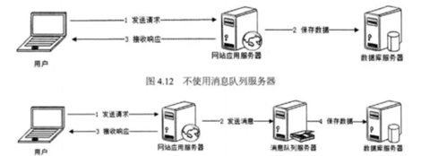
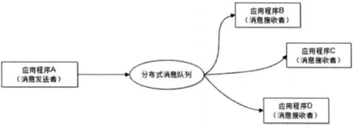
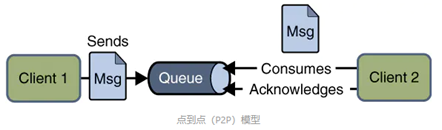
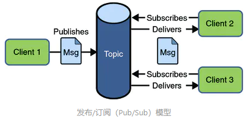

## 消息队列
我们可以把`消息队列`比作是一个存放消息的`容器`，当我们需要使用消息的时候可以取出消息供自己使用。消息队列是`分布式`系统中重要的组件， 
**优点：**	
1. 通过`异步`处理提高系统性能（削峰、减少响应所需时间）

 在不使用消息队列服务器的时候，用户的请求数据直接写入数据库，在高并发的情况下数据库压力剧增，使得响应速度变慢。但是在使用消息队列之后，用户的请求数据发送给消息队列之后`立即返回`，再由消息队列的消费者进程从消息队列中获取数据，`异步`写入数据库。由于消息队列服务器处理速度快于数据库（消息队列也比数据库有更好的伸缩性），因此响应速度得到大幅改善。
2. 降低系统耦合性

消息队列使利用`发布-订阅`模式工作，消息发送者（生产者）发布消息，一个或多个消息接受者（消费者）订阅消息。 从上图可以看到消息发送者（生产者）和消息接受者（消费者）之间没有直接耦合，消息发送者将消息发送至分布式消息队列即结束对消息的处理，消息接受者从分布式消息队列获取该消息后进行后续处理，并不需要知道该消息从何而来。对新增业务，只要对该类消息感兴趣，即可订阅该消息，对原有系统和业务没有任何影响，从而实现网站业务的可扩展性设计。

**问题：**
1. 系统复杂性提高： 加入MQ之后，你需要保证消息没有被`重复消费`、处理`消息丢失`的情况、保证消息传递的`顺序性`等等问题！ 
2. 一致性问题： 消息队列的异步确实可以提高系统响应速度。但是，万一消息的真正消费者并`没有正确消费`消息怎么办？这样就会导致数据不一致的情况

## 消息队列模型
**点到点（P2P）模型**

使用`队列`（Queue）作为消息通信载体；满足`生产者与消费者`模式，一条消息只能被`一个`消费者使用，未被消费的消息在队列中保留直到被`消费`或`超时`。比如：我们生产者发送100条消息的话，两个消费者来消费一般情况下两个消费者会按照消息发送的顺序`各自消费一半`。
**发布/订阅（Pub/Sub）模型**

发布订阅模型（Pub/Sub）使用`主题`（Topic）作为消息通信载体，类似于`广播`模式；发布者发布一条消息，该消息通过主题传递给所有的订阅者，在一条消息广播之后才订阅的用户则是收不到该条消息的。

## 进程调度算法
1. 先来先服务调度算法
2. 短作业优先调度算法（非抢占/抢占）
3. 优先级调度算法
4. 高响应比优先调度算法
5. 时间片轮转调度算法RR

## 分区分配算法
1. 首次适应算法：地址递增
2. 循环首次适应算法：地址递增
3. 最佳适应算法：容量递增
4. 最坏适应算法：容量递减

## 页面置换算法
1. 最佳置换算法（OPT）（理想）：从主存中移出永远不再需要的页面；如无这样的页面存在，则选择最长时间不需要访问的页面。
2. 先进先出置换算法（FIFO）：是最简单的页面置换算法，总是选择驻留主存时间最长的页面进行淘汰，即先进入主存的页面先淘汰。
3. 最近最久未使用（LRU）算法：总是选择在最近一段时间内最久不用的页面予以淘汰。

## IO多路复用
IO多路复用（IO Multiplexing）是指`单个进程/线程`就可以同时处理多个IO请求。
**实现原理**：用户将想要监视的`文件描述符`（File Descriptor）添加到`select/poll/epoll`函数中，由`内核`监视，函数阻塞。一旦有文件描述符就绪（读就绪或写就绪），或者超时（设置timeout），函数就会返回，然后该进程可以进行相应的读/写操作。
**select/poll/epoll三者的区别**
* select：将文件描述符放入一个`集合`中，调用select时，将这个集合从用户空间拷贝到内核空间（缺点1：每次都要复制，开销大），由内核根据就绪状态修改该集合的内容。（缺点2）集合大小有限制，32位机默认是1024（64位：2048）；采用水平触发机制。select函数返回后，需要通过`遍历`这个集合，找到就绪的文件描述符（缺点3：轮询的方式效率较低），当文件描述符的数量增加时，效率会线性下降；
* poll：和select几乎没有区别，区别在于文件描述符的存储方式不同，poll采用`链表`的方式存储，没有最大存储数量的限制；
* epoll：通过内核和用户空间`共享内存`，避免了不断复制的问题；支持的同时连接数上限很高（1G左右的内存支持10W左右的连接数）；文件描述符就绪时，采用`回调`机制，避免了轮询（回调函数将就绪的描述符添加到一个链表中，执行epoll_wait时，返回这个链表）；支持水平触发和边缘触发，采用边缘触发机制时，只有活跃的描述符才会触发回调函数。

当`连接数`较多并且有很多的`不活跃`连接时，epoll的效率比其它两者高很多；但是当连接数较少并且都十分活跃的情况下，由于epoll需要很多回调，因此性能可能低于其它两者。
**什么是文件描述符**
文件描述符在形式上是一个`非负整数`。实际上，它是一个`索引值`，指向内核为每一个进程所维护的该进程打开文件的记录表。当程序打开一个现有文件或者创建一个新文件时，内核向进程返回一个文件描述符。
内核通过文件描述符来访问文件。文件描述符指向一个`文件`。

## 同步IO、异步IO、阻塞IO、非阻塞IO
**同步：**
所谓同步，就是在发出一个功能调用时，在没有得到结果之前，该调用就不返回。也就是必须一件一件事做,等前一件`做完了`才能做下一件事。
**异步：**
异步的概念和同步相对。当一个异步过程调用发出后，调用者不能立刻得到结果。实际处理这个调用的部件在完成后，通过状态、通知和回调来`通知`调用者。
**阻塞：**
阻塞调用是指调用结果返回之前，当前线程会被`挂起`（线程进入非可执行状态，在这个状态下，cpu不会给线程分配时间片，即线程暂停运行）。函数只有在得到结果之后才会返回。
**非阻塞：**
非阻塞和阻塞的概念相对应，指在不能立刻得到结果之前，该函数`不会阻塞`当前线程，而会立刻返回。

## 用户态和内核态
为了限制不同程序的`访问能力`，防止一些程序访问`其它`程序的内存数据，CPU划分了用户态和内核态两个权限等级。
**用户态**只能受限地访问内存，且不允许访问外围设备，没有占用CPU的能力，CPU资源可以被其它程序获取；
**内核态**可以访问内存所有数据以及外围设备，也可以进行程序的切换。
所有`用户程序`都运行在用户态，但有时需要进行一些内核态的操作，比如从硬盘或者键盘读数据，这时就需要进行`系统调用`，使用陷阱指令，CPU切换到内核态，执行相应的服务，再切换为用户态并返回系统调用的`结果`。
**为什么要分用户态和内核态**
* 安全性：防止用户程序恶意或者不小心破坏系统/内存/硬件资源；
* 封装性：用户程序不需要实现更加底层的代码；
* 利于调度：如果多个用户程序都在等待键盘输入，这时就需要进行调度；统一交给操作系统调度更加方便。
  
**如何从用户态切换到内核态**
* `系统调用`：比如读取命令行输入。本质上还是通过中断实现
* 用户程序发生`异常`时：比如缺页异常
* 外围设备的`中断`：外围设备完成用户请求的操作之后，会向CPU发出中断信号，这时CPU会转去处理对应的中断处理程序

## 分页和分段
* **页式存储**：用户空间划分为大小`相等`的部分称为页（page），内存空间划分为同样大小的区域称为页框，分配时以`页`为单位，按进程需要的页数分配，逻辑上相邻的页物理上不一定相邻；
* **段式存储**：用户进程地址空间按照自身`逻辑关系`划分为若干个段（segment）（如代码段，数据段，堆栈段），内存空间被动态划分为`长度不同`的区域，分配时以段为单位，每段在内存中占据连续空间，各段可以不相邻；
* **段页式存储**：用户进程`先按段`划分，段内`再按页`划分，内存划分和分配按页。

**区别：**
* 目的不同：分页的目的是`管理内存`，用于虚拟内存以获得更大的地址空间；分段的目的是`满足用户需要`，使程序和数据可以被划分为逻辑上独立的地址空间；
* 大小不同：段的`大小不固定`，由其所完成的功能决定；页的`大小固定`，由系统决定；
* 地址空间维度不同：分段是`二维地址`空间（段号+段内偏移），分页是`一维地址`空间（每个进程一个页表/多级页表，通过一个逻辑地址就能找到对应的物理地址）；
* 分段便于信息的保护和`共享`；分页的共享收到限制；
* 碎片：分段没有内碎片，但会产生`外碎片`；分页没有外碎片，但会产生`内碎片`（一个页填不满）

## 虚拟内存
每个程序都拥有自己的`地址空间`，这个地址空间被分成大小相等的`页`，这些页被映射到`物理内存`；但不需要所有的页都在物理内存中，当程序引用到不在物理内存中的页时，由操作系统将缺失的部分装入物理内存。这样，对于程序来说，逻辑上似乎有很大的内存空间，只是实际上有`一部分`是存储在磁盘上，因此叫做虚拟内存。
虚拟内存的优点是让程序可以获得更多的可用内存。
**如何进行地址空间到物理内存的映射**
`内存管理单元`（MMU）管理着逻辑地址和物理地址的转换，其中的`页表`（Page table）存储着页（逻辑地址）和页框（物理内存空间）的映射表，页表中还包含包含有效位（是在内存还是磁盘）、访问位（是否被访问过）、修改位（内存中是否被修改过）、保护位（只读还是可读写）。逻辑地址：页号+页内地址（偏移）；每个进程一个页表，放在内存，页表起始地址在PCB/寄存器中。