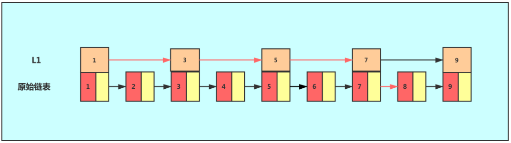

## Hash冲突解决方法
1. 开放定址法： 
线性探测
平方探测
2. 再哈希法
3. 链地址法

## 各种排序比较


## 位运算
#### ^异或运算
* a ^ a = 0     一个数与自己异或结果为0
* a ^ 0 = a     一个数与0异或结果为自己
* a ^ -1 = ~a   一个数与-1异或结果为自己取反
* 如果 a ^ b = c 那么 a ^ c = b, b ^ c = a
#### &与运算
* a & (a-1) 结果将a的最低位1置0，该操作可以用来统计a中为1的位的个数

## 跳表
对于一个单链表来讲，即便链表中存储的数据是有序的，如果我们要想在其中查找某个数据，也只能从头到尾遍历链表。这样查找效率就会很低，时间复杂度会很高，是 O(n)。

如果我们想要提高其查找效率，可以考虑在链表上建索引的方式。每两个结点提取一个结点到上一级，我们把抽出来的那一级叫作索引。

这个时候，我们假设要查找节点8，我们可以先在索引层遍历，当遍历到索引层中值为 7 的结点时，发现下一个节点是9，那么要查找的节点8肯定就在这两个节点之间。我们下降到链表层继续遍历就找到了8这个节点。原先我们在单链表中找到8这个节点要遍历8个节点，而现在有了一级索引后只需要遍历五个节点。
从这个例子里，我们看出，加来一层索引之后，查找一个结点需要遍的结点个数减少了，也就是说查找效率提高了，我们可以增加多级索引，其查找效率可以得到明显提升。


## 摩尔投票法
#### 背景知识
摩尔投票法：摩尔投票法的核心思想为对拼消耗。首先我们考虑最基本的摩尔投票问题，比如找出一组数字序列中出现次数大于总数$\frac{1}{2}$的数字（并且假设这个数字一定存在）。我们可以直接利用反证法证明这样的数字只可能有一个。摩尔投票算法的核心思想是基于这个事实：
* 每次从序列里选择两个不相同的数字删除掉（或称为「抵消」），最后剩下一个数字或几个相同的数字，就是出现次数大于总数一半的那个元素。假设我们当前数组中存在次数大于总数一半的元素为 $x$，数组的总长度为 $n$，则我们可以把数组分为两部分，一部分为相同的 $k$ 个元素 $x$，另一部分为 $\frac{n-k}{2}$对个不同的元素配对，此时我们假设还存在另外一个次数大于总数一半的元素 $y$，则此时 $y$ 因该满足 $y > \frac{n}{2}$，但是按照我们之前的推理 $y$ 应当满足 $y \le \frac{n-k}{2}$，二者自相矛盾。
#### [多数元素](https://leetcode-cn.com/problems/majority-element/)

```java
class Solution {
    public int majorityElement(int[] nums) {
        int count = 0;
        Integer candidate = null;
        for (int num : nums) {
            if (count == 0) {
                candidate = num;
            }
            count += (num == candidate) ? 1 : -1;
        }
        return candidate;
    }
}
```
#### [求众数 II](https://leetcode-cn.com/problems/majority-element-ii/)

```java
class Solution {
    public List<Integer> majorityElement(int[] nums) {
        int element1 = 0;
        int element2 = 0;
        int vote1 = 0;
        int vote2 = 0;

        for (int num : nums) {
            if (vote1 > 0 && num == element1) { //如果该元素为第一个元素，则计数加1
                vote1++;
            } else if (vote2 > 0 && num == element2) { //如果该元素为第二个元素，则计数加1
                vote2++;
            } else if (vote1 == 0) { // 选择第一个元素
                element1 = num;
                vote1++;
            } else if (vote2 == 0) { // 选择第二个元素
                element2 = num;
                vote2++;
            } else { //如果三个元素均不相同，则相互抵消1次
                vote1--;
                vote2--;
            }
        }

        int cnt1 = 0;
        int cnt2 = 0;
        for (int num : nums) {
            if (vote1 > 0 && num == element1) {
                cnt1++;
            }
            if (vote2 > 0 && num == element2) {
                cnt2++;
            }
        }
        // 检测元素出现的次数是否满足要求
        List<Integer> ans = new ArrayList<>();
        if (vote1 > 0 && cnt1 > nums.length / 3) {
            ans.add(element1);
        }
        if (vote2 > 0 && cnt2 > nums.length / 3) {
            ans.add(element2);
        }

        return ans;
    }
}
```

## 单调栈
#### 背景知识
单调栈中存放的数据应该是有序的，所以单调栈也分为单调递增栈和单调递减栈
现在有一组数10，3，7，4，12。从左到右依次入栈，则如果栈为空或入栈元素值小于栈顶元素值，则入栈；否则，如果入栈则会破坏栈的单调性，则需要`把比入栈元素小的元素全部出栈`。单调递减的栈反之。
#### [接雨水](https://leetcode-cn.com/problems/trapping-rain-water/)

```java
class Solution {
    public int trap(int[] height) {
        int ans = 0;
        Deque<Integer> stack = new LinkedList<Integer>();
        int n = height.length;
        for (int i = 0; i < n; ++i) {
            while (!stack.isEmpty() && height[i] > height[stack.peek()]) {
                int top = stack.pop();
                if (stack.isEmpty()) {
                    break;
                }
                int left = stack.peek();
                int currWidth = i - left - 1;
                int currHeight = Math.min(height[left], height[i]) - height[top];
                ans += currWidth * currHeight;
            }
            stack.push(i);
        }
        return ans;
    }
}
```
#### [柱状图中最大的矩形](https://leetcode-cn.com/problems/largest-rectangle-in-histogram/)

```java
class Solution {
    public int largestRectangleArea(int[] heights) {
        int n = heights.length;
        int[] left = new int[n];
        int[] right = new int[n];
        Arrays.fill(right, n);
        
        Deque<Integer> mono_stack = new ArrayDeque<Integer>();
        for (int i = 0; i < n; ++i) {
            while (!mono_stack.isEmpty() && heights[mono_stack.peek()] >= heights[i]) {
                right[mono_stack.peek()] = i;
                mono_stack.pop();
            }
            left[i] = (mono_stack.isEmpty() ? -1 : mono_stack.peek());
            mono_stack.push(i);
        }
        
        int ans = 0;
        for (int i = 0; i < n; ++i) {
            ans = Math.max(ans, (right[i] - left[i] - 1) * heights[i]);
        }
        return ans;
    }
}
```

## 前缀和
#### 背景知识
前缀和是一个数组的某项下标之前(包括此项元素)的所有数组元素的和。
设 `b[]` 为前缀和数组，`a[]` 为原数组，根据这句话可以得到前缀和的定义式和递推式：

#### [和为 K 的子数组](https://leetcode-cn.com/problems/subarray-sum-equals-k/)

```java
class Solution {
    public int subarraySum(int[] nums, int k) {
        int count = 0, pre = 0;
        Map<Integer, Integer> map = new HashMap<>();
        map.put(0, 1);
        for (int num : nums) {
            pre += num;
            count += map.getOrDefault(pre - k, 0);
            map.put(pre, map.getOrDefault(pre, 0) + 1);
        }
        return count;
    }
}
```