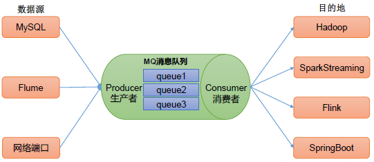
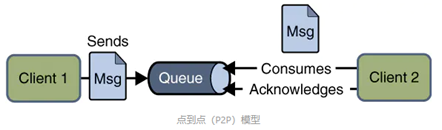
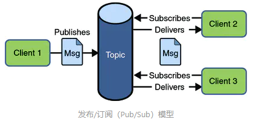
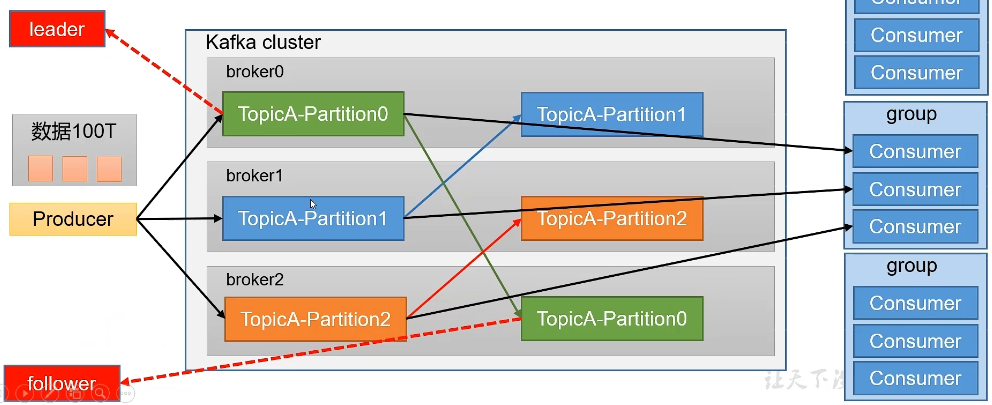
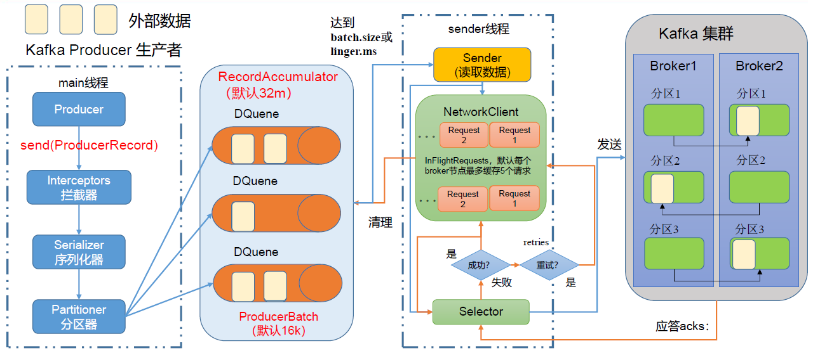
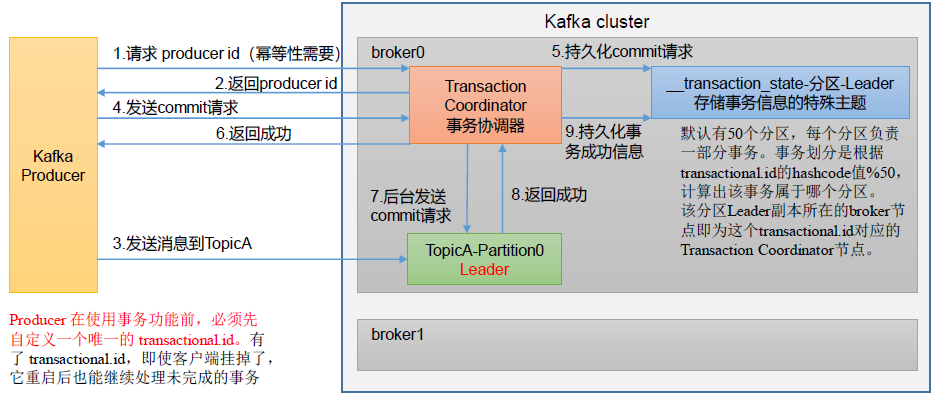
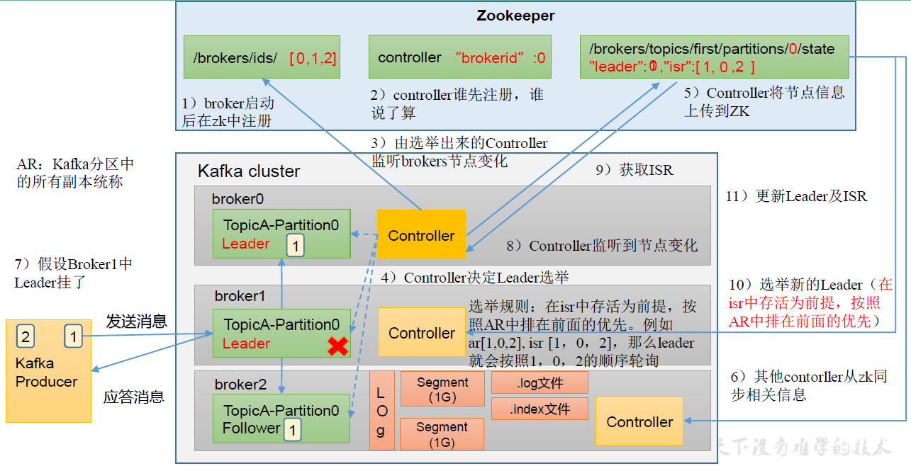
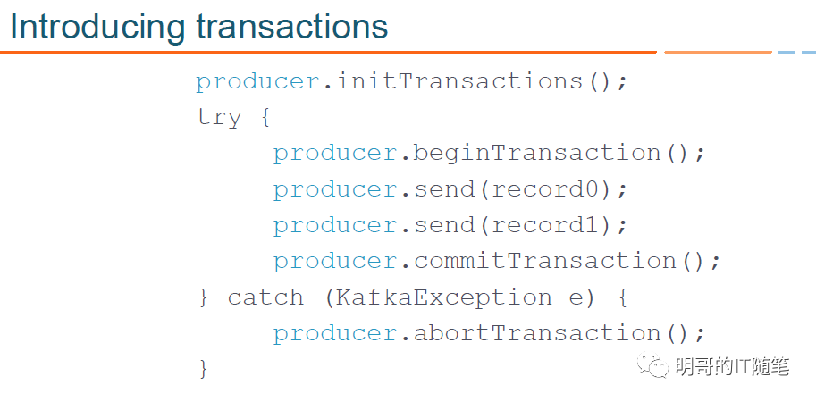

## 消息队列
#### 应用场景
**缓存/消峰**
有助于控制和优化数据流经过系统的`速度`，解决`生产`消息和`消费`消息的处理速度不一致的情况。
**解耦**
允许独立的扩展或修改两边的处理过程，只要确保它们遵守同样的接口`约束`。

**异步通信**
允许用户把一个消息放入队列，但并不立即处理它，然后在`需要`的时候再去处理它们。
#### 模式
**点对点（P2P）模式**

使用队列（Queue）作为消息通信载体；满足生产者与消费者模式，一条消息只能被`一个`消费者使用，未被消费的消息在队列中保留直到被消费或超时。比如：我们生产者发送100条消息的话，两个消费者来消费一般情况下两个消费者会按照消息发送的顺序各自消费一半。消费者消费数据之后数据就被删除。
**发布/订阅（Pub/Sub）模式**

发布订阅模型（Pub/Sub）使用主题（`Topic`）作为消息通信载体，类似于广播模式；发布者发布一条消息，该消息通过主题传递给所有的订阅者，在一条消息广播之后才订阅的用户则是收不到该条消息的。消费者消费数据之后，不删除数据。

## Kafka
Kafka传统定义：Kafka是一个`分布式`的基于`发布/订阅`模式的消息队列（Message Queue），主要应用于大数据实时处理领域。
**发布/订阅**：消息的发布者不会将消息直接发送给特定的订阅者，而是将发布的消息分为不同的`类别(topic)`，`订阅者`只接收感兴趣的消息。
Kafka最新定义： Kafka 是一个开源的`分布式事件流平台`（ Event Streaming Platform），被数千家公司用于高性能数据管道、流分析、数据集成和关键任务应用。
#### Kafka基础架构
- 一台Kafka`服务器`就是一个`broker`。一个集群由多个broker组成。一个broker可以容纳多个topic。
- 为方便扩展，提高吞吐量，Kafka将一个`topic`分为多个`partition`
- 配合分区的设计，提出`消费者组`的概念，组内每个消费者`并行`消费，一个分区的数据，只能由`一个`消费者消费。消费者组是逻辑上的一个订阅者。
- 为提高可用性，为每个partition增加若干`副本`，分为`leader`和`follower`，正常情况下，生产和消费只针对`leader`，当leader挂掉后，follower有机会成为新的leader


## Kafka命令
#### 对topic进行操作
| 参数                                              | 描述                                                                |
| ------------------------------------------------- | ------------------------------------------------------------------- |
| --bootstrap-server                                | <String: server toconnect to> 连接的Kafka Broker 主机名称和端口号。 |
| --topic <String: topic>                           | 操作的topic 名称。                                                  |
| --create                                          | 创建主题。                                                          |
| --delete                                          | 删除主题。                                                          |
| --alter                                           | 修改主题。                                                          |
| --list                                            | 查看所有主题。                                                      |
| --describe                                        | 查看主题详细描述。                                                  |
| --partitions <Integer: # of partitions>           | 设置分区数。                                                        |
| --replication-factor<Integer: replication factor> | 设置分区副本。                                                      |
| --config                                          | <String: name=value> 更新系统默认的配置。                           |
#### 对生产者进行操作
| 参数                                             | 描述                                 |
| ------------------------------------------------ | ------------------------------------ |
| --bootstrap-server <String: server toconnect to> | 连接的Kafka Broker主机名称和端口号。 |
| --topic <String: topic>                          | 操作的topic名称。                    |
#### 对消费者进行操作
| 参数                                            | 描述                                 |
| ----------------------------------------------- | ------------------------------------ |
| --bootstrap-server <String: server toconnectto> | 连接的Kafka Broker主机名称和端口号。 |
| --topic <String: topic>                         | 操作的topic 名称。                   |
| --from-beginning                                | 从头开始消费。                       |
| --group <String: consumer group id>             | 指定消费者组名称。                   |

## Kafka生产者
#### 原理

- main线程的`Producer`对象调用`send`方法发送数据
- 使用Kafka`自定义`的拦截器，Java中的Serializable校验比较重
- `Partitioner`分区器决定该数据块要发送给Kafka集群中的哪一个`分区`
- 数据发送至`RecordAccumulate`双端队列，队列大小默认`32M`，队列中的每一个数据块`ProducerBatch`默认`16k`
- sender线程在数据累计到`batch.size`，默认`16k`；或到达等待事件`linger.ms`，默认`0ms`时读取数据并发送
- Sender中默认最多缓存`5个`发送请求，Kafka集群的Broker收到请求后会返回应答`ack`，失败会重试
  - 0：生产者发送过来的数据，不需要等数据落盘，直接返回ack
  - 1：生产者发送过来的数据，Leader收到数据并落盘后，返回ack
  - -1（all）：生产者发送过来的数据，Leader和ISR队列
里面的所有节点收齐数据后，返回ack
- Sender默认重试次数为`int`最大值
#### 数据发送
```java
// 0 配置
Properties properties = new Properties();
// 连接集群 bootstrap.servers
properties.put(ProducerConfig.BOOTSTRAP_SERVERS_CONFIG, "hadoop102:9092,hadoop103:9092");
// 指定对应的key和value的序列化类型 key.serializer
properties.put(ProducerConfig.KEY_SERIALIZER_CLASS_CONFIG, StringSerializer.class.getName());
properties.put(ProducerConfig.VALUE_SERIALIZER_CLASS_CONFIG, StringSerializer.class.getName());
// 1 创建kafka生产者对象
// "" hello
KafkaProducer<String, String> kafkaProducer = new KafkaProducer<>(properties);
// 2 发送数据
for (int i = 0; i < 5; i++) {
    kafkaProducer.send(new ProducerRecord<>("first", "atguigu" + i));
}
// 3 关闭资源
kafkaProducer.close();
```
#### 异步发送
```java
// 2 发送数据
for (int i = 0; i < 500; i++) {
    kafkaProducer.send(new ProducerRecord<>("first", "atguigu" + i), new Callback() {
        @Override
        public void onCompletion(RecordMetadata metadata, Exception exception) {
            if (exception == null){
                System.out.println("主题： "+metadata.topic() + " 分区： "+ metadata.partition());
            }
        }
    });
    Thread.sleep(2);
}
```
#### 同步发送
```java
// 2 发送数据
for (int i = 0; i < 5; i++) {
    kafkaProducer.send(new ProducerRecord<>("first","atguigu"+i)).get(); // 需要处理异常
}
```

## 生产者分区
`Partitioner`分区器
分区的优点：
- 便于合理使用`存储资源`，每个`Partition`在一个`Broker`上存储，可以把海量的数据按照分区切割成一块一块数据存储在多台Broker上。合理控制分区的任务，可以实现`负载均衡`的效果。
- 提高`并行度`，生产者可以以分区为单位发送数据；消费者可以以分区为单位进行消费数据。
#### 分区策略
**默认分区器DefaultPartitioner**
- 指明`partition`的情况下，直接将指明的值作为`partition`值
- 没有指明`partition`值但有`key`的情况下，将`key`的`hash`值与topic的`partition`数进行`取余`得到`partition`值
- 既没有partition值又没有key值的情况下，Kafka采用`Sticky Partition`（黏性分区器），会`随机`选择一个分区，并尽可能一直使用该分区，待该分区的batch`已满`或者`到达等待时间`，Kafka再随机一个分区进行使用（和上一次的分区不同）
```java
public ProducerRecord(String topic, Integer partition, Long timestamp, K key, V value, Iterable<Header> headers) {}
public ProducerRecord(String topic, Integer partition, Long timestamp, K key, V value) {}
public ProducerRecord(String topic, Integer partition, K key, V value, Iterable<Header> headers) {}
public ProducerRecord(String topic, Integer partition, K key, V value) {}
public ProducerRecord(String topic, K key, V value) {}
public ProducerRecord(String topic, V value){}
```
#### 指定分区发送数据
```java
// 2 发送数据
for (int i = 0; i < 5; i++) {
    kafkaProducer.send(new ProducerRecord<>("first", 1, "", "hello" + i));
}
```
#### 自定义分区器
实现`Partitioner`接口，实现相关方法，关联自定义分区器
```java
public class MyPartitioner implements Partitioner {
    @Override
    public int partition(String topic, Object key, byte[] keyBytes, Object value, byte[] valueBytes, Cluster cluster) {}

    @Override
    public void close() {}

    @Override
    public void configure(Map<String, ?> configs) {}
}
```
```java
properties.put(ProducerConfig.PARTITIONER_CLASS_CONFIG, "com.atguigu.kafka.producer.MyPartitioner");
```

## 如何提高生产者吞吐量
- 缓冲区大小`buffer.memory`，默认`32M`
- 批次大小`batch.size`，默认`16k`
- 等待时间`linger.ms`，默认`0ms`
- 压缩类型`compression.type`，通常使用`snappy`
```java
// 缓冲区大小
properties.put(ProducerConfig.BUFFER_MEMORY_CONFIG,33554432);
// 批次大小
properties.put(ProducerConfig.BATCH_SIZE_CONFIG,16384);
// linger.ms
properties.put(ProducerConfig.LINGER_MS_CONFIG, 1);
// 压缩,gzip,snappy,lz4,zstd
properties.put(ProducerConfig.COMPRESSION_TYPE_CONFIG,"snappy");
```

## 生产者数据保证
#### 数据可靠
`Leader`收到数据，所有`Follower`都开始同步数据，但有一个Follower，因为某种故障，迟迟不能与Leader进行同步，那这个问题怎么解决呢？
- `Leader`维护了一个动态的`in-sync replica set（ISR）`，意为和Leader`保持同步`的Follower+Leader集合。如果`Follower`长时间未向`Leader`发送通信请求或同步数据，则该Follower将被`踢出ISR`。该时间阈值由`replica.lag.time.max.ms`参数设定，默认`30s`。

如果`分区副本`设置为1个，或者ISR里`应答`的最小副本数量（ min.insync.replicas 默认为1）设置为1，和`ack=1`的效果是一样的，仍然有丢数的风险
- 数据完全可靠条件= ACK级别设置为-1 + 分区副本大于等于2 + ISR里应答的最小副本数量大于等于2
```java
// acks：0，1，all(-1)
properties.put(ProducerConfig.ACKS_CONFIG, "all");
// 重试次数，默认int最大值
properties.put(ProducerConfig.RETRIES_CONFIG, 3);
```
#### 数据重复
acks设置为`-1`，当数据同步完成后，`ack`发送之前leader挂掉，Producer会再次发送相同的数据给新的leader，导致收到`重复数据`
**幂等性**
幂等性就是指`Producer`不论向`Broker`发送多少次重复数据，Broker端都只会持久化`一条`，保证了不重复。
重复数据的判断标准：具有`<PID, Partition, SeqNumber>`相同主键的消息提交时，Broker只会持久化`一条`。其中PID(producer id)是Kafka每次`重启`都会分配一个新的；`Partition`表示分区号；`Sequence Number`是单调自增的
所以幂等性只能保证的是在`单分区` `单会话`内不重复
**生产者事务**

通过事务，Kafka 可以保证跨生产者`会话`的消息`幂等发送`，以及跨生产者`会话`的`事务恢复`。前者表示具有相同 `transactionalId`的新生产者实例被创建且工作的时候，旧的且拥有相同`transactionalId`的生产者实例将不再工作。后者指当某个生产者实例宕机后，新的生产者实例可以保证任何未完成的旧事务要么被`提交`（Commit），要么被`中止`（Abort），如此可以使新的生产者实例从一个正常的状态开始工作。
```java
// 指定事务id
properties.put(ProducerConfig.TRANSACTIONAL_ID_CONFIG, "tranactional_id_01");

// 1 创建kafka生产者对象
KafkaProducer<String, String> kafkaProducer = new KafkaProducer<>(properties);
// 初始化事务
kafkaProducer.initTransactions();
// 开启事务
kafkaProducer.beginTransaction();

try {
    // 2 发送数据
    for (int i = 0; i < 5; i++) {
        kafkaProducer.send(new ProducerRecord<>("first", "atguigu" + i));
    }

    int i = 1 / 0;
    // 提交事务
    kafkaProducer.commitTransaction();
} catch (Exception e) {
    // 放弃事务（回滚）
    kafkaProducer.abortTransaction();
} finally {
    // 3 关闭资源
    kafkaProducer.close();
}
```
#### 数据有序
单partition有序，partition之间无序
1. kafka在1.x版本之前保证数据单partition有序，条件如下：
max.in.flight.requests.per.connection=1（不需要考虑是否开启幂等性）。
2. kafka在1.x及以后版本保证数据单partition有序，条件如下：
   - 开启幂等性
    max.in.flight.requests.per.connection需要设置小于等于5。
   - 未开启幂等性
    max.in.flight.requests.per.connection需要设置为1。

原因说明：因为在kafka1.x以后，启用幂等后，kafka服务端会缓存producer发来的最近5个request的元数据，故无论如何，都可以保证最近5个request的数据都是有序的。

如果要保证数据消费顺序：
1. 1个Topic（主题）只创建1个Partition(分区)，这样生产者的所有数据都发送到了一个Partition(分区)，保证了消息的消费顺序。
2. 生产者在发送消息的时候指定要发送到哪个Partition(分区)。


## Zookeeper保存的Kafka信息
1. /kafka/brokers/ids `[0,1,2]` 记录有哪些服务器
2. /kafka/brokers/topics/first/partitions/0/state `{"leader":1 ,"isr":[1,0,2]}` 记录谁是Leader，有哪些服务器可用
3. /kafka/controller `{“brokerid”: 0}` 辅助选举Leader

## Kafka Broker
#### 工作原理

- broker启动之后向zk进行注册 /kafka/brokers/ids `[0,1,2]`
- brokers争先注册为`controller`，/kafka/controller `{“brokerid”: 0}` 谁先注册为`controller`，谁监听`/kafka/brokers/ids`并在接下来决定`Leader`选举
  - AR：Kafka分区中所有副本的集合
  - ISR：和Leader保持同步的副本集合
  - 选举规则：选举规则：在`ISR`中存活为前提，按照`AR`中排在前面的优先。例如`AR[1,0,2]`, `ISR[1,0,2]`，那么leader就会按照1，0，2的顺序`轮询`
- controller将选举的`leader`和`ISR`信息注册在/kafka/brokers/topics/first/partitions/0/state `{"leader":1 ,"isr":[1,0,2]}`，其他节点从这里同步信息
- `Producer`发送信息到`Broker`，底层由`Segment`存储，大小`1G`，文件类型为`.log`，配合`.index`索引文件加速查找
- 当`leader`挂了，`controller`监听/kafka/brokers/ids的变化，选举新的`leader`，更新`leader`和`ISR`信息
#### 服役新节点
注册新节点 -> 创建新的负载均衡计划 -> 执行新的负载均衡计划
#### 退役旧节点
创建计划，将旧节点数据迁移到其他节点 -> 执行计划

## Kafka事务
- KAFKA 的事务机制，是 KAFKA 实现端到端有且仅有一次语义（end-to-end EOS)的基础；
- KAFKA 的事务机制，涉及到 transactional producer 和 transactional consumer, 两者配合使用，才能实现端到端有且仅有一次的语义（end-to-end EOS)；
- 当然kakfa 的 producer 和 consumer 是解耦的，你也可以使用非 transactional 的 consumer 来消费 transactional producer 生产的消息，但此时就丢失了事务 ACID 的支持；
- 通过事务机制，KAFKA 可以实现对多个 topic 的多个 partition 的原子性的写入，即处于同一个事务内的所有消息，不管最终需要落地到哪个 topic 的哪个 partition, 最终结果都是要么全部写成功，要么全部写失败（Atomic multi-partition writes）；
- KAFKA的事务机制，在底层依赖于`幂等生产者`，幂等生产者是 kafka 事务的必要不充分条件；
- 事实上，开启 kafka事务时，kafka 会自动开启幂等生产者。
#### 如何支持事务
为支持事务机制，KAFKA 引入了两个新的组件：**Transaction Coordinator** 和 **Transaction Log**
- transaction coordinator 是运行在每个 kafka broker 上的一个模块，是 kafka broker 进程承载的新功能之一（不是一个独立的新的进程）；
- transaction log 是 kafka 的一个内部 topic（类似大家熟悉的 __consumer_offsets ，是一个内部 topic）；
- transaction log 有多个分区，每个分区都有一个 leader，该 leade对应哪个 kafka broker，哪个 broker 上的 transaction coordinator 就负责对这些分区的写操作；
- 由于 transaction coordinator 是 kafka broker 内部的一个模块，而 transaction log 是 kakfa 的一个内部 topic, 所以 KAFKA 可以通过内部的复制协议和选举机制（replication protocol and leader election processes)，来确保 transaction coordinator 的可用性和 transaction state 的持久性；
- transaction log topic 内部存储的只是事务的最新状态和其相关元数据信息，kafka producer 生产的原始消息，仍然是只存储在kafka producer指定的 topic 中。事务的状态有：“Ongoing,” “Prepare commit,” 和 “Completed” 。
- 实际上，每个 transactional.id 通过 hash 都对应到 了 transaction log 的一个分区，所以每个 transactional.id 都有且仅有一个 transaction coordinator 负责。

为支持事务机制，KAFKA 将日志文件格式进行了扩展，添加了控制消息 **control batch**
- 日志中除了普通的消息，还有一种消息专门用来标志事务的状态，它就是控制消息 control batch；
- 控制消息跟其他正常的消息一样，都被存储在日志中，但控制消息不会被返回给 consumer 客户端；
- 控制消息共有两种类型：commit 和 abort，分别用来表征事务已经成功提交或已经被成功终止；
- RecordBatch 中 attributes 字段的第5位用来标志当前消息是否处于事务中，1代表消息处于事务中，0则反之；（A record batch is a container for records. ）
- RecordBatch 中 attributes 字段的第6位用来标识当前消息是否是控制消息，1代表是控制消息，0则反之；
- 由于控制消息总是处于事务中，所以控制消息对应的RecordBatch 的 attributes 字段的第5位和第6位都被置为1；
#### 事务机制下Kafka读写流程
KAFKA transactional api 的调用顺序：

1. KAFKA 生产者通过 `initTransactions` API 将 transactional.id **注册**到 transactional coordinator：此时，此时 coordinator 会关闭所有有相同 transactional.id 且处于 pending 状态的事务，同时也会递增 epoch 来屏蔽僵尸生产者 （zombie producers）. 该操作对每个 producer session 只执行一次.(producer.initTransaction())
2. KAFKA 生产者通过 `beginTransaction` API 开启事务，并通过 send API 发送消息到目标topic：此时消息对应的 partition 会首先被注册到 transactional coordinator，然后 producer 按照正常流程发送消息到目标 topic，且在发送消息时内部会通过校验屏蔽掉僵尸生产者（zombie producers are fenced out.（producer.beginTransaction();producer.send()*N;）；
3. KAFKA 生产者通过 `commitTransaction` API 提交事务或通过`abortTransaction` API回滚事务：此时会向 transactional coordinator 提交请求，开始两阶段提交协议 (producer.commitTransaction();producer.abortTransaction();
   - 在两阶段提交协议的第一阶段，transactional coordinator 更新内存中的事务状态为 “prepare_commit”，并将该状态持久化到 transaction log 中；
   - 在两阶段提交协议的第二阶段， coordinator 首先写 transaction marker 标记到目标 topic 的目标 partition，这里的 transaction marker，就是我们上文说的控制消息，控制消息共有两种类型：commit 和 abort，分别用来表征事务已经成功提交或已经被成功终止；
   - 在两阶段提交协议的第二阶段， coordinator 在向目标 topic 的目标 partition 写完控制消息后，会更新事务状态为 “commited” 或 “abort”， 并将该状态持久化到 transaction log 中；
4. KAFKA 消费者消费消息时可以指定具体的读隔离级别，当指定使用 read_committed 隔离级别时，在内部会使用存储在目标 topic-partition 中的 事务控制消息，来过滤掉没有提交的消息，包括回滚的消息和尚未提交的消息;需要注意的是，过滤消息时，KAFKA consumer 不需要跟 transactional coordinator 进行 rpc 交互，因为 topic 中存储的消息，包括正常的数据消息和控制消息，包含了足够的元数据信息来支持消息过滤；KAFKA 消费者消费消息时也可以指定使用 read_uncommitted 隔离级别，此时目标 topic-partition 中的所有消息都会被返回，不会进行过滤。
#### 事务容错
- transaction coordinator 是运行在每个 kafka broker 上的一个模块，是 kafka broker 进程承载的新功能之一（不是一个独立的新的进程）；
- transaction coordinator 将事务的状态保存在内存中，并持久化到 transaction log 中;
- transaction log 是 kakafa 的一个内部 topic（类似大家熟悉的 consumer_offsets ，是一个内部 topic）；
- transaction log 有多个分区，每个分区都有一个 leader，该 leade对应哪个 kafka broker，则那个 broker上的 transaction coordinator 就负责对这些分区的写操作；
- transaction coordinator 是唯一负责读写 transaction log 的组件，如果某个 kafka broker 宕机的话，其负责的 transaction log 的 partitions 就没有了对应的 leader，此时会通过选举机制选举出一个新的 coordinator，该 coordinator 会从这些 transaction log partitions 在其它节点的副本中恢复状态数据；
- 正是由于 transaction log 是 kakfa 的一个内部 topic, 所以 KAFKA 可以通过内部的复制协议和选举机制（replication protocol and leader election processes)，来确保对事务状态 transaction state 的持久化存储，以及对 transaction coordinator 的容错。

## Kafka避免重复消费
#### 为什么会出现重复消费
1. kafka是通过`offset`来标记消费的。默认情况下，消费完成后会自动提交offset，避免重复消费。Kafka消费端的自动提交逻辑有一个默认的5秒间隔，也就是说在5秒之后的下一次向Broker拉取消息的时候提交。所以在Consumer消费的过程中，应用程序被强制`kill掉`或者`宕机`，可能会导致Offset没提交，从而产生重复提交的问题。
2. Kafka里面有一个Partition Balance机制，就是把多个Partition均衡的分配给多个消费者。Consumer端会从分配的Partition里面去消费消息，如果Consumer在默认的5分钟内没办法处理完这一批消息。就会触发Kafka的`Rebalance`机制，从而导致Offset自动提交失败。而在重新Rebalance之后，Consumer还是会从`之前`没提交的Offset位置开始消费，也会导致消息重复消费的问题。
#### 如何避免
1. 提高消费端的处理性能避免触发Rebalance，比如可以用异步的方式来处理消息，缩短单个消息消费的时长。或者还可以调整消息处理的`超时时间`。还可以减少一次性从Broker上拉取数据的条数。
2. 可以针对消息生成`md5`然后保存到mysql或者redis里面，在处理消息之前先去mysql或者redis里面`判断`是否已经消费过。这个方案其实就是利用幂等性的思想。

## Kafka保证数据有序


## Kafka优缺点
#### 优点
**Producer**
批量发送、数据压缩
**Broker**
顺序写、消息索引、零拷贝
**Consumer**
Rebalance
#### 缺点
1. 运维成本高
2. 对于负载不均衡的场景，解决方案复杂
3. 没有自己的缓存，完全依赖Page Cache
4. Controller和Coordinator和Broker在同一进程中，大量IO会造成性能下降
