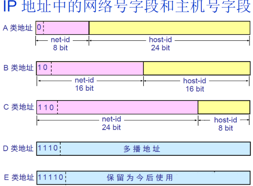

## DNS工作原理
递归 + 迭代
请求主机 → 本地域名服务器 → 根域名服务器 → 顶级域名服务器 → 权威域名服务器

## 网络模型

- 应用层：HTTP、FTP、DNS、SMTP、Telnet
- 传输层：TCP、UDP
- 网络层：IP
- 网络接口层：ARP、RARP

## IP地址分类

路由器仅根据`网络号`net-id来转发分组，当分组到达目的网络的路由器之后，再按照`主机号`host-id将分组交付给主机；同一网络上的所有主机的网络号相同。
**子网划分**
从`主机号`host-id借用若干比特作为`子网号`subnet-id；**子网掩码**：网络号和子网号都为`1`，主机号为`0`；数据报仍然先按照网络号找到目的网络，发送到路由器，路由器再按照`网络号和子网号`找到目的子网：将子网掩码与目标地址逐比特与操作，若结果为某个子网的网络地址，则送到该子网。

## TCP与UDP的区别
UDP协议和TCP协议都是传输层协议。
1. TCP提供的是面向连接，可靠的字节流服务。即客户和服务器交换数据前，必须现在双方之间建立一个TCP连接，之后才能传输数据。并且提供超时重发，数据校验，流量控制，拥塞控制等功能，保证数据能从一端传到另一端。
2. UDP是一个简单的面向数据报的运输层协议。它不提供可靠性，只是把应用程序传给IP层的数据报发送出去，但是不能保证它们能到达目的地。由于UDP在传输数据报前不用再客户和服务器之间建立一个连接，且没有超时重发等机制，所以传输速度很快。
3. TCP只支持点对点通信，UDP支持一对一、一对多、多对一、多对多
4. TCP是面向字节流的，UDP是面向报文的，面向字节流是指发送数据时以`字节`为单位，一个数据包可以拆分成若干组进行发送，而UDP一个报文只能一次发完。

## TCP的三次握手与四次挥手，TIMEWAIT的作用
#### 三次握手

* 第一次握手：Client将SYN置1，随机产生一个初始序列号seq发送给Server，进入SYN_SENT状态；
* 第二次握手：Server收到Client的SYN=1之后，知道客户端请求建立连接，将自己的SYN置1，ACK置1，产生一个acknowledge number=sequence number+1，并随机产生一个自己的初始序列号，发送给客户端；进入SYN_RCVD状态；
* 第三次握手：客户端检查acknowledge number是否为序列号+1，ACK是否为1，检查正确之后将自己的ACK置为1，产生一个acknowledge number=服务器发的序列号+1，发送给服务器；进入ESTABLISHED状态；服务器检查ACK为1和acknowledge number为序列号+1之后，也进入ESTABLISHED状态；完成三次握手，连接建立。

为什么需要三次握手呢？为了防止`已失效`的连接请求报文段突然又传送到了服务端，因而产生错误。
比如：client发出的第一个连接请求报文段并没有丢失，而是在某个网络结点长时间的`滞留`了，以致延误到连接释放以后的某个时间才到达server。本来这是一个早已失效的报文段，但是server收到此失效的连接请求报文段后，就误认为是client再次发出的一个新的连接请求，于是就向client发出确认报文段，同意建立连接。假设不采用“三次握手”，那么只要server发出确认，新的连接就建立了，由于client并没有发出建立连接的请求，因此不会理睬server的确认，也不会向server发送数据，但server却以为新的运输连接已经建立，并一直等待client发来数据。所以没有采用“三次握手”，这种情况下server的很多资源就白白浪费掉了。

**可以采用四次握手吗**
可以。但是会降低传输的效率。
四次握手是指：第二次握手：Server只发送ACK和acknowledge number；而Server的SYN和初始序列号在第三次握手时发送；原来协议中的第三次握手变为第四次握手。出于优化目的，四次握手中的二、三可以合并。

**第三次握手中，如果客户端的ACK未送达服务器，会怎样**
Server端：
由于Server没有收到ACK确认，因此会重发之前的SYN+ACK（默认重发五次，之后自动关闭连接进入CLOSED状态），Client收到后会重新传ACK给Server。
Client端：
1. 在Server进行超时重发的过程中，如果Client向服务器发送数据，数据头部的`ACK为1`的，所以服务器收到数据之后会读取 ACK number，进入 establish 状态
2. 在Server进入CLOSED状态之后，如果Client向服务器发送数据，服务器会以RST包(连接异常终止)应答。

**如果已经建立了连接，但客户端出现了故障怎么办**
服务器每收到一次客户端的请求后都会重新复位一个`计时器`，时间通常是设置为2小时，若两小时还没有收到客户端的任何数据，服务器就会发送一个`探测报文段`，以后每隔75秒钟发送一次。若一连发送10个探测报文仍然没反应，服务器就认为客户端出了故障，接着就关闭连接。
#### 四次挥手

* 第一次挥手：Client将FIN置为1，发送一个序列号seq给Server；进入FIN_WAIT_1状态；
* 第二次挥手：Server收到FIN之后，发送一个ACK=1，acknowledge number=收到的序列号+1；进入CLOSE_WAIT状态。此时客户端已经没有要发送的数据了，但仍可以接受服务器发来的数据。
* 第三次挥手：Server将FIN置1，发送一个序列号给Client；进入LAST_ACK状态；
* 第四次挥手：Client收到服务器的FIN后，进入TIME_WAIT状态；接着将ACK置1，发送一个acknowledge number=序列号+1给服务器；服务器收到后，确认acknowledge number后，变为CLOSED状态，不再向客户端发送数据。客户端等待2*MSL（报文段最长寿命）时间后，也进入CLOSED状态。完成四次挥手。

为什么需要四次挥手呢？TCP是`全双工`模式，当client发出FIN报文段时，只是表示client已经没有数据要发送了，client告诉server，它的数据已经全部发送完毕了；但是，这个时候client还是可以接受来server的数据；当server返回ACK报文段时，表示它已经知道client没有数据发送了，但是server还是可以发送数据到client的；当server也发送了FIN报文段时，这个时候就表示server也没有数据要发送了，就会告诉client，我也没有数据要发送了，如果收到client确认报文段，之后彼此就会中断这次TCP连接。
**为什么不能把服务器发送的ACK和FIN合并起来，变成三次挥手**
因为服务器收到客户端断开连接的请求时，可能还有一些数据没有发完，这时先回复ACK，表示接收到了断开连接的请求。等到数据发完之后再发FIN，断开服务器到客户端的数据传送。
#### TIME_WAIT
TCP协议规定,主动关闭连接的一方要处于`TIME_ WAIT`状态,等待两个`MSL`(最大报文生存周期)的时间后才能回到`CLOSED`状态。TIME_WAIT持续存在2MSL的话，就能保证在两个传输方向上的尚未被接收或迟到的报文段都已经消失，同时如果最后一个ACK丢失，TIME_WAIT状态可以重传最后的确认报文。如果Server没有收到ACK，就会重发FIN，如果Client在2*MSL的时间内收到了FIN，就会重新发送ACK并再次等待2MSL，防止Server没有收到ACK而不断重发FIN。

## TCP如何实现可靠传输
1. 应用数据被分割成 TCP 认为最适合发送的`数据块`。 
2. TCP 给发送的每一个包进行`编号`，接收方对数据包进行`排序`，把有序数据传送给应用层。 
3. 校验和： TCP将保持它首部和数据的检验和。这是一个端到端的检验和，目的是检测数据在传输过程中的任何变化。如果收到段的检验和有差错，TCP 将丢弃这个报文段和不确认收到此报文段。 
4. TCP 的接收端会丢弃重复的数据。 
5. 流量控制： TCP连接的每一方都有固定大小的缓冲空间，TCP的接收端只允许发送端发送接收端缓冲区能接纳的数据。当接收方来不及处理发送方的数据，能提示发送方降低发送的速率，防止包丢失。TCP 使用的流量控制协议是可变大小的滑动窗口协议。 
6. 拥塞控制：当网络拥塞时，减少数据的发送。 
7. 应答机制：接收方收到数据之后，会发送一个确认（通常延迟几分之一秒）
8. 超时重发：发送方发出数据之后，启动一个定时器，超时未收到接收方的确认，则重新发送这个数据
9. 停止等待协议：也是为了实现可靠传输的，它的基本原理就是每发完一个分组就停止发送，等待对方确认。在收到确认后再发下一个分组。

## TCP流量控制 - 滑动窗口协议
1. 发送端和接收端分别设定发送窗口和接收窗口。接受窗口的大小是根据自己的资源情况动态调整的，发送窗口的大小不能超过接受窗口的大小。
2. 三次握手的时候，客户端把自己的缓冲区大小也就是`窗口大小`发送给服务器，服务器回应时也将窗口大小发送给客户端，服务器客户端都知道了彼此的窗口大小。 
3. 比如主机A的发送窗口大小为5，主机A可以向主机B发送5个单元，如果B缓冲区满了，A就要等待B确认才能继续发送数据。 
4. 如果缓冲区中有1个报文被进程读取，主机B就会回复`ACK`给主机A，接收窗口向前滑动，报文中窗口大小为1，就说明A还可以发送1个单元的数据，发送窗口向前滑动，之后等待主机B的确认报文。只有接收窗口向前滑动并发送了确认时，发送窗口才能向前滑动。

**接收窗口为0时会怎样**
如果接收方没有能力接收数据，就会将接收窗口设置为0，这时发送方必须暂停发送数据，但是会启动一个`持续计时器`(persistence timer)，到期后发送一个大小为1字节的`探测数据包`，以查看接收窗口状态。如果接收方能够接收数据，就会在返回的报文中更新接收窗口大小，恢复数据传送。
#### 回退N帧协议
在发送完一个帧后，不用停下来等待确认，而是可以连续发送多个数据帧。这样就减少了等待时间，整个通信的通吞吐量提高。 如果前一个帧在超时时间内未得到确认，就认为丢失或被破坏，需要重发出错帧及其后面的所有数据帧。这样有可能又把正确的数据帧重传一遍，降低了传送效率。
#### 选择重传协议
后退n协议的另外一个问题是，当有错误帧出现后，总是要重发该帧之后的所有帧，毫无疑问在网络不是很好的情况下会进一步恶化网络状况，重传协议便是用来解决这个问题。原理也很简单，接收端总会缓存所有收到的帧，当某个帧出现错误时，只会要求重传这一个帧，只有当某个序号后的所有帧都正确收到后，才会一起提交给高层应用。重传协议的缺点在于接受端需要更多的`缓存`。

## TCP拥塞控制
#### 慢启动
在执行慢启动算法时，发送方每收到一个对新报文段的ACK时，就把拥塞窗口`cwnd`的值加一，然后开始下一轮的传输，当拥塞窗口`cwnd`增长到慢启动门限值`ssthresh`时，就进入`拥塞避免`状态。
#### 拥塞避免
每个传输轮次，拥塞窗口`cwnd`只能线性加一，而不是像慢开始算法时，每个传输轮次，拥塞窗口`cwnd`按指数增长。
无论在慢启动阶段还是在拥塞避免阶段，只要发送方判断网络出现拥塞（其根据就是没有收到`ACK`），就要把慢启动门限ssthresh设置为出现拥塞时的发送方窗口值的`一半`（但不能小于2）。然后把拥塞窗口cwnd重新设置为1，执行慢启动算法。（这是**不使用快速重传**的情况）

#### 快速重传
快重传要求接收方在收到一个`失序`的报文段后就立即发出`重复确认`
假设3号报文丢失，接收方不会发送针对该报文的ACK报文给发送方，发送方还可以将发送窗口内的4号数据报文段发送出去，接收方收到后，发现这不是按序到达的报文段，因此给发送方发送针对2号报文段的`重复ACK`，表明我现在希望收到的是3号报文段，但是我没有收到3号报文段，而收到了未按序到达的报文段。发送方还可以将发送窗口中的5、6号报文段发送出去.
此时，发送方收到了累计`3个连续`的针对2号报文段的`重复ACK`，立即重传3号报文段，接收方收到后，给发送方发回针对6号报文的ACK，表明，序号到6为至的报文都收到了，这样就不会造成发送方对3号报文的超时重传，而是提早收到了重传。
#### 快速恢复
发送方一旦收到`3个重复ACK`，就会执行快速恢复算法：将`ssthresh`和`cwnd`的值调整为当前窗口的`一半`，然后进入`拥塞避免`状态。不执行`慢启动`算法的原因：因为如果网络出现拥塞的话就不会收到好几个重复的确认，所以发送方认为现在网络可能没有出现拥塞。

## HTTP状态码含义

**301** `Moved Permanently`：永久性重定向，表示请求的资源被分配了新的URL，之后应使用更改的URL
**400** `Bad Request`：表示请求报文中存在语法错误
**404** `Not Found`：表示服务器上无法找到请求的资源
**500** `Inter Server Error`：表示服务器在执行请求时发生了错误，也有可能是web应用存在的bug或某些临时的错误时
**503** `Server Unavailable`：表示服务器暂时处于超负载或正在进行停机维护，无法处理请求

## HTTP请求的几种类型
1. **GET**：向特定的资源发出请求。
2. **POST**：向指定资源提交数据进行处理请求（例如提交表单或者上传文件）。数据被包含在请求体中。POST请求可能会导致新的资源的创建和/或已有资源的修改。
3. **PUT**：向指定资源位置上传其最新内容。
4. **DELETE**：请求服务器删除Request-URI所标识的资源。

**GET 和 POST的区别**
1. GET是幂等的，即读取同一个资源，总是得到`相同`的数据，POST不是幂等的
2. GET一般用于从服务器`获取`资源，而POST有可能`改变`服务器上的资源
3. 请求形式上：GET请求的数据附在`URL`之后，在HTTP`请求头`中；POST请求的数据在`请求体`中
4. 安全性：GET请求可被`缓存`、收藏、保留到历史记录，且其请求数据明文出现在URL中。POST的参数不会被保存，安全性相对较高
5. GET只允许`ASCII`字符，POST对数据类型没有要求，也允许二进制数据
6. GET的长度有限制（操作系统或者浏览器），而POST数据大小无限制

## HTTP1.0、1.1、2.0的区别 
#### HTTP1.0 和 HTTP1.1
1. **长连接**
HTTP1.1支持长连接和请求的流水线处理，在一个TCP连接上可以传送多个HTTP请求和响应，减少了建立和关闭连接的消耗和延迟，在HTTP1.1中默认开启长连接`keep-alive`，一定程度上弥补了HTTP1.0每次请求都要创建连接的缺点。HTTP1.0需要使用keep-alive参数来告知服务器端要建立一个长连接。
2. **节约带宽**
HTTP1.0中存在一些浪费带宽的现象，例如客户端只是需要某个对象的`一部分`，而服务器却将整个对象送过来了，并且不支持`断点续传`功能。HTTP1.1支持只发送header信息（不带任何body信息），如果服务器认为客户端有权限请求服务器，则返回100，客户端接收到100才开始把请求body发送到服务器；如果返回401，客户端就可以不用发送请求body了节约了带宽。
#### HTTP1.1 和 HTTP2.0
1. **多路复用**
HTTP2.0使用了多路复用的技术，做到同一个连接`并发`处理多个请求，而且并发请求的数量比HTTP1.1大了好几个数量级。HTTP1.1也可以多建立几个TCP连接，来支持处理更多并发的请求，但是创建TCP连接本身也是有开销的。

3. **头部数据压缩**
在HTTP1.1中，HTTP请求和响应都是由`状态行`、`请求/响应头部`、`消息主体`三部分组成。一般而言，消息主体都会经过gzip压缩，或者本身传输的就是压缩过后的二进制文件，但状态行和头部却没有经过任何压缩，直接以`纯文本`传输。随着Web功能越来越复杂，每个页面产生的请求数也越来越多，导致消耗在头部的流量越来越多，尤其是每次都要传输UserAgent、Cookie这类不会频繁变动的内容，完全是一种浪费。
HTTP1.1不支持header数据的压缩，HTTP2.0使用`HPACK`算法对header的数据进行压缩，这样数据体积小了，在网络上传输就会更快。
4. **服务器推送**
服务端推送是一种在客户端请求之前发送数据的机制。网页使用了许多资源：HTML、样式表、脚本、图片等等。在HTTP1.1中这些资源每一个都必须明确地请求。这是一个很慢的过程。浏览器从获取HTML开始，然后在它解析和评估页面的时候，增量地获取更多的资源。因为服务器必须等待浏览器做每一个请求，网络经常是空闲的和未充分使用的。
为了改善延迟，HTTP2.0引入了server push，它允许服务端`推送`资源给浏览器，在浏览器明确地请求之前，免得客户端再次创建连接发送请求到服务器端获取。这样客户端可以直接从本地加载这些资源，不用再通过网络。

## Session和Cookie
**Session**是`服务器端`保持状态的方案，Cookie是`客户端`保持状态的方案
**Cookie**保存在客户端本地，客户端请求服务器时会将Cookie`一起提交`；Session保存在服务端，通过检索`Session id`查看状态。保存Session id的方式可以采用Cookie，如果禁用了Cookie，可以使用URL重写机制（把会话ID保存在URL中）

## 电脑上访问一个网页，整个过程是怎么样的
1. 浏览器查询`DNS`，获取域名对应的`IP`地址：具体过程包括浏览器搜索自身的`DNS缓存`、向`本地DNS服务器`进行查询等。对于向本地DNS服务器进行查询，如果要查询的域名包含在`本地`配置区域资源中，则返回解析结果给客户机，完成域名解析(此解析具有权威性)；如果要查询的域名不由本地DNS服务器区域解析，但该服务器已`缓存`了此网址映射关系，则调用这个IP地址映射，完成域名解析（此解析不具有权威性）。如果本地域名服务器并未缓存该网址映射关系，那么将根据其设置发起`递归查询`或者`迭代查询`；
2. 浏览器获得域名对应的IP地址以后，浏览器向服务器请求`建立链接`，发起三次握手
3. TCP/IP链接建立起来后，浏览器向服务器发送`HTTP请求`；
4. 服务器接收到这个请求，并根据路径参数映射到特定的请求处理器进行处理，并将处理结果及相应的视图返回给浏览器；
5. 浏览器`解析并渲染`视图，若遇到对js文件、css文件及图片等静态资源的引用，则重复上述步骤并向服务器请求这些资源；
6. 浏览器根据其请求到的资源、数据渲染页面，最终向用户呈现一个完整的页面。

## 路由器和交换机区别
1. 路由器实现了不同`网络之间`的数据转发，交换机实现了特定`网络内`的数据交换
2. 交换机转发所依据的对象时：`MAC地址`。（物理地址）
3. 路由转发所依据的对象是：`IP地址`。（网络地址）

## ARP 和 RARP
1. **ARP**
ARP（Address Resolution Protocol，地址解析协议）是将`IP`地址解析为以太网`MAC`地址（物理地址）的协议。在局域网中，当主机或其他网络设备有数据要发送给另一个主机或设备时，它必须知道对方的网络层地址（即IP地址）。但是仅仅有IP地址是不够的，因为IP数据报文必须封装成帧才能通过物理网络发送。因此发送方还需要有接收方的物理地址，也就需要一个从IP地址到物理地址的映射，ARP就是实现这么功能的协议。
2. **RARP**
RARP为逆地址解析协议，作用与ARP相反，用于将`MAC`地址转换为`IP`地址。

## NAT网络地址转换协议
用于解决`内网`中的主机要和`因特网`上的主机通信。由NAT路由器将主机的本地IP地址转换为全球IP地址，分为静态转换（转换得到的全球IP地址固定不变）和动态NAT转换。

## HTTP 和 HTTPS
HTTPS是一种通过计算机网络进行安全通信的传输协议，经由HTTP进行通信，利用`SSL/TLS`建立全信道，加密数据包。HTTPS使用的主要目的是提供对网站服务器的身份认证，同时保护交换数据的隐私与完整性。
HTTPS的特点：
**内容加密**：采用混合加密技术，中间者无法直接查看明文内容
**验证身份**：通过证书认证客户端访问的是自己的服务器
**保护数据完整性**：防止传输的内容被中间人冒充或者篡改
#### 区别
1. 端口不同：HTTP使用的是`80`端口，HTTPS使用`443`端口；
2. HTTP（超文本传输协议）信息是明文传输，HTTPS运行在`SSL`(Secure Socket Layer)之上，添加了加密和认证机制，更加安全；
3. HTTPS由于加密解密会带来更大的CPU和内存开销；
4. HTTPS通信需要证书，一般需要向证书颁发机构（`CA`）购买
#### SSL建立连接过程

1. client向server发送请求https://baidu.com，然后连接到server的`443`端口，发送的信息主要是`随机值1`和客户端支持的`加密算法`。
2. server接收到信息之后给予client响应握手信息，包括`随机值2`和匹配好的`协商加密算法`，这个加密算法一定是client发送给server加密算法的子集。
3. 随即server给client发送第二个响应报文是`数字证书`。这套证书其实就是一对公钥和私钥。传送证书，这个证书其实就是`公钥`，只是包含了很多信息，如证书的颁发机构、过期时间、服务端的公钥、第三方证书认证机构(CA)的签名、服务端的域名信息等内容。
4. 客户端`解析证书`，这部分工作是由客户端的`TLS`来完成的，首先会验证公钥是否有效，比如颁发机构，过期时间等等，如果发现异常，则会弹出一个警告框，提示证书存在问题。如果证书没有问题，那么就生成一个随机值（`预主秘钥`）。
5. 客户端认证证书通过之后，接下来是通过`随机值1`、`随机值2`和`预主秘钥`组装`会话秘钥`。然后通过证书的公钥`加密`会话秘钥。
6. 传送加密信息，这部分传送的是用证书加密后的`会话秘钥`，目的就是让服务端使用秘钥解密得到随机值1、随机值2和预主秘钥。
7. 服务端`解密`得到随机值1、随机值2和预主秘钥，然后组装`会话秘钥`，跟客户端会话秘钥相同。
8. 客户端通过会话秘钥加密一条消息发送给服务端，主要`验证`服务端是否正常接受客户端加密的消息。
9. 同样服务端也会通过会话秘钥加密一条消息回传给客户端，如果客户端能够正常接受的话表明SSL层连接建立完成了。

## 转发和重定向
**forward(转发)** 指服务器`内部`的转发，服务器直接访问目标地址的URL，把那个URL的响应内容读取过来，而客户端并不知道，因此在客户端的地址栏中不会显示转向后的地址，还是原来的地址。由于整个转发的过程用的是同一个Request，因此forward会将Request的信息带到被定向的JSP或Servlet中使用。
**redirect(重定向)** 客户端的重定向，是完全的`跳转`，即客户端浏览器会获取到跳转后的地址，然后重新发送请求，因此浏览器中显示跳转后的地址。同时，这种方式比forward方式多了一次网络请求，因此效率要低于forward方式。

## RIP距离矢量路由协议
每个路由器维护一张表，记录该路由器到其它网络的`跳数`，路由器到与其`直接`连接的网络的跳数是`1`，每多经过一个路由器跳数就加1；更新该表时和相邻路由器交换路由信息；路由器允许一个路径最多包含`15`个路由器，如果跳数为16，则不可达。交付数据报时优先选取`距离最短`的路径。
* 实现简单，开销小
* 随着网络规模扩大开销也会增大；
* 最大距离为15，限制了网络的规模；
* 当网络出现故障时，要经过较长的时间才能将此信息传递到所有路由器