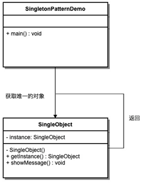
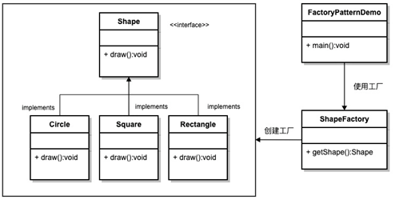
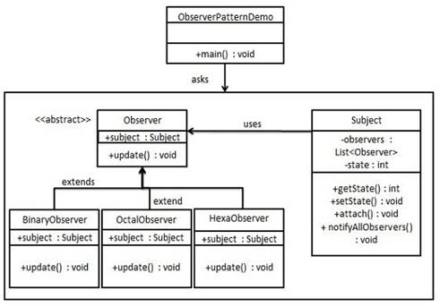
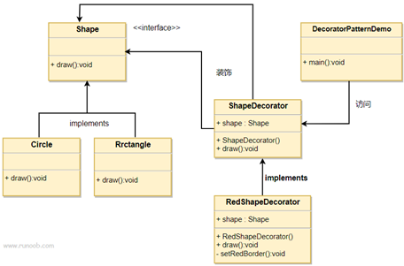
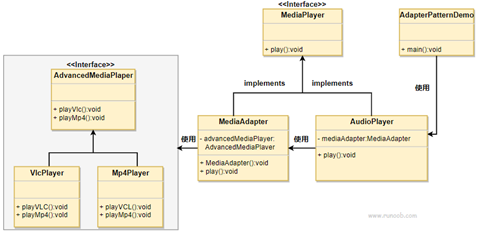
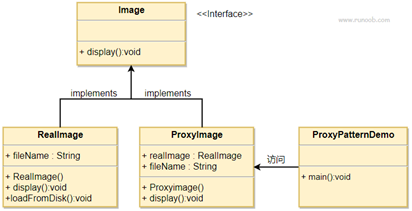

## 六大设计原则
**单一职责原则：**
一个类只负责一个功能领域中的相应职责，或者可以定义为：就一个类而言，应该只有一个引起它变化的原因。主要作用实现代码高内聚，低耦合。
**开闭原则：**
一个软件实体应当对扩展开放，对修改关闭。即软件实体应尽量在不修改原有代码的情况下进行扩展。
**里氏替换原则：**
所有引用基类（父类）的地方必须能透明地使用其子类的对象。里氏替换原则是实现开闭原则的方式之一
**依赖倒置原则：**
抽象不应该依赖于细节，细节应当依赖于抽象。换言之，要针对接口编程，而不是针对实现编程。
**接口隔离原则：**
使用多个专门的接口，而不使用单一的总接口，即客户端不应该依赖那些它不需要的接口。
**迪米特法则：**
一个软件实体应当尽可能少地与其他实体发生相互作用。

## 常用设计模式
单例模式、工厂模式、观察者模式、装饰者模式、适配器模式、代理模式
#### 单例模式
确保一个类只有一个实例，并提供一个全局访问点

#### 工厂模式
定义一个创建对象的接口，让其子类自己决定实例化哪一个工厂类，工厂模式使其创建过程延迟到子类进行

#### 观察者模式
定义对象间的一种一对多的依赖关系，当一个对象的状态发生改变时，所有依赖于它的对象都得到通知并被自动更新

#### 装饰者模式
动态地给一个对象添加一些额外的职责。就增加功能来说，装饰器模式相比生成子类更为灵活

#### 适配器模式
将一个类的接口转换成客户希望的另外一个接口。适配器模式使得原本由于接口不兼容而不能一起工作的那些类可以一起工作

#### 代理模式
为其他对象提供一种代理以控制对这个对象的访问

